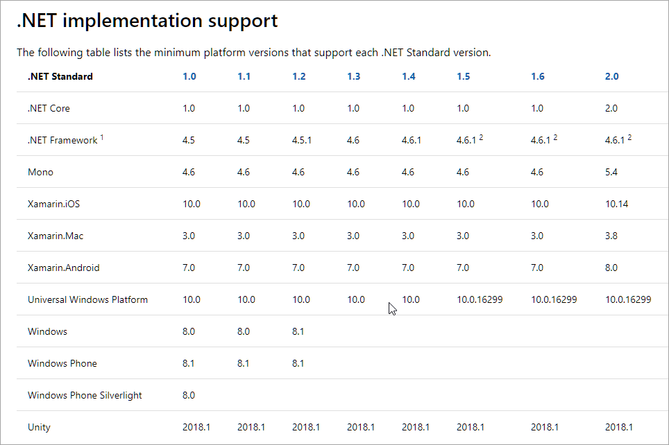
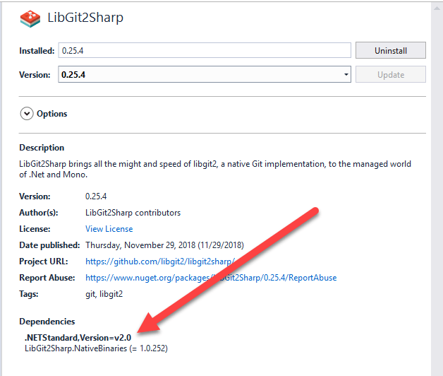

# Using .NET Standard with Full Framework .NET

.NET Standard has been around long enough now that most people are reasonably familiar with this admittedly somewhat 'unnatural' concept.  The idea of targeting or consuming a library that is not really a library but a specification which in turn affects the build process and runtime binding takes a bit getting used to.

Things have gotten a little clearer recently with better documentation and clearer designations on what versions of the various .NET runtimes support what version of .NET Standard but there's still a lot of confusion for people who are not keeping up with all the latest .NET tech. It's not a concept that comes naturally unless you've been following the evolution of .NET Standard. Rather, it requires seeing it in action to make sense of it - at least that's how it worked for me.

I've talked about .NET Standard in previous posts so I won't rehash all things here, as this post is about a more specific scenario which is using .NET Standard libraries in full .NET Framework, which has its own set of peculiarities.

There are a few things you need to understand about compatibility of various versions of full framework .NET and how that affects your applications to decide whether you'll want to use .NET Standard components in your applications or if you are a library writer of how you might want to implement your library so it's friendly to full .NET Framework. 

he latter point is important I think because full framework often gets overlooked in these days when everything seems to be about the excitement around .NET Core. There are still lots of applications on full framework that can benefit from the myriad of new and updated libraries that are coming out with the latest and greatest.

But first a short explanation of .NET Standard.
 
## What is .NET Standard?
Here's my 1 liner of what .NET Standard is:

> #### @icon-info-circle .NET Standard is a Specification not an Implementation
> .NET Standard is a specification that describes specific feature implementations that a .NET Runtime like .NET Core, full framework .NET, Mono, Xamarin or Unity has to implement - at minimum - to support that version of the standard.

The current most widely applied version of .NET Standard is **.NET Standard 2.0**.

.NET Standard is a specification that serves as a base feature blue print for .NET runtime implementations. Runtime implementations are specific versions of .NET such as .NET 4.6.1, 4.7.2, .NET Core 2.2, Xamarin.IOs, Mono 5.18 etc.

Any one of those runtimes that want to support .NET Standard have to implement a specific set of .NET features that are defined by .NET Standard. .NET Standard describes the base API library - what we used to think of as the Base Class Library (BCL/FCL) in full framework that make up the core features of the platform.

.NET Standard is a standard, not an implementation and it's up to the specific runtime to implement the features set forth in the standard. The logistics of this involve some runtime magic where each runtime provides a set of .NET Standard forwarding assemblies that map the .NET Standard APIs to the actual underlying APIs on the specific runtime.

The big win with .NET Standard is that it provides a common interface to runtime implementers, who have to make sure that their runtimes support the Standard's features and for component implementers that know what features they can use that will on any of the platforms supported by the .NET Standard version targeted. Finally for consumers of components benefit in that they can expect components they use can run on any of the supported Runtimes for that version of the .NET Standard.

There are different versions of .NET Standard that are supported by different versions of various runtimes. The following matrix is from the [.NET Standard documentation page](https://docs.microsoft.com/en-us/dotnet/standard/net-standard):

In concrete terms this means that when you build a library you can target .NET Standard and expect the compiled assembly/package to work on **any of the platforms that support that version of .NET Standard**.

If you're building libraries, you'll want to target the lowest version of .NET Standard that your library can work with. But for most intents and purposes I think that .NET Standard 2.0 is the new baseline for anything useful going forward.

## .NET Standard and Full Framework .NET
One of the supported Runtimes for .NET Standard 2.0 is the full .NET Framework.

For full framework the .NET Standard story unfortunately is a bit confusing because the although all versions of .NET 4.6.1 and later are .NET Standard 2.0 compliant yet handle that support somewhat differently. 

.NET 4.6.1, 4.6.2, .NET 4.7 and 4.7.1 all have **partial** .NET Standard support in the natively shipped runtimes, but they still are .NET Standard compliant by adding additional runtime dependencies into your output assembly folder to provide the missing functionality. NuGet along with the runtime targeting handles automatically adding those dependencies to your projects to provide the needed runtime support for those extra features.

**.NET 4.7.2** is the first version of full framework that is **fully .NET Standard compliant** without any additional dependencies.

### First Version to support .NET Standard 2.0 is 4.6.1
The first version of .NET Framework that is .NET Standard 2.0 compliant is **.NET 4.6.1**. 4.6.1 through 4.7.1 are all partially compliant with the shipped Runtime, but can work with additional dependencies added to the project when a .NET Standard 2.0 component is added.

When you add a .NET Standard 2.0 targeted package to say a .NET 4.6.2 project, a number of additional assembly dependencies and assembly redirects to provide updated runtime components are installed to provide the missing runtime features. This adds a bunch of assemblies to your application's `bin` folder that have to be distributed with your application and a bunch of assembly redirects to your `app.config` file.

This is pretty messy and clutters up your output folder and app.config, but it does work and lets you use .NET Standard 2.0 components from these older runtime versions.

### The first version that fully .NET Standard 2.0 Compliant is 4.7.2
Each successive version of full framework .NET has slightly better support for .NET Standard 2.0 up to 4.7.2 which now has full support for it and is the first version that can use .NET Standard 2.0 packages without bringing in extra dependencies.

So, for best .NET Standard support in full framework .NET, ideally you should target 4.7.2 (or 4.8+ once that comes out). Unfortunately that's probably not realistic for public access applications as there are still plenty of older versions of .NET 4.6 out there. 

For Markdown Monster which even though it's pretty tech focused, about 25% of users are not on .NET 4.7.2 and a good chunk of that is still on .NET 4.6.2/1. It'll be a while before I can target 4.7.2 and not turn away a significant chunk of users without them having to update their .NET Runtime.
 
## Concise Example: Using LibGitSharp in Markdown Monster
So what does that mean? Let me give you a practical example. In Markdown Monster which is a WPF desktop application, I'm using LibGitSharp to provide a host of Git features in the file browser and to provide a host of Git tasks related to document management.

A little while back LibGitSharp switched their library over to support **only** .NET Standard and they dropped support for other .NET Framework versions. 

### Stuck in 4.6.2
Markdown Monster has been running with a target framework of 4.6.2 in order to support older runtime installs on Windows. Supporting 4.6.x still brings in quite a few people who haven't updated to Windows 10 mostly, but it's still a non-insignificant number of users we see.

Anyway, when I add this the LibGit2Sharp dependency to my .NET 4.6.2 project I get the following assembly hell:

By adding a reference to .NET Standard 2.0 a huge number of support assemblies - a subset of the CoreFx libraries effectively - are being pulled into the project, which is ugly to say the least. 

By 

This was such a fucking mess I decided to not roll forward to the 0.25 versions that were .NET Standard only.

### What a difference a Runtime Makes
My reaction aside, there's a way this can be handled better, which is to use .NET 4.7.2 which as I mentioned earlier is **fully .NET Standard Compliant**. What this means in a nutshell is that all those .NET Standard DLLs that were pulled in for 4.6.2 to provide missing functionality and being redirected to, are available in the shipped .NET 4.7.2 runtime.

The end result is - no extra dependencies. Here's the same `bin\Release` output folder:

As you can see there no extra `System.` dependencies except the ones I added explicitly.

Yay.

### LibGit2Sharp has added back a 4.6 Target
I noticed today that LibGit2Share updated their latest version to target both .NET Standard 2.0 **and** .NET 4.6. By using multi-targeting you can now add LibGit2Sharp to a .NET 4.6.2 project and get the 4.6 targeted output assemblies rather than the .NET Standard binaries.
  
I think that was a smart move. I **did not upgrade** LibGit2Sharp to the .NET Standard only version, **because of the DLL dependencies**. The dependencies added 50% of my deployment's size to the final distribution size and made a mess of the output bin folder and `app.config` with a ton of assembly redirects.

I suspect a number of people complained and LibGit2Sharp added the .NET 4.6 target back to avoid that mess. Good move and one that I think most library vendors should follow for the time being. Until most applications target .NET 4.7.2 or later - which I think will be a while - having a .NET Framework target is probably a good idea or you risk turning away users that don't want to put up with the file proliferation/duplication.

Multi-targeting in using the SDK Style project format is fairly easy and assuming your library doesn't depend on some of the newest features that are in .NET Standard that didn't exist previously, there are usually no code changes required to compile both for .NET Standard or Full Framework. I wrote a blog post a while back that discusses this topic in detail:

[Multi-Targeting and Porting a .NET Library to .NET Standard 2.0](https://weblog.west-wind.com/posts/2017/Jun/22/MultiTargeting-and-Porting-a-NET-Library-to-NET-Core-20)

Regardless this is not an uncommon scenario and we're likely to see more libraries that end up targeting **only .NET Standard** and not specific framework implementations which is easier to support and test for library vendors.

## Summary
.NET Standard with full framework is still confusing because it's not all that obvious what works and what doesn't and what runtime dependencies you can expect. I hope this post clarfies some of that.

Here are the key points

* **.NET 4.6.1-.NET 4.7.1 add Files**  
4.6.1 through 4.7.1 add a boatload of additional runtime assemblies and assembly redirects to your project to work with .NET Standard 2.0.

* **.NET 4.7.2**  
.NET 4.7.2 is the first version of .NET Framework that fully supports .NET Standard 2.0.

* **Multi-Targeting for libraries is still recommended**  
Vendors should try to still support multiple targets rather than just .NET Standard. A full framework target can avoid the DLL deployment nightmare on 4.6.1-4.7.1. If you're a library author I would recommend you do this until most developers are targeting at least 4.7.2. I think that will be a while still - most commercial apps tend  target 4.6.

* **If possible use .NET 4.7.2+**  
If you want .NET Standard support, consider using .NET 4.7.2 or later. Not always an option, but if you can this is the cleanest way to .NET Standard 2.0.

    
    this post created and published with 
    <a href="https://markdownmonster.west-wind.com" 
       target="top">Markdown Monster</a> 

