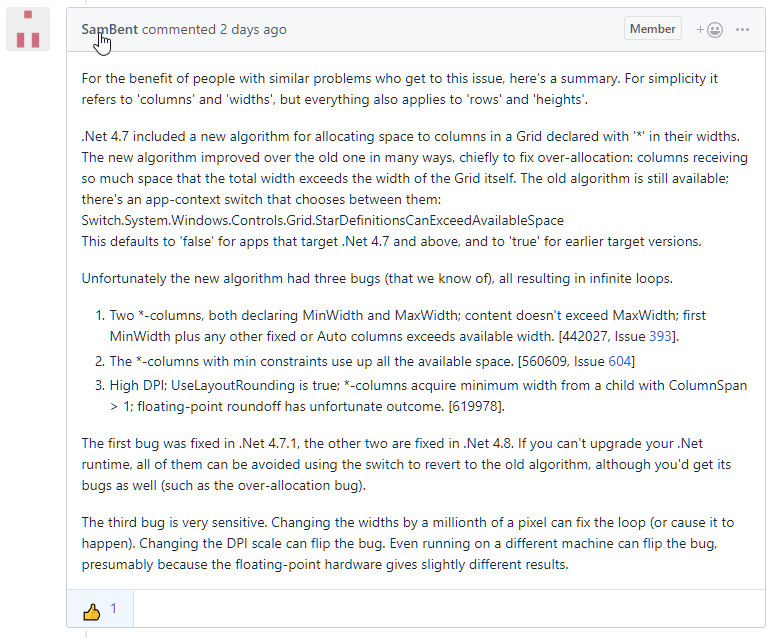

# WPF Hanging in Infinite Rendering Loop


I ran into a nasty WPF issue recently with [Markdown Monster](https://markdownmonster.west-wind.com). Markdown Monster has been for the longest time targeted at .NET 4.6.2, but a while back I started integrating with some libraries that have moved over completely to use .NET Standard. I was hoping by moving to .NET 4.7.1 and more built-in library support for .NET Standard would alleviate the DLL proliferation/duplication that using .NET Standard in full framework seems to entail. Alas that turned out to be a dead end as it didn't help in that respect.

But since I moved I figured what the heck, I'll stay on 4.7.1 - over 97% of users of MM are on 4.7.1 or later and there are a number of improvements in the framework that make this probably worthwhile. I shipped the last minor version update 1.15 with a 4.7.1 baseline target.

## Lockups with the 4.7.x Target
A few days later a few oddball bug reports came in on Github Issues. Several existing users were complaining that the new version they just upgraded to was locking up on startup. Sometimes before any UI comes up, sometimes the form loads but is unresponsive (white screen of death).

I tried to duplicate, and was unable to. I tried running MM on 4 different machines I have here locally, and a three more virtual machines that I have access to. Nothing failed. Must be a hardware issue, right? We ran into [some WPF rendering issues](https://github.com/RickStrahl/MarkdownMonster/issues/136) a long while ago due to specific graphics cards, so I figured this must be similar. The fix there was to disable hardware accelleration, but that seemed to have no effect on the affected users.

It took a lot of back and forth messages to pin this one down and I finally was able to duplicate the error **after I switched my display to scale 150%**. 4 machines, none of them failed because they all ran 100% until I switched to 150% when I managed to make two of them fail. It turns out the scaling wasn't the actual issue, but it's something that brought out the problem.


Notice how the main window partially loads, but isn't quite complete and stuck half way in the process.

This is an insidious bug because of course I didn't think about a system bug, but rather "Shit, what did I break?" Off I go on a rabbit hunt, only to come up blank rolling back code until prior to the last version update which preceeds the move to 4.7.1. Even then I did not make the connection right away. It wasn't until I started searching for similar reports which was tricky given the vague behavior.

Several people reported rolling back to 1.14.x releases and not seeing any problems and that time I started to realize that the 4.7.1 target was likely causing the problem. I rolled back and sure enough, running the same exact code in 4.6.2 that was crashing in 4.7.1 caused no problems on any of the machines. I pushed out a quick pre-release and several of the affected people tried it out and they too didn't have problems.

We found the problem - yay!
  
## Debugging this Issue
As you can imagine finding a finicky bug like this is a pain in the ass. It took me forever just to come up with a reproducible scenario. Once I figured out how to reproduce I still was unable to really get any useful information. I'd run the app in the debugger and it would hang. Pause the app and then take a look at the call stack.

The call stack wasn't much help either though. It stuck on `App.Run()` and then off deep into WPF. As you can see there's no user code in the stack, it's basically an infinite loop that keeps re-iterating deep inside of the WPF internals.


My search foo also wasn't helping me much. This is a hard issue to search on as WPF freezes are apparently common, but most were relative to perfectly normal situations like an ordinary race condition (LOL).

Finally I landed an obscure Github Issue that references a `StarDefinitionsCanExceedAvailableSpace` setting that was introduced in WPF in 4.7.x. This setting **disables** a new behavior introduced in 4.7.x that more **efficiently crashes** - uh, I mean manages WPF Grid sizing. This funky `app.config` runtime configuration setting can roll back the new behavior to the old behavior found in 4.6.x. And that's another fix that worked and still allows staying with 4.7.1 without being hit by this bug.

In my case I ended up rolling back to 4.6.1 anyway though. As mentioned the 4.7.1 move didn't get me what I wanted (less DLL dependencies from .NET Standard references) and for deployment on Chocolatey running anything past 4.6.2 complicates the automated installer testing they do to verify packages as it requires a .NET Runtime update to their clean virtual machine.

For now problem solved - after a harrowing week that probably turned away a few people from Markdown Monster because it crashed :unamused:

If you're interested you can follow the whole Markdown Monster paper trail in this GitHub issue:

[HiDPI Display w/Scaling Can Cause App Freeze on Launch](https://github.com/RickStrahl/MarkdownMonster/issues/485)

Thanks to those that stuck through all the back and forth and tried to help me figure out what was going on. You guys are awesome!

Here's some more info on the resolution.

## WPF Grid Sizing Bug in .NET 4.7.x
Long story short, I managed to duplicate the bug by having a high scale mode and all users that reported the issue also were using high scale modes.

But, it turns out the scale mode wasn't the actual cause of the failure, but rather a symptom which was exacerbated by scaling the display.

The issue is related to a known problem in .NET 4.7 related to **Grid Star Sizing**. It's specific to applications **that are targeted at .NET 4.7.x** and hit a specific sizing issue when using Grids with `*` sizing. Which for most applications is probably **everywhere**. I know in my apps almost every screen uses some form of grid and grid column or row sizing that uses `*` for auto-widening columns.

The **Grid sizing bug** caused by infinite loop entered due to a very minute rounding error in the new calculation for grid sizing introduced in 4.7.x. This bug occurs only if your application targets .NET 4.7.x - if you target 4.6.x (which uses an older algorithm) or now pre-release 4.8.x (it's fixed there) the problem does not occur. So you can **target 4.6.x and run on 4.7.x** and there is no problem. But if you **target 4.7.x and run on 4.7.x** that's when there's a potential problem.

The final outcome and summary of the problem is best summarized by Sam Bent from Microsoft in a [separate Github issue](https://github.com/Microsoft/dotnet/issues/604#issuecomment-463341296):



The gist of that summary is that when an app is compiled for 4.7.x there's a possibility that grid sizing can cause the application to seize up in an infinite loop that can lock up an application hard.

## Workarounds and Solutions 
There are a few ways to work around this problem:

* Rollback your build target to a pre-4.7.x release
* Use the [StarDefinitionsCanExceedAvailableSpace](https://docs.microsoft.com/en-us/dotnet/framework/migration-guide/runtime/4.7-4.7.1#resizing-a-grid-can-hang)
* Wait for .NET 4.8

### Rolling Back
Rolling back was the solution I used, because I didn't find out about the availability of the switch until after I rolled back, and because frankly I didn't see much benefit by staying on 4.7.1. It was important to get this resolved quickly that's where it sits today for me with Markdown Monster.

### Using  the StarDefinitionsCanExceedAvailableSpace Override
This setting overrides the new GridRendering behavior and basically lets you run with a .NET 4.7.x target in your project, but keeps the old behavior that was used in previous versions. 

There is a configuration setting that can be set in `app.config` for your application:

```xml
<configuration>
    <runtime>
        <AppContextSwitchOverrides value="Switch.System.Windows.Controls.Grid.StarDefinitionsCanExceedAvailableSpace=true" />
    </runtime>
</configuration>
```

I can verify that using that switch lets me run 4.7.1 and not see the lock up in any scaling mode. After I had my running version in 4.6.2 back, I once again moved up to 4.7.1 in a separate branch to try this out and sure enough the switch made the application run targeted with 4.7.1. So there's a hacky workaround.

It's a workaround though. This 'fix' according to Microsoft improves grid rendering allocations, providing more precise sizing and also improves performance and reduces memory usage. On paper this is a great improvement, but... well, side effects :-)

I suspect this issue is not wildly common as there was not very much info to be found about it. I think Markdown Monster makes this issue come up because the startup sequence has a lot of window manipulation. MM uses the [MahApps UI framework](https://mahapps.com/) which uses Window Animation and extra rendering frames for the main window, and MM itself moves the window offscreen for initial render and adjusts window sizing based on screen sizes and DPI settings if the window doesn't fit on the screen or would otherwise be offscreen. IOW, there's a bit of gyration to get the initial window onto the screen that is more likely to hit this bug than a simple WPF form.

So I doubt that every application needs to worry about this, but if you have a 4.7.x WPF app it might be a good idea to try it out at various resolutions and scale levels just to see how it fares.

### .NET 4.8 Fixes this Bug
I haven't tried this myself as I don't have .NET 4.8 installed yet, but according to Sam and Vatsan from Microsoft it appears this WPF bug has been fixed in .NET 4.8. **Yay!** 

But also not so *Yay*, because it'll take a while before we can target 4.8 apps and expect a decent user base for general release application.

It sure would be nice if this bug fix could be patched back into 4.7. 4.7 has the vast majority of .NET runtime user base today and it'll probably be quite a while before we can target 4.8 for public release applications when 4.8 reaches critical mass. Recent Windows 10 auto-updates help but that only applies to Windows 10 users (which luckily in MM is most of them, but for other more mainstream apps is probably not the case). 

In the meantime this insidious bug can catch a lot of developers off guard with a really hard to track down bug. Hopefully this post might help pointing people in the right direction.

## Summary
It's always a bummer to see bugs like this creep up. It sure seems like a major bug, but again searching turned up almost no hits which makes me think that not a lot of people are hitting this issue. Maybe most people target lower versions of .NET as I do - it seems I'm always **targeting one point version behind the current latest version** and that might account for the relatively low hit rate.

Still it's disconcerting to hit a bug like this that's so random and yet sounds like it could potentially hit just about any app. After all who's not using WPF Grids **everywhere** in a WPF application, it would seem difficult not to hit this at some point if it's random calculation error. I'd be interested to hear about others that have run into this issue and under what circumstances. If you have please leave a comment with your story.

I hope writing this down will make it easier for people to find this info in the future - I sure would have appreciated this instead of a week of lots of harried customer bug reports and no answers for them (and actually being a bit high and mighty with my *Works on my Machine* attitude).

<div style="margin-top: 30px;font-size: 0.8em;
            border-top: 1px solid #eee;padding-top: 8px;">
    
    this post created and published with 
    <a href="https://markdownmonster.west-wind.com" 
       target="top">Markdown Monster</a> 
</div>