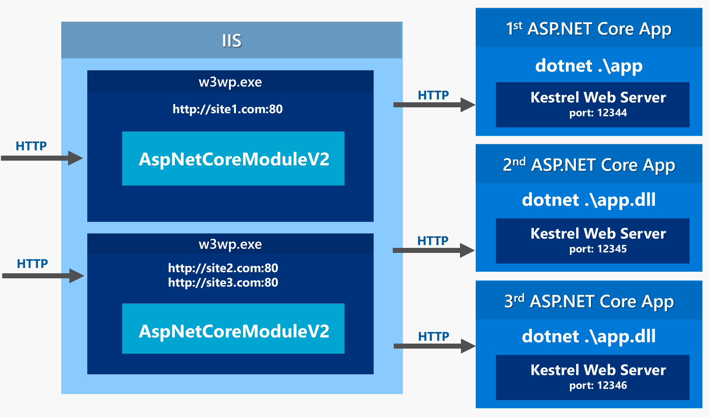
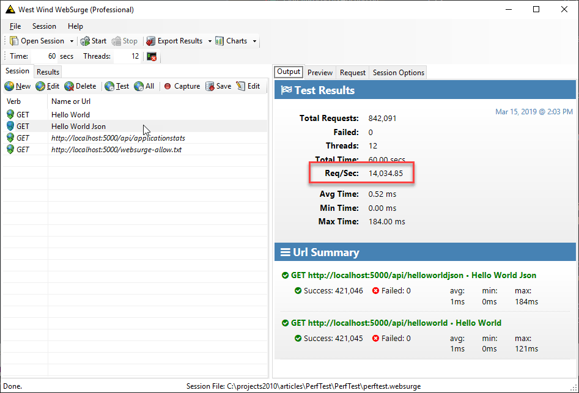

# ASP.NET Core InProcess Hosting on IIS with ASP.NET Core


ASP.NET Core 2.2 has been out for a while now and with it come some significant improvements to the hosting model if you plan on hosting in IIS. In previous versions you were required to host ASP.NET Core applications by proxying requests from IIS into the ASP.NET Core Kestrel server with IIS effectively as a Reverse Proxy. I wrote about this [in a detailed blog post](https://weblog.west-wind.com/posts/2016/Jun/06/Publishing-and-Running-ASPNET-Core-Applications-with-IIS) a while back.

Version 2.2 and later of ASP.NET Core adds support for direct in-process hosting which improves throughput considerably using an easy mechanism that allows switching between in-process and out-of-process hosting.

In this post I'll focus on the new In Process hosting model since that's what's changed and is improved, but I'll review the basics of both models here so this post can stand on its own. I'll start with what's changed and then dig a little deeper into how the models work and how they differ.

## ASP.NET Core 2.2 and later adds InProcess Hosting on IIS
The original versions of ASP.NET Core required you to host on IIS using an **Out of Process model** that proxies through IIS. Requests hit IIS and are forwarded to your ASP.NET Core app running the Kestrel Web Server. 

**Out of Process Hosting (pre v2.2 model)**



<small>**Figure 1** - Out of Process Hosting uses IIS as proxy to forward requests to your `dotnet.exe` hosted Console application. </small>

With ASP.NET Core 2.2 there's now an **In Process hosting model on IIS** which hosts ASP.NET Core directly inside of an IIS Application pool without proxying to an external `dotnet.exe` instance running the .NET Core native `Kestrel` Web Server.

**In Process Hosting (v2.2 and later)**


<small>**Figure 2** - With In Process hosting your application runs nside of the IIS application pool and uses IIS's intrinsic processing pipeline.</small>

The In Process model **does not use Kestrel** and instead uses a new Web Server implementation (`IISHttpServer`) that is hosted directly inside of the IIS Application Pool that is some ways similar to the way classic ASP.NET was plumbed into IIS.

This implementation accesses native IIS objects to build up the request data required for creating an `HttpContext` which is passed on to the ASP.NET Core middleware pipeline. As with the old version, the the Application Pool that hosts the ASP.NET Core Module does not have to be running .NET since the module hooks into the native code IIS pipeline.

Although this sounds like a fairly drastic change, from an application compatibility aspect I've not run into into any issues that have had any effect on my applications other than faster request throughput.

This feature improves throughput for ASP.NET Core requests on IIS significantly. In my off the cuff testing I see more than twice the throughput for small, do-nothing requests using IIS InProcess hosting. More on this later.

Microsoft has done a great job of introducing this hosting model with minimal impact on existing configuration: It's easy to switch between the old `OutOfProcess` and `InProcess` models via a simple project configuration switch that is propagated into the deployed `web.config` file.

## OutOfProcess or InProcess? Use InProcess
For new applications that are deployed to IIS you almost certainly will want to use InProcess hosting because it provides better performance and is generally less resource intensive as it avoids the extra network hop between IIS and Kestrel and maintaining an additional process on the machine that needs to be monitored. 

There are a few cases when OutOfProcess hosting might be desirable, such as for trouble shooting and debugging a failing server (you can run with console logging enabled for example) or if you want to be 100% compatible between different deployments of the same application, whether it's on Windows or Linux, since Kestrel is the primary mechanism used to handle HTTP requests on all platforms. With the InProcess model you're not using Kestrel, but rather a custom IISHttpServer implementation that directly interfaces with IIS's request pipeline. 

But for most intents and purposes I think running InProcess on IIS is the way to go, unless you have a very specific need to require Kestrel and OutOfProcess hosting.

New ASP.NET Core projects automatically configure projects for `InProcess` hosting, but if you're coming from an older project you may have to update your project settings explicitly.

## Settings Affected
Switching between hosting modes is very easy and requires only a configuration switch either inside of your `.csproj` file or in `web.config`. 

### Project Change - `<AspnetCoreHostingModel>`
The first change is in the project file where you can specify the hosting model by using the `<AspNetCoreHostingModel>` key. 

To use `InProcess` hosting add the following to your Web project's `.csproj` file:

```xml
<PropertyGroup>
    <TargetFramework>netcoreapp2.2</TargetFramework>
    <AspNetCoreHostingModel>InProcess</AspNetCoreHostingModel>
</PropertyGroup>
```

The relevant project setting is the `AspNetCoreHostingModel` which can be `InProcess` or `OutOfProcess`. When missing it defaults to the old `OutOfProcess` mode that uses an external Kestrel server with IIS acting as a proxy.

This affects how `dotnet publish` creates your configuration when you `publish` your project and what it generates into the `web.config` file when the project is published.

### web.config Change
The `<AspnetCoreHostingModel>` project setting affects the generated build output by writing configuration data into the `web.config` file for the project. Specifically it sets the the `hostingModel` attribute on the `<aspNetCore>` element that is generated:

```xml
<?xml version="1.0" encoding="utf-8"?>
<configuration>
  <location path="." inheritInChildApplications="false">
    <system.webServer>
      <handlers>
        <add name="aspNetCore" path="*" verb="*" modules="AspNetCoreModuleV2" />
      </handlers>
      
      <!-- hostingModel is the new property here -->
      <aspNetCore processPath="dotnet" arguments=".\WebApplication1.dll"	
			      stdoutLogEnabled="false" stdoutLogFile=".\logs\stdout"
			      hostingModel="InProcess" />
			      
    </system.webServer>
  </location>
</configuration>
```

If the `<AspNetCoreHostingModel>` key in the project is set to `OutOfProcess` or is missing, the `hostingModel` attribute is not generated and the application defaults to `OutOfProcess`.

> #### @icon-warning Refresh web.config on Publish
> I found that unlike the rest of the files in the publish output folder the `web.config` file **was not updated** on a new publish unless I deleted the file (or the entire publish folder). If you make changes that affect the IIS configuration I recommend to nuke the publish folder and doing a clean publish.

Note that you can easily switch between modes **after publishing** by simply changing the value between `InProcess` and `OutOfProcess` in the `web.config` in the Publish folder. This can be useful for debugging if you want to log output on a failing application with verbose log settings enabled for example. 

Just remember that if you change publish output it will be overwritten next time you publish again.

Cool - this single setting is all you need to change to take advantage of InProcess hosting and you'll gain a bit of extra speed connecting to your application.

## More Detail: Reviewing IIS Hosting
To understand how `InProcess` hosting for IIS is a nice improvement, lets review how ASP.NET Core applications are hosted on Windows with IIS. 

### What is an ASP.NET Core Application?
When you create an ASP.NET Core application you typically create a standalone **Console application** that is launched with `dotnet .\MyApplication.dll`. When you run the Console application, ASP.NET Core hosts its own **internal Kestrel Web Server** inside of the application. Kestrel handles the incoming HTTP traffic and a Kestrel connector hands of an `HttpContext` to the ASP.NET Core request middleware pipeline for processing.

> When you build an ASP.NET Web application you essentially create a fully self contained Web Server that runs ASP.NET Core on top of it.

### Why do I need a Web Server for my Web Server?
For live applications hosted on Windows you typically use IIS as the front end server for your ASP.NET Core application rather than letting your ASP.NET Core running the .NET Kestrel Web Server be accessed directly.

In a nutshell, the built in Kestrel Web server in ASP.NET core is not meant to be an Internet facing Web server, but rather act as an application server or **Edge Server** that handles very specific data processing tasks. Kestrel is optimized for application scenarios, but it's not optimized for other things like static file serving or managing the server's lifetime

For this reason you generally do not want to run Kestrel directly in a Web application. This is true on Windows with IIS and also on Linux where you tend to use a Web server **nginx** or **ha-proxy** to handle non-application concerns. I wrote about how to set up [IIS rewrite rules to route common static files](https://weblog.west-wind.com/posts/2017/Apr/27/IIS-and-ASPNET-Core-Rewrite-Rules-for-Static-Files-and-Html-5-Routing) rather than letting Kestrel handle them. This is not only about speed but it lets your Web application focus on doing the dynamic things that it's designed to do, letting IIS do the work it was designed for.

Here are a few of many arguments on why you want to use a full Web Server rather than running your application directly connected to the Web:

* **Port Sharing**  
Kestrel currently can't do port sharing in the same way that IIS and `http.sys` can do on Windows. Currently that functionality is supported only through IIS on Windows. (AFAIK you can't even using the HttpSys Server to do this). Additionally although it's [possible to use host header routing in ASP.NET Core](https://www.nuget.org/packages/Microsoft.AspNetCore.HostFiltering), it's not exactly easy or maintainable to set this up currently.

* **Lifetime Management**  
If you run your app without any support infrastructure any crash or failure will shut down the application and take your site offline. No matter what, you need some sort of host monitor to ensure your app continues to run if it fails and IIS provides that out of the box. ASP.NET Core with the ASP.NET Core Module benefits directly by being able to restart application pools that can relaunch your application on failures.

* **Static File Serving**  
Kestrel is not very good with static file handling currently and compared to IIS's optimized static file caching and compression infrastructure, Kestrel is comparitively slow. IIS takes full advantage of Kernel mode caching, and built in compression infrastructure that is much more efficient than today's ASP.NET StaticFile handler (".UseStaticFiles()").

There are additional reasons: Security and server hardening, administration features, managing SSL certificates, full logging and Http Request tracing facilities and the list goes on. All good reasons to sit behind a dedicated Web server **platform** rather than running and managing a self-hosted server instance. 

### Out of Process Hosting
Prior to ASP.NET Core 2.2 the only way to host ASP.NET Core on IIS was through out of process, proxy mode hosting. In this model IIS is acting like a Web Server Frontend/Proxy that passes requests through to a separately executing instance of the .NET Core Console application that runs Kestrel and your ASP.NET Core application. Each request first hits IIS and the **AspNetCoreModule** packages up all the request headers and data and essentially forwards it from port 80/443 (or whatever your port is) to the dedicated port(s) that Kestrel is listening on.


<small>**Figure 3** - Out of Process ASP.NET Core IIS Hosting</small>

As you can see the out of process model makes an additional http call to the self-contained running dotnet core application. As you can imagine there's some overhead involved in this extra HTTP call and the packaging of the data along the way. It's pretty quick, because it all happens over a loopback connection, but it's still a lot of overhead compared to directly accessing request data from IIS.

Once on the ASP.NET Core side the request is picked up by Kestrel, which then passes on processing to the ASP.NET Core pipeline.


<small>**Figure 4** - Once requests are forwarded via HTTP, they are picked up by the Kestrel Web Server</small>

### In Process Hosting


<small>**Figure 5** - IIS In Process Hosting routes requests directly into the application pipeline via the IISHttpServer implementation.</small>

In-process hosting does not use the **Kestrel Web Server** and instead uses an **IISHttpServer** implementation. This implementation receives incoming requests from the standard IIS `http.sys` driver and the built-in IIS native pipeline. Requests are routed to the Web site's port and host name through IIS and the request is then routed to `IISHttpServer` into ASP.NET Core. 


<small>**Figure 5.1** - In Process hosting uses the `IISHttpServer` component to handle the Web Server interface</small>

`IISHttpServer` then packages up request data for passing on to the ASP.NET Core pipeline to provide the HttpContext required to process the current request through the ASP.NET Core pipeline. Input is retrieved through native interfaces that talk to the IIS intrinisic objects and output is routed into the IIS output stream.


> #### @icon-info-circle In Process Differences
> Keep in mind that In Process Hosting **does not use Kestrel** and because you are using a different Web Server there might be some subtle differences in some settings that are picked up from the Web Server to create the HttpContext. One advantage of running Out of Process with  Kestrel **you get the same Web Server on all platforms** regardless of whether you run standalone, on IIS, on Linux or even in Docker.
>
> That said I haven't run into any issues with any of my (small to medium sized) applications where I've noticed anything that affected my application, but it's a possibility to watch out for.

> #### @icon-info-circle One ASP.NET Core Application per Application Pool
> The ASP.NET Core module V2 running in InProcess mode has to run in its own dedicated Application Pool. According to the documentation you cannot run multiple sites or virtual directories (Web Applications) using the the ASP.NET Core Module in a single Application Pool. **Make sure each ASP.NET Core app on IIS gets its own Application Pool**.

## Checking for InProcess or OutOfProcess Hosting
Once an application is in production you might want to ensure that you're using the appropriate hosting mechanism. You can check in a couple of ways.

#### Check for the `dotnet` process
You can check for a `dotnet` process that runs your application's dll. If you're running out of process you should have a `dotnet` process that's running your application's dll as shown in Figure 5:


<small>**Figure 6** - OutOfProcess uses `dotnet.exe` to run your application in proxy forwarding mode when using IIS and you can see that separate process in the Process list.</small>

If the `dotnet.exe` process is running with your application's specific command line, you know your app is running Out Of Process.

#### Check the Response `Server` Header
You can also check the HTTP response for the server and check for either `Kestrel` or `Microsoft IIS` as the Web Server for `OutOfProcess` and `Inprocess` modes respectively :

**OutOfProcess**


<small>**Figure 7** - Out of Process IIS Hosting forwards requests to an externally hosted ASP.Core application running **Kestrel**.</small>


**InProcess** 


<small>**Figure 8** - In Process IIS Hosting implements the Web server host inside of the Asp.Net Core Module using IIS infrastructure. The Server reads **Microsoft-IIS/10.0**.</small>


## Performance
So the obvious reason to use the new In Process model is that it's faster and uses less resources as it's running directly in process of the IIS Application Pool. There is no internal HTTP traffic and overhead and requests are processed immediately.

Before I show a few simplistic requests here, keep in mind that these tests are not representative of typical application traffic. Running simple do-nothing requests only demonstrates that **potential** throughput is drastically improved, but for longer running request the request overhead is far overshadowed by application level processing in comparison to the request access times. 

Still it's always a good idea to eek out extra performance and the improved throughput means less latency in requests, slightly faster response times and less overhead on the server potential more load that can be processed.

### How I set up the Test
For this test I used a [standard ASP.NET Core API project](https://github.com/RickStrahl/AspetCoreIISInprocessHostingSample) and then created a small custom class that has a few basically do nothing HelloWorld style methods in it:

```cs
public class TestController : Controller
{

    [Route("api/helloworld")]
    public string HelloWorld()
    {
        return "Hello World. Time is: " + DateTime.Now.ToString();
    }
    
    [Route("api/helloworldjson")]
    public object HelloWorldJson()
    {
        return new
        {
            Message = "Hello World. Time is: " + DateTime.Now.ToString(),
            Time = DateTime.Now
        };
    }
    
    [HttpPost]        
    [Route("api/helloworldpost")]
    public object HelloWorldPost(string name)
    {
        return $"Hello {name}. Time is: " + DateTime.Now.ToString();
    }
    
    ... informational requests removed
}
```


### How Much of a Difference?

**OutOfProcess**

The out of process test result looks something like this:


<small>**Figure 9** - IIS Out of Process processing results with Proxying</small>

This is on my local i7 - 12 core laptop. As you can see I get **~8.2k requests a second** using out of process hosting.

**InProcess**
Running that same test with InProcess hosting - ie. only adding the `hostingModel="InProcess"` to `web.config` (or via the **AspNetCoreHosting** project setting) I get this:


<small>**Figure 10** - IIS In Process processing results</small>

This produces **19k+ requests a second**. That's more than twice as many requests!

This is not exactly surprising given that you are removing an extra HTTP request and all the parsing that goes along the for ride in that process. But still it's quite a significant difference.

But again keep this in perspective. This doesn't mean that your app will now run twice as fast, but simply that you get slightly faster connect and response times for each request that runs through IIS which is a welcome addition, especially given that you have to do nothing to take advantage of this improvement except upgrade and set a configuration switch in your project.

> Just for reference, if I hit an IIS static Web site using tiny plain static pages I can generate about **~50k requests/second** on this same setup.

**Raw Kestrel**

Just for argument's sake I also wanted to test that same process using just raw Kestrel (on Windows) without IIS in the middle.



<small>**Figure 11** - Out of Process processing results with direct Kestrel access</small>

Direct Kestrel access lands somewhere in the middle between In and Out of Process hosting. 

I was a bit surprised by this - I would have expected raw Kestrel to perform on par or better than IIS for dynamic requests. Given all the performance stats we've heard how well ASP.NET Core performance on various benchmarks and many of the fastest benchmarks use raw Kestrel access. 

I would expect IIS to have a big edge for static files (with Kernel caching), but for dynamic requests I expected Kestrel to beat IIS. But apparently that's not the case at least not on Windows. Even for dynamic requests the IIS Inprocess throughput is better than Kestrel's.

## Summary
While IIS is getting marginalized in favor of hosting on Linux and Docker, remember that IIS is still Azure's default ASP.NET Core deployment model if you publish to an AppService and don't explicit specify platform. This means IIS is still in use in more scenarios than just self-hosted IIS applications, so it's not going away anytime soon. And Microsoft just backed that up with the new in processing hosting features that provide much better performance.

You now have two options for hosting on IIS using either the now classic Out of Processing that proxies requests through IIS and uses a completely self-contained ASP.NET Core console application using the .NET Based Kestrel Web Server, or you can use the In Process Hosting model which is more similar to the way classic ASP.NET used to interface with IIS through its own native APIs.

The new In Process model is considerably faster in terms of request throughput so in almost all cases when hosting on IIS you'll want to choose the InProcess model. 

The key setting to remember is to set:

```xml
<AspNetCoreHostingModel>InProcess</AspNetCoreHostingModel>
```

in your project and remove it or set it to `OutOfProcess` to use the old mode. The setting will generate the required `hostingModel` attribute in `web.config` which can also be explictly set in this file to make runtime changes to the host behavior.

This is a great improvement that gets you a decent performance bump for literally setting a switch. 

Switch it on and go burn some rubber...

## Resources

* [Sample Repo](https://github.com/RickStrahl/AspetCoreIISInprocessHostingSample)
* [Original ASP.NET Core IIS Hosting Post (covers out of process hosting only)](https://weblog.west-wind.com/posts/2016/Jun/06/Publishing-and-Running-ASPNET-Core-Applications-with-IIS)
* [Docs: Host ASP.NET Core on Windows with IIS](https://docs.microsoft.com/en-us/aspnet/core/host-and-deploy/iis/?view=aspnetcore-2.2)
* [Docs: Web Server Implementations in ASP.NET Core](https://docs.microsoft.com/en-us/aspnet/core/fundamentals/servers/?view=aspnetcore-2.2&tabs=windows)

<div style="margin-top: 30px;font-size: 0.8em;
            border-top: 1px solid #eee;padding-top: 8px;">
    
    this post created and published with 
    <a href="https://markdownmonster.west-wind.com" 
       target="top">Markdown Monster</a> 
</div>