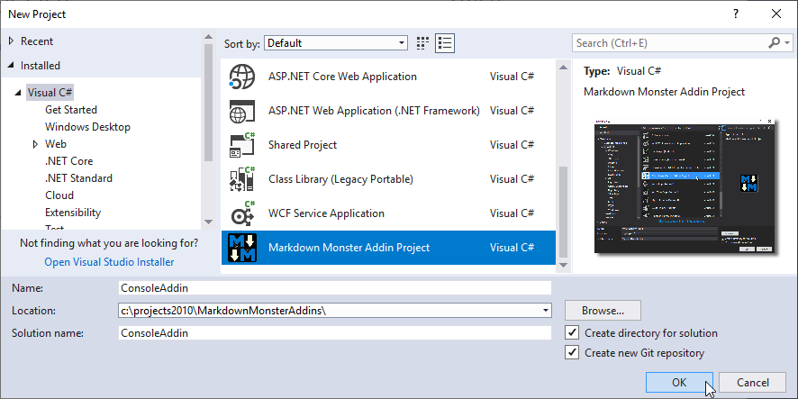
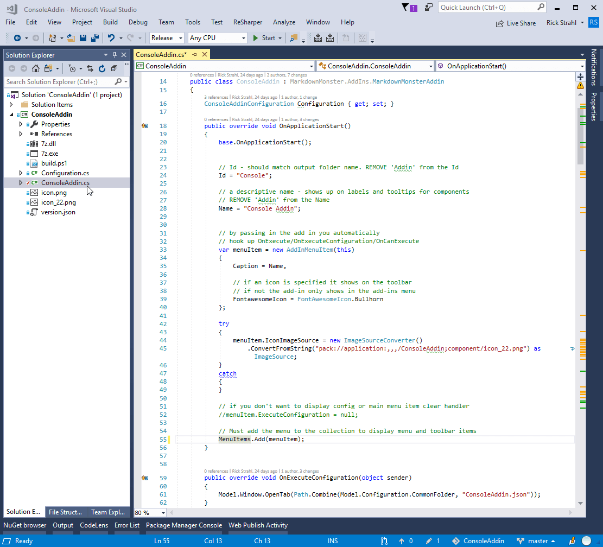
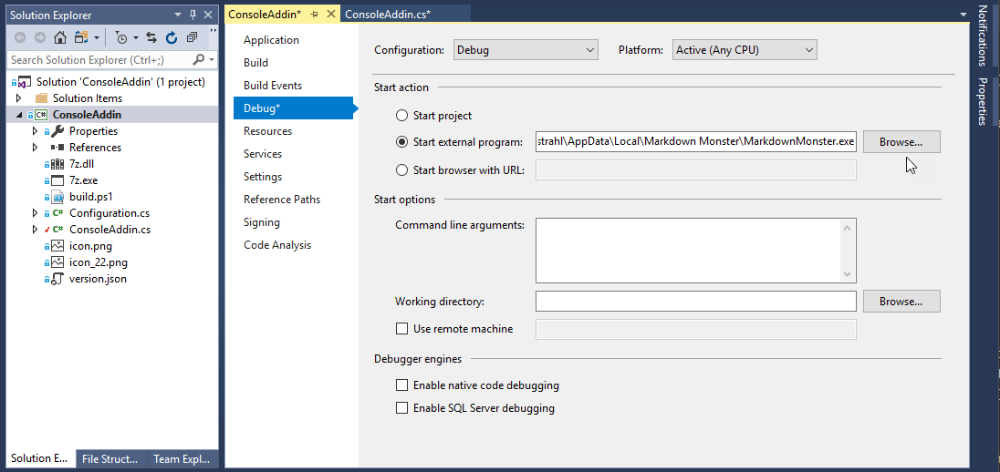

# Creating a Command Line Addin for Markdown Monster with C#

Markdown Monster is a markdown Editor for Windows that makes it very easy to extend base functionality by creating a .NET based addin. Recently I got several requests to add an 'integrated' command line to Markdown Monster and my  first response to that request was that that would make for a nice addin. 

In this post I'll describe how to create a new addin from scratch and then hook up the custom functionality to attach a terminal to the Markdown Monster window. The actual terminal code might be useful to applications other than Markdown Monster.

## A CommandLine Addin
Make that the second question - the first I had really was: **Why**? MM already includes the abillity to shell out to the operating system easily via options from the active tab, the menu or the folder browser which gives you quick access to a command line to perform common commands. The most common request is related to using Git from the commandline, but a distant second involves interacting with various content creation tools that run from the command line (like Wyam or ) to build documentation into self-contained Web site. And then there are those that just live on the command line all day to do most of their computer related tasks.

Anyways - who am I to ask. People have their preferences and if creating this external installable adding provides value, let's do it.

## CommandLine as a Floating Window
Creating Command Line integration in a Desktop application is surprisingly hard. While it's relatively easy to capture output from a console process and pipe it into an window, **interacting** with an external console window is quite tricky. Doing a little research I found that that is fraught with difficult set up and all sorts of quirks, so much so that most attempts to do this in a WPF (or WinForms) application didn't work out and were abandoned. Even if it did work it would have ended up being more effort and trial and error than I would want to invest in this.

However I got to think that a much easier solution might be to simply open a self-contained console window and 'attach' it to the bottom of the Markdown Monster window. So rather than managing the console inside of the Markdown Monster UI, the console is just a real and fully functional console, that is moved alongside the Markdown Monster window when the windows is moved, resized or activated.

A perfect job for a Markdown Monster Addin.

## Creating a Markdown Monster Addin
Creating an addin for Markdown Monster is pretty straight forward - the easiest way is to use the Markdown Monster Addin Project Template for Visual Studio which you can install from the Visual Studio 2017 and 2019 extensions manager.

The template creates a new Visual Studio project that should be ready to compile. The project consists of the main Addin file, an optional pre-configured configuration object for your addin, and a few related build files that are used to package up the addin so you can distribute it in the Markdown Monster Addin-Repository - more on that later.

Here's what you see when you open the new project in Visual Studio:

The key files are:

* **The main Addin File (ConsoleAddin.cs)**  
This is the entry point into the addin which overrides the `MarkdownMonsterAddin` base class and inherits the various hooks and properties you can use to activate the addin and interact with Markdown Monster's Application and User Interface Model.

* **Build Files**  
You can create a shared component that can be published in the Markdown Monster Addin repository. If you want to do that you need to create and fill in a `version.json` file that describes the addin and a `build.ps1` that is used to build a self-contained zip file that can be distributed to the registry. In addition an icon and optional screenshot is bundled into the distribution zip file.

## How Markdown Monster Addins get Invoked
You don't have to distribute your addin to a repository to run it, it just has to be copied into a designated location to be loaded by Markdown Monster. The Visual Studio Project automatically sets the output path to the appropriate folder, so you can just build and then run Markdown Monster outside of Visual Studio to get the addin to load.

> ### @icon-info-circle Debugging Executable has to be Manually Set
> If you want to just debug or run Markdown Monster out of Visual Studio, you have to manually set the debug startup executable and point it at Markdown Monster. This value is stored in the Solution file rather than the Project file, so the Project Template can't set it for you when the new project is created.
>
> 
>
> The default install location is:
>
> `%localappdata%\Markdown Monster\MarkdownMonster.exe`
>  
> You can use the environment var in the browse dialog, but the full path has to be entered or selected in the project setting.

So addins are just plain DLLs that are loaded with custom hooks that are implemented inside of the addin. The two main hooks are:

* **OnExecute**  
This hook is fired when you click on the Addin button in the toolbar or the menu choice in the Addins menu. If you're building a single function addin or you're simply popping up some modal form to display and act upon this interface is the way to go.

* **OnExecuteConfiguartion**  
This method is fired when you click on the configuration button. If your addin has any sort of configuration MM provides a configuration object that you can write out into a JSON file to hold saved values. Most addins currently simply open the JSON file in the editor and let you set a few options.

* **OnApplicationStarted**  
This method is fired when the application starts and allows you to hook into application life cycle events of the application. This event is fired before the MM UI has come up and before other addins and a number of other things have loaded, so be careful with this method.

* **OnWindowLoaded**  
This event is fired after the Markdown Monster UI has been activated, the main window is loaded (but not necessarily visible yet). This method lets you hook in to Window related events.

There are a number of additional events avaiable that you can hook into.

In the Console Addin I'm keeping things really simple and hook into the `OnExecute()` operation to basically toggle the Console window on or off. If not active the window is created and if active the window is closed. I also need to handle `OnApplicationShutdown` to close down the console window when the app exits - otherwise the console window sticks around on the desktop.

## Console Addin - The Plan
So the plan for the console addin is pretty simple:

* Click the Toolbar button to open the console window
* Create a new Powershell or Command Window
* Resize the window and remove the title bar
* Attach to main Window Events to move the console with the Window
