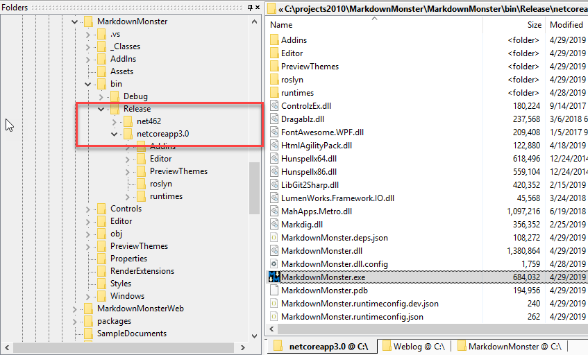
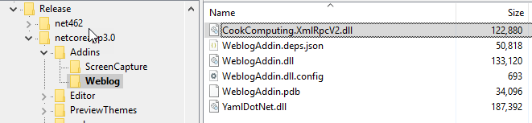
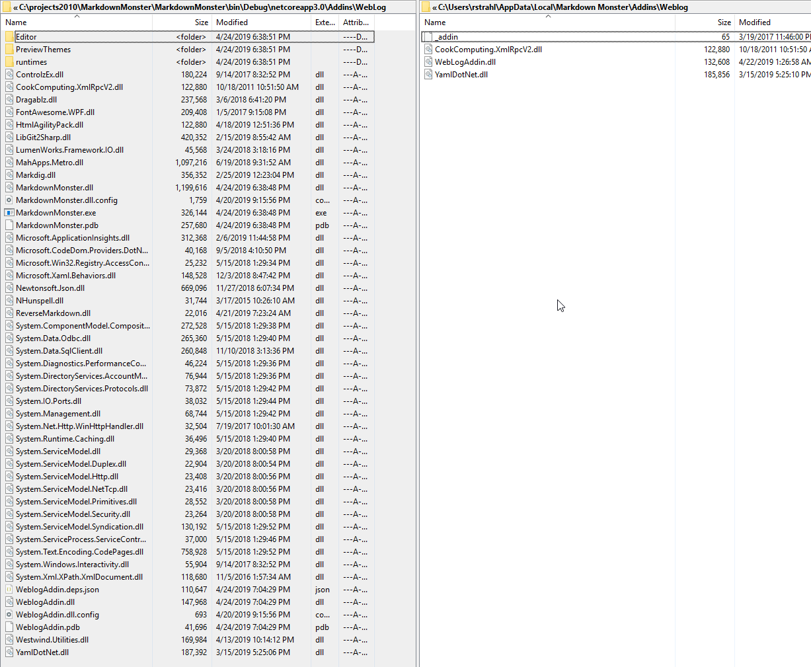
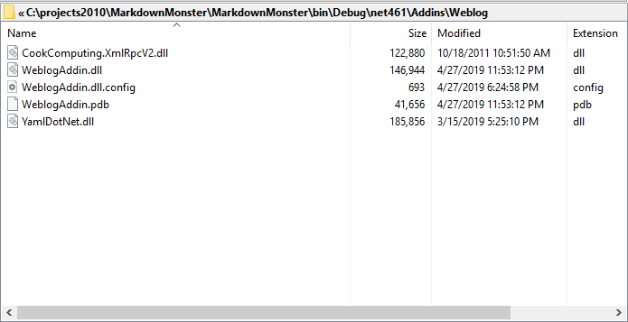

# .NET Core 3.0 SDK Projects: Controlling Output Folders and Content


In my last post I talked about [porting my Markdown Monster WPF application to .NET Core 3.0](https://weblog.west-wind.com/posts/2019/Apr/24/First-Steps-in-porting-Markdown-Monster-to-NET-Core-30) and one of the problems I ran into was how to deal with properly handling compilation of Addins. In Markdown Monster Addins compile **into a non-standard folder** in the main EXE's output folder, so when building the project I want my Addin to be pushed right into the proper folder hierarchy inside of the parent project so that I can run **and debug** my addins along with the rest of the application.

This used to be pretty easy in classic .NET projects:

* Add NuGet or Project References
* Mark each assembly reference's **Copy Local** settings
* Include new dependencies with Copy Local `True`
* Exclude existing dependencies with Copy Local `False`

In the new .NET SDK projects this is more complicated as there's no simple way to exclude dependencies quite so easily. Either everything but the primary assembly is excluded which is the default, or you can set a switch to copy dependencies which copies **every possible dependency** into the output folder.

Let's take a look.

##AD##

## Where does output go?
By default .NET SDK projects push compiled output into:

```text
<projectRoot>bin\Release\netcore3.0
```

The reason for this more complex path that includes a target framework is that SDK projects can potentially have multiple targets defined in the `<TargetFramework>` element so you can do:

```xml
<TargetFrameworks>net462;netcore3.0</TargetFrameworks>
```

The separate folder structure allow for both targets to get their own respective output folders when you build the project.



For my addins this is **not what I want** - I want to send output to a very specific folder in the 'parent' Exe project in the `Addins\AddinName` folder:



Not only that but I also need to write out only the actual assembly for the output **plus any new dependencies** that aren't already referenced in the main project - rather than all or no dependencies which are the 'default' options.

## Sending output to a Custom Folder with Dependencies
So to send output to a non-default folder you can use `<OutDir>` and to force dependencies to be included in the output rather than the default behavior that just includes the project's assembly you can use `<CopyLocalLockFileAssemblies>`.

Here's what that looks like in my project:

```xml
<PropertyGroup>
    <CopyLocalLockFileAssemblies>true</CopyLocalLockFileAssemblies>
    <OutDir>$(SolutionDir)MarkdownMonster\bin\$(Configuration)\$(TargetFramework)\Addins\Weblog</OutDir>
</PropertyGroup>
```

The `<OutDir>` element points at the Exe's project output folder and  copies files directly into the specified folder without a target folder.

> If you want to generate output to a new folder **and get a target framework root folder**  there's the `<OutputPath>` directive.


> `<CopyLocalLockFileAssemblies>` is a very blunt tool. It copies **everything** related to a dependency so it can produce a boatload of assemblies and content files that you likely don't want, so you likely will need to filter the resulting output.


The `<CopyLocalLockFileAssemblies>` ensures that **all** dependencies are copied, not just the one assembly generated for this project. So we need to filter the files somehow. More on that below.


With `<OutDir>` the output goes into the main project output folder depending on the current target framework (potentially multiples) and the Configuration which is `Debug` or `Release` most likely.

Ok - output's now going where it needs to go.

## Controlling Output Assemblies
The next problem is that when I now build  the project the project output includes **all** dependencies. That includes all NuGet package assemblies, all dependent assemblies, and also the dependencies for my Main EXE's reference:



Holy crap that's a lot of assemblies and all buy 3 of them are in this case duplicated.

So the next step is to NuGet packages and Assembly References from bringing in all of their dependencies.

For NuGet Packages the element to use is `<IncludeAssets>` and set the value `compile`:

```xml
<ItemGroup>
    <!-- Assemblies already referenced by mainline -->
    <PackageReference Include="MahApps.Metro" version="1.6.5">
      <IncludeAssets>compile</IncludeAssets>
    </PackageReference>
    <PackageReference Include="Dragablz" version="0.0.3.203">
      <IncludeAssets>compile</IncludeAssets>
    </PackageReference>    
    ...
    
    <!-- my dependencies that aren't used by main project 
         so I'm not using `<IncludeAssets>`                 -->
    <PackageReference Include="xmlrpcnet" version="3.0.0.266" />
    <PackageReference Include="YamlDotNet" version="6.0.0" />
</ItemGroup>
```

The point of this to 'exclude' any of the dependencies that are already loaded by the main executable and so don't need to be redistributed again. The `<IncludeAssets>compile</IncludeAssets>`. The only packages that I actually **want** to be included in the output folder are those new assemblies that are not already loaded by the main Exe. 

There's more info on the various `<IncludeAssets>` and related elements values that you can provide [in the NuGet documentation](https://docs.microsoft.com/en-us/nuget/consume-packages/package-references-in-project-files#controlling-dependency-assets).

## Project or Assembly References also Copy Files
I'm still not done - I also have an assembly reference that points back at the main EXE project. My first try used a project reference, but this would pull in **the entire project including all related assets**. Ouch.

So this didn't work:

```xml
<ItemGroup>
    <ProjectReference Include="$(SolutionDir)MarkdownMonster\MarkdownMonster.csproj" >
     <IncludeAssets>compile</IncludeAssets>
    </ProjectReference>
</ItemGroup>  
```  

I couldn't find a setting for `<IncludeAssets>` or `<ExcludeAssets>` that works for the Project Reference. No matter what I did the depedencies were copied in. 

So - instead of a project reference I can also use an **Assembly Reference**  instead pointing at the compiled EXE. Then I can mark it as `Private` which won't copy all of the project's content into the output folder: 

```xml
<ItemGroup>
    <Reference Include="..\..\MarkdownMonster\bin\$(Configuration)\$(TargetFramework)\MarkdownMonster.exe">
      <Private>false</Private>
    </Reference>
  </ItemGroup>
```

Success. The end result of both the package references and project reference now is:



Just to summarize here's the complete project file for the `WeblogAddin` project:

```xml
<Project Sdk="Microsoft.NET.Sdk.WindowsDesktop">

  <PropertyGroup>
    <TargetFramework>netcoreapp3.0</TargetFramework>
    <AssemblyName>WeblogAddin</AssemblyName>
    <UseWPF>true</UseWPF>
    <GenerateAssemblyInfo>false</GenerateAssemblyInfo>

    <CopyLocalLockFileAssemblies>true</CopyLocalLockFileAssemblies>
    <OutDir>$(SolutionDir)MarkdownMonster\bin\$(Configuration)\$(TargetFramework)\Addins\Weblog</OutDir>

    <Authors>Rick Strahl, West Wind Technologies</Authors>
  </PropertyGroup>

  <ItemGroup>
    <!-- Assemblies already referenced by mainline -->
    <PackageReference Include="MahApps.Metro" version="1.6.5">
      <IncludeAssets>compile</IncludeAssets>
    </PackageReference>
    <PackageReference Include="Dragablz" version="0.0.3.203">
      <IncludeAssets>compile</IncludeAssets>
    </PackageReference>
    <PackageReference Include="Microsoft.Xaml.Behaviors.Wpf" version="1.0.1">
      <IncludeAssets>compile</IncludeAssets>
    </PackageReference>
    <PackageReference Include="FontAwesome.WPF" Version="4.7.0.9">
      <IncludeAssets>compile</IncludeAssets>
    </PackageReference>
    <PackageReference Include="HtmlAgilityPack" version="1.11.3">
      <IncludeAssets>compile</IncludeAssets>
    </PackageReference>
    <PackageReference Include="Newtonsoft.Json" version="12.0.1">
      <IncludeAssets>compile</IncludeAssets>
    </PackageReference>
    <PackageReference Include="Westwind.Utilities" version="3.0.26">
      <IncludeAssets>compile</IncludeAssets>
    </PackageReference>

    <!-- my dependencies that aren't used by main project 
         so I'm not using `<IncludeAssets>`                 -->
    <PackageReference Include="xmlrpcnet" version="3.0.0.266" />
    <PackageReference Include="YamlDotNet" version="6.0.0" />
  </ItemGroup>

  <ItemGroup>
    <!--<ProjectReference Include="$(SolutionDir)MarkdownMonster\MarkdownMonster.csproj" >
     <IncludeAssets>compile</IncludeAssets>
    </ProjectReference>-->
    <Reference Include="$(SolutionDir)MarkdownMonster\bin\$(Configuration)\$(TargetFramework)\MarkdownMonster.exe">
      <Private>false</Private>
    </Reference>
  </ItemGroup>  

  <ItemGroup>
    <Resource Include="icon.png" />
    <Resource Include="icon_22.png" />
    <Resource Include="MarkdownMonster_Icon_128.png" />
  </ItemGroup>  

</Project>
```

##AD## 

## Harder than it should be
What I'm describing here is a bit of an edge case because of the way the addins are wired up in my application, but it sure feels like these are a lot of hoops to jump through for behavior that used to work in classic projects by simply specifying an alternate output folder. I also find it very odd that all dependencies are pulled in from an assembly reference (my main Markdown Monster project DLL which references *The World*). 

> To be clear having all assemblies in the output folder doesn't break the application so the default settings **work just fine**. But by default you do end up with a bunch of duplicated assemblies that likely don't want and have to explicitly exclude using the steps provided in this post.

In the end it all works and that that's the important thing, but it's a bit convoluted to make this work and wasn't easy to discover. A few pointers from Twitter is what got me over the hump.

And that's what this post is for - so I (and perhaps you) can come back to this and remember how the heck to get the right incantation to get just the right files copied into the output folder.

## Related Resources

* [First Steps in porting Markdown Monster WPF App to .NET Core 3.0](https://weblog.west-wind.com/posts/2019/Apr/24/First-Steps-in-porting-Markdown-Monster-to-NET-Core-30)
* [Project Dependency NuGet Settings](https://docs.microsoft.com/en-us/nuget/consume-packages/package-references-in-project-files#controlling-dependency-assets)
* [Markdown Monster](https://markdownmonster.west-wind.com)
* [Markdown Monster Project on GitHub](https://github.com/RickStrahl/MarkdownMonster)


<div style="margin-top: 30px;font-size: 0.8em;
            border-top: 1px solid #eee;padding-top: 8px;">
    
    this post created and published with 
    <a href="https://markdownmonster.west-wind.com" 
       target="top">Markdown Monster</a> 
</div>