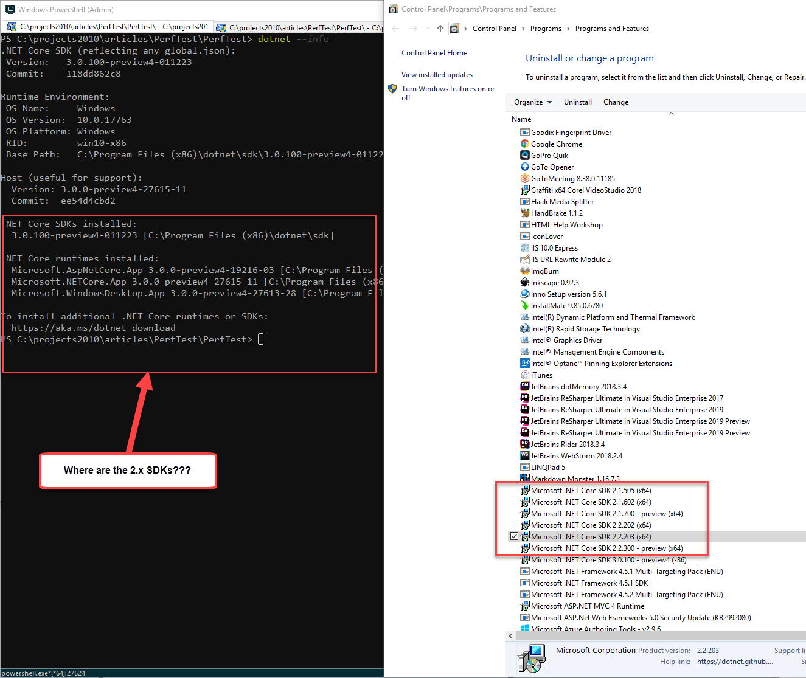
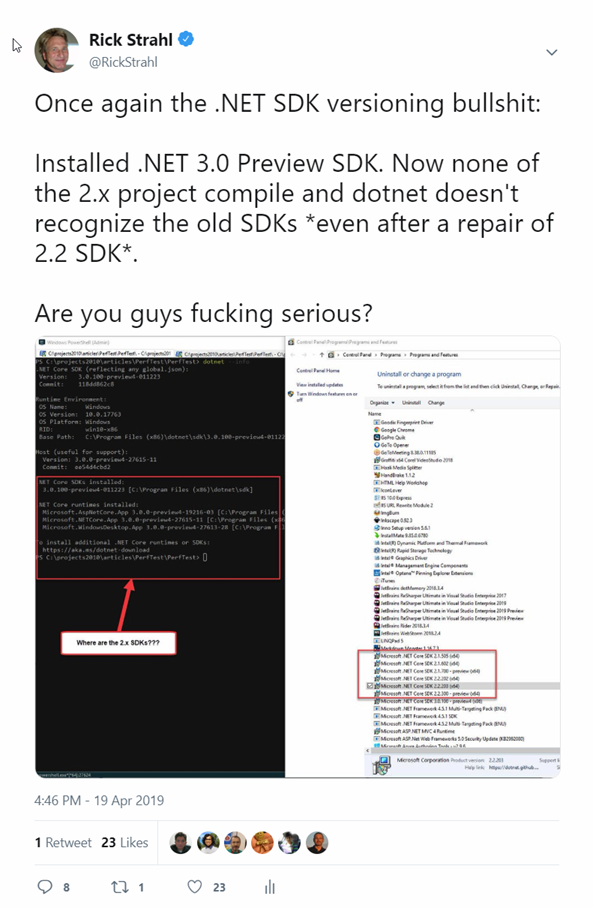
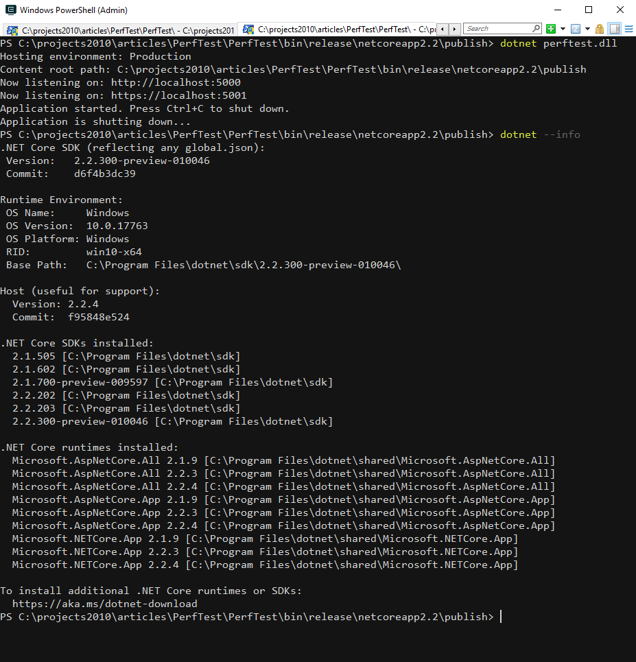
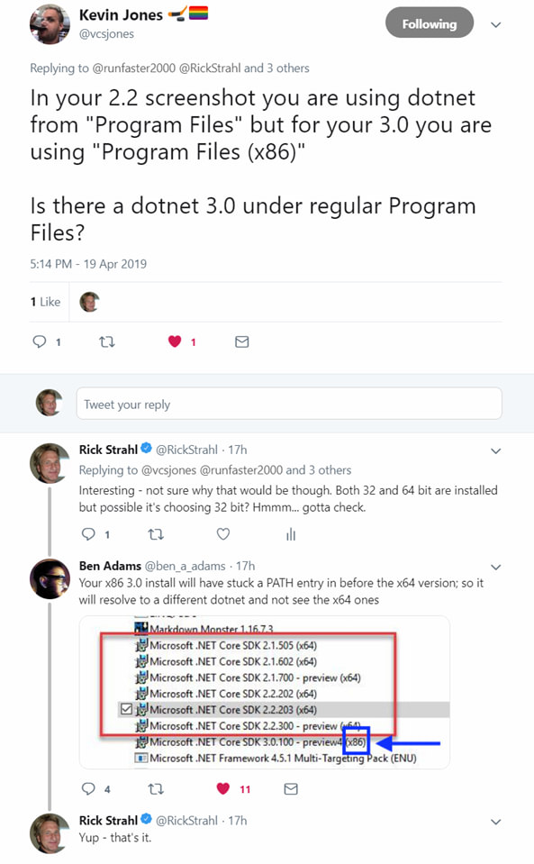
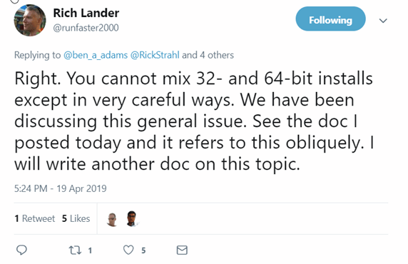
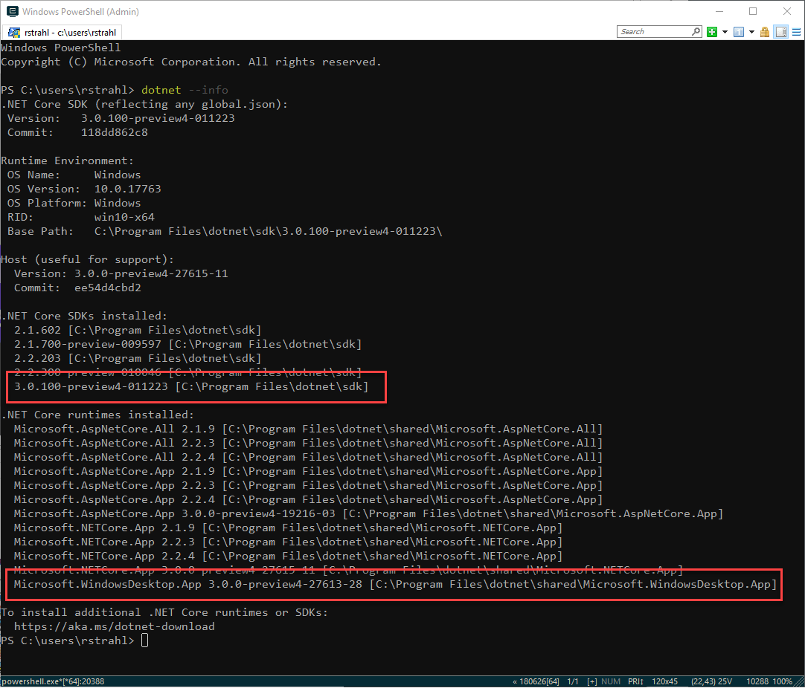
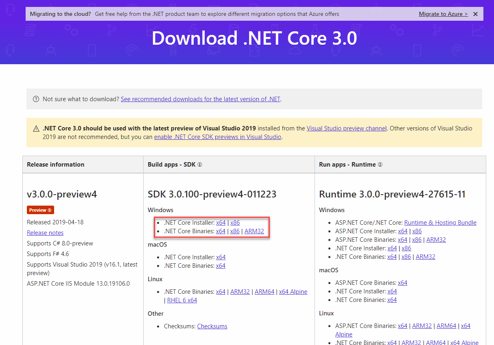

# Adventures in .NET Core SDK Installation: Missing SDKs and 32 bit vs 64 bit

Yesterday I ran into yet another .NET Core versioning problem, this time related around the .NET Core SDK installation. A couple of days ago the [.NET Core 3.0 Preview 4 SDK](https://dotnet.microsoft.com/download/dotnet-core/3.0) was released and I installed it as I was doing some experiments around Blazor and Razor Components again. I installed the SDK and did my 3.0 things and forgot about it.

Today I went back to one of my .NET Core 2.2 applications and found that when trying to run from the command line I was getting strange errors saying that the required 2.2 SDK wasn't installed.

To my surprise doing a:

```ps
dotnet --info
```

showed this:



All the 2.x SDKs were missing. Yet notice that the 2.x SDKs are actually installed on the machine, as you can clearly see in the Programs and Features display.

I tried a few things to try and get this to work **without success**:

* **Repair Installed the 2.2 SDKs**  
Just to be sure I went and repaired two of the SDK installs to see if that would bring them back in the `dotnet --info` list - but no joy.

* **Added explicit `global.json`**  
I created a `global.json` with a very **specific SDK version** that I know was installed. Building the project now tells me that **the specific version of the SDK is not installed**. Hrrrmph - no joy.

I've been having a bunch of version mishaps lately with .NET Core, so in my frustration I yelled loudly on Twitter :innocent:



I'll come to regret that later... but only a little :-)

### Success #1: Uninstall the .NET Core 3.0 SDK
So the first and obvious solution after all the above failed was to uninstall the .NET Core 3.0 SDK and sure enough removing the SDK fixed the problem, and the 2.2 SDKs SDK list back was back!



Yay. 

But why all the pain with the 3.0 SDK?

### 32 Bit vs 64 Bit
Thanks to my Twitter outburst it only took a few minutes for Kevin Jones ([@vcsjones](https://twitter.com/vcsjones)) and Ben Adams ([@ben_a_adams](https://twitter.com/ben_a_adams)) to spot my **myopia**:

[](https://twitter.com/vcsjones/status/1119439213580173312)

The 3.0 SDK installed is the 32 bit version and due to the way the SDK pathing worked out due to install order, the 32 bit SDK is found first.

So what happened here is that I had **accidentally** installed the **32 bit version** of the .NET Core 3.0 SDK.  If you look at the screen shot above more closely you can see that the installed version is installed `Program Files (x86)` which is the giveaway for the 32 bit version:


The problem here is that if you have both 32 bit and 64 bit versions of the SDK installed, the first one found wins. And only one version of the SDK (32 bit or 64 bit) can be active at any one time. 



### Fix the Problem
So to fix this problem I can now do :

* Uninstall the .NET Core 3.0 32 Bit SDK
* Reinstall the 64 bit Version

which nets me the install I want to have from the get-go:



or if you really need to have both SDKs installed fix the path so that the one you need in your current session is first in the path sequence.

* Fix 64 bit SDK locations to be first in Windows Path

### Do you need 32 Bit SDKs?
There should be very little need for 32 bit versions of the SDK on Windows. Most moderns Windows machines are running 64 bit so if you are building a new application it would make sense to build your apps using 64 bit.

One place where this will perhaps matter with .NET 3.0 is for desktop applications. A lot of older desktop applications are still 32 bit for a variety of reasons (interop with older 32 bit COM components for example), compatibility issues with older UI components.

For example, I'm planning at some point to move Markdown Monster to .NET Core 3.0 but currently it runs as a 32 bit application [due to better performance and stability of the Web Browser control in 32 bit mode](https://weblog.west-wind.com/posts/2016/dec/23/downgrading-a-net-applications-from-64-bit-to-32-bit-for-the-webbrowser-control). As long as I continue to use that control (which may not be much longer if the new Chromium Edge WebView can work reliably) I will continue to keep the application running as a 32 bit app.

So there are still some edge cases for 32 bit development and that's what those SDK exist for I suspect.

> But... even if you are building 32 bit apps, according to [Rich Lander](https://twitter.com/runfaster2000) again, the **64 bit SDK can build for 32 bit runtimes** so even if you are building a 32 bit application you probably don't need a 32 bit SDK.

All 64 bit, all day!

### Make it harder to install 32 bit
So my fat fingered error was caused by being sloppy when picking the installer on the Web Page:



It's probably a good idea to make the 64 bit download more prominent to avoid an accidental click or even for a new .NET person to think that x86 might just fine. 

Even better maybe the 32 bit download on a 64 bit system should prompt and ask *Are you sure you want to install the 32 bit SDK*?


### Visual Studio doesn't Care?
Incidentally I found that while I was struggling on the command line with the `dotnet` command line tooling, Visual Studio was just fine compiling my 2.2 projects and running it. The problem I had was specifically with the command line version from my 'normal' Windows environment.

It works for Visual Studio because VS sets up a custom environment with a custom path that includes the right SDK locations based on the runtime target you specify in your application, so compilation inside Visual Studio works.

So in theory I could have gone and published my project to a folder to get the output to work. But then running it locally I still would have to adjust my path (unless I run through Visual Studio).

### Moral of the Story
At the end of the day this was a user error on my part. The bottom line is **make sure you install the right version of the .NET Core SDK and runtimes**. 

In almost all cases the right version of the SDK to download and  is the 64 bit version unless you are running on 32 bit Windows version (hopefully not).

<div style="margin-top: 30px;font-size: 0.8em;
            border-top: 1px solid #eee;padding-top: 8px;">
    
    this post created and published with 
    <a href="https://markdownmonster.west-wind.com" 
       target="top">Markdown Monster</a> 
</div>