# First Steps in porting Markdown Monster WPF App to .NET Core 3.0

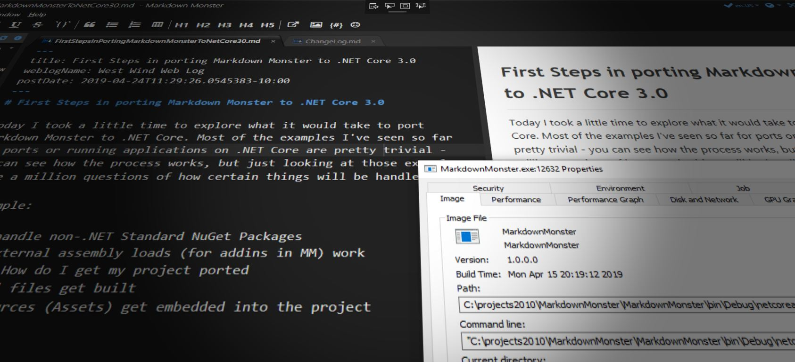

Today I took the day to explore what it would take to port Markdown Monster to .NET Core. Most of the examples I've seen so far for ports or running applications on .NET Core are pretty trivial - you can see how the process works, but just looking at those examples I had a million questions of how certain things will be handled. So I decided to take a look.

For example:

* How to handle non-.NET Standard NuGet Packages
* How do external assembly loads (for addins in MM) work
* Porting - How do I get my project ported
* How to Xaml files get built
* How do resources (Assets) get embedded into the project

I'll look at all of these things. Heads up: This is a long rambling post as I just wrote down a bunch of stuff as I was going through it. I edited out some extraneous stuff, but it's mostly just off the cuff, but if you're thinking about porting an application I think most of the things I describe here are things you are likely to run into yourself even if this application is a bit more esoteric as it includes some interop features due to the Web Browser control used the core UI.

> Examples are based **.NET Core 3.0 Preview 5** which is the latest Preview at the time of writing. 

## Porting the Project
Markdown Monster is comprised of one main WPF EXE project which contains the bulk of code, plus several Addin projects that handle things like Weblog Publishing, Screen Captures and the Snippet Editor. To start I unloaded the Addin projects to focus only on the main project first.

So the first thing I did is convert the MM exe project file to the new **.NET SDK Project Format** file by switching the old .NET project to a .NET SDK project. If you recall, .NET SDK projects are much simpler than the old .NET projects because you generally don't have to list every file that the project needs to build. Instead the project knows about common file types and automatically builds what it knows how to build. You only explicit add files that require *special instructions* like static files or folders to copy, or files to exclude from building or copying.


What's nice about that is that you can easily create a new project by basically deleting the old one and adding just a few simple things into the file.

To start I simply created a mostly empty project file from my old project:

```xml
<Project Sdk="Microsoft.NET.Sdk.WindowsDesktop">
 
  <PropertyGroup>
    <OutputType>WinExe</OutputType>
    <TargetFramework>netcoreapp3.0</TargetFramework>
    <AssemblyName>MarkdownMonster</AssemblyName>
    <UseWPF>true</UseWPF>
  </PropertyGroup>

</Project>
```

At this point I can actually open the project in Visual Studio as a new SDK style project. 

I also had to delete the `Properties.cs` file that hold assembly configuration - that information by default gets generated by the project file info. Alternate you can also add `<GenerateAssemblyInfo>false</GenerateAssemblyInfo>` and keep `Properties.cs`. I recommend the former and put the assembly info into the project file.

Most likely you'll get errors that complain about duplicate Assembly directives. SDK projects include assembly directive information in the project file itself, so you can either delete the old `AssemblyInfo.cs` file, or add `<GenerateAssemblyInfo>false</GenerateAssemblyInfo>` into the property group above and leave the old file as is.

Note that you no longer have to add Xaml files explictly - the `<UseWpf>` tag automatically compiles all Xaml files in your project so the file can stay clean.

## NuGet Packages
If I compile at that point I'll get hundreds of errors - that's because all of my dependencies are still missing. So the next step then is to move over all the package references into the new project as an item group.

```xml
  <ItemGroup>
    <PackageReference Include="Dragablz" Version="0.0.3.203" />
    <PackageReference Include="FontAwesome.WPF" Version="4.7.0.9" />
    <PackageReference Include="HtmlAgilityPack" Version="1.11.3" />
    <PackageReference Include="LibGit2Sharp" Version="0.26.0" />
    <PackageReference Include="LumenWorksCsvReader" Version="4.0.0" />
    <PackageReference Include="MahApps.Metro" Version="1.6.5" />
    <PackageReference Include="Markdig" Version="0.16.0" />
    <PackageReference Include="Microsoft.ApplicationInsights" Version="2.9.1" />
    <PackageReference Include="Microsoft.Windows.Compatibility" Version="2.0.1" />
    <PackageReference Include="NHunspell" Version="1.2.5554.16953" />
    <PackageReference Include="Westwind.Utilities" Version="3.0.25" />
  </ItemGroup>
```

The easiest way to do this is open your old packages config file and copy the packages into the item group. Replace `package` with `PackageReference` and `id` with `include` for quickly getting your references in. Note that you can remove any secondary package references that your project doesn't directly reference. For example `Westwind.Utilities` references `Newtonsoft.Json` - the old `packages.config` included `Newtonsoft.Json` but since it's a secondary dependency you can remove it. It'll still get pulled, but doesn't need to be explicitly referenced.

Also note this package:

```xml
<PackageReference Include="Microsoft.Windows.Compatibility" Version="2.0.1" />
```

which is required in order to provide all the required Windows API that are not part of .NET Core. This basically contains most of the functionality of the BCL/FCL that is Windows specific and is not part of .NET Core. It's what makes it possible for .NET Core to actually run WinForms and WPF applications with fairly good compatibility. If you want to see how much Windows specific code you have in your project get to a stable point where your code compiles, then remove that package :-) 

What's interesting is that some of the references in question are not .NET Standard (or .NET Core) compliant - mainly the Windows specific ones like this older version of [MahApps](https://mahapps.com/), [Dragablz](https://dragablz.net/) and [FontAwesomeWPF](https://github.com/charri/Font-Awesome-WPF). Most of the other assemblies actually have .NET Standard 2.0 versions that are automatically ugpraded to be used instead of the full framework ones. 

> It appears that it's not necessary that packages or assemblies added to the project are .NET Standard compliant which is a big relief given that most legacy projects are likely to have at least a few dependencies that are not on the new .NET train.

The full framework assemblies link in just fine, but we'll see what happens at runtime. Adding the dependencies has whittled down my error count to about 80.

## Hunting down Errors
Next comes the task of whack-a-mole to try to track down a bunch of dependency errors. Making sure the right namespaces are in place and all the NuGet packages are loaded properly in the project. Not really sure why some of these are happening since there weren't any code or dependency changes but lots of namespaces required explicit reassignments in my case.

### Windows vs. .NET Standard and Non-Windows
I also ran into a few errors with **my own** libraries due to some - what now turns out to be bad - assumptions.

In [westwind.utilities](https://github.com/RickStrahl/Westwind.Utilities) which is my general purpose library for helpers there are a few Windows specific classes that long preceded the advent of .NET Core/Standard. I left them in the library, but when I built the .NET Standard version I explicitly bracketed them out with `#if #endif` compiler directives, so they wouldn't actually compile nor run on other platforms or in .NET Standard.

Here's what this looks like in Visual Studio when the active target is .NET Standard 2.0:

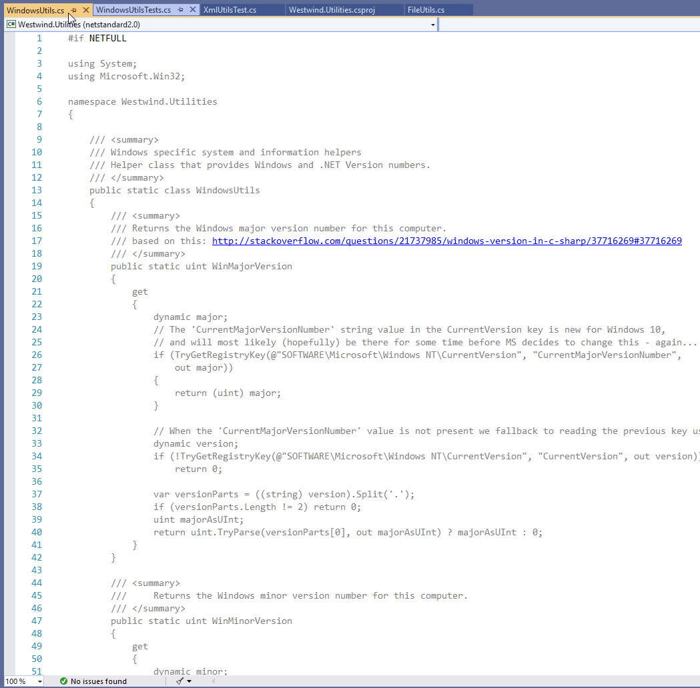

Basically I have a compiler flag when I build for full framework called `NETFULL` that allows me to bring in some code that doesn't show up in the .NET Standard assembly. It works well and is easy enough to manage.

Well now with .NET Core 3.0 supporting Windows (via additional assemblies those extra classes are missing).

In this case the solution is easy enough - the code is open source and I can just directly add the missing classes or components into the Markdown Monster (or a support) project. There were several items like this with various libraries (image conversion using GDI were a few others). 

> For future reference I'll have to rethink how this is done. Most likely anything that is Windows specific will have to be pulled out of the library and moved into a Windows specific version and then the .NET Standard version has to have a dependency on the Windows support libraries to provide the needed Windows features. There are very few features in Westwind.Utilities, mainly System level functions (WindowsUtilities) and the Shell utilities to open files folders and other applications on the desktop.

So there's a lot of small cleanup tasks for various files and types that are mostly internal. Basically cleaning up some references and removing some support libraries (mainly the CommonDialogs functions for the folder browser dialog which is now fixed in 3.0 to use the new style file browser).

This is to be expected with any sort of version update and while there were about 30 or so instances of errors or relocated references this only took 15 minutes to clean up.

## Adding your Entry Point
If you are using an entry point other than `app.xaml` as I am you'll have to add that explicitly. You can add it to the in the main project group like this:

```xml
<StartupObject>StartUp</StartupObject>
```

or use Visual Studio's project dialog to pick the startup class:

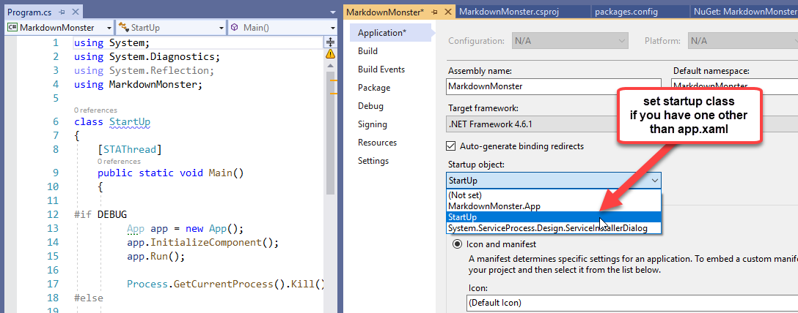

At this point the project compiles! Yay!

## Managing Resources and Copied Files
So at this point I was able to compile my project (with a number of warnings for packages that aren't 3.0 'compatible'):


Cool! That wasn't too bad...

But running the application still doesn't work at that point:


Ah - yes missing resources. Looks like each of the individual icons and image assets have to be added to the project individually as well:

```xml
<ItemGroup>
    <Resource Include="Assets/MarkdownMonster.png" />
    <Resource Include="Assets/MarkdownMonster_Icon_256.png" />
    <Resource Include="Assets/vsizegrip.png" />

    <Resource Include="Assets/folder.png" />
    <Resource Include="Assets/git.png" />
    <Resource Include="Assets/default_file.png" />
</ItemGroup>
```

That gets me a little further but I'm still missing some additional resources:

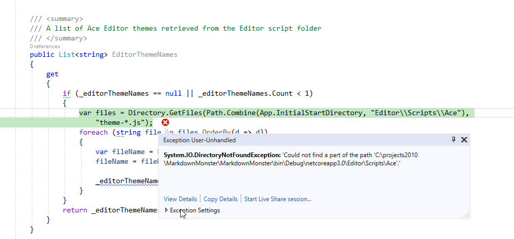

In this case I'm missing some support files that Markdown Monster copies into the output folder. Specifically it's the Web Content files used to render the editor and preview HTML.


## Copied Resources
To add those I need to explicitly add those folders to be copied:

```xml
<ItemGroup>
    <None Update="Editor\**\*.*">
      <CopyToOutputDirectory>PreserveNewest</CopyToOutputDirectory>
    </None>
</ItemGroup>

<ItemGroup>
    <None Update="PreviewThemes\**\*.*">
      <CopyToOutputDirectory>PreserveNewest</CopyToOutputDirectory>
    </None>
</ItemGroup>
```  

And that works.

At this point Markdown Monster is actually launching! Yay:

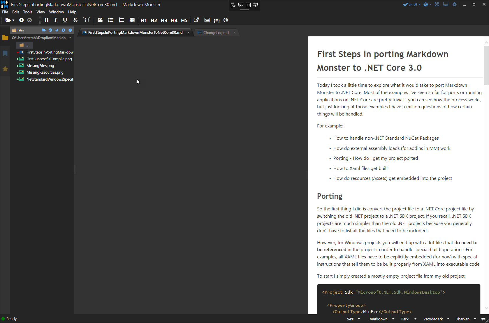


## COM Interop and Dynamic Doesn't Work!
But... there are problems. As you can see the most important UI component - **the freaking Editor** - is missing and it's due to errors that are occurring when the editor is loading.

The problem is when accessing the Web Browser Control's internal components which are COM based, the application fails. It turns out the specific problem is accessing `dynamic` COM instances and then calling methods or accessing members on them. This just fails outright.

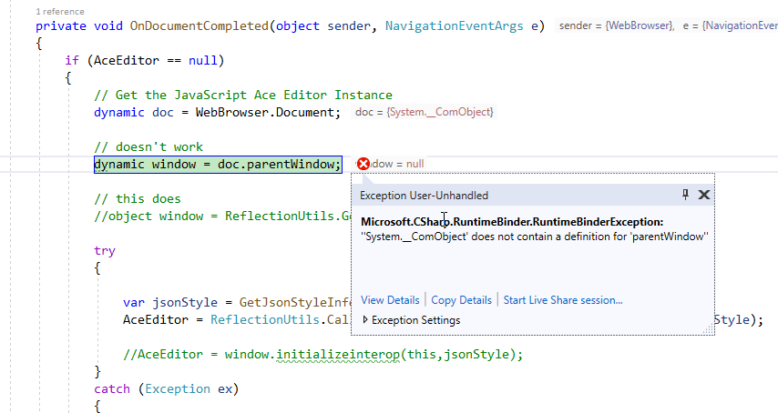

Any attempt to use `dynamic` just fails! I remember I talked about this [in a previous post](https://weblog.west-wind.com/posts/2019/Jan/22/COM-Object-Access-and-dynamic-in-NET-Core-2x) and at the time the word was that this would be fixed in 3.0.

Well apparently this is not the case at least not in Preview 4.

So Markdown Monster has a ton of interop that it does with the Markdown Editor which is an HTML component inside of a WebBrowser control. The WPF application calls into the custom behaviors that I've set up in JavaScript to interact with the editor. Any directives through the UI are routed through a central editor class and all of those interop calls use `dynamic`. These are lightweight method calls - calling JavaScript functions from C# code. 

This has been working great in full framework but all of that's broken now in .NET Core 3.0.

The workaround is to use Reflection. To retrieve my Window I can do this instead of using `dynamic` using `ReflectionUtils` in **Westwind.Utilities**:

```cs
object window = ReflectionUtils.GetPropertyCom(doc, "parentWindow");
```

To get the editor and set the Markdown in the document I can do this:

```cs
if (AceEditor != null)
{

    // Doesn't work in Core 3.0
    //AceEditor.setvalue(markdown ?? string.Empty, position, keepUndoBuffer);

    ReflectionUtils.CallMethodCom(AceEditor, "setvalue", markdown ?? string.Empty, position,
        keepUndoBuffer);
}
```

It's doable, but besides being less efficient (dynamic does good job caching Reflection details) but fixing this mess would be a heck of a nightmare even though all of the Interop calls are mostly localized in the single MarkdownDocumentEditor class.

I can't quickly fix all of this, but after fixing a few **strategic**  calls that set and retrieve the Markdown document using Reflection instead of dynamic I am now able to get the Markdown Monster editor to come up.

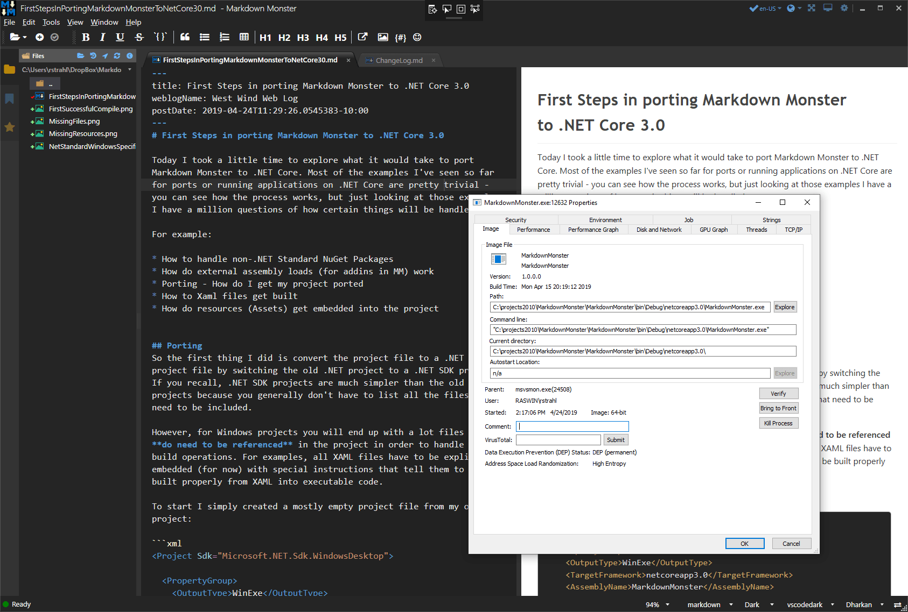

It works, but it's far from functional. The editor works but most commands won't, the refresh and browser sync isn't working.

## Other Issues

### Addins
The next thing that is causing me problems is how to deal with addins. Markdown Monster is based on a core editor, that you then plug additional features into. A number of base features like the Weblog Publishing, Screen Capture and Template Snippet engine are built using Addins that are completely separate from the main editor. The running app above is at this point not using any of the addins which I initially disabled to keep the migration process managable. Now it's time to add at least one back in.

Addins are separate DLL assemblies that are loaded from a special folder - `Addins` - in the bin folder for the stock addins that ship with MM, or in the `%appdata\Markdown Monster\Addins` folder. As such I need to build them into a special output folder when building and testing because MM expects them in these special folders.

It turns out that's not so easy to do with SDK projects, as the build output either doesn't pull any dependencies (default behavior), or pulls **every** dependency from all the project and NuGet packages. Since addins reference the main application, pretty much everything gets pulled in.

OK, here's how to create a WPF support assembly (addin) that may also contain some UI elements and forms in this case. As with the EXE I target `netcoreapp3.0` and add `<UseWpf>true</UseWpf>` to have the compiler automatically pick up Xaml resources.

```xml
<Project Sdk="Microsoft.NET.Sdk.WindowsDesktop">

  <PropertyGroup>
    <TargetFramework>netcoreapp3.0</TargetFramework>
    <AssemblyName>WeblogAddin</AssemblyName>
    <UseWPF>true</UseWPF>
  </PropertyGroup>

</Project>
```

This allows me to open the project in Visual Studio. Next I need to add all my existing packages and embedded resources/assets:

```xml
  <ItemGroup>
    <PackageReference Include="MahApps.Metro" version="1.6.5" />
    <PackageReference Include="Dragablz" version="0.0.3.203" />
    <PackageReference Include="Microsoft.Windows.Compatibility" Version="2.0.1" />
    <PackageReference Include="FontAwesome.WPF" Version="*" />
    <PackageReference Include="HtmlAgilityPack" version="1.11.3" />
    <PackageReference Include="Westwind.Utilities" version="3.0.25" />
    
    <!-- these are the only new, project specific ones -->
    <PackageReference Include="xmlrpcnet" version="3.0.0.266" />
    <PackageReference Include="YamlDotNet" version="6.0.0" />
  </ItemGroup>
  
  <ItemGroup>
    <ProjectReference Include="..\..\MarkdownMonster\MarkdownMonster.csproj" />
  </ItemGroup>
  
  <ItemGroup>
    <Resource Include="icon.png" />
    <Resource Include="icon_22.png" />
    <Resource Include="MarkdownMonster_Icon_128.png" />
  </ItemGroup>
```

Notice I also add a project reference back to the main Markdown Monster executable project which holds Addin APIs as well as the entire object model that can be automated from within the addin.

Getting this project to compile was considerably easier - it just worked right away.

### Addin Location Madness
Markdown Monster Addins need to live in a very specific location so in order to actually get my addin to work I need to copy the output to a specific output folder. For internal addins like this one that folder lives in the Markdown Monster output folder in an `\Addins` folder. In classic .NET projects this used to be easy, but it's a bit tricky in .NET SDK projects because project output actually only builds the actual assembly into the output folder.

To make this work I need to add two directives `<CopyLocalLockFileAssemblies>` and `<OutDir>`:

```xml
 <PropertyGroup>
    <TargetFramework>netcoreapp3.0</TargetFramework>
    <AssemblyName>WeblogAddin</AssemblyName>
    <UseWPF>true</UseWPF>

    <CopyLocalLockFileAssemblies>true</CopyLocalLockFileAssemblies>
    <OutDir>$(SolutionDir)MarkdownMonster\bin\$(Configuration)\$(TargetFramework)\Addins\WebLog</OutDir>
  </PropertyGroup>

  </PropertyGroup>
 ```
 
`<CopyLocalLockFileAssemblies>` is used to specify that the output folder should contain not just the target assembly but all of its dependencies. This turns out to be a bit messy, duplicating the entire dependency tree, but this was the only way I could get this to work without using an explicit post build task (which I'd rather avoid). Instead I plan on cleaning up the add-in as part of the final build script that builds final distribution package.

`<OutDir>` allows you to specify an output folder where you want the **final assembly output to go**. I know that sounds silly, but standard output creates the whole `netcoreapp3.0` hierarchy which wouldn't work in this case. `<OutDir>` forces the output into the exact folder you specify without any prefixes. 

I'm using various Build constants to force to a folder like this:

```text
<projRoot>\MarkdownMonster\bin\Release\netcoreapp3.0\Addins\Weblog
```

When I build now I end up with an output folder that looks like this:


On the left is the 3.0 output, and on the right is the full framework output of the old project. Yeah - the right is a lot easier. Just to demonstrate without `<CopyLocalLockFileAssemblies>` I get just this:

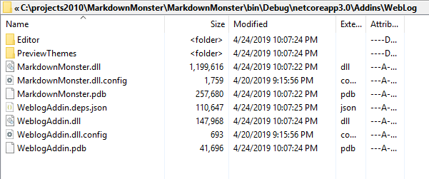

That looks more reasonable, but this is actually useless for output as it doesn't include the required dependencies that are unique to this project. It's lacking the crucial dependent assemblies which are `yamldotnet.dll` and the `CookComputing.XmlRpcV2.dll`. Oddly this includes the MarkdownMonster **assembly reference** including the content files which seems **crazy**. So that wouldn't work. Using `<CopyLocalLockFileAssemblies>` at least gives me the dependencies I need so that the addin can load and get my final build files and I can clean up the duplicated packages during final packaging into a distributable.

The other alternative to make the output cleaner here would be to do a `dotnet publish` of the addin project and then copy just the required assemblies from the publish output (same as the previous screenshot) and copy just the files I need as an extra build step but that requires adding build automation even during development that I'd rather avoid if possible. 

With all this done the addin now shows up on the tool bar and runs:

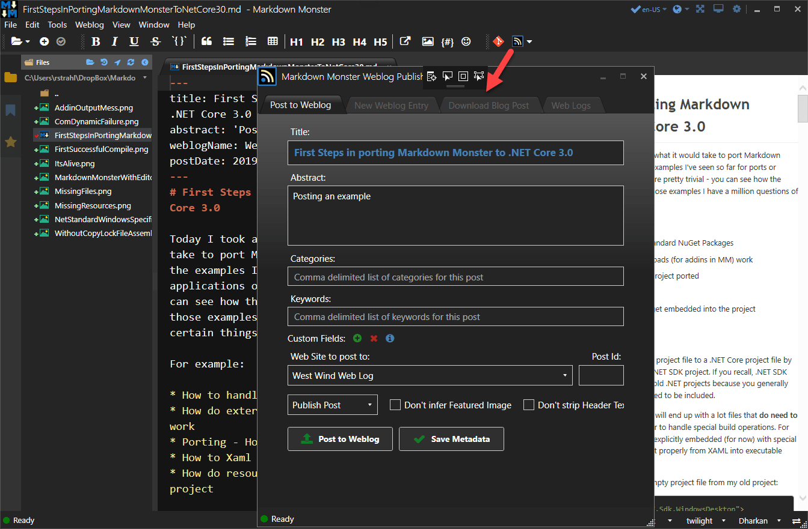

Cool. It works, but again a lot of pain trying to get this to work right.

### Excluding Packages and Assembly References
So after a bit more trial and error I found a solution to cleaning up the output folder by explicitly excluding the packages and project references that you I don't want in the output. I have to explicitly specify how to use each package and the external reference:

```xml
<ItemGroup>
    <PackageReference Include="MahApps.Metro" version="1.6.5">
      <IncludeAssets>compile</IncludeAssets>
    </PackageReference>
    <PackageReference Include="Dragablz" version="0.0.3.203">
      <IncludeAssets>compile</IncludeAssets>
    </PackageReference>
    <PackageReference Include="FontAwesome.WPF" Version="4.7.0.9">
      <IncludeAssets>compile</IncludeAssets>
    </PackageReference>
    <PackageReference Include="HtmlAgilityPack" version="1.11.3">
      <IncludeAssets>compile</IncludeAssets>
    </PackageReference>
    <PackageReference Include="Westwind.Utilities" version="3.0.26">
      <IncludeAssets>compile</IncludeAssets>
    </PackageReference>

    <PackageReference Include="xmlrpcnet" version="3.0.0.266" />
    <PackageReference Include="YamlDotNet" version="6.0.0" />
</ItemGroup>

<ItemGroup>
    <Reference Include="$(SolutionDir)MarkdownMonster\bin\$(Configuration)\$(TargetFramework)\MarkdownMonster.exe">
        <Private>false</Private>
    </Reference> 
</ItemGroup>
```

With these settings I'm telling the project to only use the above NuGet packages for compilation, not for distribution and to make the project reference private. Note that I'm using the raw EXE rather than a project reference here which is less than ideal because it can cause compile ordering errors, but I couldn't find a way to get a `<ProjectReference>` to not include its output in the output folder. The above works, and it provides a nice clean addin folder.

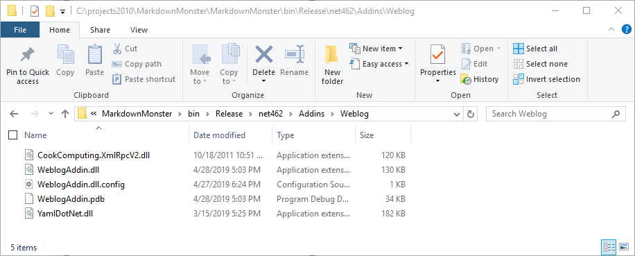

Note the terrible naming. I would have assume `<Private>` to be `true` to not export, but it means the opposite here. `Compile` means compilation only which sort of makes sense, although there are options for `none` which would have made a lot more sense.

I have a [follow up post](https://weblog.west-wind.com/posts/2019/Apr/30/NET-Core-30-SDK-Projects-Controlling-Output-Folders-and-Content) that talks more about the output generation options.

### Done Updating for now
For now though - I think I'm done upgrading because it's clear that the next step will be a lot of cleanup work - specifically related to the `dynamic` COM Interop changes. Not sure I'm ready to get into that with .NET Core 3.0 being still a ways away from release.

## Is all of this Worth It?
I went through all of this to see what's involved in the process of conversion. The reality is that MM application has a lot of *special* things going on that are tripping me up. I think most 'normal' business applications that are pure .NET code, are likely to have a much easier time in a conversion without running into some of these edge cases like COM Interop and Weird Addin Loading scenarios.

he COM Intersop stuff that drives the editor in MM is a big hurdle to working because - even though all editor operations are abstracted in their own editor class - there's a lot of it and almost all parts of MM interact with that class. In order for me to get MM running I have to deal with the COM interop stuff.

At this point I don't know what the status is exactly of the `dynamic` COM Interop. In the past Microsoft has mentioned that this will be supported but nothing seems to have changed when I tried this last year with 2.2. I posted a [Github issue](https://github.com/dotnet/corefx/issues/37161) to get some more information - we'll see what comes back from that.

### Not Quick and Easy, but Easier than I tought
I do have to say, even though there's a bit of pain in this process it's not as bad as I thought it would be. I'm especially surprised that I'm able to run full framework assemblies that haven't been moved to .NET Standard or .NET Core which I thought was going to be deal breaker in the short term. But it looks like that is not going to be an issue as you can simply reference those packages. The Windows Compatibility Codepack seems to do a great job of providing the needed compatibility.

I forgot to mention that a few weeks ago I ran the .NET Compatibility Analyzer against MM and found that it was 99% compliant. There were some very small things for obsolete method calls that had to be cleaned up but not much else. All of the warnings were actually in code that's not called by this application. So all in all Microsoft has done an excellent job in making sure that your code that is Windows specific will run in .NET Core which is very nice indeed!

## Distribution?
The larger concern I have is what .NET Core 3.0 means to distribution of an application. .NET Core 3.0 won't be a built-in Windows component. One of the nice things about full .NET Framework is that **it's just there**, pre-installed on most machines. That has its pros and cons as we all know, but from a distribution point of view it is very nice as it's guaranteed that any Windows 7 or newer machine these days at least has .NET 4.61 on it.

With .NET Core you have two choices that's not the case so you have two choices for deploying standalone desktop applications:

* Use a Shared Runtime that may not be installed
* Ship your runtime with your app and add a huge foot print 

So, neither of these deployment scenarios is very appealing. 

To give you an idea of the footprint of a dedicated x64 runtime install:

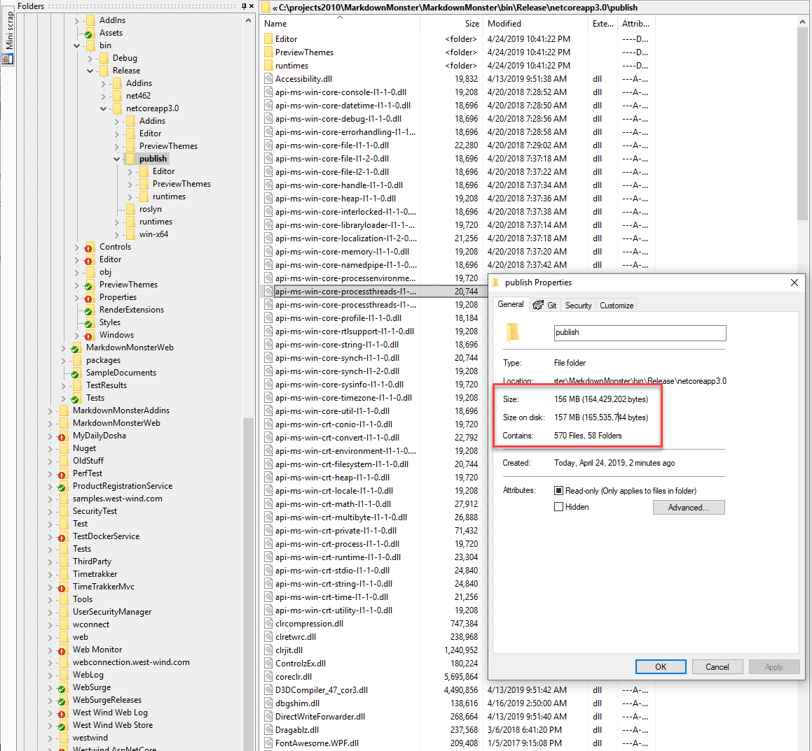

Currently full framework Markdown Monster is a 15 meg download and most of that size actually comes from Chrome related components (PDF generation). That's a 10th of the size of the dedicated runtime install at minimum. Yikes. From a rapid deploy and update cycle perspective the second option would not be an option for me. 

I suspect most people will opt for the shared runtime deployment, but depending on your target audience it'll still be very likely your clients will have to download and install a runtime so your footprint won't be small either. The benefit with shared is that hopefully that will be a one time download for most and only an occasional update.

So most likely shared runtime it is. But for those of you that follow [my Twitter Feed](https://twitter.com/RickStrahl) know how I've been railing against the proliferation of a million minor .NET Core Runtime versions being installed on your system and clogging up your hard drive. Those runtimes have to be maintained and cleaned up but who knows what app needs what? 

Some guidance is needed on this point I think because this is likely to become a real nightmare. The good news is that .NET Core runtimes are backwards compatible so newer versions minor updates work if an exact match can be found. Of course then we are essentially back to potentially breaking runtimes with code that worked on one version but not on a newer one, which was one of the main selling points of .NET Core in the first place. Oh well... can't win 'em all. 

## What do you get?
Right now I'm not so sure that .NET Core 3.0 makes a ton of sense. At this point performance seems slightly worse (at least in Preview 5 and onward - much worse before) compared to running the full framework version. Startup time of Markdown Monster is 4-5 seconds with this version (Preview 5 in Release mode) compared to a little over 2 seconds with the full framework version.

I can't compare much beyond that because a lot of features in MM currently don't work due to the Interop features. Regular WPF stuff - animations window opening etc. all feels about the same but UI stuff is usually subjective anyway so it's hard to say.

I think ultimately the benefits of .NET Core over the full framework will be runtime fixes and framework improvements, but right now there's very little of that. However, one nice improvement I was able to integrate immediately is the new Folder dialog for the WinForms `FolderBrowserDialog` which allowed me to remove the (largish) [Microsoft.WindowsAPICodePack-Shell](https://github.com/aybe/Windows-API-Code-Pack-1.1) library I'd been using for that. It's actually crazy that this feature was never added to full framework proper as the stock `FolderOpenBrowserDialog` is an **abomination of user hostility**.

Currently there also doesn't appear to be any real difference in the way you build a WinForms or WPF application. Sure it runs on .NET code but the apps still start the same as before and the code you write is not drastically different - unlike ASP.NET which actually had a lot of huge benefits by re-writing the core framework. But there are none of the benefits like the Startup pipeline and dependency injection etc. that you typically associate with .NET Core applications. I suspect that will come later, and it probably won't apply to legacy applications, but it's one of those facets that are currently hidden away.

So I'm on the fence. For now I think we can treat .NET Core 3.0 as a novelty. But farther down the line we hopefully see some improvements and fixes of old problems and bottlenecks in these old stodgey desktop frameworks as the open source development model fixes old bugs and perhaps even drives some new features.

It'll be interesting to see how these changes will affect Windows desktop development which has been stagnant for so long. One can hope...

If you want to see the converted, dual-targeted project you can [check it out on Github](https://github.com/RickStrahl/MarkdownMonster).


## Resources
* [Markdown Monster](https://markdownmonster.west-wind.com)
* [Markdown Monster GitHub Repo](https://github.com/RickStrahl/MarkdownMonster) (.NET 3.0 Branch:  NET_Core_30_First_Shot)
* [Com Object Access in .NET Core](https://weblog.west-wind.com/posts/2019/Jan/22/COM-Object-Access-and-dynamic-in-NET-Core-2x)
* [.NET Core 3.0 SDK Projects: Controlling Output Folders and Content](https://weblog.west-wind.com/posts/2019/Apr/30/NET-Core-30-SDK-Projects-Controlling-Output-Folders-and-Content)

<div style="margin-top: 30px;font-size: 0.8em;
            border-top: 1px solid #eee;padding-top: 8px;">
    
    this post created and published with 
    <a href="https://markdownmonster.west-wind.com" 
       target="top">Markdown Monster</a> 
</div>

