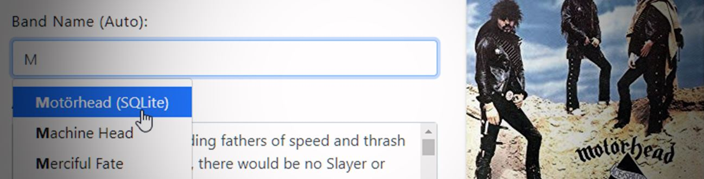
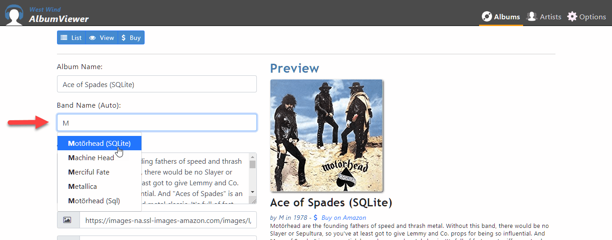

# Using the ng-BootStrap TypeAhead Control with Dynamic Data 



Ok I admit it - it took me way too long to figure out how to hook up and use the [ng-Bootstrap's Typeahead control](https://ng-bootstrap.github.io/#/components/typeahead/examples) to work with dynamic lookup data that comes from the server. The documentation conveniently omits that little detail and as is often the case assumes you have a total grasp of the `Observable` and all the nuanced combinations of operators to figure out how to make dynamic calls on your own. In this post I'll show an example of how to use the TypeAhead control with data retrieved from the server using the Observable `switchMap` operator, which was the bit that was eluding me.

[ng-Bootstrap](https://ng-bootstrap.github.io/#/home) is a collection of Angular components that wrap the native Bootstrap components like the Modal Dialog, Lists, Buttons etc. so that they can be dropped into the page as Angular components rather than using the default jQuery handling. It also adds a few additional controls like nice date and time pickers and the Typeahead/Auto-Complete control I'm going to discuss here. Using these components makes much easier to integrate programmatic control over bootstrap's components and it works fairly well.  I'm not convinced that a lot of these wrappers, that only wrap the HTML for databinding add that much value, but for more interactive controls like the Modal and definitely for the missing DatePicker and Typeahead controls **ng-bootstrap** is very useful.

##AD##

## The ng-Bootstrap Typeahead control
I'm using my AlbumViewer sample app to demonstrate this functionality and here's what the ng-bootrap TypeAhead control looks like in action:



Bascially as I enter or edit albums, I can look up the name of an existing band and assign it to the band name of the album. Alternately I can also type a new band name. There are options that control the behavior of whether the control allows only selections from the list - by default it doesn't.

Let's take a look. The control is fairly straightforward to use at least for static content to display.

#### HTML Markup
Here's what the markup for the TypeAhead looks like in the HTML template:

```html
<div class="form-group">
  <label for="ArtistName">Band Name:</label>
  <input id="ArtistName" type="text"
         name="ArtistName"
         class="form-control"                     
         [(ngModel)]="album.Artist.ArtistName"
         [ngbTypeahead]="search"                     
         [resultFormatter]="resultFormatBandListValue"
         [inputFormatter]="inputFormatBandListValue"
         #instance="ngbTypeahead"                     
    />
</div>
```     

The control is data bound to the Artist in the model (the `[(ngModel)` attribute) and when the type ahead control expects to search it fires the `search` method in my component based on the `[ngbTypeahead]` attribute.
  
### Component Code
In the component code I then need to add some dependencies. Specifically ng-bootstrap relies on various Observable behaviors which mostly come from the samples, but I added `switchMap` and `catchError` which are necessary for the async retrieval.

```ts
import { Observable } from 'rxjs';
import { debounceTime, distinctUntilChanged, switchMap, catchError  } from 'rxjs/operators';
```

The actual component code to handle searching was a bit tricky to get right. ng-bootstrap has [good docs](https://ng-bootstrap.github.io/#/components/typeahead/apihttps://ng-bootstrap.github.io/#/components/typeahead/api) for **local data**, but **completely fails to mention how to handle doing remote lookups** of the data, which is a pretty common use case. In my case I have an API call on the server that returns a key value pair of `{ name: "bandName", id: "bandId" }` to return the matching bands for what was typed. 

### Sync
ng-Bootstrap uses a search event exposed as an Observable stream of search terms that are fired on the `search` method I've specified. Try as I might I find `Observables` unintuitive to work with, but regardless this makes sense in the way Angular things about events.

So, a sync implementation is easy enough (from the documentation):

```ts
search = (text$: Observable<string>) =>
text$.pipe(
  debounceTime(200),
  distinctUntilChanged(),
  map(term => term.length < 2 
    ? []
    : states.filter(v => v.toLowerCase().indexOf(term.toLowerCase()) > -1).slice(0, 10))
)
```
The sample uses a static array of states and filters the list **locally** based on the search terms. The code debounces the input by 200ms so it doesn't fire immediately on key downs to avoid excessive thrashing, waits for a distinct value change (ie ignores navigation keys), and then maps the static result data into a result array. That all makes perfect sense.

To start with my data, I modified the sample data to match a few records of the Band data that my server is returning `[ { name: "band", id: "bandId" } ]`  and I got that working easily enough and hooked in so the UI works properly. 

##AD##

### Async and `switchMap`
But then question became **how do I hook this up to result data retrieved from my API service?**

My service call logic uses `HttpClient` in a service that returns an `Observable<any>`, so for model data I would typically use something like this:

```ts
this.albumService.artistLookup(searchText)
   .subscribe( lookups =>  this.lookups );
```   

So how do I hook this into the Observable that ng-bootstrap's Typeahead expects as a result? The `map()` example for the static data expects to materialize instance of an array which is easy with the static data - you can filter that or pass back the entire array and that just works for `.map()`.

But for the dynamic data the data returned is an `Observable` which is not available as an instance until the Observable resolves. Basically I need to return an Observable rather than a concrete array of lookup items.

So perhaps to others it would be quite obvious on how to continue the Observable chain after re-mapping the result value. It wasn't to me and I went on a bunny chase trying to track down and find the right operator to return an observable.

Turns out the simple answer is the `switchMap` operator instead of `map`. 

> #### @icon-info-circle The `switchMap` Operator
> `switchMap` is similar to `map` as a transformation function that takes an input value and transforms it into a new value and returns an `Observable` of that value. Unlike `map` the value returned is not the instance value, but an `Observable`.
<small>[More info](https://www.learnrxjs.io/operators/transformation/switchmap.html)</small>

So using `switchMap` here's what the code now looks like with my remote service call hooked in:

```ts
search = (text$: Observable<string>) => {
      return text$.pipe(      
          debounceTime(200), 
          distinctUntilChanged(),
          // switchMap allows returning an observable rather than maps array
          switchMap( (searchText) =>  this.albumService.artistLookup(searchText) ),
          catchError(new ErrorInfo().parseObservableResponseError)              
      );                 
    }
```

Quite simple actually, **once you know which operator to use!**. 

The key here is:

```ts
switchMap( (searchText) =>  this.albumService.artistLookup(searchText) ),
```

The call to `this.albumService.artistLookup(searchText)` returns `Observable<any>` which is simply returned and continues on into the Observable chain. If an error occurs my custom error handler captures the error and displays a message in a toast notification.

So easy, right? Well, it wasn't easy to find for me, but in 50/50 hindsight; yes easy.

## Binding Values to the TypeAhead
To finish out the TypeAhead logic and point out another issue that took me a while to figure out, is that both the input binding and result bindings need to be adjusted with the `inputFormatter` and `resultFormatter`. These formatters are used to format the inbound text for the input binding so that the display in the control displays correctly, and for the result that is going back into the model. 

In this example the value is a simple string in both cases but since the data from the server actually is a key/value pair the data needs to be fixed both for input and result values using these two formatters.

Here they are:

```ts
/**
 * Used to format the result data from the lookup into the
 * display and list values. Maps `{name: "band", id:"id" }` into a string
*/
resultFormatBandListValue(value: any) {            
  return value.name;
} 
/**
  * Initially binds the string value and then after selecting
  * an item by checking either for string or key/value object.
*/
inputFormatBandListValue(value: any)   {
  if(value.name)
    return value.name
  return value;
}
```

these values are bound in the HTML template with:

```html
[resultFormatter]="resultFormatBandListValue"
[inputFormatter]="inputFormatBandListValue"
```

Note that the input formatter needs to differentiate between two different binding modes: The initial `ng-model` binding when the form first loads and the assignment when the model value is updated from the TypeAhead control.

I have to say this seems pretty convoluted when I think about list binding. Coming from other environments I expect an items source with a display binding expression and a selected item that are separate. Instead ng-bootstrap opts to use the list and transform the values explicitly **or it uses the text typed into the input box** which are two very distinct value types. 

These formatters are necessary to work around this type mismatch and they act as transformation handlers which seems more unexpected work for such a common use case scenario.

But I'm glad the control provides the core features smoothly and it works and once you've worked through this once, you can copy and paste the base logic easily enough. But getting started and implementing this thing certainly took me a while - way longer than I would like to admit :unamused:. 

##AD##

## Getting Ahead
Many of you have heard me rave about the **DatePicker and TypeAhead** abyss in HTML/JavaScript frameworks where every few months we need to hunt for a new one as we switch frameworks or tools and this is my bi-yearly attempt at that.

All things considered using **ng-bootstrap** was one of the easier integrations I've done recently and really the focus and pain point is more about the separate issue of Observables than ng-bootstrap.

It's my own inability to fully grok all the Observables operators and nuances. I can read and use them once and it all makes sense, but then... they have the same effect as RegEx on me - I can get them working, but then when I step away and come back it's like starting over. Unintuitive and non-discoverable APIs are big detriment to keep things in my head. Observables just feels horribly unnatural to me.  

## Summary
This post really boils down to using the correct Observable operator. What eluded me was `switchMap` even though I had a good idea what feature I needed **I just couldn't quickly pin down the right operator**. 

In summary, `switchMap` is similar to `map` as a transformation function that takes an input value and transforms it and then returns an Observable of the transformed value. Unlike `map` the value returned is not a value but an Observable.  

It was a very circuitous path that led me to find it eventually and that's primarily why I'm writing this down for my own future reference. Maybe it'll prove useful to a few of you as well.

## Resources

* [ng-Bootstrap Typeahead](https://ng-bootstrap.github.io/#/components/typeahead/examples)
* [The `switchMap` Operator](https://www.learnrxjs.io/operators/transformation/switchmap.html)
* [AlbumViewer Sample](https://albumviewer.west-wind.com)
* [AlbumViewer Sample on Github (AlbumEditor)](https://github.com/RickStrahl/AlbumViewerVNext/tree/master/src/AlbumViewerAngular/src/app/albums)


<div style="margin-top: 30px;font-size: 0.8em;
            border-top: 1px solid #eee;padding-top: 8px;">
    
    this post created and published with 
    <a href="https://markdownmonster.west-wind.com" 
       target="top">Markdown Monster</a> 
</div>