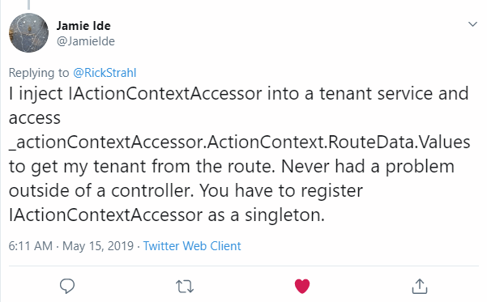

# Accessing RouteData in an ASP.NET Core Controller Constructor


Routing in ASP.NET Core 2.2 and below is closely tied to the ASP.NET Core MVC implementation. This means that if you're trying to access RouteData outside of the context of a Controller, the RouteData on `HttpContext.GetRouteData()` is going to be - `null`. That's because until the application hits MVC processing the RouteData is not configured.

It turns out that in the latest versions of .NET Core there are ways around with with EndPoint routing, but one thing at a time... :-)

## Routing == MVC
If you recall when you configure ASP.NET Core applications the routing is actually configured as part of the MVC configuration. You either use:

```cs
app.UseMvcWithDefaultRoute();
```

or

```cs
app.UseMvc(routes =>
{
    routes.MapRoute("default", "{controller=Home}/{action=Index}/{id?}");
});
```

and as a result route data is not actually available in Middleware that fires before the MVC processing. This is different than classic ASP.NET where route data was part of the the main ASP.NET pipeline and populated before MVC actually was fired. You could also easily inject additional routes into the routing table, which you can't easily do in Core (at least not until 3.0 - more on that later).

## When does this matter?
In most situations it's totally fine to only deal with RouteData inside of your MVC controller logic. After all it is a specific concern to the Web application layer and it's easy to pull out route data as part of a route in the parameter list.

You can access route data easily in a few ways:

```cs
public IList<Audit> GetData([FromRoute] string tenant, string id)
```

or 

```cs
// inside controller code
string tenant = RouteData.Values["tenant"].ToString();
```

But recently I had an application that needed access to the Route Data in Dependency Injection in the constructor. Specifically I have a multi-tenant application and based on the tenant ID I need to use a different connection string to the database in order to retrieve the customer specific data. Since the `DbContext` context is also injected the tenant Id needs to be available as part of the Constructor injection in the controller.

## Cue the false starts... 
So my first approach was to create an  `ITenantProvider` with a `GetTenant()` method with an HTTP specific implementation that uses `IHttpContextAccessor`. The accessor has an instance of the current `HttpContext` object, with a `GetRouteData()` method which sounds promising.  Alas, it turns out that doesn't work because the `HttpContext` does not have the route data set yet. The route data on `HttpContext` isn't available until the MVC Controller makes it available to the context. Ouch! This is obvious now, but at the time that seemed unexpected.

Not trusting the injection code I also tried using a middleware hook to see if I could pick out the route data there and then save it in `Context.Items`.

This also **does not work in 2.2**:

```cs
app.Use(async (context, next) =>
{
    var routeData = context.GetRouteData();
    var tenant = routeData?.Values["tenant"]?.ToString();
    if(!string.IsNullOrEmpty(tenant))
        context.Items["tenant"] = tenant;

    await next();
});
```

> Note: This can work using **EndPointRouting**. More on this later

In both of the approaches above the problem is simply that the raw context doesn't have access to the route data **until the controller starts running and initializes it**.

## Using IActionContextAccessor
It turns out I had the right idea with my `IHttpContextAccessor` injection except that I should have injected a different object that gives me access to the actual controller context: `IActionContextAccessor`.

[Jamie Ide](https://twitter.com/JamieIde) came to my rescue [on Twitter](https://twitter.com/RickStrahl/status/1128568838021210112):

[](https://twitter.com/RickStrahl/status/1128568838021210112)

And that actually works. Let's take a look.

## Setting up Injection with IActionContextAccessor
I've been a late starter with Dependency Injection and I still don't think naturally about it, so these nesting provider type interfaces seem incredible cumbersome to me. But I got it to work by creating an `ITenantProvider` to inject into the `DbContext`:

```cs
public interface ITenantProvider 
{
    string GetTenant();
    string GetTenantConnectionString(string tenantName = null);
}
```

and the MVC specific implementation so I can get the context out of the controller context:

```cs
public class HttpTenantProvider : ITenantProvider
{
    private readonly IActionContextAccessor _actionContext;

    private static Dictionary<string, string> TenantConnectionStrings = new Dictionary<string, string>();


    public HttpTenantProvider(IActionContextAccessor actionContext)
    {
        _actionContext = actionContext;
    }

    public string GetTenant()
    {
        var routes = _actionContext.ActionContext.RouteData;
        var val = routes.Values["tenant"]?.ToString() as string;
        return val;
    }


    public string GetTenantConnectionString(string tenantName = null)
    {
       ...
       
        return connectionString;
    }
}
```

So now that that's set I can inject the `ITenantProvider` into the context:

```cs
public class AuditContext : DbContext
{
    public  readonly ITenantProvider TenantProvider;
    
    public AuditContext(DbContextOptions options,
                        ITenantProvider tenantProvider) : base(options)
    {
        TenantProvider = tenantProvider;
    }
    
    
    protected override void OnConfiguring(DbContextOptionsBuilder optionsBuilder)
    {
        // *** Access the Tenant here! ***
        string conn = TenantProvider.GetTenantConnectionString();
        
        base.OnConfiguring(optionsBuilder);
        optionsBuilder.UseSqlServer(conn);
    }
    
    ...
}
```

The API controller now can simply inject the context:

```cs
[Route("[Controller]/{tenant}")]
public class WeatherController : Controller
{
    private readonly AuditContext _context;

    // *** Injecting the DbContext here *** 
    public WeatherController(AuditContext context)
    {
        _context = context;
    }
```

and at this point the context is ready to go inside of the controller:

```cs
public IList<Audit> Index()
{
    var data = _context.Audits.Where( a=> a.Time > DateTime.UtcNow.AddDays(-2)).ToList();
    return data;
}
```

Now this may seem odd that this works where other operations didn't but the reason it does is that the actual call to `GetTenant()` doesn't occur until there's an `ActionContext` in place - usually when I actually access the DbContext to retrieve data which typically happens inside of an Action method. Trying to access the DbContext in the constructor however would still fail because the route data wouldn't be set yet!

Finally I need to make sure that everything is provided by the DI pipeline in `Startup.ConfigureServices()`:

```cs
services.AddDbContext<AuditContext>();
services.AddTransient<ITenantProvider,HttpTenantProvider>();
services.AddTransient<IActionContextAccessor, ActionContextAccessor>();
```

Note that I'm not configuring the context in `ConfigureServices()` which is common since that's now happening internally inside of the context that gets the tenant out.

Ugh... Frankly, that's a lot of crap and mental gynmnastics you have to go through for this to come together! 

## .NET Core 2.2 and 3.0 can use EndPointRouting
In .NET Core 2.2 and 3.0 there's a way to fix the **MVC Only Routing** problem via something called **EndPoint Routing**. As the name suggests it provides a global mechanism for routing. The good news is that this can be added to an existing application very simply by adding `app.UseEndpointRouting()` in the `Startup.Configure()` method before any other middleware that needs to access routing:

```cs
// using Microsoft.AspNetCore.Internal;

// Make sure this is defined before other middleware
// that needs to have routing access
app.UseEndpointRouting();
            
// Now this works to retrieve the tenant
app.Use(async (context, next) =>
{
    var routeData = context.GetRouteData();
    var tenant = routeData?.Values["tenant"]?.ToString();
    if(!string.IsNullOrEmpty(tenant))
        context.Items["tenant"] = tenant;

    await next();
});

app.UseMvcWithDefaultRoute();
```

Now any piece of middleware including my simple inline `app.Use()` middleware can retrieve the tenant simply with `context.Items["tenant"] as string` which is much easier to manage than the timing critical code above dependent on a `IActionControllerContext` that is not alive for the whole request.

Using the code above I can now switch to use `IHttpContextAccessor` instead of `IActionContextAccessor` in my `ITenantProvider` instead:

```cs
public class HttpTenantProvider : ITenantProvider
{
    private readonly IHttpContextAccessor _httpContextAccessor;

    public HttpTenantProvider(IHttpContextAccessor httpContextAccessor)
    {
        _httpContextAccessor = httpContextAccessor;
    }

    public string GetTenant()
    {
        // this works without the middleware
        //var routes = _httpContextAccessor.HttpContext.GetRouteData();
        //var val = routes?.Values["tenant"]?.ToString() as string;
        
        
        // Grab previously set Items value
        var val = _httpContextAccessor.HttpContext.Items["tenant"] as string;
        return val;
    }
}
```        

This is only a little simpler, but it is much more consistent as this **now works anywhere within the context of a request**, not just inside of a controller action method.

## Summary
Incidentally while searching on routing solutions I didn't even find anything about `EndPointRouting` so I completely missed this initially. A lot of helpful hints on Twitter also didn't mention it, which makes me think I wasn't the only one who isn't in the know. Secret handshakes it is, eh?

Searches presumably don't show it, because it's a pretty new feature. 

What I did find while search were **a lot of questions about accessing RouteData outside of MVC on StackOverflow and in various repositories**, so this is definitely something that has come up frequently. I think EndPoint Routing - which sounds like a one of those bullet point features on a slide - is actually going to be a **very welcome new feature** in ASP.NET Core once it becomes more visible and perhaps gets added into the default project template.

Tracking this bit of code with the right incantation down took me a while and some friendly Twitter helpers to resolve. It's already been twice I've been down this path, so I hope there won't be a third time if I remember to review this post next time. 

Stick a fork in it, it's done!

<div style="margin-top: 30px;font-size: 0.8em;
            border-top: 1px solid #eee;padding-top: 8px;">
    
    this post created and published with 
    <a href="https://markdownmonster.west-wind.com" 
       target="top">Markdown Monster</a> 
</div>