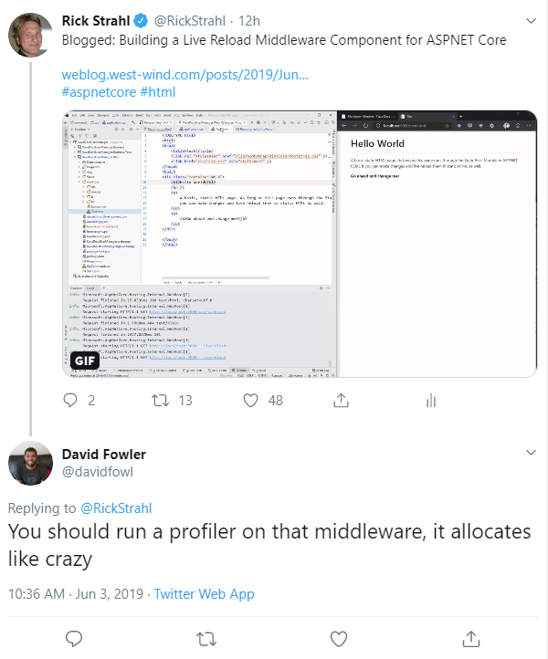

---
title: Building a Live Reload Middleware Component for ASP.NET Core
abstract: In my last way I showed how to use Live Reload in ASP.NET Server side applications using a tool called BrowserSync. In this post I replace BrowserSync's functionality with a custom Live Reload Middleware component for ASP.NET Core that's more efficient and doesn't require installing and running a separate tool. I'll show how Live Reload works, and how to implement the component in some detail.
keywords: Live Reload,LiveReload,Middleware,Development,Debugging,AspNetCore
categories: ASP.NET Core
weblogName: Rick Strahl WordPress
permalink: https://weblog.west-wind.com/posts/2019/Jun/03/Building-Live-Reload-Middleware-for-ASPNET-Core
postDate: 2019-06-03T13:17:45.8069309-07:00
---
# Building a Live Reload Middleware Component for ASP.NET Core


In [my last post](https://weblog.west-wind.com/posts/2019/May/18/Live-Reloading-Server-Side-ASPNET-Core-App) I discussed how to integrate Live Reload in ASP.NET Core using a third party NodeJs application loaded from NPM called [BrowserSync](https://browsersync.io). While that works just fine, having to run yet another command line utility on top of `dotnet watch run` **just to provide Live Reload functionality** is a bit of a pain. 

Also in the last post I mentioned that it would be nice to build some middleware to provide the live client reloading functionality...  well, I got that itch to sit down and take a stab at it and the result is this [ASP.NET Core Live Reload Middleware Component](https://github.com/RickStrahl/Westwind.AspnetCore.LiveReload). 

In this post I'll describe how to build this middleware component that handles the Live Reload functionality natively in ASP.NET Core simply by hooking a couple of middleware directives into your `Startup` configuration. The end result is much quicker and more reliable refreshes of content than with BrowserSync. You still need to run `dotnet watch run` for server side code restarts for hard code changes, but for all client side static and Razor file refreshing that is not required.

Here's what the new functionality looks like in action when editing Razor Views/Pages, static CSS and HTML, and server side source code in a controller.


 <small>**Figure 2** - Live Reload in action on static content, Razor pages and server code.</small>

All that's running here (in my [Rider IDE](https://www.jetbrains.com/rider/)) is `dotnet watch run` to refresh the server when source code changes are made. All changes auto-refresh in the browser without user intervention.

## Using the Live Reload Middleware
You can install this middleware [from NuGet](https://www.nuget.org/packages/Westwind.AspNetCore.LiveReload):

```ps
PS> Install-Package WestWind.AspnetCore.LiveReload
```

or 

```
dotnet add package  WestWind.AspnetCore.LiveReload 
```

It works with:

* Client side static files  (HTML, CSS, JavaScript etc.)
* ASP.NET Core Views/Pages (.cshtml)
* Server Side compiled code updates (combined w/ `dotnet watch run`)

The Middleware is self-contained and has no external dependencies - there's nothing else to install or run. To server code changes (.cs files) you should run `dotnet watch run` to automatically reload the server.  The middleware can then automatically refresh the browser. The extensions monitored for are configurable.

##AD##

### Configuration
The full configuration and run process looks like this:

* Add `services.AddLiveReload()` in `Startup.ConfigureServices()`
* Add `app.UseLiveReload()` in `Startup.Configure()`
* Run `dotnet watch run` to run your application

Add the namespace in `Startup.cs`:

```cs
using Westwind.AspNetCore.LiveReload;
```
  
#### Startup.ConfigureServices()
Start with the following in `Startup.ConfigureServices()`:

```cs
services.AddLiveReload(config =>
{
    // optional - use config instead
    //config.LiveReloadEnabled = true;
    //config.FolderToMonitor = Path.GetFullname(Path.Combine(Env.ContentRootPath,"..")) ;
});

// for ASP.NET Core 3.0 add Runtime Razor Compilation
// services.AddRazorPages().AddRazorRuntimeCompilation();
// services.AddMvc().AddRazorRuntimeCompilation();
```

The `config` parameter is optional and it's actually recommended you set any values via configuration ([more info below](#aspnet-core-30-defaults-to-runtime-razor-compilation-even-in-dev)). 

#### Startup.Configure()
In `Startup.Configure()` add: 
 
```cs
// Before any other output generating middleware handlers
app.UseLiveReload();

app.UseStaticFiles();
app.UseMvcWithDefaultRoute();
```

anywhere before the MVC route. I recommend you add this early in the middleware pipeline before any other output generating middleware runs as it needs to intercept any HTML content and inject the Live Reload script into it.

And you can use these configuration settings:

```json
{
  "LiveReload": {
    "LiveReloadEnabled": true,
    "ClientFileExtensions": ".cshtml,.css,.js,.htm,.html,.ts,.razor,.custom",
    "ServerRefreshTimeout": 3000,
    "WebSocketUrl": "/__livereload",
    "WebSocketHost": "ws://localhost:5000"
    "FolderToMonitor": "~/"
  }
}
```

All of these settings are optional.

* **LiveReloadEnabled**  
If this flag is false live reload has no impact as it simply passes through requests.  
*The default is:* `true`.

   > I recommend you put: `"LiveReloadEnabled": false` into `appsettings.json` and `"LiveReloadEnabled": true` into `appsettings.Development.json` so this feature isn't accidentally enabled in Production.


* **ClientFileExtensions**  
File extensions that the file watcher watches for in the Web project. These are files that can refresh without a server recompile, so don't include source code files here. Source code changes are handled via restarts with `dotnet watch run`.

* **ServerRefreshTimeout**  
Set this value to get a close approximation how long it takes your server to restart when `dotnet watch run` reloads your application. This minimizes how frequently the client page monitors for the Web socket to become available again after disconnecting.

* **WebSocketUrl**  
The site relative URL to the Web socket handler.

* **WebSocketHost**  
An explicit WebSocket host URL. Useful if you are running on HTTP2 which doesn't support WebSockets (yet) and you can point at another exposed host URL in your server that serves HTTP1.1. Don't set this unless you have to - the default uses the current host of the request.

* **FolderToMonitor**  
This is the folder that's monitored. By default it's `~/` which is the Web Project's content root (not the Web root). Other common options are: `~/wwwroot` for Web only, `~/../` for **the entire solution**, or `~/../OtherProject/` for **another project** (which works well for client side Razor).

## How does Live Reload work?
The Live Reload functionality is pretty straight forward, but there are a few moving parts involved.

### File Watcher
Live Reload works by having a FileWatcher on the server that is created as part of the middleware instantiation. When the middleware is hooked up the file watcher starts watching for files of interest and when one is changed notifies any connected browsers to refresh themselves.

### JavaScript Injection into HTML
Whenever you hit an HTML page in your ASP.NET Core application - whether it's a static page or a Razor page, or MVC view that returns HTML, heck even an error page - the middleware spies on all `text/html` content and injects a block of Javascript into the HTML response just before the `</body>` element. This small bit of JavaScript code that is injected, basically establishes a Web Socket connection to the server and ensures that the connection stays alive while the page is loaded.

The middleware intercepts every request and checks for HTML result content and if it finds it rewrites the HTML to include the WebSocket script code.

> Note that if content is compressed or otherwise encrypted/encoded the JavaScript injection will not work. The page will still render, but  Live Reload won't work.

### Web Socket Server
When the client makes the socket connection to the server, the server receives the connection request and upgrades it to a WebSocket connection. The connection stays open and the server can use this connection to **push a notification to the client** to tell it to refresh itself. The message is nothing more than a simple `Refresh` (or `RefreshDelayed`) string which the script in the browser receives and then uses to refresh the page.

Once running the `FileWatcher` monitors for file changes, and when a file of interest is changed sends a notification to any WebSocket connected browsers. If multiple pages or browsers are open, they are all refreshed simultaneously. 

### Simple Page Reloading
By default the `FileWatcher` monitors for static content files and Razor files: `.html,.htm,.css,.js,.ts,.cshtml`. When any of these files are changed the `FileWatcher` sees the change and triggers a browser refresh. For static pages the notification is nearly instance - for Razor pages it's a little slower because the Razor page has to be recompiled. But it's still pretty quick.

> #### @icon-warning ASP.NET Core 3.0 Requires Explicit Razor Compilation
> In ASP.NET Core 3.0 Razor Views no longer compile at runtime by default and you have to explicitly add a NuGet and add a runtime option.
> Add the following NuGet package to your .NET Core 3.0 project:
> `Microsoft.AspNetCore.Mvc.Razor.RuntimeCompilation`
>
> and add the following to `ConfigureServices():
>
>  ```cs
>  services.AddRazorPages().AddRazorRuntimeCompilation();
>  services.AddMvc().AddRazorRuntimeCompilation();
> ```

### Server Reloading
Server reloading is a little more complicated because the process of reloading the server takes a bit of time. The process even for a tiny project takes a few seconds. So rather than directly monitoring for changes of `.cs` files in the project, Live Reload relies on the fact that when the server shuts down, the connection is lost. The client code tries to reconnect and when it reconnects automatically refreshes the browser.

Initially I didn't realize that this was **just going to work like this** and I explicitly sent a refresh message when the middleware was hooked up, but it turned out that wasn't necessary - the connection loss and reconnect is enough to force the page to refresh on its own. Cool!

Voila - Live Reload!

##AD##

## Building Live Reload Functionality in ASP.NET Core
This is a perfect job for ASP.NET Core middleware which can plug into the ASP.NET Core pipeline to intercept requests and start the process and also to modify HTML output to inject the necessary WebSocket JavaScript code. 

In order to build this component I need the following:

* A Middleware Component to:
   * Intercept all HTML requests and inject WebSocket JavaScript
   * Listen for WebSocket Connection Requests
   * Route to the WebSocket Session Handler
* File Watcher that monitors for source code changes
* WebSocket Session Handler

### Middleware in ASP.NET Core
One of the nice improvements in ASP.NET Core is the middleware pipeline. Middleware is a bi-directional pipeline through which each incoming request flows. Any middleware that is plugged into the pipeline essentially gets passed a request delegate that is called to **pass on the request** to the next item in the middleware chain. The delegate is passed in and the middle ware implementation can choose to implement both inbound and outbound processing before or after the delegate is called to 'pass on' the request. **Figure 2** shows what the middle ware pipeline looks like.


<small>**Figure 2** - The Middleware Pipeline in ASP.NET Core</small>

For Live Reload the two-way passthrough is perfect as I need to both handle incoming requests and check for Web Socket requests and hand them off to my WebSocket Session handler, as well as check for incoming HTML requests capture the output response and rewrite it on the outbound pass to inject the JavaScript.

### Middleware Implementation
The first thing to implement is the actual middleware <small>(full code [ on GitHub](https://github.com/RickStrahl/Westwind.AspnetCore.LiveReload/blob/master/Westwind.AspnetCore.LiveReload/LiveReloadMiddleware.cs))</small>.

```cs
public class LiveReloadMiddleware
{
    private readonly RequestDelegate _next;
    internal static HashSet<WebSocket> ActiveSockets = new HashSet<WebSocket>();

    public LiveReloadMiddleware(RequestDelegate next)
    {
        _next = next;
    }
   
    public async Task InvokeAsync(HttpContext context)
    {
        var config = LiveReloadConfiguration.Current;

        if (!config.LiveReloadEnabled)
        {
            await _next(context);
            return;
        }

        // see if we have a WebSocket request. True means we handled
        if (await HandleWebSocketRequest(context))
            return;

        // Check other content for HTML
        await HandleHtmlInjection(context);
    }
}
```

This is a typical middleware component in that it receives a `next` delegate that is used to continue processing the middleware chain. The code before the call to `_next()` lets me intercept the request on the way in, and any code after `_next()` lets me look at the response.

Let's look at the HTML injection first.


### Html Injection - Take 1: The easy way
The first thing that happens for the user is that they navigate to an HTML on the site. With Live Reload enabled **every HTML page** should inject the WebSocket code needed to refresh the page. Live Reload does this by capturing the `Response.Body` stream on the inbound request, and then checking for a `text/html` content type on the outbound pass. If the content is HTML, Live Reload reads the HTML content and injects the Web Socket client code and it then takes the updated HTML stream and writes it into the original response stream.

If the code is not HTML it just writes the captured Response output and writes it back into the original content stream.

```csharp
private async Task HandleHtmlInjection(HttpContext context)
{
    // Inject Refresh JavaScript Into HTML content
    var existingBody = context.Response.Body;

    using (var newContent = new MemoryStream(2000))
    {
        context.Response.Body = newContent;

        await _next(context);

        // Inject Script into HTML content
        if (context.Response.StatusCode == 200 &&
            context.Response.ContentType != null &&
            context.Response.ContentType.Contains("text/html", StringComparison.InvariantCultureIgnoreCase) )

        {
            string html = Encoding.UTF8.GetString(newContent.ToArray());
            html = InjectLiveReloadScript(html, context);

            context.Response.Body = existingBody;

            // have to send bytes so we can reset the content length properly
            // after we inject the script tag
            var bytes = Encoding.UTF8.GetBytes(html);
            context.Response.ContentLength = bytes.Length;

            // Send our modified content to the response body.
            await context.Response.Body.WriteAsync(bytes, 0, bytes.Length);
        }
        else
        {
            // bypass - return raw output
            context.Response.Body = existingBody;
            if(newContent.Length >0)
                await context.Response.Body.WriteAsync(newContent.ToArray());
        }
    }
}
```

This is pretty much brute force code that's not very efficient as it captures the response into memory, then copies it again before writing it back out into the response stream. But keep in mind this is essentially development time code so the overhead here is not really an issue.

The way this works is that the original Response stream is captured, and replaced with a memory stream. All output is then written to the memory stream. On the return pass, the middleware checks for `text/html` and if it is, injects the JavaScript into the response captured. The memory stream is then written back into the original Response stream.

This is not very efficient - this code essentially creates a copy of the response stream for every request and then checks for HTML content, and duplicates it again in order to replace the content so it uses a fair amount of memory. 

[Later in the post](#take-2-for-the-html-injection) I'll show another way using a filtering stream that's more efficient but a little bit less readable

Sniffing the HTML content will not work if the HTML is compressed or otherwise encoded and so won't find a `</body>` tag to replace. The code won't fail, but also won't inject the necessary client code and so live reload won't work with encoded content. If you are using compression (the most likely culprit) and you want to use Live Reload you might want to turn it off for Development mode operation.


### Take 2 for the Html Injection
One thing in the HTML Injection code shown above is that the code has to capture the **entire response stream**, which requires quite a bit of extra memory for **each request** even if it's not an HTML request. I got an earful from David Fowler who loves to needle people about memory usage. 



His suggestion was to use a wrapper stream and wrap all the memory byte usage by slicing the existing buffers without copying the buffers. 

Using a wrapper stream allows inspecting each buffer write operation and gives more fine grained control, so it's not necessary to capture each and every requests' stream. Instead I can ignore all none HTML requests and only process actual requests that possibly need the script injected into it.

I've not had a chance to use the new `Span<T>` and `Memory<T>` features so this was an opportunity to get my feet wet, and after spending a little time refactoring I was able to remove most of the memory allocation for the HTML injection code, which is pretty cool. Thanks for the kick in the butt, David! 

#### Using a Wrapper Stream
Using the a wrapping stream allows looking only at actual HTML requests and pass through all other requests without modifying the original stream - right there is a huge bit of overhead removed.

With the new code the Middleware code that handles the HTML injection gets simplified drastically:

```cs
 private async Task HandleHtmlInjection(HttpContext context)
{
    using (var filteredResponse = new ResponseStreamWrapper(context.Response.Body, context))
    {
        context.Response.Body = filteredResponse;
        await _next(context);
    }
}
```        

The stream wrapper is a custom stream implementation that basically passes all base behavior to the wrapped stream. Only the `WriteAsync()` method is overridden to handle the actual HTML injection on HTML requests. <small>([full code](https://github.com/RickStrahl/Westwind.AspnetCore.LiveReload/blob/master/Westwind.AspnetCore.LiveReload/ResponseStreamWrapper.cs))</small>

```cs
public class ResponseStreamWrapper : Stream
{
    private Stream _baseStream;
    private HttpContext _context;

    public ResponseStreamWrapper(Stream baseStream, HttpContext context)
    {
        _baseStream = baseStream;
        _context = context;
        CanWrite = true;
    }
    
    ...
    
    public override async Task WriteAsync(byte[] buffer, int offset, int count,
                                          CancellationToken cancellationToken)
    {
        if (IsHtmlResponse())
        {
            await WebsocketScriptInjectionHelper.InjectLiveReloadScriptAsync(
                buffer, offset, count,
                _context, _baseStream);
        }
        else
            await _baseStream.WriteAsync(buffer, offset, count, cancellationToken);
    }


    private bool? _isHtmlResponse = null;
    private bool IsHtmlResponse(bool forceReCheck = false)
    {
        if (!forceReCheck && _isHtmlResponse != null)
            return _isHtmlResponse.Value;

        _isHtmlResponse =
            _context.Response.StatusCode == 200 &&
            _context.Response.ContentType != null &&
            _context.Response.ContentType.Contains("text/html", StringComparison.InvariantCultureIgnoreCase) &&
            (_context.Response.ContentType.Contains("utf-8", StringComparison.InvariantCultureIgnoreCase) ||
            !_context.Response.ContentType.Contains("charset=", StringComparison.InvariantCultureIgnoreCase));


        return _isHtmlResponse.Value;
    }
    
    ...
}    
```    

#### Slicing and Dicing Memory Buffers with Span<T>
The real work is all happening in the `WebSocketScriptInjectionHelper` <small>([full code](https://github.com/RickStrahl/Westwind.AspnetCore.LiveReload/blob/master/Westwind.AspnetCore.LiveReload/WebsocketScriptInjectionHelper.cs))</small>.

```cs
/// <summary>
/// Adds Live Reload WebSocket script into the page before the body tag.
/// </summary>
/// <param name="buffer"></param>
/// <param name="context"></param>
/// <param name="baseStream">The raw Response Stream</param>
/// <returns></returns>
public static Task InjectLiveReloadScriptAsync(byte[] buffer, HttpContext context, Stream baseStream)
{
    Span<byte> spanBuffer = buffer;

    var index = spanBuffer.LastIndexOf(_markerBytes);
    if (index > -1)
        return baseStream.WriteAsync(buffer, 0, buffer.Length);
    
    index = spanBuffer.LastIndexOf(_bodyBytes.ToArray());
    if (index == -1)
        return baseStream.WriteAsync(buffer, 0, buffer.Length);

    var endIndex = index + _bodyBytes.Length;

    return baseStream.WriteAsync(buffer, 0, index - 1)
        .ContinueWith(tb =>
        {
            byte[] scriptBytes = Encoding.UTF8.GetBytes(GetWebSocketClientJavaScript(context));
            return baseStream.WriteAsync(scriptBytes, 0, scriptBytes.Length);
        })
        .ContinueWith(tb => baseStream.WriteAsync(buffer, endIndex, buffer.Length - endIndex));
}


/// <summary>
/// Adds Live Reload WebSocket script into the page before the body tag.
/// </summary>
/// <param name="buffer"></param>
/// <param name="offset"></param>
/// <param name="count"></param>
/// <param name="context"></param>
/// <param name="baseStream">The raw Response Stream</param>
/// <returns></returns>
public static Task InjectLiveReloadScriptAsync(byte[] buffer, int offset, int count, HttpContext context, Stream baseStream)
{
    Span<byte> currentBuffer = buffer;
    var curBuffer = currentBuffer.Slice(offset, count).ToArray();
    return InjectLiveReloadScriptAsync(curBuffer, context, baseStream);
}
```

This code uses the original input buffer and directly writes chunks from it into the base Response stream. Using offsets into the original buffer and use `Span<t>` to search the binary data for the marker and `</body>` strings allows slicing up the string without allocating more memory. 

The only largish memory allocation that happens in the above code is for the script which is not static and has the host name and timeout injected into it. I suppose that could be split up into individual write ops as well, but that seems like it's going a little too far with the premature optimization :smile:

This was a nice exercise to see what it takes to write code that uses minimal memory for requests. It's easy to fall into the rabbit hole with this as you remove one thing then realize that there 3 others that can also be optimized.

#### Razor Compilation is the Real Memory Leaking Culprit
At the end of the day though, ironically and to David's chagrin - the high memory pressure he was complaining about had very little to do with the middleware and all to do with dynamic Razor compilation. After trying to pin down memory usage for the application it turned out that compiling Razor views at runtimes takes nearly 20 megs of memory per hit that just keeps going up and up and up and never comes back down. Yikes. 

This might be one of the reasons ASP.NET Core 3.0 is by default doing compile time pre-compilation of Razor views with runtime compilation only as an option.

### The Web Socket Server
Live Reload uses raw WebSockets to push Refresh messages to the client. This is my first time of using Web Sockets in ASP.NET Core and it turns out it's pretty simple to get socket connections to work.

To initiate the connection I can just check for a socket connection request on a specific URL (`config.WebSocketUrl`). ASP.NET Core's WebSocket implementation then allows getting access to the Socket after its connected via `WebSockets.AcceptSocketConnection()`. Once I have the socket I can pass it to handler that can run in an endless loop to keep the WebSocket connection alive and check for disconnects.

The socket hook up code looks like this:

```cs
private async Task<bool> HandleWebSocketRequest(HttpContext context)
{
    var config = LiveReloadConfiguration.Current;

    // Handle WebSocket Connection
    if (context.Request.Path == config.WebSocketUrl)
    {
        if (context.WebSockets.IsWebSocketRequest)
        {
            var webSocket = await context.WebSockets.AcceptWebSocketAsync();
            if (!ActiveSockets.Contains(webSocket))
                ActiveSockets.Add(webSocket);

            await WebSocketWaitLoop(webSocket); // this waits until done
        }
        else
        {
            // this URL is websockets only
            context.Response.StatusCode = 400;
        }

        return true;
    }

    return false;
}
```

I also keep track of the connected WebSockets in an ActiveSockets dictionary - this will be the list of connected clients that need to be refreshed when a refresh request is made.

Once a WebSocket is available I can create a handler that keeps the connection open:

```cs
private async Task WebSocketWaitLoop(WebSocket webSocket)
{
    var buffer = new byte[1024];
    while (webSocket.State.HasFlag(WebSocketState.Open))
    {
        try
        {
            var received = await webSocket.ReceiveAsync(buffer, CancellationToken.None);
        }
        catch
        {
            break;
        }
    }

    ActiveSockets.Remove(webSocket);
    await webSocket.CloseAsync(WebSocketCloseStatus.NormalClosure, "Socket closed", CancellationToken.None);
}
```

This code basically sits and waits for some incoming data from the socket. Now my client code **never** sends anything so the socket just sits and waits indefinitely until the connection dies. The connection can die because the user navigates or refreshes the connected page. But as long as the page is active this connection remains alive. When the connection breaks the Socket is removed from the active list of `ActiveSockets`. 

During a typical cycle of a page that sees changes WebSockets constantly get created and removed as the page refreshes in the browser. At any point in time there should only be as many active connections as there are HTML pages open on the site.

### The Injected JavaScript
The **client side WebSocket code** that gets injected then connects to the server code shown above. It does little more than create the connection and then accept `onmessage` events when a push notification is fired form the server.

Here's what the injected code looks like (the WebSocket URL is injected into the script when it's generated):

```js
<!-- West Wind Live Reload -->
<script>
(function() {

var retry = 0;
var connection = tryConnect();

function tryConnect(){
    try{
        var host = 'wss://localhost:5001/__livereload';
        connection = new WebSocket(host); 
    }
    catch(ex) { console.log(ex); retryConnection(); }

    if (!connection)
       return null;

    clearInterval(retry);

    connection.onmessage = function(message) 
    { 
        if (message.data == 'DelayRefresh') {
                    alert('Live Reload Delayed Reload.');
            setTimeout( function() { location.reload(true); },3000);
                }
        if (message.data == 'Refresh') 
          location.reload(true); 
    }    
    connection.onerror = function(event)  {
        console.log('Live Reload Socket error.', event);
        retryConnection();
    }
    connection.onclose = function(event) {
        console.log('Live Reload Socket closed.');
        retryConnection();
    }

    console.log('Live Reload socket connected.');
    return connection;  
}
function retryConnection() {   
   retry = setInterval(function() { 
                console.log('Live Reload retrying connection.'); 
                connection = tryConnect();  
                if(connection) location.reload(true);                    
            },3000);
}

})();
</script>
<!-- End Live Reload -->
```

This is super simple. The code basically creates the connection and sets up event handlers for `onmessage` which is fired when a refresh message is received and `onerror` and `onclose` which are fired when the connection is lost. `onclose` fires when the user navigates away or refreshes (ie. the client closes), and `onerror` fires if the server disconnects (ie. the server disconnects). For both of these 'error' events I want to retry the connection after a couple of seconds. The most common case will be that the server was shut down and if it's `dotnet watch run` that reloaded the server it'll be down for a second or less and a retry will then automatically refresh the page.

### Forcing the Browser To Refresh from the server
Finally I also need a way to actually trigger a browser refresh from the server by sending data into each of the connected sockets. To do this I have a static method that goes through the `ActiveSockets` dictionary and fires a simple `Refresh` method using `SendAsync()` on the socket:

```cs
public static async Task RefreshWebSocketRequest(bool delayed = false)
{
    string msg = "Refresh";
    if (delayed)
        msg = "DelayRefresh";

    byte[] refresh = Encoding.UTF8.GetBytes(msg);
    foreach (var sock in ActiveSockets)
    {
        await sock.SendAsync(new ArraySegment<byte>(refresh, 0, refresh.Length),
            WebSocketMessageType.Text,
            true,
            CancellationToken.None);
    }
}
```

It's pretty nice how relatively simple it is to interact with a raw Web Socket in ASP.NET Core!  I can now call this method from anywhere I want to refresh. That 'somewhere' in this middleware component is from the `FileWatcher`.

### File Watcher
The file watcher is started as part of the middleware startup. The watcher monitors a specified folder for all files and the change detection code checks for specific file extensions that trigger a call to the `RefreshWebSocketRequest()` method shown above. ([code](https://github.com/RickStrahl/Westwind.AspnetCore.LiveReload/blob/master/Westwind.AspnetCore.LiveReload/LiveReloadFileWatcher.cs))

```cs
public class LiveReloadFileWatcher
{

    private static System.IO.FileSystemWatcher Watcher;

    public static void StartFileWatcher()
    {
        var path = LiveReloadConfiguration.Current.FolderToMonitor;
        path = Path.GetFullPath(path);

        Watcher = new FileSystemWatcher(path);
        Watcher.Filter = "*.*";
        Watcher.EnableRaisingEvents = true;
        Watcher.IncludeSubdirectories = true;

        Watcher.NotifyFilter = NotifyFilters.LastWrite
                               | NotifyFilters.FileName
                               | NotifyFilters.DirectoryName;

        Watcher.Changed += Watcher_Changed;
        Watcher.Created += Watcher_Changed;
        Watcher.Renamed += Watcher_Renamed;
    }

    public void StopFileWatcher()
    {
        Watcher?.Dispose();
    }

    private static void FileChanged(string filename)
    {
        if (!LiveReloadConfiguration.Current.LiveReloadEnabled ||
            filename.Contains("\\node_modules\\"))
            return;

        if (string.IsNullOrEmpty(filename) ||
            !LiveReloadConfiguration.Current.LiveReloadEnabled)
            return;

        var ext = Path.GetExtension(filename);
        if (ext == null)
            return;

        if (LiveReloadConfiguration.Current.ClientFileExtensions.Contains(ext))
            LiveReloadMiddleware.RefreshWebSocketRequest();
    }

    private static void Watcher_Renamed(object sender, RenamedEventArgs e)
    {
        FileChanged(e.FullPath);
    }

    private static void Watcher_Changed(object sender, System.IO.FileSystemEventArgs e)
    {
        FileChanged(e.FullPath);
    }
}
```

All change events are routed to the `FileChanged()` method which checks for a few exceptions, and then checks for the interesting extensions and whether it matches the configuration list. If it does the refresh request is sent to WebSocket which then refreshes the browser.

### Middleware Extensions Hookups
The final bit is to hook up the middleware to the Web application.

Middleware by convention has methods that make it easier to configure and hook up middleware components. For Live Reload these are `services.AddLiveReload()` in `ConfigureServices()` and `app.UseLiveReload()` in the `Configure()` method <small>([code](https://github.com/RickStrahl/Westwind.AspnetCore.LiveReload/blob/master/Westwind.AspnetCore.LiveReload/LiveReloadMiddlewareExtensions.cshttps://github.com/RickStrahl/Westwind.AspnetCore.LiveReload/blob/master/Westwind.AspnetCore.LiveReload/LiveReloadMiddlewareExtensions.cs))</small>

```cs
 public static class LiveReloadMiddlewareExtensions
{
    /// <summary>
    /// Configure the MarkdownPageProcessor in Startup.ConfigureServices.
    /// </summary>
    /// <param name="services"></param>
    /// <param name="configAction"></param>
    /// <returns></returns>
    public static IServiceCollection AddLiveReload(this IServiceCollection services,
        Action<LiveReloadConfiguration> configAction = null)
    {
        var provider = services.BuildServiceProvider();
        var configuration = provider.GetService<IConfiguration>();
        
        var config = new LiveReloadConfiguration();
        configuration.Bind("LiveReload",config);

        LiveReloadConfiguration.Current = config;

        if (config.LiveReloadEnabled)
        {
            if (string.IsNullOrEmpty(config.FolderToMonitor))
            {
                var env = provider.GetService<IHostingEnvironment>();
                config.FolderToMonitor = env.ContentRootPath;
            }
            else if (config.FolderToMonitor.StartsWith("~"))
            {
                var env = provider.GetService<IHostingEnvironment>();
                if (config.FolderToMonitor.Length > 1)
                {
                    var folder = config.FolderToMonitor.Substring(1);
                    if (folder.StartsWith('/') || folder.StartsWith("\\")) 
                        folder = folder.Substring(1); 
                    config.FolderToMonitor = Path.Combine(env.ContentRootPath,folder);
                    config.FolderToMonitor = Path.GetFullPath(config.FolderToMonitor);
                }
                else
                    config.FolderToMonitor = env.ContentRootPath;
            }

            if (configAction != null)
                configAction.Invoke(config);

            LiveReloadConfiguration.Current = config;
        }

        return services;
    }


    /// <summary>
    /// Hook up the Markdown Page Processing functionality in the Startup.Configure method
    /// </summary>
    /// <param name="builder"></param>
    /// <returns></returns>
    public static IApplicationBuilder UseLiveReload(this IApplicationBuilder builder)
    {
        var config = LiveReloadConfiguration.Current;

        if (config.LiveReloadEnabled)
        {
            var webSocketOptions = new WebSocketOptions()
            {
                KeepAliveInterval = TimeSpan.FromSeconds(240),
                ReceiveBufferSize = 256
            };
            builder.UseWebSockets(webSocketOptions);

            builder.UseMiddleware<LiveReloadMiddleware>();

            LiveReloadFileWatcher.StartFileWatcher();
        }

        return builder;
    }

}
``` 

The main job of `AddLiveReload()` is to read configuration information from the from .NET Core's `IConfiguration` and mapping the configuration values to the internal configuration object used throughout the component to control behavior. Configuration comes from the standard .NET configuration stores (JSON, CommandLine, Environment, UserSecrets etc.) and can also be customized with the delegate passed to `.AddLiveReload()` that gives a chance for code configuration **after** all the other configuration has happened. This is pretty common convention middleware components, and pretty much any middleware I've built uses code just like this. 

`useLiveReload()` then is responsible for hooking up the middleware with `UseMiddleware<LiveReloadMiddleware>();`. Both methods also make sure that required services like WebSockets are loaded and that the file watcher is launched during startup.  If `EnableLiveReload=false` nothing gets loaded so the middleware is essentially inert as a no-op.

These two methods are hooked up in `ConfigureServices` and `Configure()` respectively and they are the only things that need to realistically be hooked up.

### Easy, Peasy?
And there you have it - all the pieces needed for this to work. I started in on this project not really knowing anything about WebSocket programming or exactly how the `dotnet watch run` behavior would interact with the browser reload functionality, but all of this came together rather quickly. Kudos for the ASP.NET team for having a really simple WebSocket server implementation that literally just took a few lines of code to integrate with. Granted the socket 'interaction' is extremely simple, but even so it's nice to see how little effort it took to get this simple connection up and running. 


## Caveats
I did run into a few snags and there are a few things to watch out for. 

### Http2
If you are using Kestrel and have HTTP2 enabled, **make sure you also enable Http 1** on the connection. WebSockets don't work over HTTP2 so if you are running on an **HTTP2 only connections the socket connection will fail**.

You can configure HTTP2 in the startup program and ensure you use both `Http1AndHttp2`:

```cs
public static IWebHostBuilder CreateWebHostBuilder(string[] args) =>
        WebHost.CreateDefaultBuilder(args)
            .ConfigureKestrel(options =>
            {
                // allow for Http2 support - make sure use Http1AndHttp2!
                options.ConfigureEndpointDefaults(c => c.Protocols = HttpProtocols.Http1AndHttp2);
            })
            .UseStartup<Startup>();
```

##AD##

### ASP.NET Core 3.0 defaults to Runtime Razor Compilation even in Dev
In ASP.NET Core 3.0 Razor Views no longer compile at runtime by default and you have to explicitly add a NuGet package and add some additional middleware.

Add the following NuGet package to your .NET Core 3.0 project:

`Microsoft.AspNetCore.Mvc.Razor.RuntimeCompilation`

and add the following to `ConfigureServices()`:

```cs
services.AddRazorPages().AddRazorRuntimeCompilation();
services.AddMvc().AddRazorRuntimeCompilation();
```

Also if you recently upgraded to Windows 1903 note that the development certificates on your machine might have gone stale. This didn't cause a problem for HTTP request but for me WebSocket connections were failing until I reset the dev certificates.

You can do this from the command line:

```ps
dotnet dev-certs https --clean
dotnet dev-certs https --trust
```

This creates a new localhost user specific certificate used for Kestrel and IIS Express.

### Blazor
Several people have asked about whether this middleware component works with Blazor. The answer is - it depends. 

#### Server Side Blazor
If you are using a server side Blazor project you can just use `dotnet watch run` which automatically provides browser refresh (unreliable but it sort of works) so realistically you shouldn't need to use this Live Reload Middleware

You'll need to add:

```xml
<ItemGroup>
    <Watch Include="**\*.razor" />
</ItemGroup>
```

and that should work to refresh pages. In my experience this is really flakey though and you can double that up with this Live Reload addin which will also refresh the page when the project restarts.

#### Client Side Blazor
For client side Blazor the story is more complex and there's no real good solution for quick auto-reload, because client side blazor has no individual page recompile, but has to completely recompile the blazor project. 

Live Reload can work with this but it's slow as both the Blazor project has to be recompiled and the server project restarted (don't know if there's a way to just trigger a recompile of the client project on its own - if you think of a way please file an issue so we can add that!)

The following is based on the default project template that uses two projects for a client side blazor: The ASP.NET Core hosting project and the Blazor client project.


* Add LiveReload to the **ASP.NET Core Server Project**
* Set up monitoring for the entire solution (or the Blazor Project only)
* Add the Blazor extension

You can do this in configuration via:

```json
{
  "LiveReload": {
    "LiveReloadEnabled": true,
    "ClientFileExtensions": ".css,.js,.htm,.html,.ts,.razor,.cs",
    "FolderToMonitor": "~/.."
  }
}
```

This adds the `.razor,.cs` extensions and it basically monitors the entire Solution (`~/..`) for changes. Alternately you can also point at the Blazor project instead:

```json
"FolderToMonitor": "~/../MyBlazorProject"
```

Since Blazor projects tend to not care about the .NET Core backend that just acts as static file service you probably only need to monitor the client side project in Blazor projects. Either the entire solution or Blazor project folders work.

* Start the application with `dotnet watch run` (required or you need to manually restart)
* Open the Index Page
* Open `Pages/Index.razor`
* Make a change in the page
* Save the file

Reload will not be quick because the Blazor client project **and** the .NET Core project will recompile and restart. For a simple hello world it takes about 5 seconds on my local setup. For a full blown applications this may be even slower.

Obviously this is not ideal, but it's better than nothing. Live Reload works as it should but the underlying problem is that the actual content is not refreshing quickly enough to make this really viable.

We can only hope Microsoft come up with a built-in solution to trigger the recompilation of the client project or better yet recompilation of a single view as it's changed. 

## Summary
Live Reload for server side code is pretty sweet - it provides much of the same functionality that you've come to expect from client side applications but now on the server. For me it's been a huge time saver with MVC and Razor Pages projects.

This middleware is small and lightweight and when turned off completely bypasses the middleware pipeline processing. The idea is to set it **on** in the `Development` environment and leave it off for `Production` by using settings `appsettings.json` and `appsettings.development.json`.

I hope you found this walk-through useful. I know I probably will be back here to review some of the code especially for the WebSocket bits to recall how to implement a simple server side socket handler. But I also think it's an interesting example how you can mix a number of interesting tool technologies into a useful utility.

If you find this middleware useful, go check out the GitHub repo and [don't forget to @icon-star the Github repo](https://github.com/RickStrahl/Westwind.AspnetCore.LiveReload).

Enjoy.

## Resources
* [Live Reload Source Code on Github](https://github.com/RickStrahl/Westwind.AspnetCore.LiveReload)
* [Westwind.AspNetCore.LiveReload NuGet Package](https://www.nuget.org/packages/Westwind.AspNetCore.LiveReload)

<div style="margin-top: 30px;font-size: 0.8em;
            border-top: 1px solid #eee;padding-top: 8px;">
    
    this post created and published with 
    <a href="https://markdownmonster.west-wind.com" 
       target="top">Markdown Monster</a> 
</div>