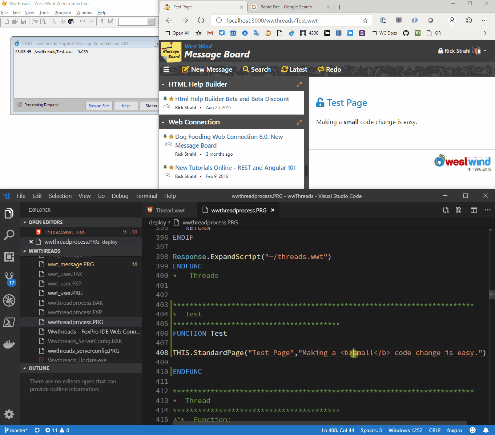

# Building a Web Connection Live Reload Server


Look Ma! No hands... I love shaving off time in my development cycle. A lot of what we do during Web Development is highly repetitive and by removing some of the steps in the typical process even making small adjustments that save time, can end up saving a lot of time over the course of a day, and especially over the lifetime of a project. This post is about saving time in the build, debug, run cycle.

A few months ago I wrote about how you can [use Browser-Sync with Web Connection](https://west-wind.com/wconnect/weblog/ShowEntry.blog?id=943) to automatically reload your browser when you make changes to HTML and other Web related resources in your projects. The idea is that you run a command line utility that acts as a Web Request proxy that detects changes on disk, and when it finds a change it automatically causes the browser to reload. It's incredibly useful and productive to work that way as you can make changes and you can literally see the changes you make in-real time changing as soon as you save to disk - the browser automatically refreshes the page you are already on without having to manually reload. 

One thing that has been missing though is the ability to **also detect server side code changes and automatically refresh** the Web Connection server. 

Consider the current scenario when you make a change to server side Web Connection Code:

* I start my Web Connection Server
* I find a problem with my Code
* I stop the server
* From the Command Window open the editor
* I find the code with the problem
* I make the change and save
* I start the server back up from the Command Window
* I refresh my Web page

That's a lot of steps - and I know I go through those steps quite a bit. Note that this applies both to HTML code, and API implementations. With APIs browser refresh isn't an issue but restarting the server very much is the same for API's as it's for HTML based Web UIs.

Now imagine that you can edit your code and **don't to stop the Web Connection Server manually, nor restart it**. That's what I'll talk about in this post.

Using what I'll describe here we'll be able to cut the steps above  down to:

* I start my Web Connection Server
* I open my open editor (still in context usually) 
* I make a change and save
* If BrowserSync is also running, active page auto-refreshes

This may not seem like a lot of saved steps, but it takes out the most time consuming ones which is stopping the server, typing the file to edit and then afterwards starting the server back up again. It easily shaves a 20-30 seconds of the debug/run cycle which is significant.

Here's what both Live Reload and [Browser Sync](https://www.browsersync.io/) look like when used in combination:



Notice that at no point in this demo do I restart or refresh either the Web Connection server or the Web Page - the changes happen as soon as I save my changes to disk.


> #### @icon-info-circle Best with DebugMode off
> Note that for best results it's also best that you run the server with `DebugMode` off. With DebugMode off errors are handled by Web Connection and display an error page, rather than breaking which interrupts the flow shown above. 
>
> With errors not breaking and displaying a message instead, you can use the error message to figure out where to make a change, change te code and simply save, and the server is right back up and running. Additionally if you use an external editor like VS Code you can just leave your code editor open and stay in context - unlike the FoxPro editor that locks source PRG files.

### Watching Server Side Files
The idea is that it's possible to set up a file watcher and watch for changes on disk. When a code file is changed the watcher tells the Web Connection app to shut down and restart itself. If `SET DEVELOPMENT ON` is set, the file change is automatically detected by FoxPro and the file is automatically recompiled when it gets loaded again.

Optionally if you prefer to work with compiling your project into EXE after changes instead of starting the PRG file (as I like to do during dev time), you can also change the default logic to rebuild your project's EXE as part of the restart process. I'll show how to do that later.

Note that this works especially very well if you use an external editor like [VS Code](https://code.visualstudio.com/) with the [FoxPro language extension](https://marketplace.visualstudio.com/items?itemName=NewDataSystems.foxpro). 

You can also use the FoxPro editor as long as you **turn off automatic compilation on Save**. Why? Because you'll be editing live code that is actually still running while you're editing. If the code were to compile it would fail to do so because the .FXP file or class will be in use by the running instance. So if you want to use this feature with the FoxPro editor make sure to turn off the **Compile on Save** option.

### How do I set this up?
The way this is implemented is via new helper function that sets up a [.NET File Watcher](https://docs.microsoft.com/en-us/dotnet/api/system.io.filesystemwatcher?view=netframework-4.8) that watches for file changes. When a source code file is changed or added, the helper unloads the running, file based Web Connection server and restarts it. It also creates a small temporary file that force browser-sync - if it's running - to refresh the active Web page.

So let's look to see what this looks like using Web Connection 7.05 and later. Starting with that version the templates automatically include the required logic to hook up the Live Reload Functionality via a custom `LiveReloadServer=On` configuration setting.

> If you're creating a new project with Web Connection 7.05 and later, the following code is auto-generated into the source code, so you don't need to add anything. If you have an older application and are updating to 7.05 or later you can use the following to add this functionality to an existing application.

All the code hookups are done in your mainline program (`AppMain.prg`) in the file based start code block. 

There are two parts to this process: 

* Hook up the file watcher
* Handle the shutdown and restart process

The first bit is setting up the file watcher implementation which lives in a new file in `LiveReloadServer.prg`. This class uses `wwDotnetBridge` to create a file watcher, and an event handler that can capture the file change events that are fired from that component.

To hook up this component is done after the Web Connection server is initially created and it's very simple:


```foxpro
*** Load the server - wc3DemoServer class below
goWCServer = CREATE("WwthreadsServer")

*** Live Reload Server if program files are changed on disk (File Watcher)  
IF goWCServer.oConfig.lLiveReloadServer AND Application.StartMode = 0
   DO LiveReloadServer
ENDIF
```

The `LiveReloadServer.prg` function that sets up the watcher is loaded only when running in the IDE only if the `LiveReloadServer` flag is set in the server configuration. Once this is done the File Watcher now watches all source code files and when any `.prg`, `.vcx`, `.app`, `.exe` or `.ini` file (by default) is changed the watcher triggers code that causes the `READ EVENTS` loop that keeps the server alive to be terminated causing the application to shut down. A `lAutoReload` flag is also set on the server, and if the application is shutting down in restart mode additional code is run to restart the server.

```foxpro
*** Make the server live - Show puts the server online and in polling mode
READ EVENTS

*** Check if server wants to auto-restart - store to var so we can release
LOCAL llAutoRestart
llAutoRestart = goWcServer.lAutoRestart

ON ERROR

...

*** Release all but the variable
RELEASE ALL EXCEPT llAutoRestart
CLOSE DATA

IF llAutoRestart
   IF VARTYPE("__WWC_FILEWATCHER") = "O"
      __WWC_FILEWATCHER.Destroy()
      __WWC_FILEWATCHER = null
   ENDIF 
   CLEAR ALL   

    *** Try to restart this applications
   KEYBOARD [CLEAR PROGRAM{ENTER}] + ;
            [DO wwThreadsMain.prg{ENTER}]                
   
   *** If BrowserSync is running this will refresh the active page
   STRTOFILE(TRANSFORM(DateTime()),"..\Web\__CodeUpdated.html")            
ELSE
   CLEAR ALL      
ENDIF
```

Shutting down a Web Connection application and restarting is trick because you want to shut down but yet maintain some state. But it's also important to ensure that the application is **completely shut down** before restarting, so that the code will recompile. In order for this to work some trickery with the `KEYBOARD` command is used to actually type commands into the Command Window after the app shuts down to restart it. `CLEAR PROGRAM` is important to ensure that all classes get unloaded properly - without there are problems with the code not recompiling. Finally the code also writes a temporary file into the `Web` folder to trigger Browser Sync to **refresh the current page**.


The first part shows Server Live reload where I'm making a change inside of PRG Progress class. All I do here is save and the text is updated (small-> MASSIVE - smallish). Then when I switch to the new message I add a bit of text (the `<h2>` tag)  to a script page. I simply save and the change is immediately shown.

There's no manual switching the changes just show immediately. Cool, right?

Although this may not seem so amazing to look at, it saves a ton of time during the development process as you don't have to keep switching between windows to start and stop the server and constantly refresh the browser. 
 
### How does it work?
As mentioned the key feature that makes the server reload work is based on using a file watcher. Where browser-sync is a separate application that handle the Web files, the Server live reload needs to be handled at the FoxPro Web Connection level. That's because although we can set up browser sync to detect changes in PRG/VCX etc. files we can't easily make it send a message back to FoxPro.

So instead using a .NET Filewatcher allows doing that by running the File Watcher in the background while the Web Connection application is running.

The first step is loading the file watcher and hooking up an 'event handler' that will receives any of the events that the object publishes and creating a subscription using `wwDotnetBridge`:

```foxpro
************************************************************************
*  LiveReloadServer
****************************************
***  Function: Optional Live Reload Module that monitors changes 
***            to code files and if changed automatically reloads
***            the main program file
***    Assume: Called from Web Connectino File based startup
***            if debug mode and 
***      Pass: lcFileList:  Optional - List of file extenions("*.prg,*.vcx,*.exe,*.ini")
***            lcFolder:    Optional - root folder
************************************************************************
LPARAMETERS lcFileList, lcFolder
LOCAL loBridge as wwDotNetBridge, loEventHandler as FileWatcherEventHandler, loSubscription

IF EMPTY(lcFolder)
   lcFolder = SYS(5) + CurDir()
ENDIF

*** Files that have changed 
IF EMPTY(lcFileList)
   lcFileList = "*.prg,*.vcx,*.exe,*.app,*.ini"
ENDIF

do wwDotNetBridge
loBridge = GetwwDotnetBridge()

PUBLIC __WWC_FILEWATCHER

__WWC_FILEWATCHER = loBridge.CreateInstance("System.IO.FileSystemWatcher",lcFolder)
__WWC_FILEWATCHER.EnableRaisingEvents = .T.
__WWC_FILEWATCHER.IncludeSubDirectories = .T.

loEventHandler = CREATEOBJECT("FileWatcherEventHandler")
loEventHandler.cFileList = lcFileList

loSubscription = loBridge.SubscribeToEvents(__WWC_FILEWATCHER, loEventHandler)
loEventHandler.oSubscription = loSubscription

RETURN
```

The actual event handler object is implemented then to implement each of the events that the FileWatcher publishes. The class also includes a helper that filters the incoming change requests based on just the files that we care about - `*.prg,*.vcx,*.app,*.exe,*.ini`. If any of those files are change then and only then do we want to restart hte Web Connection server.

```foxpro
*************************************************************
DEFINE CLASS FileWatcherEventHandler AS Custom
*************************************************************
*: Author: Rick Strahl
*:         (c) West Wind Technologies, 2019
*:Contact: http://www.west-wind.com
*:Created: 05/04/2019
*************************************************************

cFileList = "*.prg,*.vcx,*.exe,*.app,*.ini"
oSubscription = null
nLastAccess = 0

FUNCTION OnCreated(sender,ev)

IF THIS.HasFileChanged(ev.FullPath)
	THIS.RestartWebConnection()
ENDIF
	
ENDFUNC

FUNCTION OnChanged(sender,ev)

IF THIS.HasFileChanged(ev.FullPath)
	THIS.RestartWebConnection()
ENDIF

ENDFUNC

FUNCTION OnDeleted(sender, ev)

IF THIS.HasFileChanged(ev.FullPath)
	THIS.RestartWebConnection()
ENDIF
ENDFUNC

FUNCTION OnRenamed(sender, ev)

IF THIS.HasFileChanged(ev.FullPath)
	THIS.RestartWebConnection()
ENDIF

ENDFUNC


ENDDEFINE
```

The actual events that are handled have the same implementation for each one - checking whether files have change and if so restarting the server. These two functions are the key and they are both pretty simple:

```foxpro
************************************************************************
*  HasFileChanged
****************************************
FUNCTION HasFileChanged(lcFilename as String)
LOCAL lcFileList, lnX, lnFiles
LOCAL ARRAY laExtensions[1]

IF SECONDS() - this.nLastAccess < 5
   RETURN .F.
ENDIF   
this.nLastAccess = SECONDS()

IF ATC("\temp\",lcFileName) > 0
   RETURN .F.
ENDIF

lcFileList = STRTRAN(THIS.cFileList,"*.","")
lnFiles =  ALINES(laExtensions,lcFileList,1 + 4,",")

lcExtension = LOWER(JUSTEXT(lcFilename))
FOR lnX = 1 TO lnFiles
    IF lcExtension == LOWER(laExTensions[lnX])
       RETURN .T.
    ENDIF
ENDFOR

RETURN .F.
ENDFUNC
*   HasFileChanged

************************************************************************
*  RestartWebConnection
****************************************
FUNCTION RestartWebConnection()

*** Force file based server to shut down and then restart
IF VARTYPE(goWcServer) = "O"
	goWcServer.lAutoRestart = .t.
	CLEAR EVENTS
ENDIF

ENDFUNC
* RestartWebConnection
```

`HasFileChanged` checks to see whether the file falls in the scope of what we're looking for. It looks for the required file extensions and excludes anything from the `\temp` folder (which unfortunately is part of the folder hierarchy).

File Watchers have no comprehensive filter functionality (only a single `Filter` can be applied ) so **every file change is fired into the event handler**. This includes all of the message files that are created in file based messaging. `HasFileChanged()` makes sure that we only get notified on code files.

`RestartWebConnection()` then is responsible for restarting Web Connection and it only does two things:

* It sets the `lAutoRestart` property on the server
* It clears the `READ EVENTS` loop that shuts down the server

It's basically a trigger routine. The `lAutoStart` property is checked by the mainline following the `READ EVENTS` and then determines whether the restart code is fired. You can look back on the earlier snippets to see this implemented.

What's really cool about this is that this is a pretty simple implementation with very little code albeit with a few FoxPro specific hacks required to work around the fact that it's hard to shut down a running FoxPro program completely to ensure that everything gets completely unloaded before restarting the application.

### Time Saver!
I've been using this functionality for the last few weeks working on a client application and it's been a huge time saver.

I run my application with DebugMode off most of the time now, so rather than letting my application crash on errors I rely on the error display to tell me when and where an error occurs. I then open the file(s) in question make the change and save, and the app automatically reloads.  It makes for very fast iteration and it's beautiful!

If you haven't previously checked out `browser-sync` that's a great place to start. And Live Reload is coming in 7.05 which should be available shortly.

Check it out!  

### Resources

* [Browser Sync in Web Connection Post](https://west-wind.com/wconnect/weblog/ShowEntry.blog?id=943)
* [Browser Sync](https://www.browsersync.io/)
* [File System Watcher (.NET)](https://docs.microsoft.com/en-us/dotnet/api/system.io.filesystemwatcher?view=netframework-4.8)

<div style="margin-top: 30px;font-size: 0.8em;
            border-top: 1px solid #eee;padding-top: 8px;">
    
    this post created and published with 
    <a href="https://markdownmonster.west-wind.com" 
       target="top">Markdown Monster</a> 
</div>