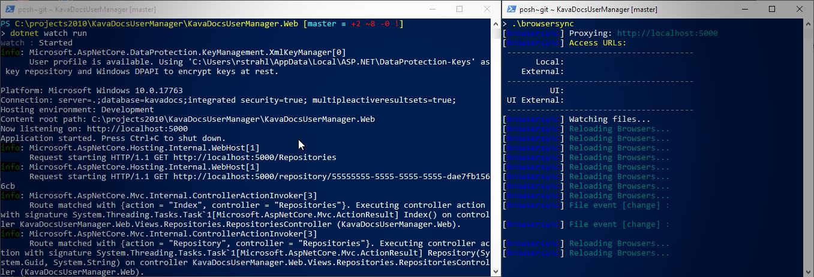
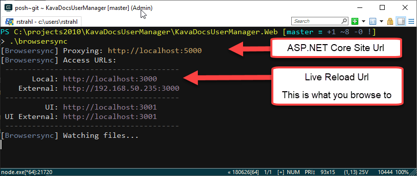

# Live Reloading Server and Client Side ASP.NET Core Apps



Client side in-browser hot reloading is one of the most compelling features of client side development. If you're using any client side framework like Angular, Vue or React they all come with integrated CLIs that provide instant live reloading of content as soon as you make a change.

If you've never used live reload functionality before it's quite a game changer for productivity, while working on iterative code - especially HTML and CSS Layout tweaks that often go through the "make a tiny change, see what it looks like and then tweak it some more" phase. 

> Live Reload is like WYSIWYG on steroids

That's all nice and neat **for client side code** where live reload is common, but on the server side there isn't really an easy comprehensive solution that provides similar functionality. Microsoft *sort of* added some tooling into Visual Studio called **Browser Link** a long time ago with Visual Studio tooling, but this originally promising project died a quiet death and never really took off. It's still there, neglected and there are options on the debug toolbar, but other than for CSS Browser Link it never really worked reliably for me. That's too bad because it looked really promising. It also only works in Visual Studio so if you're not on Windows or use another tool like [Rider](https://jetbrains.com/rider) or VS Code it's not useful.

## Server Side Live Reloading
There are however other, better solutions and in this post I'll talk about using a couple of tools in combination to provide pretty good Live Reload functionality for:

* Static HTML, CSS, JavaScript Files (client side)
* Razor Pages (server side)
* Compiled Code Changes in your ASP.NET Core App (server side)

To do this I'll use:

* [dotnet watch](https://docs.microsoft.com/en-us/aspnet/core/tutorials/dotnet-watch?view=aspnetcore-2.2#run-net-core-cli-commands-using-dotnet-watch) - a built-in .NET SDK tool
* [Browser-Sync](https://browsersync.io) - a client side live reload server/proxy

You also need to run 2 terminal windows for this particular solution to work.

Here's what the end result looks like:


The process I describe deals with two distinct scenarios: Server side code change detection and restarting, that require recompilation and re-running of your server app, followed by a refresh of client pages. Client side refresh for static content like HTML, CSS, JavaScript/TypeScript as well as for Razor pages/views which update client side using Browser Sync. 

> ### @icon-info-circle Classic ASP.NET and Live Reload
> Although what I discuss here has an ASP.NET Core based focus, you can also use BrowserSync with class ASP.NET, ASP, PHP and any other platform. It will work with any files that automatically recompile and reload. For class ASP.NET WebForms and MVC applications the only difference will be server restart code mentioned at the end which can be implemented in the same way in `Application_Start()`.

Let's take a look.

##AD##

## ASP.NET Core Application Execution
Server side ASP.NET Core applications are command line **Console applications** that are compiled and executed via `dotnet.exe`. It's compiled code, so if you make a code change the server has to be restarted because your project is one or more compiled assemblies that are running inside the launched `dotnet.exe` process. There are other ways .NET Core can be 'hosted', but for this article I only deal with `dotnet.exe`.

The execution process for ASP.NET Core is very different than the way it worked in classic ASP.NET where any time you updated your DLL the ASP.NET Runtime and the application that knew about .NET Application would automatically 'hot swap' the code and then immediately run the new application. It also required restarting, but the logistics for that process were part of the ASP.NET runtime itself that would detect changes to binaries and configuration and would automatically shut down the application's AppDomain and start a new one with the updated code - it was all built-in. Because this happened in-process it also tended to be relatively quick. With classic ASP.NET you recompile your code and on the next  request the new code is running.

## .NET Core is Different
Not so with .NET Core applications which run as a standalone application launched via `dotnet.exe`. If you make a change to your source and recompile your project, you're not actually updating the running application but shutting down the currently running application and starting a new one. .NET Core applications also don't run 'in place' like ASP.NET did, but they need to be **published to an output folder** and then run from there after the original EXE was shut down.

Long story short, restarting a .NET Core application requires a few external steps. For deployed applications this is usually just what you want - a stable process that can be automated and configured consistently without any black box logic that handles administration tasks.

However, for development this makes things more complicated when you make a change to your code and you want to see that change.

## dotnet watch run
To make this process easier Microsoft provided some tooling - specifically a tool called `dotnet watch` which is now included as part of the [.NET SDK](https://dotnet.microsoft.com/download/visual-studio-sdks). You use `dotnet watch` to **watch for file changes** and then execute a specific `dotnet.exe` command - typically `run`:


```ps
dotnet watch run
```

You run this command in your Web project folder. It works the same as plain `dotnet run`, **except it also watches files and restarts when a change is detected**. `watch` is just a pass-through command, so all the `dotnet run` (or whatever other command you use) command line parameters work with `dotnet watch run`.

`dotnet watch run` monitors source files and if a file changes, shuts down the application that it started, rebuilds and publishes the project, and then restarts the application.

It's a simple, single focus tool, but it's one of the most useful `dotnet` tools that ship in the box. Personally, I use almost explicitly for running my .NET application during development with the exception when I'm explicitly debugging code.

> ### @icon-info-circle IIS Express and Auto Restart
> IIS Express can also manage automatically updating a compiled application without a full restart, **but only in non-debug mode**. You can start IIS Express from Visual Studio with `Ctrl-F5` and make a change in code and keep running. Unlike `dotnet watch run` you have to manually re-compile your project though.

In a way `dotnet watch run` is nicer than the old ASP.NET behavior because it takes out the extra compilation step. You go straight from file change to the updated application running.

The process for using `dotnet watch run` looks like this:

* Open a command Window in your Web project's folder
* Type `dotnet watch run` 
* Open your browser and navigate to an API or Page
* Make a change to source code
* Save the file
* Go back to the browser and refresh manually
* You should see the change reflected

Notice that these steps don't include any explicit compilation step - `dotnet watch run` handles that process for you transparently.


<small>**Figure 1** - `dotnet watch run` runs, watches and restarts your app when a file change is made</small>


## Browser Sync
`dotnet watch` handles the server side reloading of code and  [Browser Sync](https://www.browsersync.io/) provides the second piece in this setup that refreshes the browser when either server side or 'client side' code and markup is changed.

Browser Sync is an easy to use web server/proxy that provides **a very easy and totally generic way** to provide simple browser page reloading. It's a Node component and it installs as a global NPM tool:

```ps
npm install -g browser-sync
```

After that you can just use `browser-sync` from your terminal as it's available on your Path.

### Proxying ASP.NET Core for Code Injection
Browser-sync can run as a Web server to serve static files directly out of a folder, or - more useful for server side scenarios - it can **act as a proxy** for an already running  Web site - like say... an ASP.NET Core Web site. 

The proxy intercepts each request via a different site port (`localhost:3000` by default), injects some web socket script code into each HTML page it renders, and then routes the request to the original site URL (`localhost:5000` typically for ASP.NET Core).

Once running any changes made to files in the folder cause the browser to refresh the currently active page and remember its scroll position. 

You can run Browser Sync from the [command line](https://www.browsersync.io/docs/command-line) like this:

```ps
browser-sync start `
            --proxy http://localhost:5000/ `
            --files '**/*.cshtml, **/*.css, **/*.js, **/*.htm*'             
```

which detects changes for all of the different files you want to monitor. You can add add folders, files or wild cards as I've done here. The above only handles client side files, plus Razor pages - I'll come back how we can also detect and refresh on server side application changes.

I put the above into a `browsersync.ps1` script file in my project folder so it's easier to launch.



Once you do this you can now navigate to your proxy URL at:

```
http://localhost:3000
```

Note that the URL is now pointing to port 3000 instead of the ASP.NET Core port of 5000. 5000 still works, but the live reload functionality is only available on port 3000.

Nice.

> #### @icon-info-circle Use Other Live Reload Servers?
> I should point out that Browser Sync isn't the only live reload solution. There are quite a few others and most client side bundling/packaging solutions like WebPack also include live reload servers. I prefer Browser-Sync for the simple reason that it's easy to use with a single lightweight focus and simple command line interface that's easy to automate.


## Not quite There Yet - Server Side Code Change Refreshing
So with `dotnet watch run` and `Browser Sync` running as I've shown above we can now live reload client pages as well as Razor pages/views since those are dynamically compiled at runtime in dev mode. We can also automatically reload our server when a code change is made. 

But if a code change is made in server side code in say a controller or business object, that code is not updating yet.

While it's possible to add server side file extensions to browser sync like `**/*.cs` or even `../**/*.cs` the reality is that while the change might be detected a browser refresh at the time of the change isn't going to work. 

That's because restarting a .NET Core application is relatively slow. Making changes to a CSS, HTML or JavaScript file, and even a Razor page or view is very quick and nearly instant. But making a code change, recompiling, then restarting the application can take a bit and it will vary with the size of the application. For one of my medium sized applications the process takes about 10 seconds locally.

The problem is that Browser Sync doesn't wait for 10 seconds to refresh but rather it starts refreshing immediately which then results in a hanging operation because the server is in the middle of restarting. Browser Sync does have a `--reload-delay` option you can use to delay reloading but that's not really practical because you do want static client files to refresh as quickly as possible.

##AD##

### Writing out a File Browser Sync can check for
To solve this problem is actually pretty simple. We know when our project is restarting because we are executing start up code, and in that startup sequence we can simply write out a file to disk in the project folder (or anywhere really) with changed content that can then be detected by Browser Sync.

I put the following at the bottom of my `Startup.Configure()` method:

```cs
#if DEBUG
    try
    {
        File.WriteAllText("browsersync-update.txt", DateTime.Now.ToString());
    }
    catch { 
        // ignore
    }
#endif
```

I can then change the Browser Sync command line to include the `browsersync-update.txt` file:

```cs
browser-sync start `
    --proxy http://localhost:5000/ `
    --files '**/*.cshtml, **/*.css, **/*.js, */*.ts, browsersync-update.txt'
```

And voila - now when you make a server change anywhere in your application, Browser Sync is notified and can reload your the active page.

Note that server side restarts will be slow - it can take some time so it's **not anywhere as fast refreshing as client side files**. My medium'ish app takes nearly 10 seconds to refresh, so maybe *live reload* in that case is more like  *delayed reload*. Even so this is still much quicker than manually recompiling, restarting, and then refreshing the browser and the browser does refresh **as soon as the server is done restarting**, which is pretty damn nice.

To finish this off, here's a video capture of what this looks like:


Note that in order to use this solution you need to run 2 command window Terminals for `dotnet watch` and **Browser Sync**. However, you can also cut out `dotnet watch` if you want to just run from your IDE. it also works in Debug mode, but if you do you will have to manually restart - but the startup output file will still be detected by browser sync and refresh the active browser page when you restart.


##AD##


## Summary
The concepts I'm describing here aren't new. There are a number of tools that provide client side live reload functionality and it's possible to make those work in a similar fashion. However, I've been using this combination of BrowserSync and `dotnet watch run` in combination in ASP.NET Core and Browser Sync in general for a number of non ASP.NET solutions (including some of my old FoxPro tools) and the nice thing about Browser Sync is that it's easy and works with all of the solutions, whether it's purely client side, ASP.NET Core, or some ancient legacy application running on classic ASP :-) all using the same exact approach. I haven't tried it, but I don't see any reason why this wouldn't work on a Mac or Linux too!

Oh and in case you're wondering - this also works with Blazor both client and server side, which **mysteriously** does not have an in-box live reload solution either. Which by the way should be a huge priority for Microsoft to provide because that is one of the big selling points of any client side technology these days.

<s>If I had the time I would love to build something more integrated for this like directly build ASP.NET Core middleware that would essentially combine  what browser sync with dotnet watch does: Monitor for file changes and then automatically inject Web Socket code into each request to send the `refresh` message into the browser. Heck it might even exist already...

This would eliminate the need to have to run anything special, but rather it's just always be there if the middleware is added (in debug). It'd be surprised if somebody hasn't already addressed that already (ServiceStack maybe?).</s>

> Since this article was written I put together a Live Reload Middleware component for [ASP.NET Core called Westwind.AspnetCore.LiveReload](https://github.com/RickStrahl/Westwind.AspnetCore.LiveReload) that you can plug into your application that negates the need for BrowserSync and just provides this functionality as part of the ASP.NET Core Web server when you run your project. I'll describe how that works and how it was made in my next post.


For now the BrowserSync solution works well enough and I just love that I can use with **any Web application style** from client side to server side to archaic old stuff. Even with the two command windows that need to keep running it's easy to set up and keep running in the background. Using a multi-tabbed terminal like [ConEmu](https://conemu.github.io/) or inside for [Rider](https://www.jetbrains.com/rider/https://www.jetbrains.com/rider/) or [Visual Studio Code](https://code.visualstudio.com/) is a big help.

Lock and load...

## Resources

* [Browser Sync](https://browsersync.io)
* [dotnet watch](https://docs.microsoft.com/en-us/aspnet/core/tutorials/dotnet-watch?view=aspnetcore-2.2)
* [Westwind.AspnetCore.LiveReload  Middleware](https://github.com/RickStrahl/Westwind.AspnetCore.LiveReload)

<div style="margin-top: 30px;font-size: 0.8em;
            border-top: 1px solid #eee;padding-top: 8px;">
    
    this post created and published with 
    <a href="https://markdownmonster.west-wind.com" 
       target="top">Markdown Monster</a> 
</div>