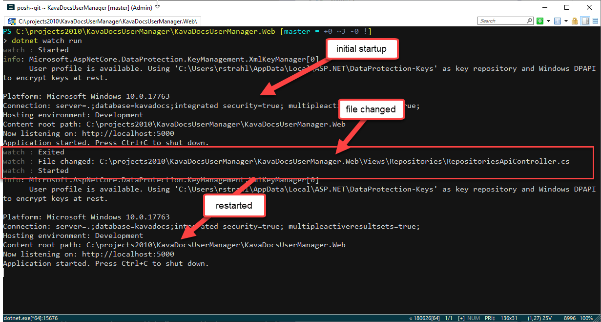

# Using Browser-Sync with Server Side ASP.NET Core

Client side in-browser, hot reloading is one of the most compelling features of client side development. If you're using any client side framework like Angular, Vue or React they all come with integrated CLIs that provide instant hot-reloading of content as soon as you make a change.

If you've never used live reload functionality before it's quite a game changer for productivity while working on iterative code - especially HTML and CSS Layout tweaks that often go through a make a tiny change, see what it looks like and then tweak it some more.

That's all nice and good for client side code, but on the server side there isn't really an easy comprehensive solution that provides similar functionality. Microsoft sort of added some tooling into Visual Studio called Browser Link that uses SignalR and some Visual Studio tooling, but this ambitious project seemed to never take off. It's still there and there are options on the debug toolbar, but other than for CSS Browser Link never worked reliably for me. That's too bad because it looked really promising at the time.

There are however solutions and in this post I'll talk about using a couple of tools in combination to provide pretty decent Live Reload functionality for:

* Static HTML, CSS, JavaScript Files
* Razor Pages
* Compiled Code Changes in your ASP.NET Core App

To do this I'll use:

* `dotnet watch` which is a dotnet tool that comes with the SDK
* Browser-Sync which is a client side live reload server/proxy

The process here really deals with two distinct scenarios: Server side code change that require recompilation and re-running of your server app, followed by a refresh of client pages. And client side refresh that needs to update the display anytime static content - or Razor Pages which aren't client side but dynamically compile and behave like client side pages - are changed.

Let's take a close look.

## ASP.NET Core Application Execution
For server side code we need to understand how ASP.NET Core applications run. They are command line **Console applications** that are compiled, so if a change is made in your code you need to restart the application because essentially your project is one or more compiled assemblies that are running in command line application.

This process is very different than the way it worked in classic ASP.NET where any time you updated your DLL the ASP.NET Runtime and the application that knew about .NET Application would automatically 'hot swap' the code and run the new application. It also restarted but the logistics for that process were part of the ASP.NET runtime itself that would detect changes to binaries and configuration and would automatically shut down the application appdomain and start it back up. Because this happened in-process it also tended to be relatively quick. With classic ASP.NET you recompile your code and on the next  request the new code is running.

Not so with .NET Core applications which run as a standalone application launched via `dotnet.exe`. If you make a change to your source and recompile your project, you're not actually updating the running application but shutting down the currently running application and starting a new one. .NET Core applications also don't run 'in place' like ASP.NET did, but they need to be **published to an output folder** and then run from there after the original EXE was shut down.

Long story short, restarting a .NET Core application requires a few external steps. For deployed applications this is usually just what you want - a stable process that can be automated and configured consistently without any black box logic that handles administration tasks.

However, for development this makes things more complicated.

## dotnet watch run
To make this process easier Microsoft provided some tooling - specifically a tool called `dotnet watch` which is now included as part of the .NET SDK. You use `dotnet watch` to 'watch' for file changes and then execute a standard `dotnet.exe` command, usually `run`. 

Here's more info in the [Microsoft Documentation on `dotnet watch`](https://docs.microsoft.com/en-us/aspnet/core/tutorials/dotnet-watch?view=aspnetcore-2.2#run-net-core-cli-commands-using-dotnet-watch).

To launch an application and automatically have it restart when there are file changes in any code related files, you simply do:

```ps
dotnet watch run
```

in your Web project folder. 

`dotnet watch run` monitors source files and if a file changes, shuts down the application that it started, rebuilds and publishes the project, and then restarts the application.

It's a simple, single focus tool, but it's one of the most useful `dotnet` tools that ship in the box. I use almost explicitly for running my application during development with the exception when I'm explicitly debugging code.

> ### @icon-info-circle IIS Express and Auto Restart
> IIS Express can also manage automatically updating a compiled application without a full restart, **but only in non-debug mode**. You can start IIS Express from Visual Studio with `Ctrl-F5` and recompile which rebuilds the application. Unlike `dotnet watch run` you have to manually re-compile your project though.


In a way `dotnet watch run` is nicer than the old ASP.NET behavior because it restarts without having to recompile. You can just change a file and the change is immediately reflected. One less step.

The process for using `dotnet watch run` looks like this:

* Open a command Window in your Web project's folder
* Type `dotnet watch run` 
* Open your browser and navigate to an API or Page
* Make a change to source code
* Save the file
* Go back to the browser and refresh manually
* You should see the change reflected

Notice that these steps don't include any explicit compilation step - `dotnet watch run` handles that process for you transparently.




<small>**Figure 1** - `dotnet watch run` runs, watches and restarts your app when a file change is made</small>

It's a simple, and very useful tool. Most of the time I develop that's what I actually run. It also works great for APIs especially if your APIs can return detailed error information, so that when something goes wrong you can check the error, make a change and get back to your API tester or browser to see the change right away.  It's a huge time-saver and except when I run and debug I pretty much default to using `dotnet watch run` these days.


## Browser Sync
`dotnet watch` handles the server side reloading of code. [Browser Sync](https://www.browsersync.io/) provides the second piece in this setup that can automatically refresh the browser when either server side or 'client side' code and markup is changed.

Browser Sync is an easy to use web server/proxy that provides **a very easy and totally generic way** to provide simple browser page reloading. Depending on the usage scenario, you can either use it as a Web Server that serves static content, or, as I  do here with an ASP.NET Core MVC application, **as a proxy** that can intercept requests to an existing Web site to inject the reload functionality into each content page served. For ASP.NET Core application we can use Browser Sync as a proxy to the actual ASP.NET Core site.


The way this works is that you run Browser Sync from the command line like this:

```ps
browser-sync start `
            --proxy http://localhost:5000/ `
            --files '**/*.cshtml, **/*.css, **/*.js, **/*.cs, **/*.htm*'             
```

which detects changes for all of the different files you want to monitor. You can add others, but the above will work. I'll come back to the `**/*.cs` files because that actually won't work as is. More on that later.

Using Browser Sync for all the 'web' files including Razor templates lets gives you the same behavior you get for an Angular or React app with live reloading, albeit with a little bit more delay.


points at the original site URL and provides a new url that you

It doesn't do hot module reloading via code injection as it's primarily a page reloader (or at least that's how I use it), which is fine for what I'm trying to accomplish. The main goal is to refresh the Web page when ever some sort of resource in the project is changed.


<!--[](LiveReloadAndBrowserSync.gif)-->
