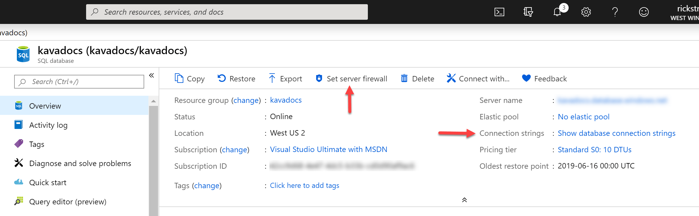
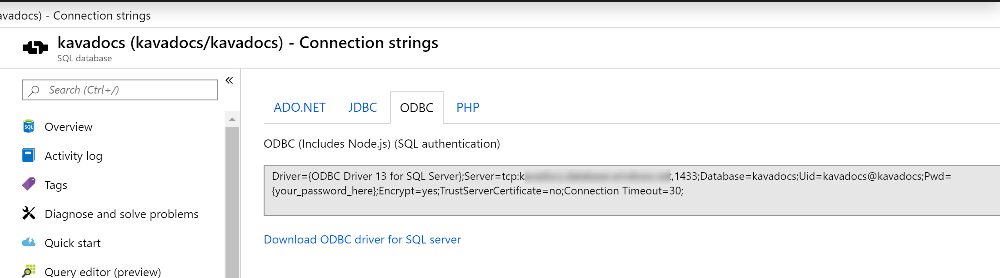
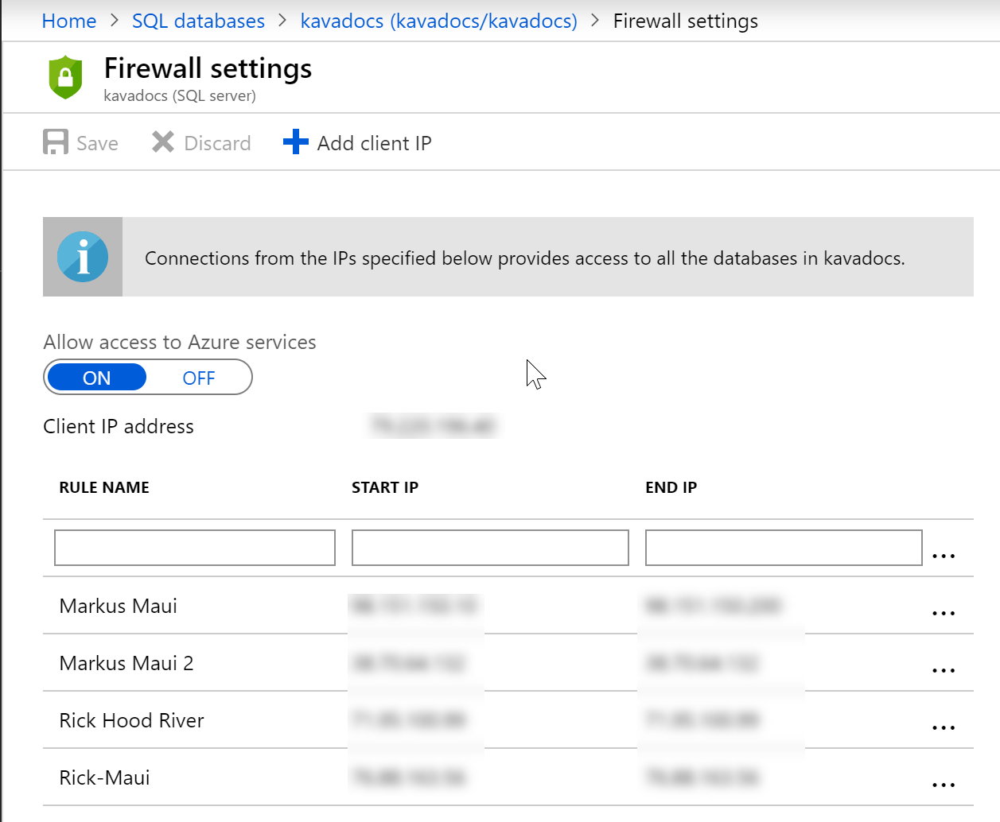
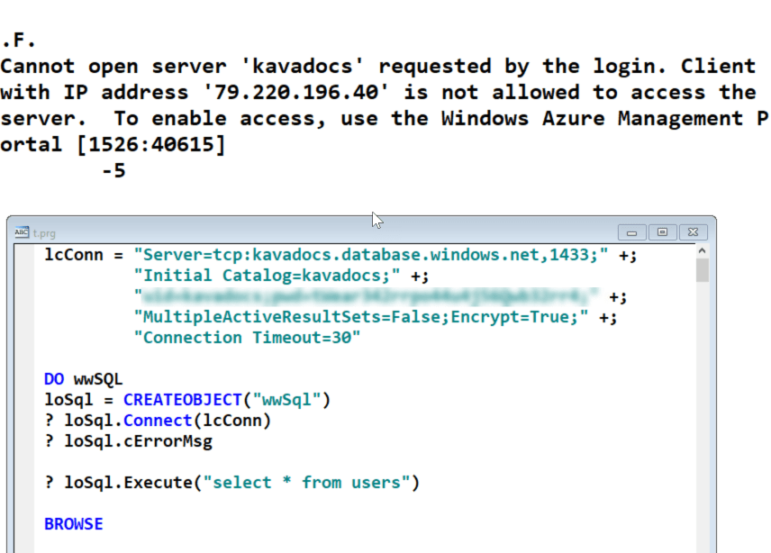

# Using FoxPro to Connect to an Azure SQL Database


Several times now people have asked me whether you can use FoxPro's SQL Server features, and the [wwSQL class](https://client-tools.west-wind.com/docs/_s8x03tcfs.htm) in particular to connect to a remote Azure SQL database. The answer is a hearty **yes, of course**. 

But there are a few things you have to consider when using Azure in general and connecting to an Azure SQL database remotely.

## Azure Databases
Azure SQL databases are basically SQL Server databases. Azure SQL is 95+% compatible with SQL Server and you use the same SQL Server drivers that you use to connect to a local or locally networked SQL Server database.

In order to access an Azure SQL database remotely you have to configure a couple of things:

* Enable the Firewall for your IP Address
* Pick up a valid Connection String

In the portal you can find those two options here:



### Picking up a Connection String
Connecting to a SQL Azure database is the same as any other database - you can use a connection string to connect to it. If you're using raw FoxPro you can use [SQLSTRINGCONNECT()](http://fox.wikis.com/wc.dll?Wiki~VFPCommandSQLStringConnect) or if you're using the `wwSQL` class you can use the [Connect()](https://client-tools.west-wind.com/docs/_s8x03tcmg.htm) method with the connectionstring  as a parameter.

There are several connection strings but the closest one you can find is the ODBC driver one:



You need to specify your username and password that is setup for the database and embed those into the connection string provided.

The username is typicaly the **name of the database**. The password is a one time password and can only be looked up by resetting the password in the portal which is because of security - Azure never echos back the password to you other than when it's created. This is a pain, but it's a good security practice.

#### Retrieving or Resetting the Password
To reset the password:

* Click on the Server Name (mydb.database.windows.net)
* Then click on Reset Password

Basically this is the equivalent of resetting the admin password on the server and the only way that password can be redisplayed on the portal is by resetting it.

Once you've reset the password it's displayed and you can save it and use it in your connection string. I recommend you save it somewhere, or if you have an Azure Web application that uses it, immediately apply it to that application's configuration values.

### Allowing IP Address Access
The connection string alone is not enough and you need to enable access for the specific IP Address that you're using to access the database.

Because Azure is a remote database, there are serious security concerns over who can access the database, so Azure SQL (and most other data services on Azure) requires you to provide a white list of IP addresses: 

*You have to explicitly enable access for all IP addresses that need to access the server.*

You can do this in the portal by specifying any number of IP addresses here:



As you can see you can specify a begin and end IP Address which is a range and each user or server requires a configuration (if they are not in the same location). For example, in this database Markus Egger and I work on, we both have multiple locations we're accessing that application from.

Note that the Azure server locations, if you are using an Azure Web application to connect, are automatically included so you don't have to explicitly enable those.

For a single IP address use the same IP for both start and end ips. I tend to use the full range of the subnet just because an ISP often will change your IP Address when your address's lease expires.
    
If you forget to set the IP Address access the remote IP Address will not be exposed, and a connection attempt will hang typically for the timeout of the connection.



### SQL Server ODBC Driver
You also need to make sure that the machine you're using has a SQL Server ODBC driver installed. The ODBC connection string provided by Azure will automatically include a very specific ODBC driver, along with a link where you can download it. 

Personally I prefer to leave off the driver and use whatever is installed locally which is the default FoxPro SQL driver. You may need a newer explicit driver if you use some of the newer SQL Server data types and features, but for most applications the old drivers are just fine.

## Connecting
Once you have a connection string, ODBC driver and the IP Address configured you're ready to connect finally.

Pick up the ODBC connection string from the Azure portal and then add in your username and password. Remember by default the username is the name of the database, and password is the server's admin password.

Here's what this looks like using `wwSQL`:

```foxpro
CLEAR
lcConn = "Server=tcp:mydb.database.windows.net,1433;" +;
         "Database=kavadocs;" +;
         "uid=mydb;pwd=ultraSeekritPassword;" +;
         "MultipleActiveResultSets=yes;Encrypt=yes;" +;
         "Connection Timeout=30"
                
DO wwSQL
loSql = CREATEOBJECT("wwSql")
? loSql.Connect(lcConn)
? loSql.cErrorMsg

? loSql.Execute("select * from Users")
? loSql.cErrorMsg
BROWSE NOWAIT
```

And that lets me access the remote database. Note I removed the specific driver from the connection string. You can leave that in, just remember that if you do that driver has to be installed everywhere you run the application, whereas the code above will work with whatever driver is installed. Note that **some SQL SERVER ODBC driver** has to be installed in order for this to work, so your application's installer probably needs to ensure it installs the appropriate ODBC driver.

The code above uses wwSQL - for plain FoxPro replace the `.Connect()` call with `SQLSTRINGCONNECT()` and then capture the connection handle to run your `SQLEXEC()` commands.

## Summary
Azure is getting popular for hosting data stores, and SQL Azure is an easy way to host a SQL Server that is compatible with traditional SQL Server applications in the cloud. Azure isn't cheap especially if you need higher performance or lots of storage, but it does provide a nice admin-less service in the cloud that's easy to set up and manage remotely with very little effort.

Remote connections is not something you should use as part of an application - performance generally is not great over the Internet, but in a bind it's totally possible to remotely connect and access the database remotely. The most common scenario is for development and testing while the deployed Web application actually runs on Azure proper.

I hope this brief post gives you all the information you need to use Azure SQL databases in your FoxPro applications remotely.

<div style="margin-top: 30px;font-size: 0.8em;
            border-top: 1px solid #eee;padding-top: 8px;">
    
    this post created and published with 
    <a href="https://markdownmonster.west-wind.com" 
       target="top">Markdown Monster</a> 
</div>