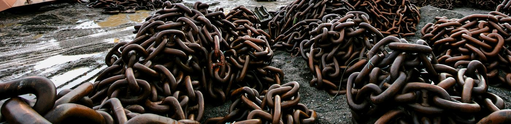
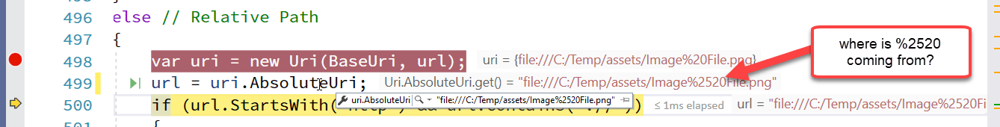

# Uri.AbsoluteUri and UrlEncoding of Local File Urls



I have a love/hate relationship with the `System.Uri` class. It's great when it works as you expect, but I've had a few of battles related to Url encoding and decoding and in this post I'll point out one oddity that bit me today.

## Url Combining
I frequently use the Uri class to build Urls, both for Web Urls as well as for local Urls. Specifically I commonly use it to normalize relative URLs into absolute Urls or vice versa. One very nice thing about the URI class is that it **also works with file paths** so it can be quite useful into combining paths and encoding/decoding the URL formatting which is quite useful if you're embedding local file links into things like Markdown documents (imagine that!). 

## Local file:/// Urls
This particular issue affects `file:///` urls and it concerns different behavior for Url Encoding depending on **how** a file URL is initialized in the Uri class.

My specific scenario in code is that in [Markdown Monster](https://markdownmonster.west-wind.com) I have an output generation class that dumps a generated HTML document as a self contained file to disk by pulling in all related resources and embedding them directly into one large  document. To do this a document relative path is required, which in this case I build up using the URI class. I use Uri because the relative path may be relative to an online `https://` resource **or** a local file. If the path is relative it's assumed to be relative to the current document, and I use the URI class to combine the base path with the relative path.

Seems straight forward enough:

```cs
// assign base path initially from a filename
var basePath = Path.GetDirectoryName(doc.Filename);
this.BaseUri = new Uri(basePath);

...

// then figure out relative path to retrieve resources
else // Relative Path
{
    var uri = new Uri(BaseUri, url);
    var url = uri.AbsoluteUri;  // here things go awry!
    
    if (url.StartsWith("http"))
    {
        var http = new WebClient();
        imageData = http.DownloadData(uri.AbsoluteUri);
    }
    else
    
        imageData = File.ReadAllBytes(uri.LocalPath);
    
}
```

Unfortunately, this code runs into a serious problem with the Url Encoding:




Specifically when combining the URLs, the second URL is added as a literal string and not considered as encoded. The result is that the `%20` space encoding is encoded as `%2520` - basically encoding the `%` and writing out the `20` after that. IOW, the input is treated as a raw unencoded string.

## Uri Constructor: Scheme Matters
After a bit of experimenting it turns out that the problem is **how the Uri instance is initialized from a string**. Specifically, the protocol - or lack thereof - determines how the Uri is treated for `file:///` urls.

In the example code above I essentially assigned the Uri like this:

```cs
var baseUri = new Uri("c:\\temp\\");
```

which demonstrates the problem by doing:


```cs

var part1 = new Uri("C:\\temp\\"); // double encodes when combining parts 
var part2 = "assets/Image%20File.jpg";  // src/href from HTML doc


var uri = new Uri(part1, part2);
uri.Dump();  // shows correctly as it shows original url

url = uri.AbsoluteUri;  // Wrong: file:///c:/temp/Image%2520File.jpg 
url.Dump();

uri.LocalPath.Dump(); // c:\temp\Image\20File.jpg 
```	

This creates incorrectly encoded values for `AbsoluteUrl` and `LocalPath`:

```text
file:///c:/temp/Image%2520File.jpg 
C:\temp\assets\Image%20File.jpg
```

both of which are obviously not what is desired here.

## Fix with always un-encoded Urls/Paths
The problem above is that the URL/Path passed is already URL encoded, and one way to fix this is the pass in the URLas an unencoded string:

```cs
var part1 = new Uri("C:\\temp\\assets\\Image File.jpg"); // unencoded
```

Now `AbsoluteUrl` and `LocalPath` correctly are:

```text
file:///C:/temp/assets/Image%20File.jpg
C:\temp\assets\Image File.jpg
```

The trick here is to first UrlDecode any possibly encoded strings before passing it to the Uri constructor.

In my scenario I capture the URLs from an HTML document, where they are already encoded so this would mean I'd have to UrlDecode the URL before passing it to the `Uri` ctor then re-encode it later, so this didn't look very appealing.

Turns out there's a better way yet.

## Fix Uri with explict `file:///` Scheme
Another perhaps more flexible approach is to pass in a properly formatted URL for a local file path. So rather than **just** passing the filename, I can pass a properly formatted `file:///` Url using the `file:///` scheme prefix.

So changing the baseUri to:

```cs
var part1 = new Uri("file:///C:\\temp\\assets\\Image%20File.jpg");
```

> Note that it doesn't matter whether the filename has forward or backward slashes or even a mixture of the two - Uri can properly resolve the slashes into Web and Local Urls.

This now correctly UrlEncodes (or rather doesn't) the file.

```cs
url = uri.AbsoluteUri;  // Right: `file:///c:/temp/Image%20File.jpg` 
url.Dump();

uri.LocalPath.Dump();   // Right: c:\temp\Image File.jpg
```	

Presumably a raw file string is considered completely unescaped, while a `file:///` Url is considered to already be encoded, so with the latter the behavior is what I would expect, while the former seems rather useless and unfortuately an easy mistake to run into (as I did).

## The easy fix in my Code
So, then to fix my problem in code I can now do:

```cs
// assign base path initially from a filename
var basePath = Path.GetDirectoryName(doc.Filename);
this.BaseUri = new Uri($"file:///{basePath}"); // add file:/// prefix

var uri = new Uri(BaseUri, partialUrlPath);
```

and the code now correctly escapes and unescapes in a predictable manner. 

Note that `basePath` is a standard Windows OS path with backwards slashes but because the `file:///` protocol is specified the Uri constructor properly fixes up the Uri so it **just works**.

I can then simply use `uri.LocalPath` to retrieve the full, unescaped filename:

```cs
imageData = File.ReadAllBytes(uri.LocalPath);
```

This removes any need to do explicit UrlDecoding as I was doing previously in my code.

If you want to play around and see the behavior differences between the two assignment modes I've put my simple LINQPad tests [in a .NET Fiddle](https://dotnetfiddle.net/o6hIp9).


## Relevant Uri Path Properties
For reference, here's a summary of some of the path relative Uri properties and whether they are encoded or not:

| Uri Member   | UrlEncoded | Functionality                            |
|--------------|------------|------------------------------------------|
| AbsoluteUri  | Yes        | Fully qualified escaped URL              |
| AbsolutePath | Yes        | File: Escaped file path with `/` path separators  <br>Web: Escaped site relative path |
| LocalPath    | No         | For file URLs: Unescaped local file path with `file:///` prefix stripped.<br>For Web URLs: Unescaped site relative path. |
| .ToString()  | No         | Fully qualified URL with all UrlEncoding removed.   |

## Summary
This isn't the first time I've tangoed with the `Uri` class in regards to url encoding and url formatting. 

The first take-away is that the `Uri` class is a powerful tool to work with paths, both for Web and local paths as it can handle Url encoding and formatting in a much cleaner way than manually picking up URLs and UrlEncoding and Decoding. I had previously made myself a lot of extra work retrieving HTML document Urls decoding them, then re-encoding them later for re-embedding when Uri can handle all that for you.

But as always - caveats, especially for local file URLs. The way Urls are assigned and how UrlEncoding works is not always obvious, and in this case it outright caused my application to break because of an untested scenario (spaces in Urls specificially). In the end there are a couple of easy solutions to ensure proper encoding:

* Always forcing full `file:///` Urls
* Always providing unencoded paths to the Uri constructor

Neither is obvious or documented, but it works. Hopefully this post helps others to discover this behavior with less trial and error than mine described in this post...
  
## Resources
* [.NET Fiddle Demonstration](https://dotnetfiddle.net/o6hIp9)

<div style="margin-top: 30px;font-size: 0.8em;
            border-top: 1px solid #eee;padding-top: 8px;">
    
    this post created and published with 
    <a href="https://markdownmonster.west-wind.com" 
       target="top">Markdown Monster</a> 
</div>