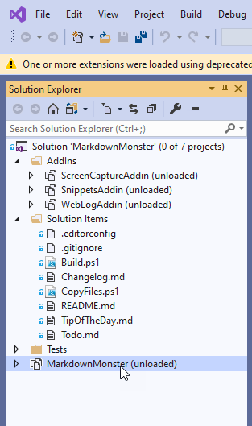
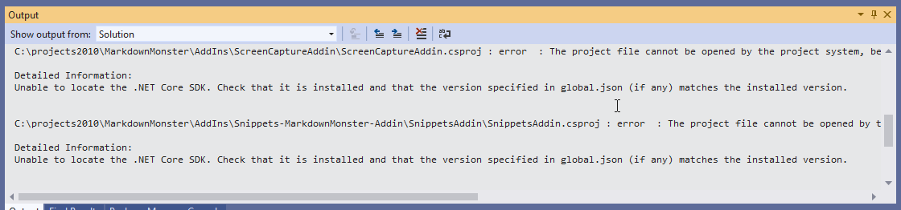
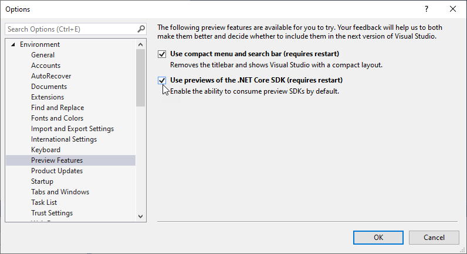

# Visual Studio 2019.2 and .NET 3.0 SDK Projects not Loading


After upgrading to Visual Studio 2019.2.3 you may find that if you're using projects that use the .NET Core 3.0 SDKs will no longer work out of the box. To be fair, Microsoft recommends that you use the VS 2019.3.x for working with .NET Core 3.0 and the 3.0 SDK, but up until recently working with the 3.0 SDK had been no problem even in the released, non-preview VS 2019.2.x releases.

I have several 3.0 projects, but the one I use the most is my [Markdown Monster](https://markdownmonster.west-wind.com) project which is a .NET SDK WPF project that uses the new project format. This all worked perfectly fine in previously releases but after the update to 2019.2.3 I now get this:



Looking a little closer at the Output window I can see that the problem is the wrong version of an SDK is used, and it looks like by default Visual Studio uses .NET SDK 2.2 (it'll tell you when it's actually building).



The message is:

> Unable to locate the .NET Core SDK. Check that it is installed and that the version specified in global.json (if any) matches the installed version.

It would be nice if this was more descriptive and told you a) what version it's looking for and b) what version it's trying to currently use.

The frustrating thing is that the proper SDKs are installed and Visual Studio now installs the appropriate SDKs. Yet it's unable to find the right version anyway.

That's not an improvement!

### 3.0 SDK Required!
The problem in the project above is that it's a .NET SDK project that **requires** the V3.0 SDK as it uses WPF which is part of the Windows platform support that was added in the 3.0 SDK versions. This project type doesn't work in older pre-3.0  versions of the SDK. 

So while other .NET Core 2.x projects compile just fine using the defaults, this particular project does not, even though the proper 3.0 Preview SDK is in fact installed. This worked before, but now fails.

The failure is due to a change in Visual Studio that no longer looks at preview SDKs by default. So it finds the latest 2.x **release SDKS** but not the 3.0 preview SDKs - by default. Hrrmpf.

### Overriding the SDK used with global.json - sort of
The solution to SDK versioning problems in projects or Solutions is to use a `global.json` file in the project or solution root to **specify a specific version of an SDK** to use with your project or solution.

In there I can specify a specific version of my SDK I want to use for this project/solution:

```json
{
    "sdk": {
      "version": "3.0.100-preview8-013656"
    }
}
```

That works, but it is a **terrible** solution to this problem. It sucks because now I'm pinning my solution to a very specific (preview) version of the SDK. Since this project lives on GitHub and is shared anybody using the project now too ends up needing to use this same version of the SDK if I check in `global.json`. Alternately I can not check it in, in which case the project just won't build unless a Preview release of VS is used. Bah!

Maybe even worse using global.json, if SDKs are updated now, I have to remember to update the `global.json` version to get the latest SDK rather than the one that now is pinned in `global.json`.

I tried using more generic version numbers (3.0 and 3.0.*) which seems like a logical and expressive solution to this problem, but that doesn't appear to work - the only thing that worked for me was using a very specific version number.

### Use Previews of the .NET Core SDK Setting in Visual Studio
Of course moments after I posted somebody from Microsoft mentioned that *"there's a switch for that!"*, that you can set in the current 2019.2 release of Visual Studio to force it to also look at preview SDKs for versioning.

You can use **Tools->Options->Environment->Preview Features** to specify that you want to enable Preview SDKs:



 This enables finding the latest version rolling forward to the latest preview SDK installed. 
 
 After setting that switch - my project now works without requiring an explicit `global.json`.
 
### Use Visual Studio Preview 2019.3
Another option is to use the latest Preview release of Visual Studio - VS 2019.3 which has support for .NET Core 3.0 and the 3.0 SDKs and defaults to using the 3.0 .NET Preview SDKs. It automatically recognizes the current preview SDKs.

This is what Microsoft recommends currently if you are working with .NET Core 3.0 and any of the newer SDK style projects like WPF/WinForms, but these previews have been a bit shaky for my tastes with lots of instabilities especially with Extension tooling.

### SDK Tooling Delivery and Usage Improvements?
Microsoft has stated that they are [trying to address the SDK install problems](https://devblogs.microsoft.com/dotnet/improving-net-core-installation-in-visual-studio-and-on-windows/) and that the current releases (rtm and preview) of Visual Stuio are starting to reflect that. The new SDK installers are supposed to clean up old SDKs and leave behind only one version plus specific preview SDKs. Since SDKs are backwards compatible and can compile older versions or project formats there should be little reason to keep older SDKs around.

We can hope that this will get better as time goes on. This issue certainly was confusing and frustrating to me - one minute it works, next you update and it doesn't which is never a good experience.

It took a note from a Microsoft developer to find the Preview switch in options, but this sort of thing should be more prominently displayed in error messages like the message that shows in the output window. 


<div style="margin-top: 30px;font-size: 0.8em;
            border-top: 1px solid #eee;padding-top: 8px;">
    
    this post created and published with 
    <a href="https://markdownmonster.west-wind.com" 
       target="top">Markdown Monster</a> 
</div>