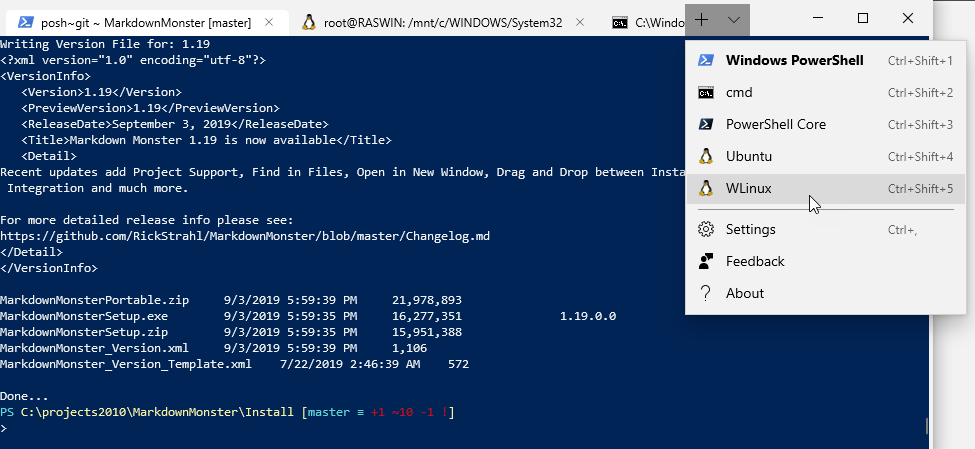
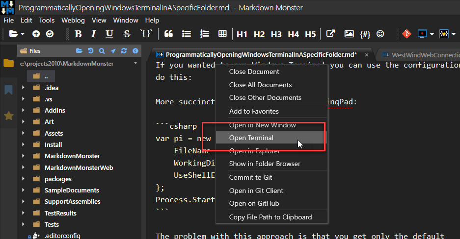
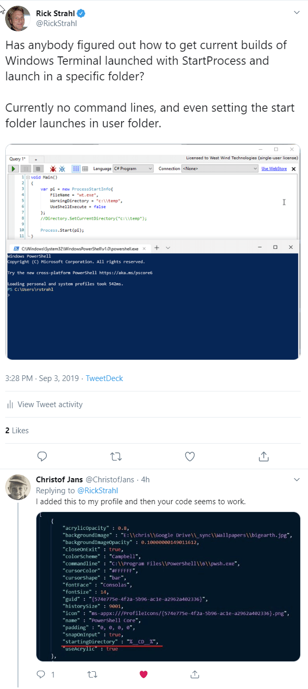
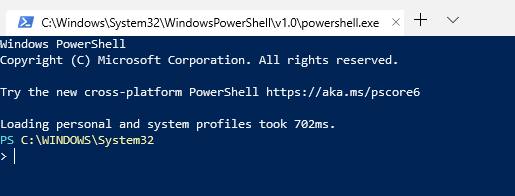
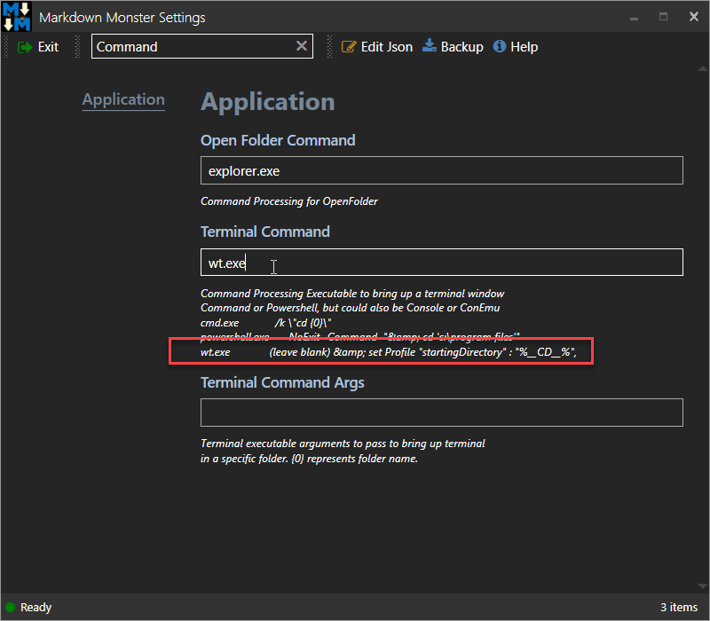

# Programmatically Opening Windows Terminal in a Specific Folder
I've been using Windows Terminal for a while now since it was announced and made available [in the Windows Store](https://www.microsoft.com/en-us/p/windows-terminal-preview/9n0dx20hk701?activetab=pivot:overviewtab) a few months back. 



There are lots of reasons to like this new Terminal and I don't want to get into all of them here. For me, the main reason is that it ships with a new `ConHost.exe`, that is considerably faster than the ConHost shipped with Windows which results in much faster terminal painting and scrolling.

> Keep in mind that Windows Terminal is a Terminal UI, plus the Console Host, and it's not a replacement for the Powershell, CMD or Bash shells or any other shell. The Terminal acts as a host to those shells that are loaded inside of it. Any shell application uses ConHost and the Terminal UI provides the hosting UI for these shell instances.

A few reasons to check it out:

* Multiple tabs of Shell Instances
* Very fast text rendering
* Smooth text scaling
* Better terminal spec compliance
* [Open source on GitHub](https://github.com/microsoft/terminal) and under active development
* Many improvements expected...

If you haven't yet, [check it out](https://www.microsoft.com/en-us/p/windows-terminal-preview/9n0dx20hk701?WT.mc_id=-blog-scottha#&activetab=pivot%3Aoverviewtab)...

## No Automation Yet
The terminal works great, but it's still in the early stages of development. The core terminal functionality is rock solid,
but the Windows UI shell and command interface are not very feature rich around the edges yet. It's all very utilitarian which is to be expected - after all the focus first and foremost is on building a better Console Host and it's an early preview.

To make it easy to load, Microsoft provides a globally mapped executable - `wt.exe` - that you can launch without providing a path from anywhere in your system: From `Windows-R`, from another console or from another application using  `CreateProcess()` related APIs.

You can launch Windows Terminal from anywhere with:

```
wt.exe
```

or by using the installed shortcut.

One problem currently is that you can't easily automate the terminal application when it launches. There are **no command line options** supported yet (although there's discussion around this and it will come eventually), which means you can't start up the shell in a specific folder, execute a startup command or even pick a profile to start with.

Recently I had several people asking about Windows Terminal in [Markdown Monster](https://markdownmonster.west-wind.com):

> How can I launch Windows Terminal as my Terminal Viewer in Markdown Monster

The short answer is:

* You can customize the startup default Terminal Shell Profile
* Set `"startingDirectory" : "%__CD__%"`   
which starts the Shell out of the active OS folder
* Side effect: Windows shortcut launching launches from System folder

For more information read on.

## Markdown Monster and Terminals
Markdown Monster has configuration options that let you customize the Terminal executable and Command Arguments so you can customize which terminal gets launched. The default is Powershell but it's easy to add a commandline to switch the `Cmd.exe` or WSL or another version of Bash. In the program the terminal launching is provided via context menu options from with from various folder related operations:



MM does this from number of places: 

* From the current document tab or document
* From the Folder Browser Folder
* From a file or folder in the Folder Browser
* From the Git Commit Dialog

I get a lot of use out of that feature and I suspect others use it quite a bit as well especially given several of the Window Terminal requests.

Unfortunately if I want to use `wt.exe` as my shell option, I can't pass the command parameters the way I currently do with the other shells, which is by using custom launch commands in the shell to change to a specific folder.

For example for the default Powershell terminal the default is:

```ps
powershell.exe     -NoExit -Command  "& cd '{0}'"
```

Since Windows Terminal is really a shell host, rather than an actual shell, you can't pass parameters directly to the shell. `wt.exe` currently doesn't have any command line parameters (AFAIK) so there's no way to set the working folder or push a command to the launched shell.

I also can't specify which configured terminal to start up via an option  - basically all you can do is `wt.exe` without arguments at the moment and hope for the best.

## Automating anyway
To launch Windows Terminal programmatically I can use code like the following:

```csharp
var pi = new ProcessStartInfo{
	FileName = "wt.exe",
	WorkingDirectory = "c:\\temp", 	    
	UseShellExecute = false		
};
Process.Start(pi);
```

and that works, **except it fails to load out of the `WorkingDirectory`**.

The problem with this approach is that you get only the default configuration, and the folder - even though set via the `WorkingDirectory` in the start info - is completely ignored by the `wt.exe` startup due to a default profile setting. Hrmph!

### Windows Terminal Profiles
The bad news is that you can't pass a working folder to `wt.exe` via a startup command yet.

What you **can** do however is to customize the startup Profile and change it so the profile starts the shell in the currently active folder. You can make a change to a configuration key in the default Windows Terminal Shell profile.

This works, but it means **it's up to the user to customize their default profile**, which isn't terribly user friendly, but it's a workaround that works for now.

You can access the Windows Terminal profile JSON file by going to Settings in the Terminal itself using the down button:


If you edit that file you'll find:


Here you can specify multiple profiles for each type of shell window, and you can add additional profiles of your own or customize the existing ones. 

Each profile has a `guid` key that uniquely identifies it and the startup profile is referenced by a `defaultProfile` key that points at one of these profile guids.

### Forcing the Startup Path
So in Markdown Monster I would love to use Windows Terminal and after searching around a little bit unsuccessfully to find command line options I posted a message on Twitter asking if anybody had gotten this launching WT in a specific folder to work.

[@ChristofJans](https://twitter.com/ChristofJans) ended up helping me out:

[](https://twitter.com/RickStrahl/status/1169014217929908224)

Here are the relevant keys:

```json    
"defaultProfile": "{61c54bbd-c2c6-5271-96e7-009a87ff44bf}",
...
"profiles" : 
[
    {
        "commandline" : "powershell.exe",
        "guid" : "{61c54bbd-c2c6-5271-96e7-009a87ff44bf}",
        "name" : "Windows PowerShell",
        "startingDirectory" : "%USERPROFILE%",
    },
    { ... }
]    
```

The gist of is that by default all profiles are configured with a hard coded `startingDirectory` setting to the user profile

```
"startingDirectory" : "%USERPROFILE%","
```

You can change this folder to use the active working directory with the following change:

```json
"startingDirectory" : "%__CD__%",
```

And voila WT now opens in the specified path if you set the path prior or provide a `WorkingDirectory` to the CreateProcess APIs.

### Side Effects
Unfortunately, there's a side effect: Now when you start `wt.exe` from your default shortcut it'll start in your SYSTEM folder:



That's not ideal, but I can live with that. It's easy to `cd ~`.

I suspect there's a way to fix the startup path the Windows shortcut somehow by setting the shortcut starting directory, but - it's a bloody Windows Store app and that shit is buried somewhere and not worth the effort to have it blown away on the next update anyway.

The ideal solution here would be for `WT.exe` to provide a way to select a profile to invoke, then setup a custom profile that's not the default and add the `%__CD__%` pathing there, which would provide the features needed for applications, while leaving the default profile intact.

Overall profiles are great because they do make it easy to create new shell configurations quickly simply by copying profile entries and modifying a couple of obvious settings.

## Summary
The good news is that with the `StartingDirectory` value set in the default profile, it works and I can now use `wt.exe` as my terminal command in Markdown Monster:



and it works just dandy now!

The terminal has been a joy to use, which is why I'm mucking around with all this in the first place. I'm following up on the request I got earlier because  - heck -  I want to use the Windows Terminal in MM too :-). And now I can...

<div style="margin-top: 30px;font-size: 0.8em;
            border-top: 1px solid #eee;padding-top: 8px;">
    
    this post created and published with 
    <a href="https://markdownmonster.west-wind.com" 
       target="top">Markdown Monster</a> 
</div>