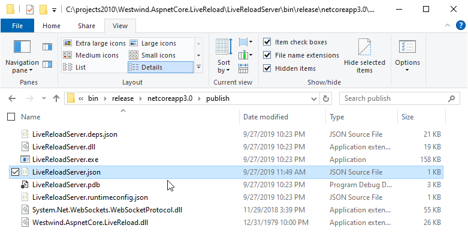
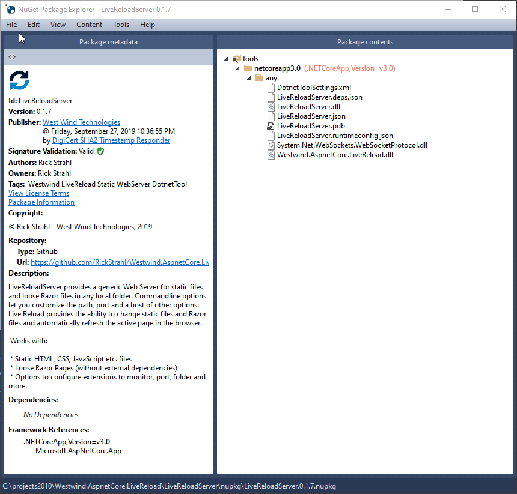
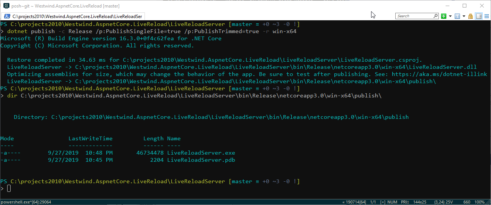

# Serving ASP.NET Core Web Content from External Folders


ASP.NET Core makes it easy to create a Web application regardless of whether you want to create code in raw middleware, using traditional MVC Controllers and Views, or by using Razor Pages as well as static content. 

I love the fact that you can easily create a self-contained, **local** web server with ASP.NET Core. I have a lot of scenarios in desktop applications that need access to local Web content for rendering or preview functionality and having a quick way to display content is useful. I also have a host of local static documentation sites that I need to often tweak the HTML with and having a local Web Server that includes LiveReload functionality is very useful for quickly making small quick-fix changes.

## Standalone Generic Local Web Server in .NET
One scenario I've been thinking about recently is to build a generic Web server that makes it easy to serve Web content **from an arbitrary local folder - generically**. Yeah, I know there are lots of NodeJs tools that do this, but **it's just as easy to create a standalone server in .NET now**. By writing my own I can customize and **provide exactly the features I need**.

It's easy to build and just as easy to then publish that customized generic server as a .NET tool or as a self-contained EXE, so it's easy to share - even if it's just for myself on other machines. 

I've talked a lot about Live Reload recently because I ended up integrating this functionality into a number of applications and frameworks to make it that much easier to build and debug applications. So my use case is to have a local Web static file Web Server that automatically has Live Reload enabled. Point it at a foler of HTML resources and go. Make changes to resources in that folder and see the page in the browser updated. As a bonus it also works with Razor Pages (with limitations) - all in a folder that you specify (or launch in).

If you want to take a look at this generic static file Web server with included LiveReload functionality, you can install the `LiveReloadServer` .NET Tool like this <small>(requires that the Dotnet Core 3.0 SDK is installed)</small>:

```ps
dotnet tool install -g LiveReloadServer

# run in current folder
LiveReloadServer

# point at a folder elsewhere
LiveReloadServer --WebRoot c:/temp/mysite/web --port 5500 --UseSsl true
```

Just in case you're unfamiliar with how LiveReload functionality works, here's the `Westwind.AspnetCore.LiveReload` middleware in action inside of a Web application. It's slightly different for the generic LiveReloadServer as there's no code - only file resources. You get the same features in this `LiveReloadServer`, with the exception of controller source code change refreshing:


In this post I'll describe how to build this generic standalone Web server that can serve static files and also - in limited capacity -  Razor Pages. The server also supports fast and efficient, built-in LiveReload functionality which is enabled by default and so makes it perfect for developer scenarios.

## Standard ASP.NET Core Site vs Generic Site
By default ASP.NET Core's services are bound to a `HostingEnvironment` and a `ContentRoot` folder in which the application is installed. The `ContentRoot` is the folder where the application's binary resources and configuration files live. There's also a `WebRoot` folder and typically this is the `wwwroot` folder where the Web application expects static content to be served from. Static HTML files and CSS, Images and JavaScript resources typically live in this static `wwwroot` folder.

This is pretty accepted common ground and almost every ASP.NET Core application uses that same pattern. And this is totally fine for typical custom Web applications.

But if you want to serve content from other locations than the host folder or dynamically configure your application to process files from other locations, some additional setup is required. Turns out though, that ASP.NET Core makes this fairly easy via configuration once you find the right dials to tweak.  Specifically various ASP.NET frameworks support specifying a `FileProvider` that determines where files are loaded from and by customizing paths it's relatively easy to serve content from other locations.

### ASP.NET Core's File Providers
`IFileProvider` is a base interface that is used to - as the name suggests - provide files to the application. Files can come from different locations and rather than hard coding physical paths there are various file providers.

One of those providers is a `PhysicalFileProvider` which is used to specify a physical disk path from which to serve file resources. Other providers can serve files directly from embedded resources, from a stream or from custom data providers.

For loading content out of folders other than the default folder I'll use a `PhysicalFileProvider` and point it at an application provided path via commandline most commonly but any of the other configuration points.

## Static Files from external Folders
My specific use case is to build a generic static file Web server with Live Reload functionality, that I can either run from a given folder or provide a `--WebRootPath` parameter to point at a folder to launch out of.

ASP.NET Core uses the `StaticFiles` middleware, so to serve static files out of a different folder we can configure the `.UseStaticFiles()` initialization in `Startup.Configure()`:

```cs
WebRootPath = Configuration["WebRootPath"];  // from config/CommandLine/Env
if(string.IsNullOrEmpty(WebRootPath))
    WebRootPath = Environment.CurrentPath;
...
app.UseStaticFiles(new StaticFileOptions
{
    FileProvider = new PhysicalFileProvider(WebRoot),
    RequestPath = new PathString("")
});
```

One of the options of the `StaticFiles` middleware is to specify a file provider which determines **which folder to use for static files** to serve. This folder location is set as the root path, with the `context.Request.Path` appended to find the file to serve.

Here I assign a `PhysicalFileProvider` with a new root path. I also set the `RequestPath` to `""` which is the **Root Path** - normally this defaults to `/wwwroot` which is the location in default ASP.NET Core project where static content is served from. But in this case I want my server to serve **directly out of the root folder I specify** via config or the command line - as provided by a `WebRoot` configuration switch. RequestPath is set to empty to use the root folder.

That's literally all it takes to create a generic static file server. You can now access any static content from the Web root on the port you specify:

```text
http://localhost:5000
```

This is a **very simple, yet powerful use case**: doing literally nothing more than adding the StaticFile middleware into a new application and setting the path gives you a generic static file Web server. Nice!

Now all that's left to do is to make this easily accessible to me and others.  You can now build this application into an easy self-contained EXE console application, or to take it one level further make it into an easily shared **dotnet tool** that can be installed via the .NET SDK similar to an NPM install. The latter is likely the preferred use case, but I'll show both.

I've created the dotnet tool and have [published it on NuGet](https://www.nuget.org/packages/LiveReloadServer/). So if you're interested in a local static file Web server with LiveReload,  you can install the server and run it with a couple of commands:

```ps
dotnet tool install -g LiveReloadServer

# Start in any folder or provide a --webroot
LiveReloadServer --webroot c:/sites/test site/web --port 5300 --UseSsl True
```

This fires up the local file server and includes the LiveReload functionality. Open a Web Page or dependent resource in the folder, make a change to the page or one of the dependent resources and see those the active page in the browser auto-refresh almost immediately. 

Note that you can turn that off `--LiveReloadEnabled False` but the idea is to have ready to go pre-configured, fast live reload HTTP server to local content. It's great for quickly testing and tweaking a local HTML page or JavaScript library.

More on that later.

This tool fits a practical use case for me. I maintain a number of small Javascript libraries and running and modifying code and HTML layout is made much easier by using a local server with Live Reload. There are existing tools - mostly NodeJs based and NPM hosted - that do this including  [Browser-Sync](https://browsersync.io) and while this tool works, it's relatively slow and for me at least unreliable forcing me to frequently have to restart the server. So I've wanted to have a static file server that **I can tweak and customize easily**, and more importantly can create my own custom versions of.

## Razor Pages 
My primary use case was for static files, but as I was playing around with the static file functionality I thought to myself we should also be able to do the same thing with Razor Pages - in a limited fashion at least.

It turns out you can! You can redirect the Razor Pages base folder to a different location on disk at runtime and serve Razor Pages from that folder. This means I can start my generic server point it at an external folder and serve Razor pages out of that! Instant Razor Web Server - pretty cool, right?

### Hooking up Generic Razor Support 
Here's what it takes to hook up Razor Pages in an external folder. As of ASP.NET Core 3.0 dynamic Razor compilation at runtime is **an optional feature**, so the first step is to turn dynamic runtime compilation on and add a NuGet package that put that support back in.

```xml
  <ItemGroup>
    <PackageReference Include="Microsoft.AspNetCore.Mvc.Razor.RuntimeCompilation" Version="3.0.0" />
  </ItemGroup>
```

Next, compilation needs to be configured. It's not very different from what I did earlier with the Static File Provider:

```csharp
public void ConfigureServices(IServiceCollection services)
{
    services.AddLiveReload();

    WebRoot = Configuration["WebRoot"];
    if (string.IsNullOrEmpty(WebRoot))
        WebRoot = Environment.CurrentDirectory;
        
    var razEnabled = Configuration["RazorEnabled"];
    UseRazor = string.IsNullOrEmpty(razEnabled) ||
               !razEnabled.Equals("false", StringComparison.InvariantCultureIgnoreCase);


#if USE_RAZORPAGES
    if (UseRazor)
    {
        services.AddRazorPages(opt => { opt.RootDirectory = "/"; })
            .AddRazorRuntimeCompilation(
                opt =>
                {
                    // This would be useful but it's READ-ONLY
                    // opt.AdditionalReferencePaths = Path.Combine(WebRoot,"bin");

                    opt.FileProviders.Add(new PhysicalFileProvider(WebRoot));
                });
    }
#endif
}
```

With this in place you can now drop `.cshtml` pages - as well as layout and partial pages, _viewstart etc. - into the Web root and have them work **as long as logic does not need to reference external code or packages**.

### Excluding Razor Conditionally
Adding Razor to the local file server has a price - it adds significant size to the tool and/or EXE. By adding the Razor Compilation package to the application the size goes up by nearly 20 megs for an EXE and close to 8megs for a .NET tool.

I made the Razor functionality compile conditionally using a Compiler Constant, because if you truly just need a static file server, removing the Razor dependency results in a much leaner package with faster startup time and much smaller footprint (especially if you create a standalone EXE). 

To conditionally include the RazorCompilation NuGet package I can use a conditional in the `.csproj` file:

```xml
  <PropertyGroup Condition="'$(Configuration)|$(Platform)'=='Debug|AnyCPU'">
    <DefineConstants>TRACE;USE_RAZORPAGES</DefineConstants>
  </PropertyGroup>

  <ItemGroup Condition="$(DefineConstants.Contains(USE_RAZORPAGES))">
    <PackageReference Include="Microsoft.AspNetCore.Mvc.Razor.RuntimeCompilation" Version="3.0.0" />
  </ItemGroup>
```

For the startup configuration too I need to make sure that the Razor Libraries never get referenced if Razor is excluded - otherwise I end up with compiler errors for missing Razor dependencies.

To do this I can use a bracketing block:

```cs
#if USE_RAZORPAGES
    if (UseRazor)
    {
         services.AddRazorPages(opt => { opt.RootDirectory = "/"; })
            ...
    }
#endif
```

This works great. Now I can easily switch back and forth between the Razor inclusive or exclusive build just by adding or removing the `USE_RAZORPAGES` compiler constant. Remove the Compiler Constant and I get a lean static files only build. Add it back in and Razor is added, but I get a decidedly larger build with Razor Pages support.

### Razor and Dynamic Compilation: Sharp Edges
Ok, now for the disclaimers: As nice as it seems to be able to just plop Razor pages into a folder a la ASP.NET Web Pages, there are serious limitations due to the static nature of a compiled application.


It totally works, but there are big limitations in terms of what you can with your Razor Pages in this dynamically loaded site.

The idea is that you can simply drop a `.cshtml` page into a folder and it runs with access to in-page code Razor code, as long as **it doesn't depend on external libraries or externally compiled code (.cs files)**. 

In a nutshell the dynamic location suffers these shortcomings:

* No source code compilation (no loose .cs files)
* No way to add Nuget packages or assembly references

That's a pretty big disclaimer and yes this isn't suitable to build full-fledged applications, but that's not the use case - at least not for me.

The use case is what I call **static content with benefits**: Simple scripting scenarios common in Web pages. It works for what it is: Script page only Razor code and expressions, without adding explicit source code files, or external packages and assemblies.

Note that all of the file based Razor features work: You can use Layout and Partial Pages, you can use `__ViewStart` etc. And you can access Razor code inside of your Razor pages so it's fully functionalt, but only with those components and packages that the original application is compiled for. 

It's certainly possible to recompile the main server application and **manually add additional dependencies** that are then available in the dynamically accessed site, but it's not possible (AFAIK) to dynamically add packages or assemblies once the application has started. 

***Disclaimer**: I didn't look too hard, since that scenario isn't part of my use case so there might be a way to actually do this. But comments from David Fowler suggested that it's not and if it does not a recommended use case.*

Why all the disclaimers? Because as Damien Edwards so eloquently pointed out: 

*"You're trying to re-create ASP.NET Web Pages"*

While that would be super cool if that was possible, unfortunately due to the dynamic loading limitations it's more like what I mentioned earlier: 

**Static Pages with Benefits**

### Still Useful
That's still pretty powerful though - you can use this for simple page logic for simple fixups like adding a current year to a copyright notice, or doing an HttpClient lookup for a a latest version number for a download, load files from a different location etc. There are lots of use cases that are for mostly static pages that need a few simple helpers. 

But it's not useful for creating full applications **with custom code logic** broken out into separate assemblies and complex business logic. There's no reason for not using a regular .NET Core project for this and have proper support for all the features that Razor Pages and the eco-system provides. If you need Live Reload services, you just add the [Live Reload middleware](https://github.com/RickStrahl/Westwind.AspnetCore.LiveReload) into your project directly.


## Creating a Generic LiveReload Web Server for Local Static Files
So my particular use case for this tooling is to build a static file Web server I can use to quickly preview and edit static Web sites locally. I have a number of documentation 'sites' that are static and having them quickly browsable is very useful. I also manage a number of small JavaScript libraries and being able to quickly run the demos and tests, and also have LiveReload to make iterative changes is nice.

This is nothing new. There are plenty of NodeJS based tools that do similar things. I've used `http-server` for static file serving and `browser-sync` for LiveReload functionality. However, I've always had issues with browser-sync getting... wait for it... out of sync :-) and requiring refresh, plus it generally tends to be pretty slow.

## Dotnet Tool Functionality
.NET now provides an NPM like experience for publishing and sharing tools much in the same way you can on NPM. In fact, it's even easier because you can simply build a Nuget package and publish that to NuGet to make it available as a .NET Tool by specifying a couple of extra project tags.

To do this all I need to do is:

* Create a .NET Core Console Application
* Add my Live Reload Component ([Westwind.AspNetCore.LiveReload](https://github.com/RickStrahl/Westwind.AspnetCore.LiveReload))
* Add Dotnet Tool Attributes into the Project File

### Dotnet Tool
A Dotnet Tool is basically a Console application that is turned into a NuGet package. This ends up creating a special package that the Dotnet SDK can unpack and execute once it's been installed.

> #### @icon-warning Requires a Console Application!
> It's important that you create a **Console Application** not a regular Web application as a Dotnet Tool **will not be created from a Web SDK project**. Instead create a console application and add the ASP.NET Core framework reference which gives you the same behavior but can be built into a Dotnet Tool NuGet package.

The first step is to create a Console Application. Note that my project should be a Console application rather than a Web application. Technically a Web Application is also a console application, but the project types and how they build and how dependencies are included are slightly different.

A **Web project** uses:

```xml
<Project Sdk="Microsoft.NET.Sdk.Web">
```

while a **Console app** uses:

```xml
<Project Sdk="Microsoft.NET.Sdk">
```

so I want to use the latter.

In order to pull in ASP.NET Core's feature support in the EXE I also have to add the `Microsoft.AspNetCore.App` so that the base ASP.NET Core libraries are available:

```xml
<ItemGroup>
  <FrameworkReference Include="Microsoft.AspNetCore.App" />
  ...
</ItemGroup>
```

With .NET 3.0 Microsoft recommends this approach over adding individual packages as it keeps the package list lean, and automatically ensures you get patched updates.  Note that although this screams **add the whole enchilada**, the compiler is actually smart enough to add only assemblies out of that framework reference that you actually are using/referencing. I was skeptical at first, looking at the executables I can see only a small number of libs are included in the final output.

### A custom Program Class
This is a special use case so rather than using the Default Builder, I explicitly specify what features I want to use in the Web startup so I use a custom host builder setup in `program.cs` ([GitHub](https://github.com/RickStrahl/Westwind.AspnetCore.LiveReload/blob/master/LiveReloadServer/Program.cs)):

```csharp
public static IHostBuilder CreateHostBuilder(string[] args)
{
    // Custom Config
    var config = new ConfigurationBuilder()
        .AddJsonFile("LiveReloadServer.json", optional: true)
        .AddEnvironmentVariables("LiveReloadServer_")
        .AddCommandLine(args)
        .Build();


    if (args.Contains("--help", StringComparer.InvariantCultureIgnoreCase) ||
        args.Contains("/h") || args.Contains("-h"))
    {
        ShowHelp();
        return null;
    }

    return Host.CreateDefaultBuilder(args)
        .ConfigureWebHostDefaults(webBuilder =>
        {
            webBuilder
                .UseConfiguration(config);

            string sport = config["Port"];
            bool useSsl = config["UseSsl"].Equals("true",StringComparison.InvariantCultureIgnoreCase);
            int.TryParse(sport, out int port);
            if (port == 0)
                port = 5000;

            webBuilder.UseUrls($"http{(useSsl ? "s" : "")}://0.0.0.0:{port}");

            webBuilder
                .UseStartup<Startup>();
        });
}
```

Specifically I want to limit the configuration providers used and explicitly specify my host urls as provided either by the defaults of the app or from the user's command line options (or `LiveReload.json` config).

The other thing thing the startup class needs to do is dynamically assign the host URL used to map the port provided and whether plain HTTP or HTTPS is used in the server which has to be done **before the app gets bootstrapped**. 

This code also handles the help page, and displaying an error message if the builder fails to start the application which most commonly is due to the host port already being in use.

### A simple Startup Class
The startup class is almost ridiculously simple - it only includes configuration for my `LiveReload`  and the `StaticFiles` middleware, plus the Razor Pages config ([GitHub](https://github.com/RickStrahl/Westwind.AspnetCore.LiveReload/blob/master/LiveReloadServer/Startup.cs)):

```csharp
public void ConfigureServices(IServiceCollection services)
{
    // Get Configuration Settings
    UseLiveReload = GetLogicalSetting("LiveReloadEnabled");
    UseRazor = GetLogicalSetting("RazorEnabled");
    
    WebRoot = Configuration["WebRoot"];
    if (string.IsNullOrEmpty(WebRoot))
        WebRoot = Environment.CurrentDirectory;
    else
        WebRoot = Path.GetFullPath(WebRoot,Environment.CurrentDirectory);

    if (UseLiveReload)
    {
        services.AddLiveReload(opt =>
        {
            opt.FolderToMonitor = WebRoot;
            opt.LiveReloadEnabled = UseLiveReload;
        });
    }


#if USE_RAZORPAGES
    if (UseRazor)
    {
        services.AddRazorPages(opt => { opt.RootDirectory = "/"; })
            .AddRazorRuntimeCompilation(
                opt =>
                {
                    // This would be useful but it's READ-ONLY
                    // opt.AdditionalReferencePaths = Path.Combine(WebRoot,"bin");
                    opt.FileProviders.Add(new PhysicalFileProvider(WebRoot));
                });
    }
#endif    
}    
```


The `Configure()` implementation has a little more code, primarily because it maps some of the configuration parameters onto features provided. Here I pull out the WebRoot and Port plus a few other items:

```csharp
public void Configure(IApplicationBuilder app, IWebHostEnvironment env)
{
    bool useSsl = GetLogicalSetting("useSsl");
    bool showUrls = GetLogicalSetting("ShowUrls");
    
    string defaultFiles = Configuration["DefaultFiles"];
    if (string.IsNullOrEmpty(defaultFiles))
        defaultFiles = "index.html,default.htm,default.html";

    var strPort = Configuration["Port"];
    if (!int.TryParse(strPort, out Port))
        Port = 5000;

    if (UseLiveReload)
        app.UseLiveReload();

    if (showUrls)
    {
        app.Use(async (context, next) =>
        {
            var url = $"{context.Request.Scheme}://{context.Request.Host}  {context.Request.Path}{context.Request.QueryString}";
            Console.WriteLine(url);
            await next();
        });
    }

    app.UseDefaultFiles(new DefaultFilesOptions
    {
        FileProvider = new PhysicalFileProvider(WebRoot),
        DefaultFileNames = new List<string>(defaultFiles.Split(',',';'))
    });

    app.UseStaticFiles(new StaticFileOptions
    {
        FileProvider = new PhysicalFileProvider(WebRoot),
        RequestPath = new PathString("")
    });

#if USE_RAZORPAGES
    if (UseRazor)
    {
        app.UseRouting();
        app.UseEndpoints(endpoints => { endpoints.MapRazorPages(); });
    }
#endif
}
```

This code sets up the StaticFile and - if enabled - the Razor Pages middleware. It also adds another bit of optional inline middleware for echoing out the active URL to the console via the `--ShowUrls` flag which is fired on every request if enabled.

This is all there's to this little Console app that acts as a static file and Razor Page Web server with Live Reload. You should be able to run this application now with a command line like this:

```ps
LiveReload --UseSsl True --WebRoot c:\MySite\web --port 5310 --ShowUrls True 
```

At this point I've created a .NET Console application which has a folder full of files:



As you can see not much in the way of hard dependencies. Basically the only hard dependencies are the my own LiveReload dll from a package and its own WebSocket dependency. This is not bad, but let's deploy this a little bit cleaner by re-publishing as a Dotnet Tool that can be easily shared and updated.

### Creating the Dotnet Tool
A dotnet tool is a special NuGet package that can be installed locally and run as a tool. Some dotnet tools you may be familiar with is `dotnet watch`, the User Secrets manager, the EF Core Migrations manager. Each of these is installed as a Dotnet Tool that happens to be preinstalled, but you can also install your own tools.

The process is simple:

* Create a Console App
* Add special Packaging Tags to the Project that identifies as tool
* Recompile your project
* Publish (or share) the NuGet Package

We already have a Console app, so the next step is to add some additional tags into the project file to identify this project as a Dotnet Tool:

```xml
<PropertyGroup>
    ...
    
    <PackAsTool>true</PackAsTool>
    <ToolCommandName>LiveReloadServer</ToolCommandName>
    <PackageOutputPath>./nupkg</PackageOutputPath>
    <GeneratePackageOnBuild>true</GeneratePackageOnBuild>
    <PackageRequireLicenseAcceptance>false</PackageRequireLicenseAcceptance>
</PropertyGroup>    
```    

This creates the package locally in the ./nupkg folder. Build the project...

Now you can test the tool locally by installing it from the output folder:

```ps
dotnet tool install -g LiveReloadServer --add-source ./nupkg
```

If all goes well you should then be able to run the tool:

```ps
LiveReloadServer --WebRoot c:\temp\MySite\web
```

If that all works, the next step is to publish the package to NuGet. In order to publish to NuGet you need to set up an account on the [NuGet Web site](https://www.nuget.org/). Once you have an account you can generate a NuGet publisher Id which you can then use to publish your packages. Packages can be published using [`nuget push ` from the command line](https://docs.microsoft.com/en-us/nuget/reference/cli-reference/cli-ref-push).

```cs
nuget push  -ApiKey YourKeyHere ./nupkg/LiveReloadServer.0.1.1.nupkg
```

Personally, I like to use the [NuGet Package Explorer](https://github.com/NuGetPackageExplorer/NuGetPackageExplorer) for this (but you can also use command line tools to do it if you choose) since pushing a package is generally a last step that I'd rather perform explicitly anyway.



From here I typically use **File->Sign**, to first sign the package, and then using **File->Publish** using my NuGet publish key to publish the package.

Once pushed to NuGet you can now install the global tool on any machine that has the Dotnet Core SDK installed:

```ps
dotnet tool install LiveReloadServer -g
```

and then run it from anywhere on the local machine:

```ps
# run site in current folder
LiveReloadServer

#specify a WebRoot to run site in
LiveReloadServer --WebRoot c:/temp/mysite/web
````

Using a global tool for this Live Reload Server is useful as it makes it extremely easy to install the tool on any machine that has the SDK installed. This includes machines on other platforms. I built this on Windows, but it'll work just the same on a Mac or Linux assuming the .NET SDK 3.0 is installed on those platforms.

## Single EXE
Another option is publishing to a self-contained EXE. A self-contained EXE can contain everything it needs to run - including the .NET Core Runtime -  in a single self-contained EXE.

To do this again you need to add some settings to your project file.

> Note that EXE Single File publishing and NuGet Tool Packaging are mutually exclusive. So you can only use one or the other. I comment out the appropriate sections depending on how I want to build the application.

The configuration settings required look like this:

```xml
<PropertyGroup>  
    <PublishSingleFile>true</PublishSingleFile>
    <PublishTrimmed>true</PublishTrimmed>
    <RuntimeIdentifier>win-x64</RuntimeIdentifier>

    <!--
    <PackAsTool>true</PackAsTool>
    <ToolCommandName>LiveReloadServer</ToolCommandName>
    <PackageOutputPath>./nupkg</PackageOutputPath>
    <GeneratePackageOnBuild>true</GeneratePackageOnBuild>
    <PackageRequireLicenseAcceptance>false</PackageRequireLicenseAcceptance>
    -->
</PropertyGroup>      
```

Note that you have to specify a specific platform  to compile to - in this case `win-x64`. In order to publish this file go to the command line and run this command to build:

```ps
dotnet publish -c Release /p:PublishSingleFile=true /p:PublishTrimmed=true -r win-x64
```

Here's what that looks like as is churns for a minute or so:



This produced a 46mb Exe that is 100% self contained and has no external dependencies. Not exactly small, but still not too bad given that it includes all the dependencies - .NET Core and ASP.NET - to run the application. I can take that file and drop onto any 64 bit Windows box and **it'll just work** without installing anything else. If I want this to work on other platforms I have to explicitly build and compile for those platforms by changing the `RuntimeIdentifier` shown above.

This addresses a nice use case where you might want to provide a fully self contained tool without telling users to install an SDK or runtime first.

## Which Distribution Model?
Which publish path you choose is up to you obviously - you've got choices and it depends on your target audience.

Here are some of the trade offs:

**Dotnet Tool Pros**

* Easy to install with `dotnet tool install`
* Easy to update with `dotnet tool update`
* Works cross platform

**Dotnet Tool Cons**

* Requires Dotnet SDK is installed

**Self Contained Exe Pros**

* Single File you can place somewhere and run
* No pre-requisites at all

**Self Contained Exe Cons**

* Large file size (zip cuts 60-70%)
* Separate Files for each Platform

At the end of the day it's a matter of preference. I have a few different use cases for this. As a simple HTTP server, the dotnet tooling is perfect because it's easy to grab the tool from any machine as long as the .NET SDK is installed.

But I also have some legacy applications with which I would like to ship a local Web Server. For that scenario a self-contained EXE is a much better choice, although the large size is not so cool.

## Summary
This is a long winded post that talks about some of the cool things you can do fairly easily with .NET Core. It's literally just a handful of lines of code to spin up a generic local Web server you can use to serve local file resources, plus provide Live Reload services. The server spins up super fast and the integrated Live Reload functionality using WebSockets is also very responsive and quick.

The fact that you can build self contained server applications so easily and launch them from the command line is incredibly liberating. Even cooler is that this even works on multiple platforms. The tool I showed here works both on Windows, Linux and Mac.

Although the code in this tool is ridiculously simple as it defers all the heavy lifting to other middleware components, it provides a lot of value to me and fits in right with the idea of being able to repackage functionality into something new and useful.

Having a very simple Live Reload server locally that I can fire with a single simple command is a big improvement over the mish-mash of tools I was using before. The fact that I can easily customize this code to add on additional features with a few lines of code that I easily understand is even more of a bonus.

It's great to see the scenarios like this that .NET Core enables with minimal effort. There's a lot of interesting stuff that the hosting runtime provides that was very difficult to do in older versions of .NET - HTTP hosting, hosting HTTPS requests, Web Sockets etc. All of that is so much easier it opens up many opportunities... take advantage of it!


## Resources

* [Live Reload Server on GitHub](https://github.com/RickStrahl/Westwind.AspnetCore.LiveReload/tree/master/LiveReloadServer)
* [Live Reload Middleware on GitHub](https://github.com/RickStrahl/Westwind.AspnetCore.LiveReload)
* [Live Reload Server Tool Install (NuGet)](https://www.nuget.org/packages/LiveReloadServer/)

<div style="margin-top: 30px;font-size: 0.8em;
            border-top: 1px solid #eee;padding-top: 8px;">
    
    this post created and published with 
    <a href="https://markdownmonster.west-wind.com" 
       target="top">Markdown Monster</a> 
</div>