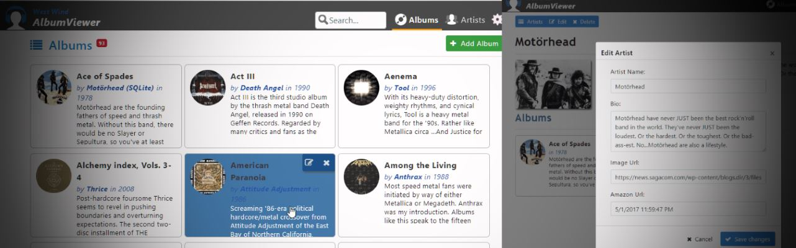
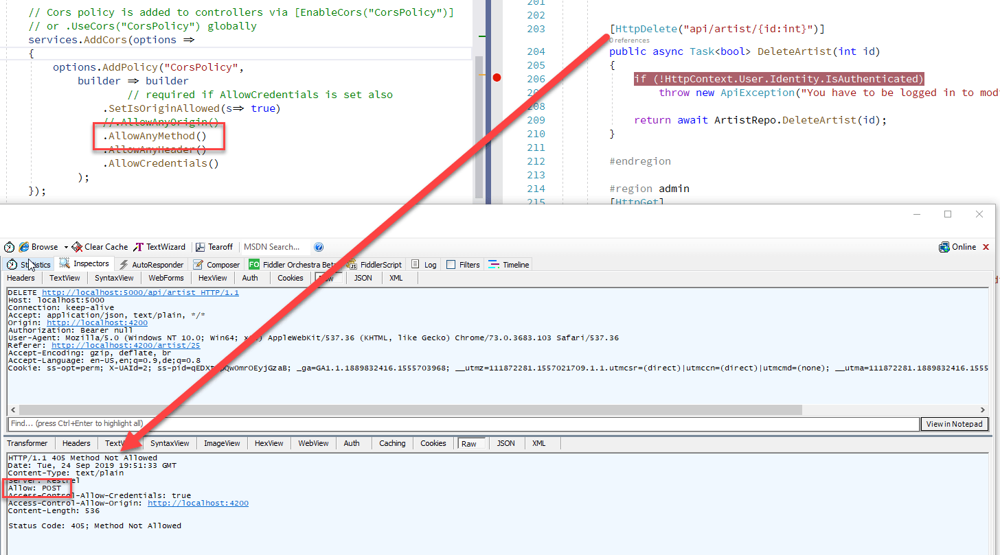
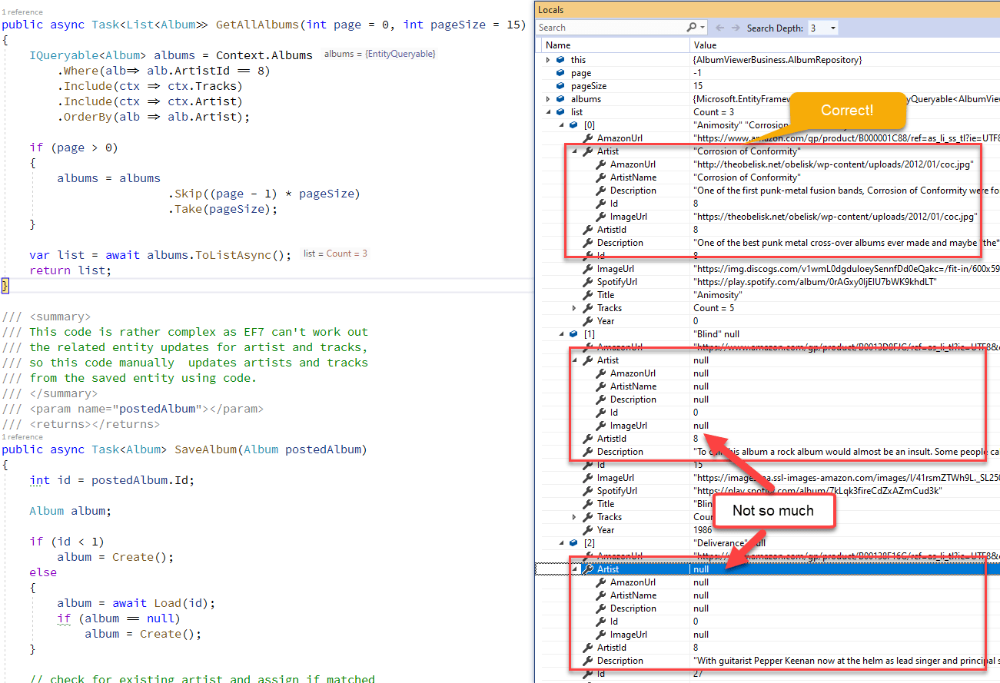

# Upgrading my AlbumViewer Sample Application to ASP.NET Core 3.0



ASP.NET Core 3.0 shipped yesterdaym and it's a big release with many new features and a huge batch of performance updates. Although this is a major release that touches a lot of the existing framework code, a lot of the big changes happen under the covers. For the most part this is an incremental update and doesn't require monumental changes to upgrade. Some changes are required to be sure - mainly in the `Startup` class configuration - but considering the feature changes and enhancements they are pretty tame.

To give an idea of what's involved in updating an application - even if a very small one -  I'll describe the steps I went through to upgrade my AlbumViewer Angular ASP.NET Core application from .NET Core 2.2 to 3.0 as I've done for most of the previous major releases.

To give you an idea, here's the application:


You can find the source code at:

* [AlbumViewer ASP.NET Core/Angular Sample on GitHub](https://github.com/RickStrahl/AlbumViewerVNext)
* [Online Demo](https://albumviewer.west-wind.com)


## Upgrading .NET Core/ASP.NET Core Versions
Every time an update rolls around there are things that change and it's not immediately obvious what has to be changed. But the good news is that most of the changes are isolated and related to how the application is configured.

Most of the changes in these updates have to do with Startup configuration changes. To help with this, the first thing I do when updating to a new version is to create a separate, new project to use as a template to see how the base application features **are supposed to be configured** and then match those changes into my existing project. Since this is an ASP.NET Core backend for an Angular application, I use the stock API template as a starting point - pick whatever most closely matches your current application. 

Then it's time to compare what the new template generates and what your code does. If you're doing this from scratch be prepared to do a little research on the changed options as often not only does the syntax change, but also the behavior (as you'll see later).

## .NET Core First Impressions
There's tons of new stuff in .NET Core 3.0, but the really good news is that most of the new features really are behind the scenes so they don't require massive reworking of existing applications. To be honest in the 3 applications I've done this with to date, the vast majority of changes need to be applied in the configuration of the application, and almost none inside of my own actual application code. Other than a few interface type name changes that can ripple through an application, actual application changes are minimal which means the changes are really isolated in the configuration portion of each application.

The second thing that is very noticable is that performance of .NET Core 3.0 applications seems to be drastically improved. Startup speed feels dramatically faster, as does the build tooling. It seems that the build tooling is much better at taking advantage of incrmental builds so full builds of the entire project are much rarer.

I tend to run projects with `dotnet watch run` from the command line and the auto-restarts now seem considerably quicker than in 2.x. 

## .NET Core 3.0 Updates
Ok, so now let's take a look through a few of the changes I had to make to the AlbumViewer application in order to make it work with .NET Core 3.0. All of these are configuration changes that are essentially isolated to `Startup.cs`, which is a testament to the nice organization of configurability in ASP.NET Core. While configuration can become quite complex in large projects, at least it's easy to find where you need to look for the configuration options.

### EndPoint Routing
One of the new features of ASP.NET Core that was already introduced in 2.2 and has been moved front and center in 3.0 is **[EndPoint Routing](https://docs.microsoft.com/en-us/aspnet/core/fundamentals/routing?view=aspnetcore-3.0)**.

This new routing mechanism is global to the ASP.NET hosting infrastructure, rather than directly tied to the ASP.NET MVC framework as it was before. Previously routing was closely tied to MVC controllers, whereas now routing is managed at the host endpoint level.

This addresses a number of common use cases that makes it now possible to access routes as part of the middleware pipeline without having to use MVC specific mechanisms to access routing info. This was very difficult previously, but with EndPoint routing route data is now available as part of the pipeline.

In addition the same top level routing mechanism is used for MVC, SignalR and gRPC and any other framework that requires routing. The all can take advantage of this functionality without having to create their own framework specific routing semantics.

That's a nice enhancement, but it requires a few changes in the way routing and MVC is set up in the application.

In `ConfigureServices()` and the old code I explicitly used `AddMvc()` to set up MVC controller handling as well as configuring JSON API options:

**old code**

```csharp
services
    .AddMvc(options =>
    {
        // options.Filters.Add(new ApiExceptionFilter());
    })
    .SetCompatibilityVersion(Microsoft.AspNetCore.Mvc.CompatibilityVersion.Version_2_2)
    .AddJsonOptions(opt =>
    {
        var resolver = opt.SerializerSettings.ContractResolver;
        if (resolver != null)
        {
	        var res = resolver as DefaultContractResolver;
	        res.NamingStrategy = null;
        }

        if (HostingEnvironment.IsDevelopment())
            opt.SerializerSettings.Formatting = Newtonsoft.Json.Formatting.Indented;
    });
```

The updated version uses `AddControllers()`:

**new code**

```csharp
services.AddControllers()
     // Use classic JSON 
     .AddNewtonsoftJson(opt =>
     {
         var resolver = opt.SerializerSettings.ContractResolver;
         if (resolver != null)
         {
             var res = resolver as DefaultContractResolver;
             res.NamingStrategy = null;
         }

         if (HostingEnvironment.IsDevelopment())
             opt.SerializerSettings.Formatting = Newtonsoft.Json.Formatting.Indented;
     });
```

In `Configure()` method then the hookup for using MVC and Controllers has also changed. Rather than specifying:

**old code**

```cs
app.UseMvcWithDefaultRoute();
```
you now have to add `UseRouting()` - which is the endpoint routing feature - plus you set up an endpoint for the MVC application:

**new code**

```csharp
app.UseRouting();

// authentication / CORS have to follow .UseRouting! but before endpoints

app.UseEndpoints(endpoints =>
{
    endpoints.MapControllers();
});
```

### Gotcha: Order Matters!
This new routing configuration is a little more finicky and [I ran into a big Gotcha](https://github.com/aspnet/AspNetCore/issues/14049) here with Authentication due to the order of the middleware components where Authentication/Authorization was not working if the order is not correct.

Very specifically it's important that `UseRouting()` is applied **before** you apply behavior that relies on routing such as authentication or authorization that is tied to specific routes on a controller or other endpoint.

The proper order for Routing, Auth/CORS and Endpoint mapping is:

```csharp
// First
app.UseRouting();

app.UseCors("CorsPolicy");

app.UseAuthentication();
app.UseAuthorization();

app.UseStatusCodePages();
app.UseDefaultFiles(); 
app.UseStaticFiles();

// put last so header configs like CORS or Cookies etc can fire
app.UseEndpoints(endpoints =>
{
  endpoints.MapControllers();
});
```

## JSON Changes
As you can see in the code above JSON configuration is also changing. The JSON configuration used above is for controller `JsonResult` returns.

ASP.NET Core 3.0 by default now uses a new set of [high peroformance, built-in JSON parsing support classes](https://docs.microsoft.com/en-us/dotnet/api/system.text.json?view=netcore-3.0) including a new JSON parser and serializer that is higher performance and less featured than the old JSON.NET parser. Microsoft decided that such a core component should be part of the core framework rather than requiring a separate library that has to be added to each project.

The new parser is very fast and memory efficient as it is built from scratch using the new low level memory features like `Span<T>` and `Memory<T>` to take maximum advantage of these new features at the framework level.

If you're using basic JSON results and always receive return strongly typed results then the new Json parser features work great and give you an extra performance boost. 

However, if you also return things like dynamic data, anonymous types or using the LINQ to JSON features for JSON.NET in the past, then you likely have to stick with the JSON.NET parser. I for one frequently return anonymous objects to clients in order to combine multiple resultsets into a single result object and for that I need to use the old JSON parser.

To do this you have to add an extra assembly now, as JSON.NET is no longer included in the framework dependency list by default:

```xml
<PackageReference Include="Microsoft.AspNetCore.Mvc.NewtonsoftJson" Version="3.0.0" />
```

And then explicitly configure it as part of the `AddControllers()` definition:

```csharp
services.AddControllers()
    // Use classic JSON 
    .AddNewtonsoftJson(opt =>
    {
        var resolver = opt.SerializerSettings.ContractResolver;
        if (resolver != null)
        {
            var res = resolver as DefaultContractResolver;
            res.NamingStrategy = null;
        }

        if (HostingEnvironment.IsDevelopment())
            opt.SerializerSettings.Formatting = Newtonsoft.Json.Formatting.Indented;
    });
```

Note the additional configuration is optional, but in this particular application I needed to make sure I use PascalCase naming (the default had changed in .NET Core 2.0 to camelCase) in order to keep the original application's JSON client naming requirement intact. The default for .NET Core 2.x and later has been to use `CamelCase` and the code above removes the CamelCase contract resolver that's used by default.

Similar options are available for the new JSON parser, but the configuration syntax is somewhat different.

## CORS Changes
I also ran into issues with CORS - specifically in HTTP `DELETE` requests, not working. In the AlbumViewer when I delete an Artist I get this HTTP response:



Even though `AllowAnyMethod()` is set on the CORS configuration it looks like `DELETE` is not working.

After a bit of experimenting (and remembering something similar with `AllowAnyOrigin()` in 2.2) I had to explicited specify the supported methods using `WithMethods()`:


```csharp
services.AddCors(options =>
{
    options.AddPolicy("CorsPolicy",
        builder => builder
            //.AllowAnyOrigin() // doesn't work
            .SetIsOriginAllowed(s=> true)
            //.AllowAnyMethod()  // doesn't work for DELETE!
            .WithMethods("GET","POST","DELETE","OPTIONS","PUT")
            .AllowAnyHeader()
            .AllowCredentials()
        );
});
```

And that works.

It would be nice if `AllowAnyOrigin()` and `AllowAnyMethod()` don't support **any** Origin and **any** Method, they should be obsoleted or at the very least there should be some information in the help text to specify how it doesn't work - neither of those worked as what their naming advertises.

It also looks like you're supposed to configure CORS slightly different in 3.0.

In 2.2 I used the above Policy definition in `ConfigureServices()` and then apply the policy globally.

**old**

```cs
 app.UseCors("CorsPolicy");
```

In 3.0 it looks like you're supposed to explicitly attach the policy to an endpoint.  You still need to specify `app.UseCors()` (without a policy just to enable it), and then add it to the controller mapping:

**new (but doesn't work!)

```cs
app.UseCors()

...

app.UseEndpoints(endpoints =>
{
    endpoints.MapControllers()
        .RequireCors("CorsPolicy");  
});
```

However I had no luck getting that to work. Using the above combination netted me no CORS headers when accessing the app from a cross-domain (Angular Dev Server) site.

I had to go back to the original `app.UseCors("CorsPolicy")` to get CORS work...

This is a bit frustrating. The CORS documentation is very complex mainly because there are a number of combinations, and the fact that there seems to be some duplication and non-functionality of features seems odd.,

## IHostingEnvironment to IWebHostEnvironment
Another minor change due to the endpoint routing changes is that the Startup class now by default injects an `IWebHostEnvironment` instead of a more generic `IHostEnvironment`. The naming reflects Web specific features as well as some new functionality that's more specific to Web applications.

The change is basically a search and replace for `IHostingEnvironment` to `IWebHostingEnvironment`. This affects the startup class and any other places where you might be injecting the hosting environment. In my AlbumViewer I use the Hosting Environment to extract some status information about the application to be displayed in the about page as well as finding the Content and Web roots for the application for reading the intial album data file for import.

## Entity Framework 3.0 Fail
The final migration bits are related to Entity Framework and here I ran into some serious issues that I couldn't resolve. In fact I ended up going back to EF Core 2.2 because EF Core 3.0 just didn't work correctly with the data I was working with even for a really simple use case.

The very specific scenario that was giving me trouble had to do with a simple list query that returns Albums and artists as a list of nested objects. Specifically in .NET Core 3.0 the list would fail to return the Artist record for any album where there are multiple albums for an Artist. First albumn for the artist shows, any subsequent Artist for albums by the same artist would return empty objects.



This is a pretty basic query over data:

```cs
public async Task<List<Album>> GetAllAlbums(int page = 0, int pageSize = 15)
{
    IQueryable<Album> albums = Context.Albums
        .Include(ctx => ctx.Tracks)
        .Include(ctx => ctx.Artist)
        .OrderBy(alb => alb.Title);

    if (page > 0)
    {
        albums = albums
                        .Skip((page - 1) * pageSize)
                        .Take(pageSize);
    }

    return await albums.ToListAsync();
}
```

Yet it fails. I couldn't find a workaround and [an issue on GitHub is pending for this](https://github.com/aspnet/EntityFrameworkCore/issues/18007).

There were also changes in the way that child entities are handled in one to many relationships - whereas in previous versions you didn't have to explicitly have to  `Context.Add()` new or `Context.Update()` existing entities when you added them to a loaded parent object, you now **always** have to explicit add, update and remove entities. This is perhaps more consistent as there can be scenarios where your entity may not be loaded from the DB and so adding wouldn't do anything, but still this is a breaking change that is likely to affect a lot of people because it worked previously. In my scenario I didn't have any places where this was an issue but in several other applications I did.


### Roll back to Entity Framework 2.2
The first problem above though was a show stopper for me. I couldn't get past that issue, so I ended up rolling back to EF Core 2.2 which just worked  without the former error.

The good news is that EF Core 2.2.6 works just fine in .NET Core 3.0 applications - I didn't see any side effects due to old dependencies and existing functionality worked just fine with the 2.2.6 libraries. For now and for me at least I can't justify dealing with the issues in EF Core 3.0.

This is obvious not idea, but until EF Core 3.0 can iron out some of these issues using 2.2 is the only way I can move forward for the moment.

### EF Core Problems Continue
It's disheartening to see where EF Core is headed. This and previous releases removed features, changed a number of core behaviors, and apparently has a number of show stopper issues that as far as I can tell don't have a workaround.

Database applications are at the core of the vast majority of applications that are built, and having a solid data stack is a vital component of any application stack. EF Core seems barely able to fill that role. While there are better alternatives, they are not an easy sell with many customers due to the perception that EF comes from Microsoft and so that has to be the good enough solution. Only it shouldn't be the *good enough* data solution, it should be as kick ass as the rest of the .NET stack.

I realize that it's difficult to build a reliable, consistent and performant data access layer/platform and that it takes time to get that right. But at the same time the EF Core team has had a **lot of time** and 3 major versions (with several major sub-versions) to build out a mature and reliable platform. Instead EF Core still feels like a V1 product with all the inherent inconsistencies and behavior and API changes.

## Summary
Overall the upgrade process for ASP.NET Core 3.0 was pretty painless. The bulk of it - sans the debugging of the EF Core data issue and the CORS config issue - took around 20 minutes. The data issue took a while to track down and then some additional time going back to EF Core 2.2 and re-testing. But even so the process is relatively minor as there are just a few places that need to be updated.

At the end of the day make sure you double check each of the Startup class configuration section for things like Authentication, CORS, Routing, Logging and see if the syntax or behavior has changed.
  
Once that's done the rest is very likely to just work. And be noticably faster.

<div style="margin-top: 30px;font-size: 0.8em;
            border-top: 1px solid #eee;padding-top: 8px;">
    
    this post created and published with 
    <a href="https://markdownmonster.west-wind.com" 
       target="top">Markdown Monster</a> 
</div>