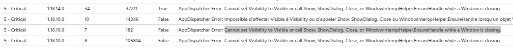
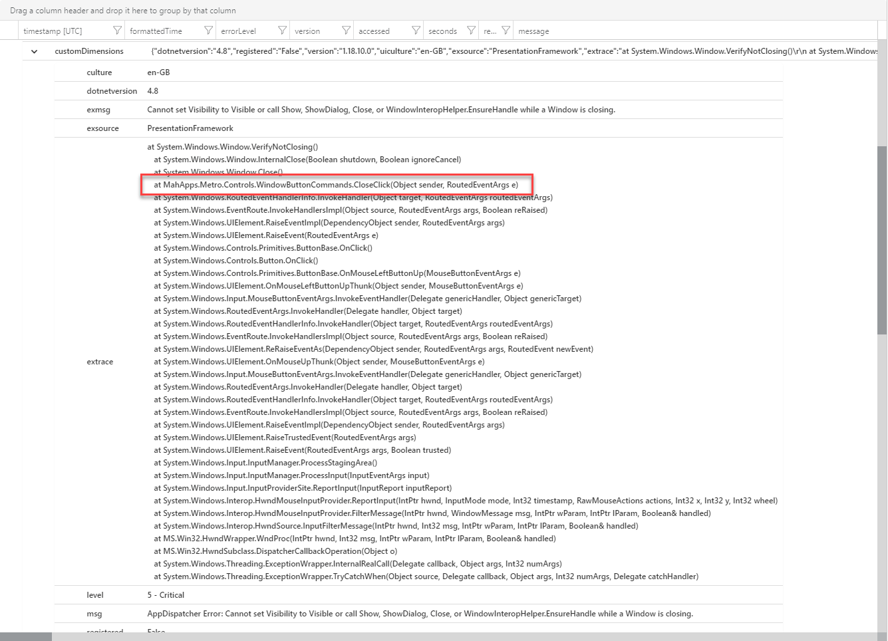
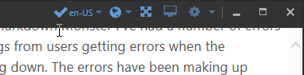

# WPF Window Closing Errors


For quite a while in Markdown Monster I've had a number of errors showing up in my logs from users getting errors when the application is shutting down. The errors have been making up around 80% of my critical log errors to the tune of 2-3 errors every other day or so.  It's not enough to be too concerned since it's a tiny fraction of actual uses, but it is annoying in that these requests are clogging up the logs. 

More importantly though I've not been able to reproduce the problem reliably myself - I can see the errors, and even got an occasional bug report with steps, but I was unable to reproduce those steps and see the failure myself.  Don't you just love bugs like that? 

## WPF Closing Error
The error specifically is this one:



> Cannot set Visibility to Visible or call Show, ShowDialog, Close, or WindowInteropHelper.EnsureHandle while a Window is closing.

When I drill into the stack trace of the captured error I can see the following:



Most of this is deep inside the WPF stack, except for the outlined block which is in [MahApps Metro](https://mahapps.com/) which is the UI framework I use. MahApps intercepts the default close button management as it custom draws the window to provide custom window styling for themed windows and custom control boxes which I use in Markdown Monster:



My first inclination was to put the blame for these close errors on MahApps since after all the problem points straight at the MahApps close handler. But after doing some searches for this issue I quickly realized that this is a more generic WPF issue. I still ended up posting [a Github issue in the MahApps repo](https://github.com/MahApps/MahApps.Metro/issues/3535) which started a great discussion on what might be causing the problem. Thanks to [@batzendev](https://twitter.com/batzendev) who pointed me in the right direction of the solution(s) I talk about here. 

## What's the problem?
WPF is not happy if you close a window, while a window is already closing. That sounds silly, and while in normal operation this likely doesn't happen, there are certain circumstances where multiple nested close operations can occur.

In async code you may run into timing issues where multiple clicks on the close button may create multiple `.Close()` calls on a form, or you may have a prompts that fire as part of the `OnClosing()` event that cause the form to be held open and then 're-closed'. Another scenario that can cause problems is if a fatal error occurs in the application that causes the form to be closed non-interactively and then an explicit close operation is later applied by the application. Most of these issues come down to timing which is why it's such a pain to duplicate the error.

## Avoiding double Closing
The simplest failure scenario that I was actually able to duplicate was:

* Double click the Close button
* Have  a document with changes
* Which causes a dialog to prompt for saving

The second click hits the already running `Close()` event that's now held up running by open dialog and **Bamm!**, it breaks.

A very simple solution to the double click problem is to not allow closing if already closing:

```cs
bool IsClosing = false;

protected override void OnClosing(CancelEventArgs e)
{
    if (IsClosing)
        return;

    IsClosing = true;
  
   .. 
   
   // Code that might hold things open
   if (!CloseAllTabs())   // Save dialog may happen here
   {
        // tab closing was cancelled
        e.Cancel = true;
        
        // this allows closing again
        IsClosing = false;
        return;
   }   
   
   ...
}
```

This was my initial fix and while it worked to bring down the error counts, it didn't eliminate them entirely, because it didn't address the second scenario caused by a crash shutdown. This scenario displays a dialog but in this case outside of the `Close()` handler.

## Deferring Close() Handler Logic
In the MahApps Github issue @batzendev provided the solution, but initially I figured this would be difficult to manage deferring operations because of the potential to abort shutdown. But after I continued to see errors with the simple solution above, I realized this had to be fixed properly using deferred execution as @batzendev suggested..

The idea is that **the Close() handler shouldn't execute any code directly** but always defer operation. To make this work the handler by default shouldn't close the form, **unless an explicit flag is set to force it to be closed**. IOW, the application has to be in charge of when to actually shut down the window rather than `OnClosing()` on its own. As a result anything that fires `OnClosing()` is initially deferred, until the closing logic decides that the form should indeed be closed. 

This allows for the closing abort scenarios such as when there are open, unsaved documents and the user decides to Cancel and keep the app open. In that case, the `ForceClose` flag is left unset and the method returns, leaving the form open. Otherwise, the flag is set and the `Close()` method is called again with the `ForceClose` flag set which causes the form to immediately close. 

This frees WPF from having to potentially fight with multiple close operations because the actual `OnClosing()` code has been distilled down to a very quick binary operation.

Luckily WPF makes deferring operations pretty easy to implement using a Dispatcher and Async invocation. The only other thing needed is the logic to flag the shutdown operation via a `ForceClose` flag.

Here's what that code looks like:

```cs
bool ForceClose = false;

protected override void OnClosing(CancelEventArgs e)
{
    // force method to abort - we'll force a close explicitly
    e.Cancel = true;

    if (ForceClose)
    { 
        // cleanup code already ran - shut down
        e.Cancel = false;
        return;
    }

    // execute shutdown logic - Call CloseForced() to actually close window
    Dispatcher.InvokeAsync(ShutdownApplication, DispatcherPriority.Normal);
}

public void CloseForced()
{
    ForceClose = true;
    Close();
}

// Application specific window shutdown
private void ShutdownApplication()
{
    try
    {
        // have to do this here to capture open windows etc. in SaveSettings()
        mmApp.Configuration.ApplicationUpdates.AccessCount++;      
        SaveSettings();

        if (!CloseAllTabs())
        {
            // tab closing was cancelled - no forced close
            mmApp.Configuration.ApplicationUpdates.AccessCount--;
            return;
        }

        PipeManager?.StopServer();

        AddinManager.Current.RaiseOnApplicationShutdown();
        AddinManager.Current.UnloadAddins();
        
        App.Mutex?.Dispose();
        mmApp.Shutdown();

        // explicitly force the window to close
        CloseForced();
    }
    catch(Exception ex)
    {
        mmApp.Log("Shutdown: " + ex.Message, ex, logLevel: LogLevels.Error);
        CloseForced();
    }
}
```

The key here is that any call to `OnClosing()` **immediately returns** with the Window not left in a closing state **except when the ForceClose flag is set to `true`**. When starting the shutdown logic, the code just calls an async dispatcher, but leaves the closing state unset. This means the code keeps running while the actual closing processing is handled in the separate operation that fires on the Dispatcher. 

If `OnClosing()` is actually going to close, the closing logic then explicitly call the `CloseForced()` method to  explicitly close the form. The code boils down to this:

```cs
if (PotentialUiHoldUp())
{
    // just exit - No close state set
    return;
}

// Force the window to be closed
CloseForced();
```

This solution is hacky, but it seems to work well. Initially I thought it was going to be difficult to handle the out of band logic of prompting for confirmation on open documents but due to the easy way you can use Dispatchers that really isn't an issue - you can just throw those operations onto an out of band dispatcher operation and it just works. Nice.

## Proof's in the Pudding
The change has been running in Markdown Monster for a couple of weeks now and and since implementation the errors in the logs have disappeared for the new versions. Big improvement and a much cleaner log although I see plenty of the errors from previous versions but that will rollof soon.

## Summary
This is an edge case error and workaround, but it's common enough based on the number of questions I've seen in regards to this error message while tracking this down. The solution is pretty simple once you understand the problem and how to offload the `OnClosing()` logic via out of band operation on a Dispatcher.

<div style="margin-top: 30px;font-size: 0.8em;
            border-top: 1px solid #eee;padding-top: 8px;">
    
    this post created and published with 
    <a href="https://markdownmonster.west-wind.com" 
       target="top">Markdown Monster</a> 
</div>