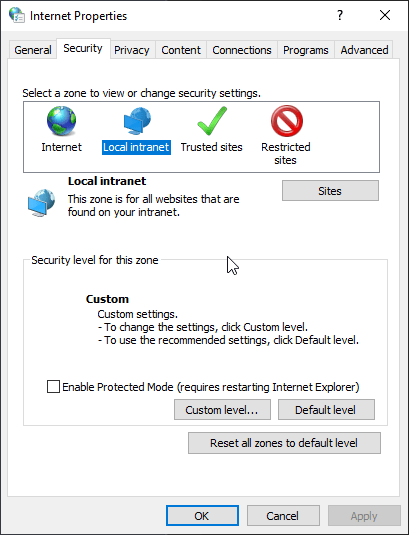
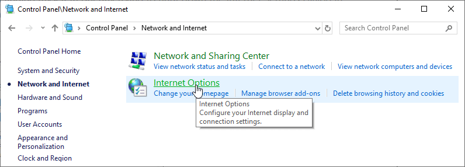
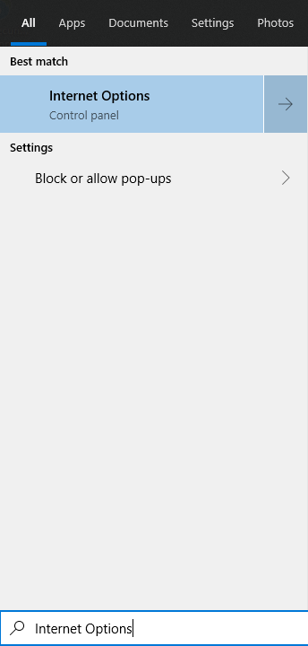

# Open Internet Settings on Windows

I've been recently working on an application that works with Windows Authentication and Active Directory and I'm finding myself frequently trying to hunt down the Internet Settings Dialog in Windows. You know the one that typically was opened through Internet Explorer:



It's getting increasingly more difficult to get to this dialog, because the new Windows Networking dialogs don't appear to link to it from anywhere anymore. The only interactive way to get there is through another application that brings up that dialog.  Internet Exploder's settings get you there, or Chrome -> Settings -> Proxy Settings for example, but it's a pain to bring up these apps and then navigate the menus to bring up the dialog.

You can still find it in the old Control Panel settings. To do this type **Control Panel** into the Windows Search box, then go to **Networking** where you find Internet Options:



## Directly open the Control Panel Applet
Luckily there's a much quicker way to get there. 

First you can just type **Internet Options** into the search box and that takes you there directly:



You can also directly go there from the command line or the Windows Run box with:

```ps
control /name Microsoft.InternetOptions
```

and if you really need this frequently you can create a shortcut for it.

I'm leaving this here so I may find it in the future again after I've forgotten exactly what to search for or which control panel applet to load so I don't have to fire up Internet Explorer and use it's settings option to get there :-)

<div style="margin-top: 30px;font-size: 0.8em;
            border-top: 1px solid #eee;padding-top: 8px;">
    
    this post created and published with 
    <a href="https://markdownmonster.west-wind.com" 
       target="top">Markdown Monster</a> 
</div>