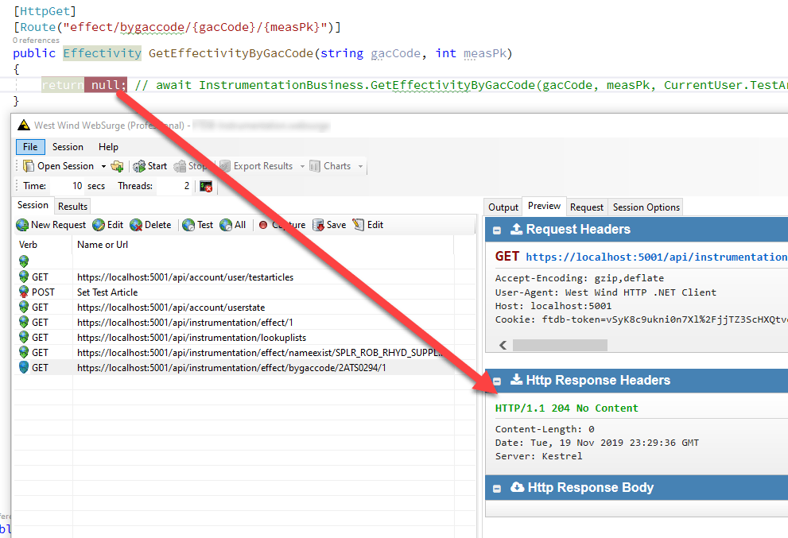

# ASP.NET Core API Null Results return 204 No Content

I guess I missed the memo on this, as I was told that this has been the stock behavior in ASP.NET core, but in Core APIs if you return a null value from an API method the Controller's API response will be `204 - No content`, instead of what I expected to be a `null` JSON response:



While perhaps semantically correct, this actually can cause a few problems with client applications that are expecting JSON results.

In my view, `null` not the same as No Content. Null is a very specific response that says that this response should return an object but didn't have one to give you back as a valid response. The only time I would use a `204` response is when my entire response doesn't return anything at all.

The difference is subtle semantically, but for client applications a 204 response might be problematic because an empty response is **not** a JSON response. If the client is expecting JSON he may or may not get that and JSON parsing might fail.

And indeed this bites me in the current Angular application I'm working on. When receiving a JSON response from an HTTP request, Angular's HttpClient throws an error for the 204 response, where the null response works:

```ts
this.parameterService
    .getParameterCode(this.activeEffect.measurement.code)
    .subscribe(
        effect => {
            if (effect) {
                this.activeEffect = effect;
                this.oldGacCode = effect.measurement.gacCode;
                this.toastr.success("Parameter loaded from new GacCode");
            }
        },
        error => {
            if (error.response.status !== 204)  // no content
            {
                this.toastr.error('Failed to load parameter: ' + error.message);
            }
        }
    );
```    

When this code runs and returns a valid null response, Asp.net turns this into a 204 response, and sure enough that triggers Angular's error response because I have a parameter I'm expecting and an empty response shouldn't have one.