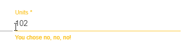

# Creating Angular Sync and Async Validators for Template Validation


This isn't a new topic, but I've had a hard time to find consolidated information on Validators for the scenario I describe here so I decided to write this down. Although not complicated, it took me **way too much time** to hunt down all the information to make Async validators work, and I hope this post makes that process a little easier. I'm writing this, while using the current version which is Angular 8.

Angular provides a bunch of validation features and validators out of the box for the built-in HTML validations. So things like `required`, `min-width` and `max-width` and a generic RegEx validator just work without creating any custom validators. 

But if you're building any type of reasonably complex application you're likely to require custom validations that require firing of custom business logic and at that point you'll have to dig in and create custom validators. If that business logic happens to live in data that's only on the server you will need to call an async validator which is just a little different.

The process for creating custom validators is:

* Create a class derived from [Validator](https://angular.io/api/forms/Validator) or [AsyncValidator](https://angular.io/api/forms/AsyncValidator)
* Implement the `validate()` method
* Return `null` for valid, or an `ValidationErrors` object for invalid
* Async Validators return an `Observable<ValidationErrors>` instead
* Add the class to Module Declarations
* Add the class to the component Provider list

To use it then:

* Create declarative Validator(s) on HTML Template controls
* Add error blocks for validation errors

Synchronous and asynchronous Validators are very similar - the main difference is that a sync Validator returns an error object instance directly, while the async version returns an Observable of the the same object. The most common use case for async Validators is doing a server validation via an HTTP Callback. I'll look at creating the sync version first, then modify for simulated async, and then finish off with an example `AsyncValidator` that makes an HTTP call to a server to validate some server side business logic.

Note, I prefer to use **declarative validation** with validators applied in the HTML template, so that's what I'll talk about here. But all of this also works with Reactive Forms where you can just provide the validator directly to the FormControl creation process.

## Sync Validatators First
Let's create a very simple validator - a YesNoValidator. The validator takes an optional input value which is an attribute assignment of `yes` or `no`:

```html
<input name="Name" yesNoValidator="no" />
```

If the key item in the above is the `yesNoValidator="yes"` on the `<input>` element no error is shown as the validation is valid. `yesNoValidator="no"` should display an error message. Note that validators don't require a value so you could have a validator like:

```html
<input name="Name" yesNoValidator />
```

and that would still work. But if you do need to pass a value to the to the validator you can access it via the passed in `control.value` property. It's more typical to not have explicit values as in the latter example.

> #### @icon-info-circle Validator Naming Conventions
> The docs show validator selector names without a `Validator` postfix as I do here. I find that problematic because in a lot of cases it's not very obvious that the attribute is a validator. `yesNo` as an attribute is pretty ambiguous and to me at least `yesNoValidator` is not, so I'm leaving the `Validator` on in my selectors unless the name is obviously for validation.

### Create the Validator Class
Lets start with the sync implementation by deriving a class from `Validator` and implementing the `validate()` method:

```typescript
import {
    AbstractControl,
   NG_VALIDATORS,
    ValidationErrors, Validator
} from '@angular/forms';
import {Directive} from '@angular/core';

@Directive({
    selector: '[yesNoValidator][ngModel],[yesNoValidator][FormControl]',
    providers: [
        {provide: NG_VALIDATORS, useExisting: YesNoValidator, multi: true}
    ]
})
export class YesNoValidator implements Validator {

    constructor() {
    }

    validate(control: AbstractControl): ValidationErrors | null {
        const val = control.value;

        console.log("yesno validator: ",val);
        if (!val || val.toLowerCase() === 'yes') {
            return null;
        }
        return {yesNoValidator: 'You chose no, no, no!'};
    }
}
```

### Register the Validator as a Validator and Provider
Make sure you provide the Validator to Angular's validator provider list in the class header using `NG_VALIDATIONS` in the provider list:

```typescript
providers: [
    {provide: NG_VALIDATORS, useExisting: YesNoValidator, multi: true}
]
```

If you're building an async Validator use `NG_ASYNC_VALIDATIONS`. This is an **easy thing to miss** if you're converting a Validator from sync to Async so heads up!

### Register the Validator Declaration in the Module
Finally, register the Validator with a module (or root module) where it's to be used:

```ts
@NgModule({
  declarations: [
      ...
      YesNoValidator
  ],
```  

### Use it in the Template
Then to actually use it in an HTML Template:

```html
<mat-form-field>

    <input matInput name="units" 
           [(ngModel)]="activeEffect.measurement.units"
           yesNoValidator="yes" required>

    <mat-error *ngIf="form1.controls['units']?.errors?.required">
        Units is required.
    </mat-error>
    <mat-error *ngIf="form1.controls['units']?.errors?.yesNoValidator">
        {{ form1.controls['units']?.errors?.yesNoValidator }}
    </mat-error>

</mat-form-field>
```            

If I run this now and use `no` as the value I get:



If I run it with `yes` no error shows.

### The `validate()` method

The `validate(control:abstractControl): ValidationErrors|null` implementation of a Validator works by returning `null` if the validation is valid (no error), or returning a `ValidationErrors` object that contains an error key/value. 

The error value can be something that's simply a single true/false value, which is what some of the built-in Validators do For example `required` returns:

```ts
{ required:  true; }
```

I find it more useful to return an error message, so in the above `yesNoValidator` I return:

```ts
{ yesNoValidator: "You said, no, no, no." }
```

You can make this more complex as well to return an object:

```ts
{ 
    yesNoValidator: {
        isValid: false,
        message: "You said, no, no, no." 
    }
}    
```

IOW, it's up to you what to return, and what is then exposed to your error display logic in the template.

This object is then available on the `form1.controls['name']?.errors?.yesNoValidator?.message` property and you can then decide how to work with the values. I recommend keeping it simple and personally I like to use strings.

In a nutshell, for errors return an object with a single property and value that can produce a thruthy expression (which is just about anything).

### Displaying Errors on a Declarative Form
Errors can be displayed based on the error status of a control. You can reference a Form Control and its `.errors` property to determine whether the are any errors. By convention it's something like:

```ts
form1.controls['name']?.errors?.yesNoValidator
```

and you can bind that or use it as an expression.

Note the `?` for null handling, which you'll want to add since you otherwise end up with potential binding errors due to the missing errors object when there are no errors yet.

To put this into form error handling you can now use this with the simple string value:

```html
<mat-error *ngIf="form1.controls['units']?.errors?.required">
    Units is required.
</mat-error>
<mat-error *ngIf="form1.controls['units']?.errors?.yesNoValidator">
    <!-- I use an error string for the validator result value -->
    {{ form1.controls['units']?.errors?.yesNoValidator }}
</mat-error>
```

And that works just fine! Make sure to use the nullable values (?s) to ensure there are no binding errors before there are errors or before the form has rendered.

If static values work for the messages, by all means use a static string in the UI. If the error message is dynamic and generated as part of the validator, it's nice to embed the customized message like yesNoValidator example.

Note that I'm using Angular Material which automatically detects validator errors and automatically fixes up the UI and styling. It actually displays errors without any conditional `*ngIf` expressions.

With plain HTML you have to use something `<div *ngIf='...'` to trigger rendering of errors explicitly. For Angular Material, the `*ngIf` expressions are necessary only if you have multiple validators and you want to selectively display one or the other.

## Async Validators
The good news is that if you need an Async validator, the process is pretty much the same. The main difference is that you will be returning an `Observable<ValidationErrors>` rather than a the object directly and setting a couple of configuration strings differently.

### Updated Async Validator
Since we've already seen the majority of the code that is required for a validator and that is also used from an AsyncValidator here's the `AsyncValidator` implementation:

```typescript
import {
    AbstractControl, AsyncValidator,
    NG_ASYNC_VALIDATORS,
    ValidationErrors, Validator
} from '@angular/forms';
import {Directive} from '@angular/core';
import {Observable, of} from 'rxjs';


@Directive({
    selector: '[yesNoValidator][ngModel],[yesNoValidator][FormControl]',
    providers: [
        {provide: NG_ASYNC_VALIDATORS, useExisting: YesNoValidator, multi: true}
    ]
})
export class YesNoValidator implements AsyncValidator {

    constructor() {}

    validate(control: AbstractControl): Observable<ValidationErrors | null> {
        // turn into an observable
        return of( this._validateInternal(control));
    }

    _validateInternal(control: AbstractControl):ValidationErrors | null {
        const val = control.value;

        console.log('yesno async validator: ',val);
        if (!val || val.toLowerCase() === 'yes') {
            return null;
        }

        return {yesNoValidator: 'You chose no, no, no!'};
    }
}
```

I moved the old validation function into an private function to call, and then simply used the `of` rxJs operator to turn that result `ValidationErrors` value into an Observable. This is super contrived since there's nothing async happening here, but it demonstrates the async setup in the most minimal fashion possible.

### Key Changes
The key code changes are:

* Derive from `AsyncValidator` rather than `Validator`:  
    ```ts
    export class YesNoValidator implements AsyncValidator
    ```
* Return an Observable instead of a concrete value:  
    ```ts
    validate(control: AbstractControl): Observable<ValidationErrors|null> {
        // turn into an observable
        return of( this._validateInternal(control));
    }
    ```
* Make sure to add to `NG_ASYNC_VALIDATORS` providers instead of `NG_VALIDATORS`:  
    ```ts
    providers: [
        {provide: NG_ASYNC_VALIDATORS, useExisting: YesNoValidator, multi: true}
    ]
    ```

There are no implementation changes in the HTML template - the same exact syntax is used. The same `.errors` object is returned along with the validated values.

### A more practical Async Validation Example
The more common scenario for async Validations is to run some server side validation with an HTTP call.

Here's an example of an application level Validator that calls back to a server to determine whether an entered name already exists:

```ts
@Directive({
    selector: '[instrumentationNameValidator][ngModel],[instrumentationNameValidator][FormControl]',
    providers: [
        {provide: NG_ASYNC_VALIDATORS, useExisting: InstrumentationNameValidator, multi: true}
    ]
})
export class InstrumentationNameValidator implements AsyncValidator {

    constructor(private http: HttpClient,
                private config: AppConfiguration,
                private user: UserInfoService) {
    }

    validate(control: AbstractControl): Observable<ValidationErrors | null> {
        const url = this.config.urls.url('instrumentation-name-exist',
                                         control.value,
                                         this.user.userPk);
        const obs = this.http.get<boolean>(url)
            .pipe(
                map((isUsed) => {
                    // null no error, object for error
                    return !isUsed ? null : {
                        instrumentationNameValidator: 'Name exists already.'
                    };
                })
            );
        return obs;
    }
}
```

To use it:

```html
<mat-form-field class="third-width">
    <input matInput placeholder="Name"
           name="name"
           [(ngModel)]="measurement.name"
           instrumentationNameValidator required>
    <mat-error *ngIf="form1.controls['name']?.errors?.required">
        The name cannot be empty.
    </mat-error>
    <mat-error *ngIf="form1.controls['name']?.errors?.instrumentationNameValidator">
        {{form1.controls['name']?.errors?.instrumentationNameValidator}}
    </mat-error>
</mat-form-field>
```

Any keystroke in the field triggers the validate method which creates a delayed (debounced) server request to check against an API whether the name entered already exists. The service returns `true` or `false` and `map()` turns that into `null` for false (no errors) or a ValidationErrors object if the value is true (has errors). Same as in the sync sample, but wrapped into the Observable.

When not valid, it triggers the second `<mat-error>` block and that displays the error message generated by the validator:


Voila - an async Validator at work.


### Summary
There you have it. Validators are not complex to create, but it's a bit tedious to declare and hook them up so that Angular can find and use them. There are a few magic string combinations that can easily screw you up. Ask me how I know :-) - operator error opportunities abound here. I've written down the things that helped me and that put all the pieces in context, so I hope that this is useful for some of you as well. 

<div style="margin-top: 30px;font-size: 0.8em;
            border-top: 1px solid #eee;padding-top: 8px;">
    
    this post created and published with the 
    <a href="https://markdownmonster.west-wind.com" 
       target="top">Markdown Monster Editor</a> 
</div>