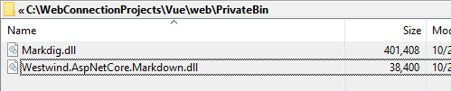

# Dynamically Loading Assemblies at Runtime in RazorPages


I've been working on some standalone tools that are generically serving static content as well as ASP.NET Core content **from an arbitrary folder**. With ASP.NET Core it's now possible using several different approaches to create standalone server applications that provide all sorts of utility with relative ease.

The tool I've built recently is a .NET based,  standalone local dev server with built-in Live Reload functionality and it's main purpose is to serve static content locally in a self-contained fashion.

If you're interested you can grab the [Dotnet Tool](https://www.nuget.org/packages/LiveReloadServer/) or a [Standalone Exe (zipped)](https://github.com/RickStrahl/Westwind.AspnetCore.LiveReload/blob/master/LiveReloadServer/LiveReloadWebServer.zip).

To install the Dotnet Tool (requires .NET Core 3.0 SDK):


```ps
dotnet tool install --global LiveReloadServer
```

Install from [Chocolatey](https://chocolatey.org/packages/LiveReloadWebServer) as a standalone EXE (no dependencies):

```ps
choco install LiveReloadWebServer
```

Once installed you can run:

```ps
# dotnet tool
LiveReloadServer --WebRoot c:\temp\mysite\web 

# chocolatey install or EXE
LiveReloadWebServer --WebRoot c:\temp\mysite\web 
```

Note the different names for the dotnet tool and the standalone EXE, so it's possible to run both side by side in case both are installed. For the remainder of this post I'll use `LiveReloadServer` but it replies to `LiveReloadWebServer` as well

There a few options for configuring the server, live reload, what to look for etc by using the `--help` command line switch.

Code for the LiveReload Middleware and generic Web Server can be found on GitHub:

[Westwind.AspNetCore.LiveReload](https://github.com/RickStrahl/Westwind.AspnetCore.LiveReload/tree/master/LiveReloadServer)

First a little background.

### Static Content First
My original goal for this generic server implementation was borne out of the frequent need to generically serve local HTTP content. I maintain several old JavaScript libraries as well as working on a number of locally maintained (static) documentation sites, plus several legacy tools that work with static content. For these a local Web Server with built-in Live Reload functionality is a incredibly useful and productive.

The goal originally was to simply support Static Content because that's the most common use case. The idea is that you simply start `LiveReloadServer` out of a folder with Web content and go or use the `--WebRoot <path>` command line to point at a different folder and you're up and running with a Live Reload Web Server.

There are other tools like [BrowserSync](https://www.browsersync.io/), but they are Node based. For me personally these node based tools have been pretty flakey. They work for a bit but eventually have to be restarted to keep reloading content or they slow down to the point of unusability. By building my own I can easily tweak the way it works and fix any issues as they come up. To top it off ASP.NET Core **makes this functionality relatively trivial to implement** and I can customize it for my exact needs.

For static content this has all been a no-brainer and it works beautifully.

### Limited Razor Pages Content
But I also got to thinking that it would be nice to support semi-dynamic content via Razor Pages in the referenced site. Razor Pages allow for self-contained `.cshtml` Razor pages on disk to be served including **dynamic content** via it's built-in support for **C# Razor syntax**.

Essentially you can create something like `hello.cshtml` and then serve that as `https://localhost:5200/hello`. The Razor page can then contain dynamic C# content.

Turns out it's very easy to route Razor pages to look for content in a non-install location:

```csharp
if (UseRazor)
{
    services.AddRazorPages(opt => { opt.RootDirectory = "/"; })
        .AddRazorRuntimeCompilation(
            opt =>
            {
                opt.FileProviders.Add(new PhysicalFileProvider(WebRoot));
            });
}
```
In order for this dynamic Web Server concept to work, the first thing needed is to add `.AddRazorRuntimeCompilation()` and adding the following Nuget Package:

```xml
<ItemGroup>
    <PackageReference Include="Microsoft.AspNetCore.Mvc.Razor.RuntimeCompilation" Version="3.0.0" />
</ItemGroup>
```

Runtime compilation in ASP.NET Core 3.0 is disabled by default, which means you're expected to pre-compile all your RazorPages (and MVC Views), so there is no runtime recompilation when changes are made. The goal is for much faster startup time and that works, at the cost of development time convenience (or runtime changes).

Once the above configuration has been added I can now easily create a Razor Page (hello.cshtml) somewhere in the target folder hierarchy and then add something like this:

```html
@page
<html>
<body>
<h1>Hello World</h1>

<p>Time is: @DateTime.Now.ToString("hh:mm:ss tt")</p>

<hr>

@{
    var client = new System.Net.WebClient();
    var xml = await client.DownloadStringTaskAsync("https://west-wind.com/files/MarkdownMonster_version.xml");
    var start = xml.IndexOf("<Version>") + 9;        
    var end = xml.LastIndexOf("</Version>");
    var version = xml.Substring(start, end - start);
}

<h3>Latest Markdown Monster Version: @version</h3>
<hr>

</body>
</html>
```

Not surprisingly this works just fine because all the dependencies in this code are directly contained in the .NET Core and ASP.NET Core runtimes.

Is this useful? It depends - you certainly wouldn't want to create a complex site with this, but it's quite useful for a number of simple use cases:  

* Create a local site that has some simple dynamic content
    * Adding current dates to pages
    * Looking up and displaying version numbers
    * Looking up and display status information retrieved from monitoring sites
* Cross site search support for a documentation site

### Not quite Full Razor Pages
So far everything I've described works just fine with runtime compilation. And it works because I've used only built-in features that are part of the .NET Core and ASP.NET runtimes plus whatever dependencies I compile in - Live Reload mainly.

Out of the Box this sort of generic Razor Rendering has a couple of drawbacks that don't work:

* **Loading external Assemblies**  
Because runtime compiled Razor Pages are not pre-compiled you can't easily add assemblies to access at runtime. All that's available by default is what is compiled into the application when the static server was built originally - it doesn't look for other assemblies in the startup folder or elsewhere at least not automatically.

* **Compiling 'code-behind' code for Page Models**  
Razor Pages supports both script-only and Page Model pages. With Page Models you provide a C# class that inherits from `PageModel` that has page lifecycle event hooks that can be overridden and provide the ability to create support functions to minimize code inside of scripted Razor Page. These CodeBehind code files also don't work at runtime - even with RazorCompilation enabled.  
  
  While quite useful, *Runtime Compilation* is not something I have a solution for, nor is it something that really fits the generic Web Server scenario that is supposed to provide 'static pages with benefits'.

### Dynamically Load Assemblies for Razor Pages at Runtime
It turns out that runtime loading of assemblies however is possible, although it requires some special handling using a built in, and not very obvious support feature built into ASP.NET Core and MVC/Pages for just this purpose.

To make this work, my idea is to allow the `--WebRoot` folder that is the base Web folder to have a `\PrivateBin` subfolder into which assemblies can be placed.

When the server starts, the server looks for all the assemblies in that folder and then loads the assemblies at runtime.  

Sounds simple enough right?

I can hook up the assembly loading when Razor Pages is configured:

```cs
#if USE_RAZORPAGES
    if (UseRazor)
    {
        var mvcBuilder = services.AddRazorPages(opt => opt.RootDirectory = "/")
            .AddRazorRuntimeCompilation(
                opt => { opt.FileProviders.Add(new PhysicalFileProvider(WebRoot)); });

        LoadPrivateBinAssemblies(mvcBuilder);
    }
#endif
```

Then:

```cs
private void LoadPrivateBinAssemblies(IMvcBuilder mvcBuilder)
{
    var binPath = Path.Combine(WebRoot, "privatebin");
    if (Directory.Exists(binPath))
    {
        var files = Directory.GetFiles(binPath);
        foreach (var file in files)
        {
            if (!file.EndsWith(".dll", StringComparison.CurrentCultureIgnoreCase))
                continue;

            try
            {
                var asm = AssemblyLoadContext.Default.LoadFromAssemblyPath(file);
            }
            catch (Exception ex)
            {
                FailedPrivateAssemblies.Add(file + "\n    - " + ex.Message);
            }
        }
    }
}
```        

Well it turns out it's not quite that simple and the above code doesn't work to make the assemblies available in Razor.

While this loads the assemblies into the server process, **they are not actually visible to the RazorPages engine**. Say what?

This was frustrating as heck: I could see the assemblies being loaded into the server process - it shows in loaded assembly list, and I can even see it in Process Explorer's view of loaded assemblies. But even so Razor Pages refuses to reference any of the embedded types resulting in type loading errors.

It turns out, not only does the assembly have to be loaded, but you have to also let ASP.NET know that it's available.

There are a couple of ways to do this but the recommended way is to using  `mvcBuilder.AddApplicationPart()`:

```cs
try
{
    // Load the assembly manually
    var asm = AssemblyLoadContext.Default.LoadFromAssemblyPath(file);
    
    // Let Razor know about the assembly
    mvcBuilder.AddApplicationPart(asm);
}
```

You need to explicitly load the assembly and then notify the MVC/Razor engine that this assembly is available so that it can be referenced in our runtime compiled Razor Pages.

And voila this actually works to allow me to access my assemblies in Razor Pages now.

### Assemblies? What's that?
Yeah, right?

We've been trained to use NuGet packages, so much so that it actually took me a bit to figure out a good way to actually retrieve the needed **assemblies** for a given package I wanted to use.

For example, I wanted to a Markdown library in one of my applications using the [Westwind.AspNetCore.Markdown](https://github.com/RickStrahl/Westwind.AspNetCore.Markdown) package.

This package has a dependency on another package - [MarkDig](https://www.nuget.org/packages/Markdig/) - and so in order to actually use this functionality I have to make sure I get both dependencies into the `PrivateBin` folder where my custom application assembly loader looks for assemblies.



Easy enough, but it now becomes your responsibility to make sure all dependencies can be found and can be loaded.

Finding actual raw assemblies to pick out of NuGet packages is actually not so easy anymore in .NET Core, because unless you built a full, self-contained runtime publish pass, the output generated doesn't actually include all of the dependencies.

Short of extracting files directly from a `.nupkg` zip file, the only good way I could think of getting my raw assemblies was to create quick `dotnet new console` project and then doing a full self-contained publish to get at the assemblies.

If you can think of an easier way to pick assemblies out of packages short of unzipping `.nupkg` files, please leave a comment.

At the end of the day this is a pain, but if you need to use external functionality it's possible by compiling code into an assembly that's referenced this way. Cool.

### Summary
Loading assemblies at runtime is not something that a typical application does, but it's something a generic tool like my static Web server requires. While it's not obvious how to load assemblies and it requires some explicit notification APIs to let Razor know about dynamically loaded assemblies, the good news is that it's quite possible to do this which opens up a lot of functionality that otherwise wouldn't be available.


### Resources

* [GitHub Repository for Westwind.AspNetCore.LiveReload](https://github.com/RickStrahl/Westwind.AspnetCore.LiveReload/tree/master/LiveReloadServer)
* [LiveReloadWebServer on Chocolatey](https://chocolatey.org/packages/LiveReloadWebServer)
* [LiveReloadServer Dotnet Tool](https://www.nuget.org/packages/LiveReloadServer/)
* [Live Reload Middleware Blog Post](https://github.com/RickStrahl/Westwind.AspnetCore.LiveReload/tree/master/LiveReloadServer)


<div style="margin-top: 30px;font-size: 0.8em;
            border-top: 1px solid #eee;padding-top: 8px;">
    
    this post created and published with the 
    <a href="https://markdownmonster.west-wind.com" 
       target="top">Markdown Monster Editor</a> 
</div>