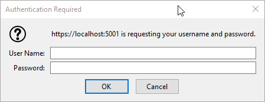
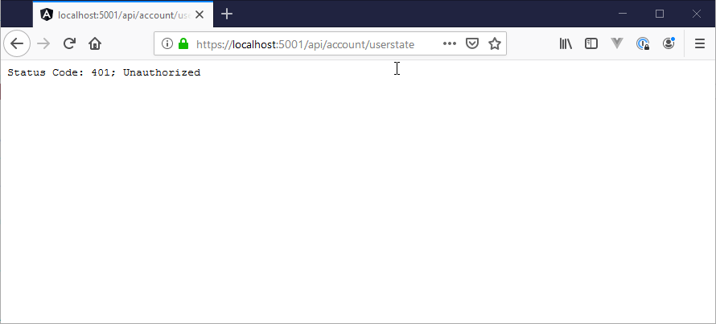
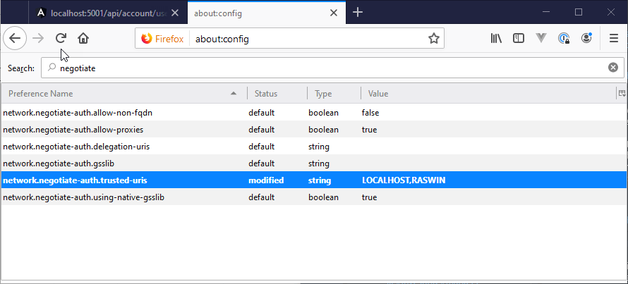

# FireFox, Windows Security and Kestrel on ASP.NET Core


I've been working on an application that's using Windows Authentication for an intranet application. Windows authentication is used because some of the business rules are deeply dependent on Active Directory roles and authorization information and the most efficient way to get this information is through the built-in Windows authentication mechanisms that .NET Core provides.

I've run into issues with this application where the application refused to authenticate using Kestrel on my local machine when using the FireFox browser. Everything works with Chrome, Edgium and Edge, but FireFox, just returned an endless loop of login dialogs:



<small>**Figure 1** - FireFox Login dialogs galore</small>

or - even worse refuses to even authenticate and just returns the stock ASP.NET Core 401 response:



<small>**Figure 2** - Default Kestrel Response to an Negotiate request in FireFox </small>

Hrmmph!

### Adding Windows Authentication to ASP.NET Core
I've written about using Windows Authentication not long ago, but it can't hurt to review the basics of setting up Windows Authentication again here since it doesn't take much to set up.

Start by adding a reference to the Negotiate Authentication package:

```xml
<PackageReference Include="Microsoft.AspNetCore.Authentication.Negotiate" Version="3.0.0" />
```

Negotiate is the authentication scheme (`Negotiate`) used that works with Windows auth. There's also `NTLM`, but as we'll see Kestrel actually doesn't support that out of the box. However, Negotiate will work in most cases.

and then hook it up in `ConfigureServices()`:

```csharp
services
    .AddAuthentication(NegotiateDefaults.AuthenticationScheme)
    .AddNegotiate();
```

and turn it on in `Configure()`:

```csharp
// Enable System Authentication
app.UseAuthentication(); 
app.UseAuthorization();
```

The built-in middleware will pick up Windows Authentication ticket headers and create a a `WindowsPricipal` and `WindowsIdentity` which are derived from `ClaimsPrincipal`, which means that groups and other AD settings are provided as claims.


> #### @icon-warning Middleware Order Matters
> Make sure you hook up Windows Authentication .UseAuthentication() and .UseAuthorization after .AddRouting() but before any other middleware that uses authentication like MVC or Pages or StaticFiles. If the order is wrong, authentication won't work.

Once hooked up authentication works you can force authentication it via an `[Authorize]` attribute on a controller or you can simply check `context.User.Identity` for the Windows `WindowsIdentity`. 

Using `[Authorize]` on a controller:

```cs
[Authorize]
public class AccountController : BaseController 
{ ... }
```

or you can access the User information in the HttpContext property of the controller:

```cs
var user = this.HttpContext.User.Identity;
```

You can also explicitly challenge with a 401 response from your code, for example in custom authentication middleware (as I'm doing in this application I'm working on):

```csharp
if (!context.User.Identity.IsAuthenticated)
{
    context.Response.StatusCode = 401;
    context.Response.Headers.Add("www-authenticate",
        new StringValues(new string[] {"Negotiate", "NTLM"}));

    Logger.LogInformation("Login request from " + context.Connection.RemoteIpAddress);

    await context.Response.WriteAsync("Unauthorized Windows User");
    return null;
}
```

The authentication provider gives you the authentication status, user account info along with the all the Windows or Active Directory Groups the user is part of in the embedded Claims.

Simple enough.

### It works, but... FireFox
So I've been building my application happily using the [Chromium based version of Edge](https://www.microsoftedgeinsider.com/en-us/) and it's been working without any issues. I've also check the app with classic Edge and actual Chrome and everything works as it should.

However, using Firefox I found that app was not authenticating at all. This particular app is an Angular application and so I'm running the local Dev Server on port `4200` and the .NET server on port `5001` in Kestrel with Kestrel providing the Windows authentication.

In FireFox this turned out to result in an endless loop of windows login dialogs. I was getting tired of this (and you will be too if I keep posting this image :smile:):


When running from the Angular app, I would see the dialog because the Angular app is redirecting to the .NET server for authentication to pick up the authentication status. But each request just ends with the dreaded login dialog in an endless loop.

If I access the application directly and access one of the endpoints with FireFox, however I get no authentication at all, but just the authentication message.


This was made even more frustrating in that this **wasn't working using Kestrel** as the Web Server, but it **was working with IIS Express**. What the heck?

I captured the output from requests for both servers to see what the difference could be and found this:

**Kestrel:**

```http
HTTP/1.1 401 Unauthorized
Date: Fri, 15 Nov 2019 00:51:46 GMT
Content-Type: text/plain
Server: Kestrel
WWW-Authenticate: Negotiate
Proxy-Support: Session-Based-Authentication
Content-Length: 530

Status Code: 401; Unauthorized                                              
```

**IIS Express:**

```http
HTTP/1.1 401 Unauthorized
Content-Type: text/html; charset=us-ascii
Server: Microsoft-HTTPAPI/2.0
WWW-Authenticate: NTLM TlRMTVNTUAACAAAADAAMADgAAAAFgoqiVKtwQ7croagAAAAAAAAAAFAAUABEAAAACgDqSQAAAA9SAEEAUwBXAEkATgACAAwAUgBBAFMAVwBJAE4AAQAMAFIAQQBTAFcASQBOAAQADABSAEEAUwBXAEkATgADAAwAUgBBAFMAVwBJAE4ABwAIAH1CVNlNm9UBAAAAAA==
Date: Fri, 15 Nov 2019 00:44:33 GMT
Content-Length: 341
Proxy-Support: Session-Based-Authentication

<!DOCTYPE HTML PUBLIC "-//W3C//DTD HTML 4.01//EN""http://www.w3.org/TR/html4/strict.dtd">
<HTML><HEAD><TITLE>Not Authorized</TITLE>
<META HTTP-EQUIV="Content-Type" Content="text/html; charset=us-ascii"></HEAD>
<BODY><h2>Not Authorized</h2>
<hr><p>HTTP Error 401. The requested resource requires user authentication.</p>
</BODY></HTML>
```

Kestrel is sending a `Negotiate` header, while IIS is sending an `NTLM` authenticate header. Apparently, FireFox treats `NTLM` different than `Negotiate` and `NTLM` works without any special configuration. `Negotiate` however does not.

However, AFAIK there's no way to configure Kestrel to send an `NTLM` header as it defaults to `Negotiate`. Hrmph.

### Configure FireFox
I knew that there are configuration options for Windows Authentication in FireFox and I started looking at those. The first thing I did is look at the `NTLM` settings (before I looked at the headers) - which as it turns out was the wrong set to change. NTLM works without configuration and that's why IIS Express 'just worked'.

It wasn't until I saw the `Negotiate` header that I checked for the negotiate specific settings by  configuring FireFox via its `about:config` settings.

To do this:

* Open FireFox
* Type `about:config` into the address bar
* Type `negotiate` into the search box
* Add domains to `network.negotiate-auth.trusted-uris`

This looks like this:



Set the `network-negotiate-auth.trusted-uris` which is a comma delimited list of domains that you need Windows/AD Auth to work with. The settings above are for `negotiate`. Add `LOCALHOST` for local development, and any other domains you are interested in.

Note I'm using both LOCALHOST and my local machine name - the latter is not really required, but I'm adding it just in case as I do have a few scenarios where I'm using a machine name.

And boom! That worked!

> #### @icon-info-circle FireFox NTLM Config is not necassary
> FireFox also has similar configuration settings for NTLM. To access those follow the steps above with `about:config` then go type `ntlm` into the searchbox.
>
> It looks like NTLM configuration is not necessary and FireFox respects the native Windows settings without special configuration. YMV, but for me when running through IIS which uses NTLM connections and auto-logins just worked without any custom configuration of the FireFox ntlm or negotiate keys. But if for some reason IIS won't authenticate, the NTLM config keys in FireFox are there for editing.

I am now able to properly log into the application with FireFox including auto-logins for local domains or workstation accounts.

It's great that this works, but this is still a bummer because it looks like this requires explicitly configuring FireFox manually in order to properly work with Windows Authentication. This isn't ideal for a Web application to say the least - even an intranet one, but presumably companies that are using FireFox and Windows or AD Auth have a standard policy for this already in place.

It would be nice if the behavior between Kestrel and IIS wasn't different and wouldn't require custom settings in FireFox to work...

### Summary
I continue to find stumbling blocks with Windows Authentication in ASP.NET Core. It works, but there are rough edges. Windows Auth of course isn't an ideal solution to authentication,  and wouldn't be my first choice, but alas due to requirements that's what has to be used in many cases.

Hopefully this post helps some of you and avoids the pain of trying to figure out why FireFox isn't authenticating with Windows Auth.

<div style="margin-top: 30px;font-size: 0.8em;
            border-top: 1px solid #eee;padding-top: 8px;">
    
    this post created and published with the 
    <a href="https://markdownmonster.west-wind.com" 
       target="top">Markdown Monster Editor</a> 
</div>