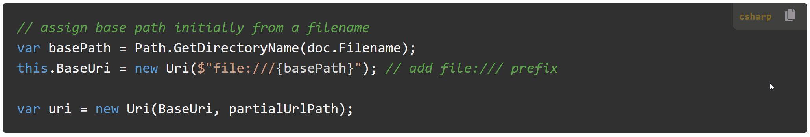
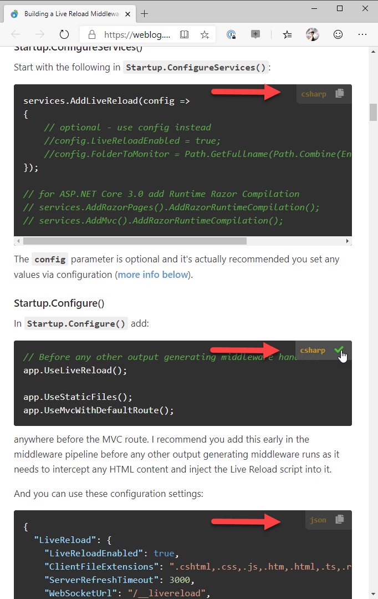
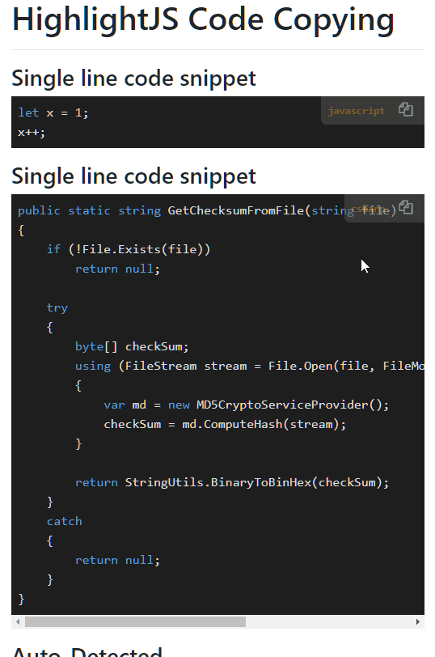

# A HighlightJs Copy Code Badge Component



A while back I created a small addon component for use with [HighlightJs](https://highlightjs.org/) that provides the ability to copy a code snippet and display the active language in a little badge above the code snippet. If you're using HighlightJs for your code snippets you might find this a useful enhancement for your snippets.

Here's what the code-badge looks like:



The badge picks up and displays the language that HighlightJs renders. This is either the explicit value specified or the inferred value that HighlightJS tries to auto-discover. The badge is shown in low opacity that gets solid when hovering over the badge and you can click on the copy icon to copy the code block's content to the clipboard.

Here is a live example of code blocks in this Weblog you can play with:

### Single Line Code
```javascript
let x = 1;
```

### Code block
```csharp
public static string GetChecksumFromFile(string file)
{
    if (!File.Exists(file))
        return null;

    try
    {
        byte[] checkSum;
        using (FileStream stream = File.Open(file, FileMode.Open, FileAccess.Read, FileShare.Read))
        {
            var md = new MD5CryptoServiceProvider();
            checkSum = md.ComputeHash(stream);
        }

        return StringUtils.BinaryToBinHex(checkSum);
    }
    catch
    {
        return null;
    }
}
```

### Auto-Detected (no language specified)
```
Content-Type: text/html
Accept: application/json
Content-Length: 12332
```


## Why this Component?
This is not exactly a complex component, so why a whole component? Well, the devil's in the details as always and it's not actually as trivial as it looks to handle the code display and copy/paste **generically**. Building a non-custom version is easy enough but in order for it to work in various scenarios and without requiring explicit dependencies (CSS) takes a little more work.

The main reason I built this is that I have quite a few content Web sites and tools that use code snippets:

* Several blogs
* Tons of documentation sites
* Markdown Monster uses HighlightJS code snippets

All of these Web based content generating tools and engines use code blocks, and can use this same component now (or will be anyway :-)). Originally I had just a few hacked scripts in several different sites and decided that I should consolidate them into something that can be more easily shared amongst all of my content.

This component is the result. I've been using this on this blog for a few months and it works well, albeit it required a few small fixes that made me come back to it this week. I'll talk about some of these later in this post because I think they are kind of interesting HTML errata items.

### Install from NPM or Grab the Source Code
You can install it [from NPM](https://www.npmjs.com/package/highlightjs-badge):

```powershell
npm install highlightjs-badge
```

and you can pick up the source and latest dev versions from Github:  

[HighlightJs-badge on Github](https://github.com/RickStrahl/highlightjs-badge)

If you want to play around with it you can look at a CodePen sample:

[Sample on CodePen](https://codepen.io/rstrahl/pen/RwNZGBE)

### Usage
To use this library is very simple - you add a script file and call `highlightJsBadge()` after highlightJS has been applied.

```html
<!-- load highlightjs first -->
<link href="scripts/highlightjs/styles/vs2015.css" rel="stylesheet" />
<script src="scripts/highlightjs/highlight.pack.js"></script>

<!-- then add this badge component -->
<script src="scripts/highlightjs-badge.min.js"></script>

<script>
    // apply HighlightJS
    var pres = document.querySelectorAll("pre>code");
    for (var i = 0; i < pres.length; i++) {
       hljs.highlightBlock(pres[i]);
    }
    
    // add HighlightJS-badge (options are optional)
    var options = {   // optional
       contentSelector: "#ArticleBody",
       
       // CSS class(es) used to render the copy icon.
       copyIconClass: "fas fa-copy",
       // CSS class(es) used to render the done icon.
       checkIconClass: "fas fa-check text-success"
    };
    window.highlightJsBadge(options);
</script>
```

### Styling
The default script includes default styling that should work great with dark themed syntax, and fairly well with light themed syntax.

You can customize the styling and the layout of badge by either overriding existing styles or by:

* Overriding styles
* Copying complete styles and template into page

#### Overriding styles
The easiest way to modify behavior is to override individual styles. The stock script includes a hardcoded style sheet and you can override the existing values with hard CSS overrides.

For example to override the background and icon sizing you can:

```css
<style>
    .code-badge {
        padding: 8px !important;
        background: pink !important;
    }
    .code-badge-copy-icon {
        font-size: 1.3em !important;
    }
</style>
```

#### Replace the Template and Styling Completely
Alternately you can completely replace the template and styling. If you look at the source file at the end of the file is a commented section that contains the complete template and you can copy and paste that template into your HTML page - at the bottom near the `</body>` tag.

```html
<style>
    "@media print {
        .code-badge { display: none; }
    }
    .code-badge-pre {
        position: relative; 
    }
    .code-badge {
        display: flex;
        flex-direction: row;
        white-space: normal;
        background: transparent;
        background: #333;
        color: white;
        font-size: 0.8em;
        opacity: 0.5;
        border-radius: 0 0 0 7px;
        padding: 5px 8px 5px 8px;
        position: absolute;
        right: 0;
        top: 0;
    }
    .code-badge.active {
        opacity: 0.8;
    }
    .code-badge:hover {
        opacity: .95;
    }
    .code-badge a,
    .code-badge a:hover {
        text-decoration: none;
    }

    .code-badge-language {
        margin-right: 10px;
        font-weight: 600;
        color: goldenrod;
    }
    .code-badge-copy-icon {
        font-size: 1.2em;
        cursor: pointer;
        padding: 0 7px;
        margin-top:2;
    }
    .fa.text-success:{ color: limegreen !important}    
</style>
<div id="CodeBadgeTemplate" style="display:none">
    <div class="code-badge">
        <div class="code-badge-language">{{language}}</div>
        <div title="Copy to clipboard">
            <i class="{{copyIconClass}} code-badge-copy-icon"></i>
        </div>
     </div>
</div>
```

This is the same template that the library internally holds and injects into the page, but if `#CodeBadgeTemplate` exists in the document then that is used instead of the embedded template. When using your own template no styling is applied. so you neeed to include both the CSS and the `CodeBadgeTemplate`.

You can optionally separate out the CSS into a separate file and only include the `#CodeBadgeTemplate` `<div>` element - that's sufficient for your custom template and styling to kick in.


## Component Design
The component is fully self contained and has no external dependencies other than highlightjs itself and - optionally, a font library (FontAwesome by default) - to display the copy icon. The icon styling can be customized so you can use just text or some other icon format like material design.

It's been a while since I've built a raw component without any dependencies oir jQuery and given that we can now pretty much count on ES6 support and features it's a lot easier than it used to be. In the past I probably would have made this a jquery component, but there's nothing here that really requires that, including support for IE 10/11. 

So this component has no dependencies other than HighlightJs itself which obviously has to be loaded prior to using this component.

### How does it work?
The component looks for the same container that highlightJs looks for and then injects the little code badge into the page after the `<pre>` tag. To do this it uses a template, which is a `<div>`` tag with the required template HTML that is then appended into the document for each code block:

```html
<style>
    /* formatting for the code-badge */
</style>
<div id="CodeBadgeTemplate" style="display:none">
    <div class="code-badge">
        <div class="code-badge-language">{{language}}</div>
        <div title="Copy to clipboard">
            <i class="{{copyIconClass}} code-badge-copy-icon"></i>
        </div>
     </div>
</div>
```

The template includes a couple of replacable placeholders `{{language}}` and `{{copyIconClass}}` that are replaced when the template is rendered.

This template is internally provided in the code, but it can also be overridden simply by placing a `#CodeBadgeTemplate` element into the page - if it exists, that and existing styling will be used instead of the embedded template. This allows for any HTML/CSS customization you want to apply. 

The code first checks to see if a template has been provided and if not reads the static template:

```javascript
if (!document.querySelector(options.templateSelector)) {
    var node = document.createElement("div");
    node.innerHTML = getTemplate();   // internal template
    var style = node.querySelector("style");
    var template = node.querySelector(options.templateSelector);
    document.body.appendChild(style);
    document.body.appendChild(template);
}
```

Alternately the styling can be overridden more simply by applying style overrides:

```css
<style>
    .code-badge {
        padding: 8px !important;
        background: #ccc !important;
        color: black !important;
    }
    .code-badge-copy-icon {
        font-size: 1.3em !important;
    }
</style>
```

### Processing Code Blocks
The core of code runs through the same code snippets that highlightJs should process which is the `pre>code.hljs` selector. It then inserts the new element `<div class="code-badge">` element after the `<pre>` tag. 

The key bits are simple enough:

```javascript
var $codes = document.querySelectorAll("pre>code.hljs");        
for (var index = 0; index < $codes.length; index++) {
    var el = $codes[index];
    if (el.querySelector(".code-badge"))
        continue; // already exists
               
    var lang = "";

    for (var i = 0; i < el.classList.length; i++) {
        // class="hljs language-csharp"
        if (el.classList[i].substr(0, 9) === 'language-') {
            lang = el.classList[i].replace('language-', '');
            break;
        }
        // class="kotlin hljs"   (auto detected)
        if (!lang) {
            for (var j = 0; j < el.classList.length; j++) {
                if (el.classList[j] == 'hljs')
                    continue;
                lang = el.classList[j];
                break;
            }
        }
    }

    if (lang)
        lang = lang.toLowerCase();
    else
        lang = "text";

    var html = hudText.replace("{{language}}", lang)
                      .replace("{{copyIconClass}}",options.copyIconClass)
                      .trim();

    // insert the Hud panel
    var $newHud = document.createElement("div");
    $newHud.innerHTML = html;
    $newHud = $newHud.querySelector(".code-badge");        
    
    if(options.copyIconContent)
      $newHud.querySelector(".code-badge-copy-icon").innerText = options.copyIconContent;

    // make <pre> tag position:relative so positioning keeps pinned right
    // even with scroll bar scrolled
    var pre = el.parentElement;
    pre.style.position = "relative";

    // insert into the <pre> tag as first element
    el.insertBefore($newHud, el.firstChild);
}
```

The code loops through all snippets, and if it needs to add a badge, reads the template, copies it, replaces the language and icon and then embeds the newly created element into the document before the main `<code>` element.

Here's what the HTML for a code snippet looks like after this process has completed:

```html
<pre class="code-badge-pre">
    <div class="code-badge">
        <div class="code-badge-language">javascript</div>
        <div title="Copy to clipboard">
            <i class="code-badge-copy-icon fa-copy fa"></i>
        </div>
    </div>  
     
    <code class="hljs language-js javascript"><span class="hljs-keyword">let</span> x = <span class="hljs-number">1</span>;
    </code>
</pre>
```

The `<div class="code-badge">` element has been injected as has the `class="code-badge-pre"` in the `<pre>` tag.

### Relative Content
The `<pre class="code-badge-pre">` in the snippet above is injected into the `<pre>` tag when the page is processed. This is unfortunately required because the `<pre>` tag on its own is not uniquely identifiable as a `hljs` code snippet - there could be other non hljs `<pre>` tags on the page and we need to explicitly set `position: relative` in order to be able to render the code badge reliable in the right corner of the code snippet.

Initially, I didn't use the `<pre>` container for the `position: relative` as I was trying to embed the `code-badge` into the inner `<code class="hlks">` element. While this worked on the surface, it had a nasty side-effect with scrolled code blocks. For scrolled code content the badge was not sticking to the right side of the code block:



Notice how the code-badge in the middle doesn't stay pinned to the right of the code snippet 'container'.

This is a funky HTML behavior where the absolute positions are not updated based on scroll position for `<pre>` blocks, keeping the `right: 0px` location at it's original content location rather than pinning to the end of the content. Ugly. I would argue this is a browser bug, as absolute and 0px right certainly should never end up in the middle of the page regardless of scroll position. But alas, Chromium, FireFox and Edge all display the same (funky) behavior, so I guess it must follow some part of the spec that makes sense of this non-sensical behavior.

Anyway, the problem is that `postion: absolute` and `right: 0` on scrolled content does not work if you want the content pinned to the right of the container. The solution is to move the `position:relative` up to the `<pre>` container which is a fixed and non-scrolling container into which the scrolling `<code>` tag is rendered. 

In CSS this looks like this:

```css
.code-badge-pre {
    position: relative; 
}
.code-badge {
    ...
    position: absolute;
    right: 0;
    top: 0;
}
```

That works, but there's still one more problem: How to select the `<pre>` tag as it doesn't have any identifiable information that identifies it as a hljs code-block. So the solution is to inject a class explicit at render time when the badge is injected as `<pre class="code-badge-pre">`:

```js
var el = $codes[index];
...

// insert the Hud panel
var $newHud = document.createElement("div");
$newHud.innerHTML = html;  // assign template
$newHud = $newHud.querySelector(".code-badge"); 

// make <pre> tag position:relative so positioning keeps pinned right
// even with scroll bar scrolled
var pre = el.parentElement;            
pre.classList.add("code-badge-pre");
pre.insertBefore($newHud, el);
```

It's ugly, but it works.

### Copying Code to the  Clipboard
Once the the code badges have been created for all code blocks, we still need to handle the content click events. Since there may be quite a few code snippets on a large page, the clicks are consolidated via a single click handler on the content container (or body if not provided) which checks for specific instances of click targets against a `.code-badge-copy-icon`. This provides behavior similar to `$el.on()` 'late' event binding in jQuery:

```javascript
var content = document.querySelector(options.contentSelector);

// single copy click handler
content.addEventListener("click",
   function (e) {                               
       var clicked = e.srcElement;
       if (clicked.classList.contains("code-badge-copy-icon")) {
           e.preventDefault();
           e.cancelBubble = true;
           copyCodeToClipboard(e);
       }
       return false;
   });
```

For the actual clipboard copying, I use a fairly generic routine.  Since you can't directly copy text to the clipboard a workaround using an intermediary textarea and a text selection is required:

```javascript
function copyCodeToClipboard(e) {
    // walk back up to <pre> tag
    var $origCode = e.srcElement.parentElement.parentElement.parentElement;

    // select the <code> tag and grab contained code as text
    var $code = $origCode.querySelector("pre>code");
    var text = $code.textContent || $code.innerText;
    
    // Create a textblock and assign the text and add to document
    var el = document.createElement('textarea');
    el.value = text.trim();
    document.body.appendChild(el);
    el.style.display = "block";

    // select the entire textblock
    if (window.document.documentMode)
        el.setSelectionRange(0, el.value.length);
    else
        el.select();
    
    // copy to clipboard
    document.execCommand('copy');
    
    // clean up element
    document.body.removeChild(el);
    
    // show the check icon (copied) briefly
    swapIcons($origCode);     
}
```

The code retrieves the content of the code block, creates a new TextArea node, copies the text into it, selects the text of the textarea and then uses the `document.execCommand("copy")` to copy the selected text to the clipboard. The node is then deleted. This convoluted approach makes it possible to copy aribtrary text to the clipboard as there's no explicit API to copy text directly.

#### innerText vs. textContent
When I originally created this component I had been using the `codeElement.innerText` to retrieve the text of the code block. Although that worked fine for Chromium and FireFox browsers, Internet Explorer 11 and 10 would return text with all the linebreaks and some spaces stripped. 

After a bit of experimenting I realized that `.innerText` is probably not the right property to use, but it's much cleaner to use `.textContent` instead. For both IE and Chromium, `.textContent` returns the raw content while `.innerText` performs some browser depedent fix up on the string text. If you need to retrieve text that includes line breaks and significant white space make sure you use `.textContent` instead of `.innerHtml` or better yet using something like this:


```javascript
// back up to the `<pre>` tag
var $origCode = e.srcElement.parentElement.parentElement.parentElement;

// Get Code Text
var $code = $origCode.querySelector("pre>code");
var text = $code.textContent || $code.innerText;
```

## At Work: Using This Component
As mentioned I have a lot of places where I use code blocks with rendered Markdown and I use this component now in all of them. The code is portable and works with minimal additional code beyond what's already required in order for highlightJs to work. It's literally a single line (or a few more if you explicitly set options) plus the script tag to get this hooked in.

This seems like a minor feature for code snippet rendering and when a user request came in for this into Markdown Monster over a year ago I kind of dismissed as "can live without that". But when I sat down to actually add it some time ago to my blog, I all of a sudden found myself using the copy code button **a lot**. It's one of those features you don't know you need until you use it a few times on a largish code block - it's a lot easier to press on a single button than scroll and select two pages of code.

So yeah, it was worth the effort.

As is often the case for me, it's a very specialized type of component, but if you're using highlightJs you might find this useful as a ready-to-go addin. If you're using something else for code highlighting it probably wouldn't be hard to adjust the badge injection code to work with an alternate syntax highlighter either. Enjoy...