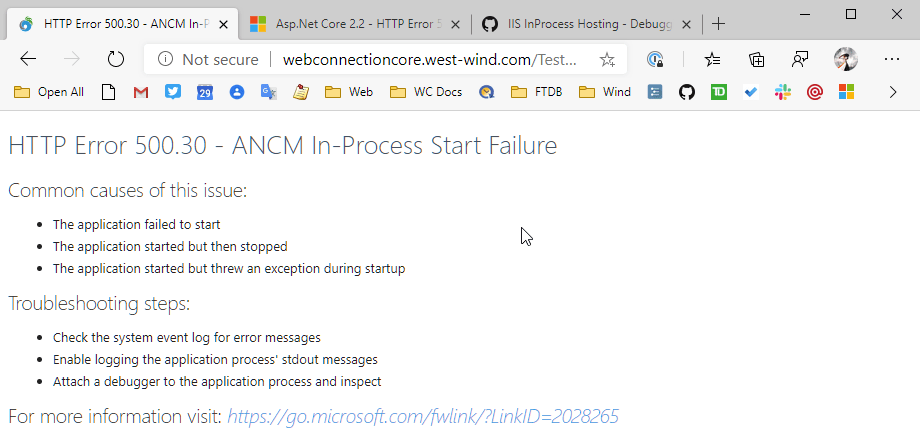
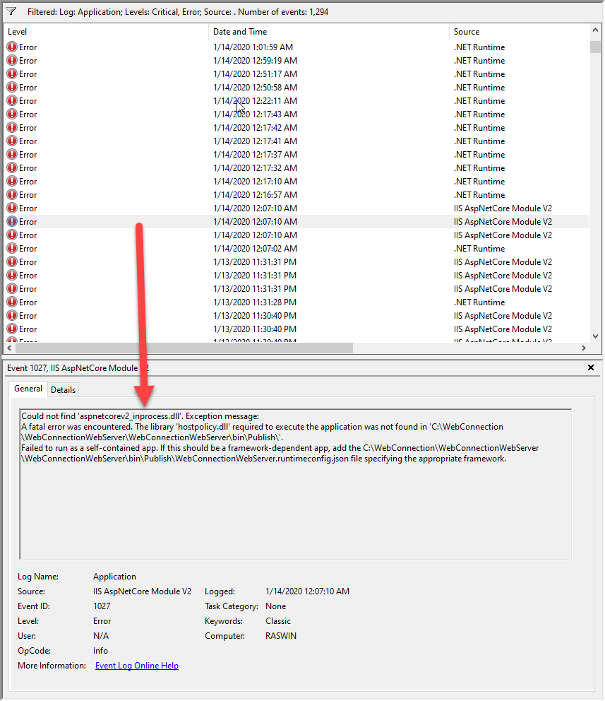
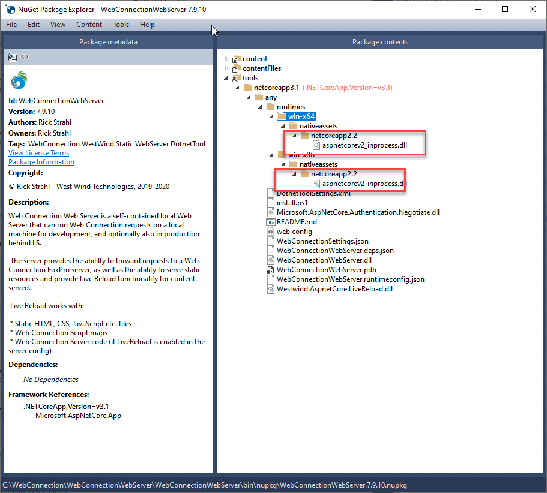

# .NET Core IIS InProcess Hosting Issue in .NET Core 3.1


I ran into a nasty issue yesterday related to hosting an ASP.NET Core 3.1 server application in IIS using the default InProcess hosting. If you're not familiar with ASP.NET Core hosting in IIS, here is a previous post that provides more insight on the two hosting modes, how they work and how they differ (post is for 2.2 but still applies  for 3.x):

* [ASP.NET Core InProcess Hosting in .NET Core](https://weblog.west-wind.com/posts/2019/Mar/16/ASPNET-Core-Hosting-on-IIS-with-ASPNET-Core-22)

In .NET Core 3.x InProcess hosting for IIS is the default. OutOfProcess hosting externally runs `Kestrel.exe` and has IIS proxying requests into the external Kestrel HTTP host. InProcess hosting uses a custom IIS Module that bootstraps a custom .NET Core host right into the IIS host process which provides better performance and a smaller footprint.

Running my .NET Core 3.1 server `OutOfProcess` was working without problems, but as soon as I tried switching the server to `InProcess` I get this dreaded **ANCM In-Process Start Failure** error page:



.NET Core 3.0/3.1 has InProcess hosting on by default, but you can explicitly configure the value in the project via the `AspNetCoreHostingModel` explicitly.

```xml
<AspNetCoreHostingModel>OutOfProcess</AspNetCoreHostingModel>
```

or the now default value:

```xml
<AspNetCoreHostingModel>InProcess</AspNetCoreHostingModel>
```

This project configuration value translates to a `web.config` setting in the IIS publish output folder:

```xml
<system.webServer>
    <aspNetCore processPath="dotnet.exe" 
                arguments="..\WebConnectionWebServer\WebConnectionWebServer.dll"
                stdoutLogEnabled="true"
                stdoutLogFile=".\logs\stdout"
                
                hostingModel="InProcess" />
</system.webServer>
```

So in this case InProcess hosting is failing while OutOfProcess hosting is working. What gives?

## Debugging Server Startup Failures
The ANCM (ASP.NET Core Module) error message page is scary because it doesn't provide much in the way of debugging information on the page itself. The link at the bottom takes you to a [detailed page](https://docs.microsoft.com/en-us/aspnet/core/test/troubleshoot-azure-iis?view=aspnetcore-3.1#50030-in-process-startup-failure) that talks about a number of hosting failures but didn't help much in the case of InProcess startup failures.

The specific advice is:

> The ASP.NET Core Module attempts to start the .NET Core CLR in-process, but it fails to start. The cause of a process startup failure can usually be determined from entries in the Application Event Log and the ASP.NET Core Module stdout log.

### First things First: Turn on Logging
So the first thing I always do when I have IIS hosting startup problems is to enable the logs by turning on the `stdoutLogEnabled="true"` in the web.config of your server installation (or you can add a pre-configured web.config to your project).

```xml
stdoutLogEnabled="true"
```

What this does is log stdOut into a file in the logs folder which should in most cases given you some additional information. This logs out `Console` output as well as logging output.

In my case it gave me some additional - albeit not very useful - information on what is failing in the form of a stack trace that I'm outputting as part of my main program error handling. I write out the exception info which in this case turns out to be rather verbose due to a deep callstack into the runtime itself:

```text
Object reference not set to an instance of an object.
---
   at Microsoft.AspNetCore.Hosting.WebHostBuilderIISExtensions.<>c__DisplayClass0_0.<UseIIS>b__2(IISServerOptions options)
   at Microsoft.Extensions.Options.ConfigureNamedOptions`1.Configure(String name, TOptions options)
   at Microsoft.Extensions.Options.OptionsFactory`1.Create(String name)
   at Microsoft.Extensions.Options.OptionsManager`1.<>c__DisplayClass5_0.<Get>b__0()
   at System.Lazy`1.ViaFactory(LazyThreadSafetyMode mode)
   at System.Lazy`1.ExecutionAndPublication(LazyHelper executionAndPublication, Boolean useDefaultConstructor)
   at System.Lazy`1.CreateValue()
   at System.Lazy`1.get_Value()
   at Microsoft.Extensions.Options.OptionsCache`1.GetOrAdd(String name, Func`1 createOptions)
   at Microsoft.Extensions.Options.OptionsManager`1.Get(String name)
   at Microsoft.Extensions.Options.OptionsManager`1.get_Value()
   at Microsoft.AspNetCore.Server.IIS.Core.IISHttpServer..ctor(IISNativeApplication nativeApplication, IHostApplicationLifetime applicationLifetime, IAuthenticationSchemeProvider authentication, IOptions`1 options, ILogger`1 logger)
   at System.RuntimeMethodHandle.InvokeMethod(Object target, Object[] arguments, Signature sig, Boolean constructor, Boolean wrapExceptions)
   at System.Reflection.RuntimeConstructorInfo.Invoke(BindingFlags invokeAttr, Binder binder, Object[] parameters, CultureInfo culture)
   at Microsoft.Extensions.DependencyInjection.ServiceLookup.CallSiteRuntimeResolver.VisitConstructor(ConstructorCallSite constructorCallSite, RuntimeResolverContext context)
   at Microsoft.Extensions.DependencyInjection.ServiceLookup.CallSiteVisitor`2.VisitCallSiteMain(ServiceCallSite callSite, TArgument argument)
   at Microsoft.Extensions.DependencyInjection.ServiceLookup.CallSiteRuntimeResolver.VisitCache(ServiceCallSite callSite, RuntimeResolverContext context, ServiceProviderEngineScope serviceProviderEngine, RuntimeResolverLock lockType)
   at Microsoft.Extensions.DependencyInjection.ServiceLookup.CallSiteRuntimeResolver.VisitRootCache(ServiceCallSite singletonCallSite, RuntimeResolverContext context)
   at Microsoft.Extensions.DependencyInjection.ServiceLookup.CallSiteVisitor`2.VisitCallSite(ServiceCallSite callSite, TArgument argument)
   at Microsoft.Extensions.DependencyInjection.ServiceLookup.CallSiteRuntimeResolver.VisitConstructor(ConstructorCallSite constructorCallSite, RuntimeResolverContext context)
   at Microsoft.Extensions.DependencyInjection.ServiceLookup.CallSiteVisitor`2.VisitCallSiteMain(ServiceCallSite callSite, TArgument argument)
   at Microsoft.Extensions.DependencyInjection.ServiceLookup.CallSiteRuntimeResolver.VisitCache(ServiceCallSite callSite, RuntimeResolverContext context, ServiceProviderEngineScope serviceProviderEngine, RuntimeResolverLock lockType)
   at Microsoft.Extensions.DependencyInjection.ServiceLookup.CallSiteRuntimeResolver.VisitRootCache(ServiceCallSite singletonCallSite, RuntimeResolverContext context)
   at Microsoft.Extensions.DependencyInjection.ServiceLookup.CallSiteVisitor`2.VisitCallSite(ServiceCallSite callSite, TArgument argument)
   at Microsoft.Extensions.DependencyInjection.ServiceLookup.CallSiteRuntimeResolver.VisitIEnumerable(IEnumerableCallSite enumerableCallSite, RuntimeResolverContext context)
   at Microsoft.Extensions.DependencyInjection.ServiceLookup.CallSiteVisitor`2.VisitCallSiteMain(ServiceCallSite callSite, TArgument argument)
   at Microsoft.Extensions.DependencyInjection.ServiceLookup.CallSiteRuntimeResolver.VisitCache(ServiceCallSite callSite, RuntimeResolverContext context, ServiceProviderEngineScope serviceProviderEngine, RuntimeResolverLock lockType)
   at Microsoft.Extensions.DependencyInjection.ServiceLookup.CallSiteRuntimeResolver.VisitRootCache(ServiceCallSite singletonCallSite, RuntimeResolverContext context)
   at Microsoft.Extensions.DependencyInjection.ServiceLookup.CallSiteVisitor`2.VisitCallSite(ServiceCallSite callSite, TArgument argument)
   at Microsoft.Extensions.DependencyInjection.ServiceLookup.CallSiteRuntimeResolver.Resolve(ServiceCallSite callSite, ServiceProviderEngineScope scope)
   at Microsoft.Extensions.DependencyInjection.ServiceLookup.DynamicServiceProviderEngine.<>c__DisplayClass1_0.<RealizeService>b__0(ServiceProviderEngineScope scope)
   at Microsoft.Extensions.DependencyInjection.ServiceLookup.ServiceProviderEngine.GetService(Type serviceType, ServiceProviderEngineScope serviceProviderEngineScope)
   at Microsoft.Extensions.DependencyInjection.ServiceLookup.ServiceProviderEngineScope.GetService(Type serviceType)
   at Microsoft.Extensions.DependencyInjection.ServiceProviderServiceExtensions.GetService[T](IServiceProvider provider)
   at Microsoft.Extensions.Hosting.Internal.Host.StartAsync(CancellationToken cancellationToken)
   at Microsoft.Extensions.Hosting.HostingAbstractionsHostExtensions.RunAsync(IHost host, CancellationToken token)
   at Microsoft.Extensions.Hosting.HostingAbstractionsHostExtensions.RunAsync(IHost host, CancellationToken token)
   at Microsoft.Extensions.Hosting.HostingAbstractionsHostExtensions.Run(IHost host)

```

The code in question in my code ends at the `builder.Build()` call in `Program.cs`, which then goes into the internal  `CreateBuilder()` functionality which then internally ends up calling the `app.UseIIS()` functionality that hooks up the IIS hosting. And that's when things go boom. Given that I'm failing at InProcess hosting only this doesn't exactly tell me anything new. 

Still this logging output can be quite useful in other situations including the ability to quickly add some additional output that can tell you how far the code is getting during a startup failure.

> This information is also available on Azure if you go into the log viewer - you don't even need to enable the logs they are on by default although at logging only error information.

The startup works perfectly fine for my server in OutOfProcess hosting, but fails InProcess which is very frustrating because the expectation is that InProcess and OutOfProcess should behave very closely the same - which they mostly do, but there are subtle differences. In this case the error trace doesn't provide much help because it ends up pointing into internal code related to loading the hosting runtime dlls.

### Additional Debugging Detail
In addition here are additional debugging suggestions from David Fowler and Damian Edwards:


To set the Environment and turn on Detailed Error logging in `web.config`:

```xml
<aspNetCore processPath="dotnet.exe" 
        arguments="..\WebConnectionWebServer\WebConnectionWebServer.dll"
        stdoutLogEnabled="true"
        stdoutLogFile=".\logs\stdout"
        hostingModel="inprocess">
  <environmentVariables>
    <environmentVariable name="ASPNETCORE_ENVIRONMENT" value="Development" />
    <environmentVariable name="WEBCONNECTION_DETAILEDERRORS" value="1" />
    
    <environmentVariable name="WEBCONNECTION_USELIVERELOAD" value="False" />
    <environmentVariable name="WEBCONNECTION_OPENBROWSER" value="False" />
    <environmentVariable name="WEBCONNECTION_SHOWURLS" value="False" />
  </environmentVariables>
</aspNetCore>             
```

Turns out in this case that didn't help and I didn't actually get more detailed error info because this happened as part of the initial startup sequence, but this is good advice nevertheless for startup debugging.

Damian Edwards also chimed in with looking in the Event Log:


Doing this I found the following in the event log:



which gives a slight hint into what's going on. It claims that the hosting DLL `aspnetcoreV2_inprocess.dll` which provides the interfacing between IIS and the .NET Core code, couldn't be found. It makes sense in hindsight now that I know what's going on, but initially when I looked at the error, there was no co-relation to the fix. 

More on that in a minute...

## .NET Core 3.x Regression with .NET Core Specific Pre-3.x Dependencies
It turns out that this problem was caused by regression in .NET Core 3.1 when certain, older .NET Core 2.x packages/assemblies are referenced. 

This project was originally built for 2.2 and then moved to 3.0 and then finally updated to 3.1 yesterday. 

[@JustinKotalik](https://twitter.com/JustinKotalik) on the ASP.NET team spotted my Github Issue and pin-pointed the solution only a little while after posting on Github:

* [Github Issue](https://github.com/dotnet/aspnetcore/issues/18325#issuecomment-573994276)

The problem is that my project had a reference to a `2.2` dependency which likely got added when the project was originally created in 2.2 (or perhaps referencing some IIS specific component that I no longer use):

```xml
<PackageReference Include="Microsoft.AspNetCore.Server.IIS" Version="2.2.6" />
```

I removed this reference since I wasn't even sure why it's there in the first place. Nothing broke on compilation, so good on that. As soon as I removed that package reference - BOOM - InProcess hosting started to work.

According to Justin this is caused by a regression in 3.1, that's causing the old 2.2 in process handler being deployed into an unexpected location. Specifically it relates to the following two packages:

* Microsoft.AspNetCore
* Microsoft.AspNetCore.Server.IIS

If you have explicit references to them in your 3.x projects you should be able to remove them as they are part of the ASP.NET Core Framework package. They come either from a 2.x project that was upgraded or by some fluke got imported when referencing a specific type and getting multiple choices and choosing the wrong one (ooops! been there done that).

You can read more detail about this regression issue [in this issue on Github](https://github.com/dotnet/aspnetcore/issues/17973).

My particular app compiles both into a published folder application as well as into a Dotnet Tool and when I looked at my pre-fix Dotnet Tool package I noticed the following 2.2 references to the Inprocess handler in the Nuget package:



This looks very wrong...

Apparently when one of these 2.2 ASP.NET Core references are in the project it causes these 2.2 versions of the inprocess.dll to be deployed in the runtimes folder. But if you look back at the event log error message it appears that the application is looking for that dependency in the root side by side to the binaries in the root folder.

In a **self contained deployed 3.x** application the `aspnetcorev2_inprocess.dll` is deployed into the root folder, but with the 2.2 reference there the root folder DLL (or one of its dependencies) was not found.

### Self-Contained Issue
I haven't tried this but if you build a **framework dependent published application this issue likely won't come up** because the inprocess hosting dll is part of the shared runtime and will be available as part of the shared runtime folder from which the runtime binaries are loaded.

So this particular failure is specific to self-contained runtime installs and not an issue for shared runtime installs.

Either way, it's a good idea to check for the errant 2.2 packages because... they shouldn't be there regardless of whether it works or not. Once I removed the 2.2 package reference shown above, the runtimes folder was removed from the NuGet Tool package and from the self-contained publish runtimes folder. The standalone published application then started working InProcess.

## Summary
Long story short, the 2.2 dependency is what broke the InProcess Hosting in IIS in .NET Core 3.1 for a self-contained runtime install. The 2.2 dependency can come from a direct dependency or potentially from an indirect dependency to other ASP.NET Core 2.2 references in child dependencies, so it may not be quite so easy to see where a 2.2 reference is coming from or potentially be difficult to remove if you don't control some component that's loading it. The IIS assembly should be safe to be only in Application code, buyt the `Microsoft.AspNetCore` reference could be more tricky if a component is referencing that. 

This is a regression bug in .NET Core 3.1  and will be fixed in future updates so this bug won't be around in later updates (current version 3.1.101 which is still broken), but until this is fixed this might bite a few of you as it did me and hopefully this post makes it a little easier to find the solution.

<div style="margin-top: 30px;font-size: 0.8em;
            border-top: 1px solid #eee;padding-top: 8px;">
    
    this post created and published with the 
    <a href="https://markdownmonster.west-wind.com" 
       target="top">Markdown Monster Editor</a> 
</div>