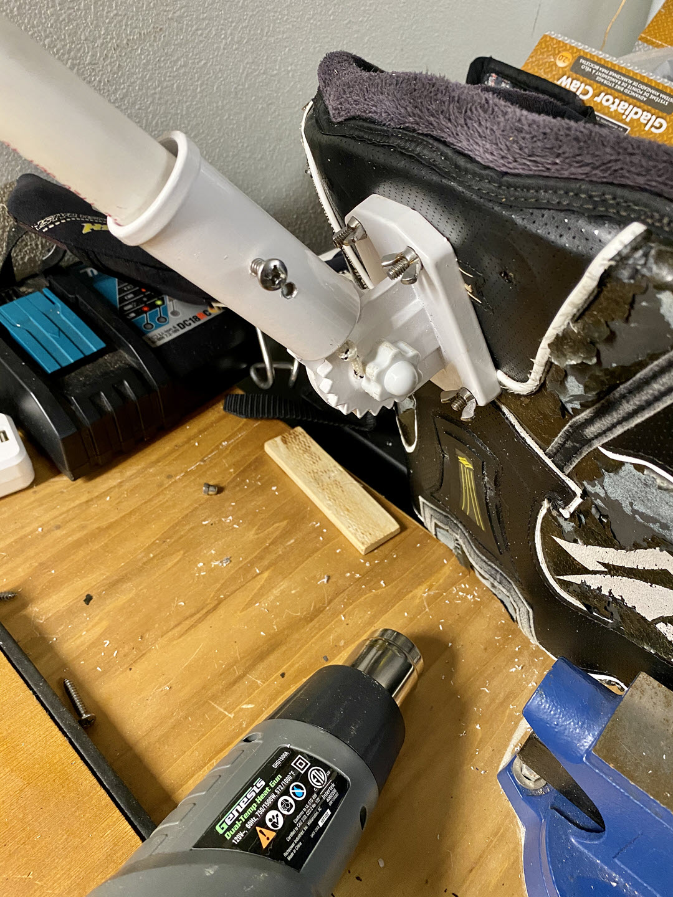

# Creating a Home Made Windsurfing Harness Rear Mount

### Parts

* [A FlagPole Holder](https://amzn.to/3a7QTqk)
* **3 foot 3/4" (or whatever length you want) PVC pipe**  
I used 3/4" PVC pipe, but it's fairly thick and shows up fairly big in the shot once the camera is mounted.  You can also use 1/2" pipe, but it'll be less strong and flex much more. So - trade-offs.
* **1 M5 (or 10/32) 1.5" Screw with nut (for mounting the GoPro Mount)**  
This is the screw that will hold the GoPro mount in place at the top of the pole. 
* **2 3/4" Steel screws (water safe) for holding the pole in place** 
Use Sheet Metal or Wood screws with a sharp point and screw them in a little, but not all the way

## Building the Harness Mount
There are a number of ways to do this but using the FlagPole mount is nice because it's adjustable and allows for easy mounting and unmounting. The holder lets you just unscrew the two hold down screws to remove the pole, which makes it easier for transport.

I've also played with using just straight vertical brackets and drilling holes through the PVC to hold them and while that works well (with bending the PVC pipe at the desired angle) there's no adjustability. If you can figure out exactly what angle and shape works, then maybe the plain bracket can be an even easier to build solution.

I'll use the pole mount for this post.

### Preparing the harness
Let's start with what the final mounted bits look like on the harness:

As you can see there's flagpole mount that's bolted to the harness with WingNuts.
