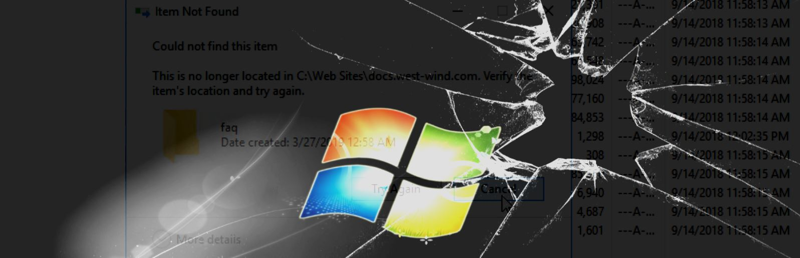
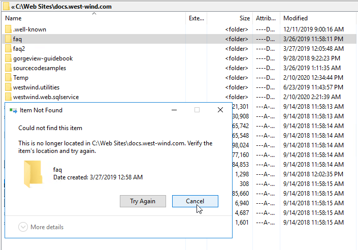
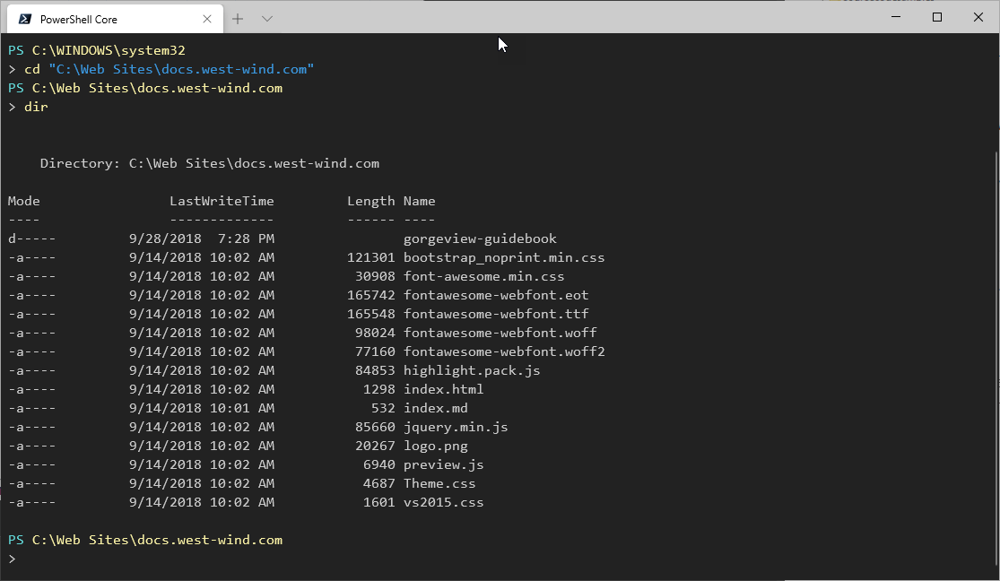
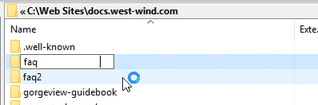
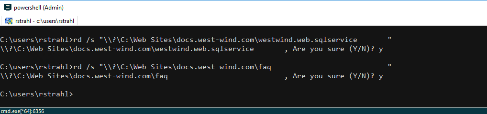

# Deleting Problem Folders and Files on Windows: Could not find this Item Error

 

[asdasd](https://west-wind.com/This%20is%20a%20test)

I ran into a nasty folder naming issue recently where I was unable to delete a number of folders on my server. 

After some digging I figured out that the folders were created by the FTP server and a client application that was uploading files via FTP, but failed to trim trailing spaces of input on the publish folder. It's an old legacy application and the field input defaults to the extra spaces that weren't trimmed off before sending to the server resulting in the server happily creating folders with spaces. 

**Windows apparently does not like folders (or files) with trailing spaces.**

The problem is that Explorer can see the files, but can't delete them. Some applications would see the folders (Explorer primarily) while others (like the Windows Command Prompt) don't. When I tried to delete the folders I'd get this lovely error message:




> Could not Find Item  
> This no longer located in <folder/file location>. Verify the item's location and try again.

The file is obviously there and I'm pointing at the folder to delete, but alas... the folder won't delete. Welcome to Windows using multiple **different** APIs to work with file information.

### It's There - and it's Not
Some interesting things happen with this: If I do a directory listing of the parent folder, the 'misnamed' folder(s) (there are several of them in this root folder) using the command window or PowerShell they don't show in the listing:



Notice that **none of the problem folders are showing up in the directory listing** except the `gorgeview-guidebook` which was manually created without trailing spaces.  Even using `DIR /x` which should show short/fixed up filenames, in a command window didn't show those missing folders.

I tried a bunch of stuff **that didn't work**:

* Renaming the folder (file can't be found or file exists already)
* Moving the folder to a new folder to delete the parent (didn't find to move)
* Using Windows Terminal commands (`REN`/`DEL`) even with full paths

None of that worked. What's going on?

Part of the confusion seems to be that some operations/applications can see the files and others can't, sometimes even inside of the same application - like seeing the file in Explorer and then not finding it trying to delete it. It looks like two different APIs being used - one that can deal with extended files and one that cannot.

### Files and Folders with Trailing Spaces
It turns out the issue is in my case is trailing spaces in the folder names. The folder names include trailing spaces and this appears to throw off some of the older Windows APIs that return directory information.

Here's what this looks like in Explorer:



Notice how the cursor in the folder edit textbox is way out to the right which is indicative of the extra spaces in the file name. **Renaming here by trimming the spaces just fails**, as does trying to move the folder to a new location.

This behavior is similar to files that have full paths longer than the old 256 char MAX_LENGTH. If an application creates filenames or nested paths that are longer than 256 chars long Explorer and most commands can't deal with those either using standard file operations.

### Deleting the Folders with Extended Path Format
The solution to deleting the files is to use the Windows **Extended Path Format** (`\\?\` path prefix) when deleting the folder from the command line. Windows since version 7 has long path and extra characters in file names support via a special extended path syntax that uses a path-like prefix.

So rather than using just a simple path like the following , which **doesn't work**:

```dos
rd /s "C:\Web Sites\docs.west-wind.com\faq                           "
```

you have to use the extended path syntax that supports long paths and apparently various special cases like trailing spaces. 

This **does work**:

```dos
rd /s "\\?\C:\Web Sites\docs.west-wind.com\faq                           "
```



The `\\?\` relates to **Extended Path Syntax** that supports long filenames as well as apparently being more lax with spaces in path names. The paths I use above still need to be fully qualified and  must include the trailing spaces! To capture those trailing spaces I go into Explorer and copy the path from the address bar and paste it into the command line surrounded by quotes.

There's more info on the extended path syntax in the Microsoft Docs:

[Naming Files, Paths and Namespaces](https://docs.microsoft.com/en-us/windows/win32/fileio/naming-a-file?redirectedfrom=MSDN#maximum-path-length-limitation)

This article talks mainly about long file names, but it looks like that's basically the same issue  of file names that the Classic Windows file APIs can't deal with. Although I'm having this issue with folders here, the same problem with extra spaces applies to files as well. 

I didn't try renaming once I got the folders to delete, but I suspect you can also use other commands like `ren` or `del` to manipulate files as long as you use the extended path syntax all files involved in the operation.

Yay!

### Summary
It's good to know that the extended path syntax using the `\\?\` prefix can solve some funky filename issues. It solved the trailing space issue here and it can also be useful for dealing deeply nested file and folder paths or extra long file names in nested paths that exceed 256 characters.

It'd be even nicer if Windows *just worked* with long and 'spaced out' file names all the time, but there are a million different file APIs and most of them only support extended format paths with the `\\?\` syntax which host applications likely aren't using consistently. Heck even Explorer is using the legacy APIs it seems. 

The `\\?\` syntax is a good reminder to  - and an easy one to forget since I've been here before - and one of the reasons I decided to write this down in this post. Hopefully this might prove useful to a few others as well.


<div style="margin-top: 30px;font-size: 0.8em;
            border-top: 1px solid #eee;padding-top: 8px;">
    
    this post created and published with the 
    <a href="https://markdownmonster.west-wind.com" 
       target="top">Markdown Monster Editor</a> 
</div>