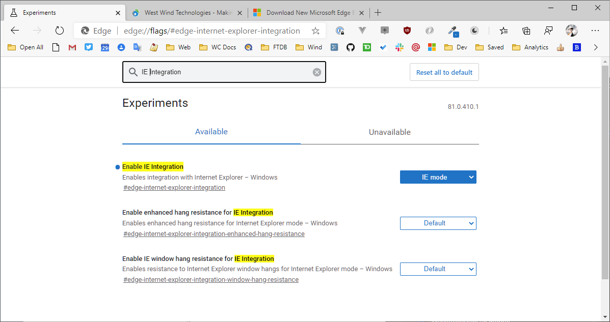
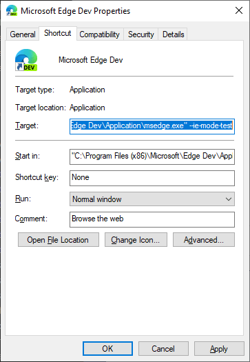
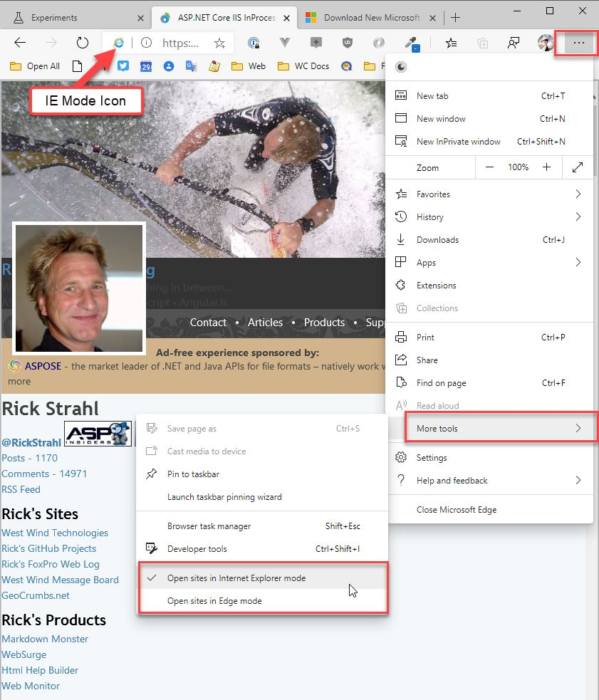
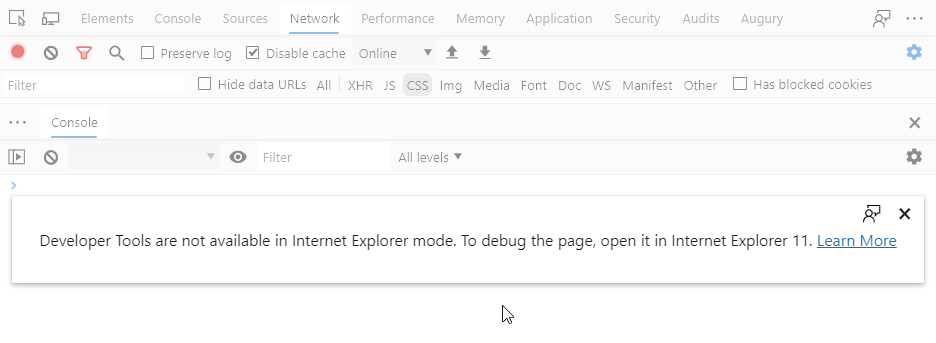

# Internet Explorer Mode in Edge Chromium


Ah, wouldn't it be nice if we could get rid of Internet Explorer for good? Or even the need to launch a separate instance of IE to test some operation for IE?

As much as I hate Internet Explorer, I find that I need it from time to time. Mainly for debugging purposes of Web Browser control based applications with the Internet Explorer Web Browser control embedded into a Windows desktop application which works surprisingly well, but is unfortunately based on the legacy Internet Explorer engine. I often run some of the pages that the application internally renders in the browser if I need to do some thorny debugging of a JavaScript or funky styling issue.

I also need Internet Explorer for a few customer's legacy internal Web Sites/Portals. There's a surprising number of ancient applications out there that still **require** IE to work. Addins, using Java Components and plugins that no longer run in other browsers. Yech - but it's a fact of life unfortunately.

## Enabling Internet Explorer Mode in Edge Chromium
Well, if you're using the new Chromium based [Microsoft Edge Browser](https://www.microsoft.com/en-us/edge) you can enable Internet Explorer mode, which essentially gives you the ability to open a new tab in IE mode. This was also possible in classic Edge BTW, and as we'll see support there was actually a bit more complete.

### Set the IE Integration Flag
To enable IE integration you first have to set a configuration flag that enables this functionality in the browser. 

Use the following URL to open the settings page:

[edge://flags/#edge-internet-explorer-integration](edge://flags/#edge-internet-explorer-integration)

and select

* **Enable IE Integration - IE mode**

Here's what it should look like:




### Use Experimental Startup Command Line
Since this feature is still a preview feature you also need to explicitly specify a command line option to enable the IE integration. You can create a separate shortcut for the specific command line:

```
"C:\Program Files (x86)\Microsoft\Edge Dev\Application\msedge.exe" --ie-mode-test
```

Here's what this looks like:



### Open Windows in IE Mode
Once both the command line is set and the IE Mode flag is enabled you can now open new browser tabs either in Internet Explorer Mode or Edge Mode:

* Click on the `...` menu button
* More Tools >
* Choose **Open sites in Internet Explorer mode** or **Open sites in Edge mode**

Here's what this looks like:



... and yes you can see the mangled rendering of this Web site which clearly doesn't make any attempt to work with Internet Explorer. :-)

### No Developer Tools
So with this feature in place you can now largely do without Internet Explorer, right? But there is one big caveat - if you need the debugger F12 tools for debugging code or HTML, you're out of luck:



Currently IE Mode doesn't appear to support the Internet Explorer developer tools so pressing F12 in IE mode will pop up the **Chromium Tools not the Internet Explorer Tools**. 

Ugh... bummer. So maybe it's not quite yet time to throw out IE entirely. 

With the developer tools missing you also don't get to set the Internet Explorer rendering version (IE7-IE11) as you could with the full dev tools available.

### A new Web Browser Control? Please?
For me, the real solution for getting rid of Internet Explorer would be for Microsoft to hurry up and provide a decent embeddable version of the new Edge Chromium that can replace the **legacy Web Browser control** in applications. But Microsoft is dragging their feet after the initial exciting announcements more than 2 years ago that a new control would be forth-coming 'soon'... but here we are with no progress especially for .NET (there is [some support for C++](https://github.com/MicrosoftEdge/WebView2Browser) but that too seems to have stalled). 

While there are other Chromium based controls ([CefSharp](https://github.com/cefsharp/CefSharp) primarily) that have performance and deployment size concerns, and the classic Edge based WebView which is now pretty much obsolete, using something other than the Web Browser control today is a major pain in the butt. Say what you will about the Web Browser control it works well for what it does - it's fast, has no additional distribution footprint and it works reasonably well with HTML 5 content as long as you can live with ES5 code. But that's getting to be harder and harder to do, but it depends on your scenario.

So a new more integrated solution that ships as part of the browser platform rather than a separate big distribution certainly would be very welcome...

## Summary
So, it looks like while you can now utilize Internet Explorer compatibility mode in Edge Chromium the feature support there is limited with no control over which IE version is used (other than doc meta tags in the content itself), and the inability to use directly use the F12 Dev Tools. 

But still this integration might be useful if you just need to use one or two sites that require Internet Explorer, and let you run in a tab that alongside your regular non-legacy content tabs. Hopefully going forward this integration can be made a little more seamless without explicit tabs, but I think that's the goal once this functionality comes out of preview.

Overall though it's good to see this functionality being available to consolidate functionality in a single browser. It sucks having to keep various versions of browsers around just to see how this or that works. It's much cleaner to have it all running under one roof...