# Enhancing Web Applications with VueJs

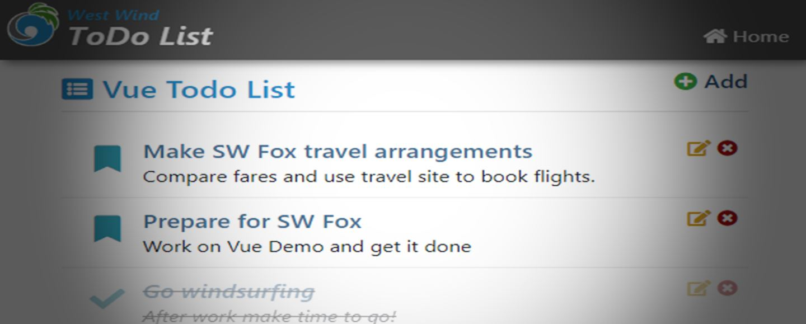

*prepared for:*  [Southwest Fox 2019](http://www.swfox.net/)  

[Session Materials on GitHub](https://github.com/RickStrahl/SWFOX2019_Vue)


Web Frameworks come and go - frequently. [VueJs](https://vuejs.org/) is yet another Web Framework (YAWF), but  I think you'll find that VueJs is a bit different than most other frameworks. Unlike most of its peers VueJs is not specific to building full featured client side SPA (Single Page Applications) which it supports, but it also addresses much simpler scenarios of enhancing existing simple HTML pages.

The focus of this article is on VueJs as a **drop in JavaScript Framework** that you can use in simple function HTML pages (rather than full featured SPAs) or in server generated HTML pages. Specifically I'll use [West Wind Web Connection](https://webconnection.west-wind.com) for my server side examples since it fits the **FoxPro target audience** of this paper, but the concepts really can be used with **any kind of server framework** - I use these concepts frequently with ASP.NET Core for example.

## Framework Overload
So why use Vue? It is after all another framework and there are already tons of other frameworks out there. 

I've used a number of JavaScript frameworks, and even though I have become a big fan VueJs, I tend to still use [Angular](https://angular.io/) as my primary framework to build full blown SPA applications. Vue also supports full blown SPA development with a full service Command Line Interface (CLI) and [WebPack](https://webpack.js.org/) based build system for bundling, packaging and support tooling. A framework like Angular or Vue with the full build process in place, works well for complex SPA applications. 

But you see, most of the big Web Frameworks are just that: Big and bulky. They require a large amount of bootstrap code just to load even a hello world application. More so, most require a complex **build process** that pulls in 100's of megabytes of dependencies, just to produce the final HTML output which often is also quite large (in the 100's of Kilobytes) especially for simple things.

If you're building a full featured, large Single Page Application front end for a complex enterprise application, that's perfectly fine. These build processes provide a number of other benefits such as automatically bundling and packing of resources, translating CSS from SCSS, LESS, provide tooling for testing and much more.

But it's **overkill** when you just want to drop a partial component into an existing page or add a small list of items into an existing static or server rendered HTML page. In fact, using a full SPA framework that's next to impossible to do effectively today (although Web Component proposals for many frameworks are aiming to change that some). 

### More Options with Vue
Where Vue really differentiates itself from other frameworks is that it can also easily be dropped into existing HTML pages using a single script reference, which allows Vue to be used more along the lines of how jQuery used to be dropped in to provide **incremental enhancement** to HTML pages.

Vue provides most of the functionality of other big frameworks that require full build processes, but with just a single, small (38kb compressed)script file library. It's actually slightly smaller than even jQuery. This means that with VueJs **it's very easy to enhance existing static or server rendered HTML pages** with easy JavaScript in much the same way that [jQuery](https://jquery.com/) could be used in the past as a simple drop-in to any page. In fact, VueJs can take over many if not most of the features that jQuery used to provide using declarative programming and model design.

> #### @icon-info-circle jQuery's Fall From Grace
> Even though jQuery has fallen out of favor over the years in favor of bigger frameworks, **it is still very useful** especially for simple page processing. Many of jQuery's features have been co-opted directly by the HTML DOM, but there are still many, many useful helpers that come in handy as well as built-in AJAX callback functionality that's easy to use. Although there's much less need for jQuery in applications that use modern data binding, almost every application I built with client side code still benefits from jQuery. Out of favor? Maybe. But not down for the count? Not just yet!

## Why use a a JavaScript Framework?
VueJs - like many of the other frameworks like Angular, React, Ember, Aurelia etc. - is a Model binding framework, that at it's heart provides an MVC/MVVM (Model View Controller, Model View ViewModel) data binding framework.

At the highest level all frameworks are based on a simple concept:

* A JavaScript data model that describes the data to be bound
* A template inside of HTML that describes how to render the data
* Some bootstrapping code that binds the model to a template
* Code that reacts to events and fires your JavaScript code


### Implicit vs. Explicit
A framework like jQuery requires you to **explicitly point at an element** and read or write a value. A framework like VueJs instead **implicitly updates your view when the model changes**. So rather than assigning a value to a DOM object, you are updating a simple value in the model which then automatically updates the DOM based on the new value assigned to the model property.  It's much simpler conceptually to update a simple value in code, than having to find and reference a DOM element for each update.

The end result of this implicit binding approach is that your code never (or very rarely) needs to directly talk to a DOM element. Instead it can just talk to the model, to affect changes on the DOM through the framework which handles the syncing of model to DOM.

### Data Binding is the Key!
The key feature of VueJs and other frameworks is data binding, which actually can affect more than what you traditionally think of as data, such as display attributes and UI state. While you will always want to bind actual data values like a name, date or description, you may also want to bind state data such as whether an item is enabled or disabled, whether it's visible or whether it has a specific CSS class or style associated with it. All of this can be handled through the declarative HTML syntax inside of a VueJs HTML template.

Just like you can easily bind data to a `ControlSource` in FoxPro, VueJs allows you to bind data to an HTML element or its attributes. Unlike FoxPro though, the data binding in Vue is much more flexible as it allows you to bind to **any property** of each element. You can bind to the most common `innerText`, `innerHTML` and `value` elements of course, but you can also easily bind a `title`, `class`, `style` or  `disabled` attribute. Essentially you can bind to any attribute that an element supports and bind to any event including custom user generated DOM events. 

This is very powerful as it allows the framework to abstract the DOM away almost entirely. Rather than pushing data items individually into the DOM every time a value changes, you can simply set a property value on the model, and the framework takes care of updating the HTML DOM based on the template bindings on the page.

### Event Binding
The other key feature is event binding. You can create methods on your model that you bind to the Dom and those methods can be triggered by events that the DOM fires. You can bind events like `click`, `blur`, `change` etc as well as any custom events you create on the DOM directly to methods on your model. Unlike classic event handlers these bindings are associated with your model and so make it easier to keep your code organized rather than creating random functions in your code.

Of course you can also call these methods on your model yourself directly. This means your model can describe your interaction and page logic both for internal (ie. you call your own methods as helpers) and event operation.

Additionally, methods in your model can also be used as binding expressions meaning you can use complex logic to easily to bind calculated or conditional values more easily using code. When bindings refresh these computed method bindings are refreshed also.

## First look at Vue Syntax
To give you an idea what a Vue 'HTML template' along with the model binding code looks like here's a simple example of a list of items displayed with display and editable fields:

```html
<!-- Template/View -->
<div id="todoApp">
    
<h1>{{appName}}</h1>

<div class="todo-item"
     v-bind:class="{completed: todo.completed}"
     v-for="todo in todos" >
     
    <div class="todo-content" 
         v-on:click="toggleCompleted(todo)">

        <div class="todo-header">
            <div v-if="!todo.isEditing" >
                {{todo.title}}
            </div>
            <div v-else>
                <input type="text"  ref="todoTitle" 
                        v-model="todo.title"
                        class="todo-header inline-editor" />
            </div>
        </div>                            
        <div v-if="!todo.isEditing" style="min-height: 25px;" >
            {{todo.description}}
        </div>
        <div v-else>
            <textarea v-model="todo.description"
                      class="inline-editor"></textarea>
        </div>
    </div>
</div>
</div>

<script>
// Model

// create the view model separately - more options this way
var vm = {
    appName: "Vue Todo List",
    todos: [ 
        { 
          title: "todo 1",
          description: "description",
          completed: false,
          isEditing: false
        },
        { ... },
        { ... }
    ],
    toggleEditMode: function(todo) { todo.isEditing = !todo.isEditing },  // ES5 syntax
    toggleCompleted: (todo)=> todo.completed = !todo.completed   // ES2016+ syntax (arrow function)
 }
 
// Initialization Code - bind the model to the template
var app = new Vue({
    el: '#todoApp',
    data: function() {
       return vm;  // bind the model to the view
    }
});
<script>
```

Looking at the HTML and the Vue template syntax it should be pretty easy to discern what this page does, and that's part of the appeal of using a data binding framework. The templates look pretty much like normal HTML with some additional attributes and some `{{expression}}` binding expressions.

If you run this page here's what it looks like (with some added edit and remove buttons that I get to later):

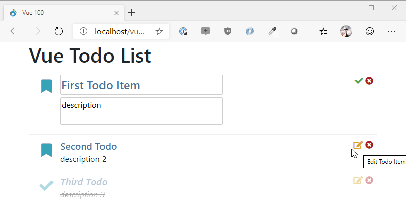

It's a pretty simple page, yet there's a lot going on in this example actually. There's literally no code to update the DOM as all the rendering is taken care of by rendering data from the model (the `vm` instance). Even operations like changing the edit state of an item and displaying a completely separate view, or toggling the completed state are simply updating a model value (`todo.completed = !todo.completed` for example) that is then immediately reflected in the UI.

The Vue specific tags are those that start with `v-` like `v-bind`, `v-model`, `v-if`, `v-else` and so on. There are also special directives like the binding a `v-bind:class` or `v-bind:style`, where you can provide a class value to describe behavior like class names or styles.

The code to hook this up is also very simple - you create a model of data which typically is an object with properties and potentially nested properties/arrays that contains the data that is to be rendered into the View. Each simple value can be bound to `v-text` or via `{{ property }}` or - for nested objects - `{{ property.childproperty }}` bindings.

Because data binding in VueJs is **reactive**, any change you make to the model is immediately reflected in the HTML view, so when you change the `vm.todos` array or any of the Todo items inside of it, the template is immediately refreshed and the data updated.

The important point is this:

> VueJs, not your own JavaScript code is responsible for updating the HTML DOM. Your code can just update the model data to update the HTML displayed on the screen. Note that you **still** can update HTML via the DOM, but generally your aim is to let the model do the work whenever possible.

All the tedious DOM update logic of poking values into the UI via code (ie. `$("#appname").text(vm.appname)`) and more importantly the more complex scenario of updating a list of data via code, is not necessary . Instead you simply assign a value to a model (`vm.todos[0].title = "Updated Todo Item"`) and that value immediately displays.

### Imperative vs. Declarative
If you come from classic style of JavaScript programming using raw JavaScript or jQuery, you likely have used manual updates via code, where you **imperatively** write each change into the HTML document. 

With VueJs on the other hand, you only **declaratively** make changes to the model data, which in turn triggers VueJs to update the HTML template with the newly updated model data. The framework is smart enough to detect which specific properties have changed and updates only those HTML elements that effectively have changes.


To demonstrate here are a couple of examples:

#### Using an imperative approach with jQuery:

```js
// using jQuery
var total = 200;
var subtotal = 180;

// throughout the page life cycle
$("#invoiceSubTotal",subtotal);
$("#invoiceTotal",total);
```

#### Using a Declarative approach with VueJs:

```js
// create the data model (vm = View Model by convention)
var vm = {
    total: 200,
    subtotal: 180
};

// bind the model to the view
var app = new Vue({
    el: '#myApp',  // element to bind to
    data: function() {
       return vm;  // return the model here
    }
});

...

// throughout the page life cycle

// you only update the model
vm.total = 200;
vm.subtotal = 180;
// which transparently updates the DOM
```

Altough this is actually more code for this simple case, once you add more data to your model (or multiple models and multiple bindings), you only need to add properties to update. You don't need to know anything about what name an element on the page has to update it. It just happens when the model changes.

In theory a VueJs (or any other framework) page/application should never (or at least very rarely) access the HTML DOM directly and instead update the model that drives the HTML display. Using the model to update is preferred because:

* It's much easier to write that code
* It's independent of HTML or DOM
* Potentially could work with other 'renderers' like native mobile
* Bulk DOM updates are faster than individual updates
* Less error prone (ie. if you rename an HTML element code still works)
* No dependencies on specific DOM features (or even browser/mobile features)

## Vue Basics 
At a high level Vue is not very different from other frameworks. There are a handful of key features that Vue provides:

* Inline HTML Templates
* Declarative directives (`v-for`, `v-if`, `v-show` etc.)
* Model -> Template Binding (`v-text`, `v-html`, `{{ }}`, `v-bind:attr`)
* Two-way Model Binding (`v-model`)
* Event Binding (`v-on:event`)

The idea is pretty simple. During the page's startup you do the following:

* You create a data model
* You add properties to your model for data
* You can nest objects or use arrays
* You add method for event handlers
* You create a Vue instance
* You attach the Vue instance to a DOM element
* You attach your model to the Vue instance

Let's break all that down step by step.


Before I dive in let's create a simple HTML page first that'll hold the example. I'm using the sample folder here and am pulling in the Bootstrap CSS library, FontAwesome and VueJs from a local store. They just make things look nicer, but don't affect any of the operations here.

```html
<!DOCTYPE html>
<html xmlns="http://www.w3.org/1999/xhtml">

<head>
    <title>Vue 100</title>

    <meta charset="utf-8" />
    <meta http-equiv="X-UA-Compatible" content="IE=edge" />
    <meta name="viewport" content="width=device-width, initial-scale=1, maximum-scale=1" />
    <meta name="description" content="" />

    <link rel="shortcut icon" href="./favicon.ico" type="image/x-icon" />
    <meta name="apple-mobile-web-app-capable" content="yes" />
    <meta name="apple-mobile-web-app-status-bar-style" content="black" />
    <link rel="apple-touch-icon" href="./touch-icon.png" />

    <link rel="icon" href="./touch-icon.png" />
    <meta name="msapplication-TileImage" content="./touch-icon.png" />

    <link href="./lib/bootstrap/dist/css/bootstrap.min.css" rel="stylesheet" />
    <link href="./lib/fontawesome/css/all.min.css" rel="stylesheet" />
    <link href="todo.css" rel="stylesheet" />

    <!-- <script src="https://cdn.jsdelivr.net/npm/vue/dist/vue.js"></script> -->
    <script src="./lib/vue/dist/vue.js"></script>
</head>
<body>
    <div id="todoApp">

      <!-- page content here -->        
        
    </div>
</body>
</html>
```

The key item specifically relevant here is the inclusion of VueJs:

```html
<!-- <script src="https://cdn.jsdelivr.net/npm/vue/dist/vue.js"></script> -->
<script src="./lib/vue/dist/vue.js"></script>
```

### Start with a Model
Generally it's best to start with a model of data that you want to bind. It's not required of course, but I find it helps to think about the data you are going to render first. Let's start with the simplest thing possible.

Personally I like to create my model separately from the View object and then pass that to Vue rather than defining the model directly on the Vue object as the documention shows. The reason for this is that I like to create a locally scoped variable that I can access for my model so that I can **always reference** the model and not have to rely on the sometimes unpredictable nature of the `this` reference in JavaScript. 

So I start with a model, which is just a JavaScript object map. You can create a class or function closure which in JavaScript also behavior like objects. for the following I use a Object Map.

> Ideally you'll want to put script code into a separate JavaScript file, but for this first example I'll use a `<script>` tag in the HTML page.

At the bottom of the HTML page before the `</body>` tag add the following:

```js
<script>
// create this first for a script wide reference
var vm = {
    appName: "Todo Application"
}

// bind the model to the todoApp Id/Element in the HTML
var app = new Vue({
    el: '#todoApp',
    data: function() {
       return vm;  // bind the model to the view
    }
});
```

I  create the model first, followed by creating an instance of the Vue object.

The Vue instance is created and the two key items that are set on the passed in object map are:

* **el**: The DOM Element to bind the model to using a CSS selector
(`#todoApp` means *Id of todoApp*)
* **data**: A JavaScript function that returns the model

The `data` object can either be an object instance or a function. The Vue docs recommend a function because it allows initialization code to be added **just before the model is loaded** which is after the DOM has loaded. In this method I simply return my Vue model as a static value but you can insert initialization code into that function like setting dynamic config value for example.

The object you pass can contain many other options, including a list of filters, locally used components, and much more. For now all we want is the model.

### Add the HTML Template
The term HTML template may be confusing, because in reality you are not creating a separate 'template' but rather are writing the Vue template syntax directly into your existing HTML document. So in the area where above it says `<!-- page content here -->` you can now add the following:

```html
<h1>{{ appName }}</h1>
```

If you open the HTML page in the browser now you should see the "Todo Application" displayed as a big header string. If you change your code and change `appName` to a different value you can see the value updated.

### Dynamic Updates
The first binding works but it's not very dynamic. Let's do something slightly more interesting by adding a value that will dynamically change. Let's go back to the model and add a new property and an initialization function:

Let's add a couple a new property to the model and initialize the model. What I'll do is add a little time update mechanism that shows the current time updating every second by adding a `time` property and an `initialize()` function:

```javascript
// create the view model separately - more options this way
var vm = {
    appName: "Vue Todo List",
    time: new Date(),
    initialize: function() {
        setInterval(function() { vm.time = new Date() },1000);            
    }        
 }
 
// initialize the model
var app = new Vue({
    el: '#todoApp',
    data: function() {
        vm.initialize();
        return vm;  // bind the model to the view
    }
});
```

`time` holds a JavaScript data, and when the model is initialized I explicitly create a timer (`setInterval`) that refreshes every second and creates a new date. IOW, every second the `vm.time` property is updated and should update the HTML with the new time.

To make this work we'll need to update the template:

```html
<h1>{{ appName }}</h1>
<hr>
<p>Current time is: <b>{{time.toLocaleTimeString()}}</b></p>
```

When you run this now you'll see the time updating every second:

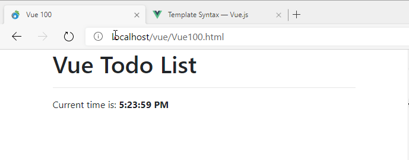

While maybe not impressive to look at, it's pretty powerful. It demonstrates neatly how you - or an automated operation in a timer here - can update just the model data. In this case `vm.time` is updated inside of the timer loop, and each time the timer ticks the model is updated. You can see that change reflected immediately in the HTML and so the time seems to be ticking up every second.

**You don't write code to update the HTML DOM, you write code to simply change values on the model.**

Vue checks the model for changes and when a change is detected fires a DOM update cycle that renders the affected parts of the template. Cool, right?

### Static `{{ }}` Bindings
Note that you can bind data in a few different ways. The **mustache syntax** used above is very descriptive and it's a content binding that fills data into the document. It's statically expanded into the template. It's the most descriptive way to bind.


### Content Binding on DOM Controls
Static bindings are very readable but they won't work for all controls because it requires a control that can take content and encode it at encoded/safe text.

You can also express those same bindings as a content-binding `v-text` or `v-html` tags to bind content instead:

```html
<p>Current time is: 
<b v-text="time.toLocaleTimeString()"></b>
```

`{{ }}` bindings always bind HTML, safely encoded text. If you want to bind raw HTML you have to use the use `v-html` instead of `v-text` or `{{ }}` tags. The following renders an HTML string from Markdown text, which is a result that **should not be encoded**:

```html
<div v-html="getRenderedMarkdown()"></div>
```

### DataBinding in Vue
`v-text` and `v-html` binding are **content** bindings meaning they bind the content that are directly rendered into the HTML between the element brackets of these attributes.

But you can bind **any attribute** with Vue using the `v-bind:attribute` syntax. For example to bind the title attribute in the header you might use:

```html
<h1 v-bind:title="appName + ' ' + time.toLocaleTimeString()">{{appName}}</h1>
```

An alternate slightly simpler syntax is using `:attribute`.The same title binding can be expressed like this:

```html
<h1 :title="appName + ' ' + time.toLocaleTimeString()">{{appName}}</h1>
```

The `:` is a shortcut for `vbind:`. Although shorter I often find `v-bind` more descriptive and easier to read, but that's pure preference.

Now when you hover over the document title you should see the title in a tool tip and the tool tip text will change every second to reflect the time as well.

The expression above brings up an important point: 

> Vue 'expressions' are **raw JavaScript** and you can pretty much use any valid JavaScript expression inside of a `v-bind` directive or a `{{ }}` expression. Unlike other frameworks that use pseudo JavaScript that uses special parsing, in Vue you can simply use raw JavaScript for native functions or your own code as long as you can reference it through your model.

### Editing Data
Displaying data is nice, but you also need to update data in your model from input created in the user interface. Vue supports **two-way data binding** via the `v-model` directive which allows you to bind a model value to a control in much the same way as `v-bind` does, but also supports **binding back** to the data source. You can use `v-model` with any of the HTML input elements.

Here's what this looks like:

```html
<p>
    <label for="">Update the App Name: </label>

    <input type="text" 
            class="form-control"
            v-model="appName"
            />
</p>
```

Notice the `v-model="appName"` attribute which binds the app name to the input box. When you now run this, you can type into the edit box and as you type you can immediately the title update:

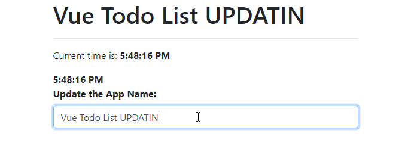

What's nice about this is that you can update your model values and immediately see the changes reflected without any sort of update mechanism. If you update a value that triggers changes to another value (like say you add an order item and recalculate a total) those new values are immediately updated.

This functionality makes it very easy to create very interactive applications.

### Event Handling
Data binding on its own is powerful but it's not all that useful if you can't fire off actions as well. To do this you can bind DOM events to functions in your model.

Let's add a button to the page that allows resetting the value of the `appName` to its default value after it's been changed, or to an updated value if it hasn't.

```html
<button class="btn btn-primary mt-2" 
         v-on:click="resetAppName()">
    <i class="fas fa-recycle" style="color: lightgreen"></i> 
    Reset to Default                
</button>
```

This hooks the `click` event of the button to an `resetAppName` function in the model:

```javascript
resetAppName: function() { 
    if (vm.appName != defaultAppName)
        vm.appName = defaultAppName;
    else
        vm.appName = defaultAppName + " RESET";   
}
```

When you click the button the above code fires and you have access to the current model. You can also pass parameters to the function from script, including in scope variables, which is an important and powerful feature we'll look at when look at list binding.

### Computed bindings
Vue is also smart enough to do what are basically computed bindings, if you bind to a method in your model:

```javascript
var vm = {};
vm = {
  firstName: "Rick",
  lastName: "Strahl",
  fullName: ()=> vm.firstName + " " + vm.lastName
};
```

You can then embed can then print out the full name like this:

```html
<div>{{ fullName() }</div>
```
What's nice is that because this is a model function that is bound into the HTML template, if you change `firstName` or `lastName` the name in the UI is still updated.

### Conditional Binding
One important thing that UI needs to do is conditionally bind things based on a *truthy* state. Any value that has a value is truthy: a string that is not null, undefined or empty, a non-zero number, `true`, a non-null object are all truthy values. `0`,`false`, `null`, `undefined`, an empty string all are non-truthy values. 

For example, you might want to only and error message display if there's an error message to display.

To create a conditional binding you can use `v-if="errorMessage"` which doesn't render the element if the errorMessage is empty, null or undefined, or `v-show`/`v-hide` which make the element hidden but still in the document.

I'll use `v-if` here to create the error box:

```html
<!-- only render this if there's an errorMessage to display -->
<div class="alert alert-warning" v-if="errorMessage">
    <i class="fas fa-exclamation-triangle" style="color: firebrick"></i>                
    {{errorMessage}}
</div>
...
<button class="btn btn-primary " v-on:click="setError()">
    Toggle Error
</button>
```

The idea is if `errorMessage` is empty it doesn't display. When you click the button the error message is toggled, simulating an error that is displayed and cleared.

Then in the model we need an `errorMessage` property and a the `setError()` method that sets the error message whenever the button is clicked:

```js
 errorMessage: "",
 setError: function() {
    if (!vm.errorMessage)
        vm.errorMessage = "An error occurred on " + new Date().toLocaleTimeString();
    else
        vm.errorMessage = "";
}    
```        

If you run and click the button the error message is displayed and hidden after each click. Conditional binding is very useful for toggle states and allows you to easily create multiple states using separate html blocks for on and off states. For example, for a login button you might display a link to the login form when the user is not logged, but display the user name and a link that goes to the user's profile instead.

### List Binding
So let's step up a little bit from the basic stuff to something a little more data driven by creating the typical ToDo list app. 

To make this a little more interesting I'll use EcmaScript 2015 with native module loading. All ever green browsers - Chrome, Edge, FireFox, Opera - etc now support EcmaScript 2015 so you start taking advantage of these newer browser features **without having to rely on complex build systems**. The module system is one of the nicest features of EcmaScript 2015 because it lets each module determine what dependencies it has without having to load them all into a startup HTML page in the right order.

Anyway, this allows breaking up code easily into multiple source files and reference any dependencies.

* TodoList-LocalData.html - base HTML page
* todoApp.js  - entry point JavaScript file, that holds the Vue model
* todo.js - holds a todo item class

This is loaded into an HTML page like this:

```js
<script src="./todoApp.js" type="module"></script>
```    

Then `todo.js` contains the an individual Todo item class definition which is then loaded by `todoApp.js` - I'm separating this out into a separate file because we'll want to reuse that same class later in another sample page.

```js
export class Todo {
    constructor(initial = {}) {
        this.id = null;
        this.title = "Todo";
        this.description = "";
        this.completed = false;
        this.entered = new Date();
        this.isEditing = false;
        
        if (initial)
             // this allows mapping an object passed for initial values
             Object.assign(this,initial);
    }


    static loadTodos(){
        var todos = [
            new Todo ({ 
                title: "Make SW Fox travel arrangements",
                description: "Compare fares and use travel site to book flights."
            }),
            new Todo( { 
                title: "Prepare for SW Fox",
                description: "Work on Vue Demo and get it done" 
            }),
            new Todo( {
                title:"Go windsurfing",
                description: "After work make time to go!"
            }),
            new Todo({
                title: "Drop Everything - It's Windy!", 
                description: "It's nuking, let's get in the car and go!"
            })
        ];

        return todos;
    }
}
```

This is modern JavaScript using classes so it looks a lot cleaner than classic JavaScript using only functions and protypes. This class defines a **TodoItem** class with properties for a title, description and completed status and a few others.

There's a static method call `loadTodos()` which creates some dummy data and returns an array of **TodoItems**.

Note the module syntax. In order to use a items from **module** you have to export them. Here I'm exporting the class. You can have multiple exports in a single file. For example, I can subclass Todo and export the subclass as well:

```javascript
export class Todo2 extends Todo {
    constructor(){
        this.notes = "";
    } 
}
```

Next I create `todo.js` which imports the data

```js
import { Todo } from "./todo.js";
```

which gives me access to the exported class by referencing it. Note that the export here is a class, but it can be **any JavaScript** expression, value or type. Whatever you export you can use as an import. Here todo can be used with `new ToDo()` to create a new todo item.

Here's the code to create an initial View Model, and assign it to Vue:

```js
import { Todo } from "./todo.js";

const newTodoText = "*** New Todo";

// create the view model separately - more options this way
var vm = {
    appName: "Vue Todo List",
    todos: Todo.loadTodos(),  // [] array of todos    
};


// initialize the model
var app = new Vue({
    el: '#todoApp',
    data: function() {
       return vm;
    }
});
```

The `TodosList-LocalData.html` then has a root element in the page to which Vue is bound. 

Here's a really simplified binding setup for this:

```html
<div id="todoApp">
    ... header stuff
    
    <div class="page-header-text">
        <i class="fa fa-list-alt"></i> {{ appName }}
    </div>

    ... other layout

    <div>
        <div class="todo-item"
            :class="{completed: todo.completed}"
            v-for="todo in todos" >

            <input type="checkbox"  
                    class="float-left mr-2" 
                    v-model="todo.completed"  /> 

            {{todo.description}}
        </div>
    </div>
</div>    
```

This tiny bit of markup displays a checkbox to bind to each Todo's `completed` property and also the description. Here's what's pretty cool: Because `completed` is a checkbox and is bound using `v-model` (as we did earlier with the textbox), you can actually toggle the `completed` state on each todo item by clicking the checkbox!

By using a custom `completed` css style:

```css
.completed {
    text-decoration: line-through;
    font-style: italic;
    opacity: 0.4;
}
```

toggling strikes out the todo item and makes it transparent which makes it look disabled: 

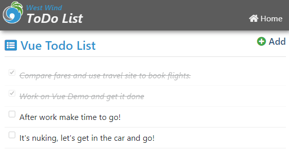

Cool, right? Notice there's no code to manipulate the DOM, not even code to set the model, but instead toggling the checkbox, binds back to the model of an individual Todo item, which causes the state to change and the UI to re-render with the now updated styling.

Cool - let's make this look a little nicer. I'm going to add some CSS that makes the list look nicer and adds a few nice touches we'll use later:

```css
.todo-item {
    padding: 8px;
    border-bottom: 1px solid #eee;
    transition: opacity 900ms ease-out;
}
.todo-header {
    font-weight: 600;
    font-size: 1.2em;
    color: #457196;
}
.todo-content {
    padding-left: 30px;
}
.todo-content .fa-check {
    color: green !important;
    font-weight: bold;
    font-size: 1.2em;
}
.completed {
    text-decoration: line-through;
    font-style: italic;
    opacity: 0.4;
}
.inline-editor {
    min-width: 200px;
    width: 50%;
    margin-bottom: 5px;
}

[v-cloak] { display: none; }
```

So let's put this to use and make the Todo items look nicer:

```html
<div class="todo-item"
     :class="{completed: todo.completed}"
     v-for="todo in todos" >
    
    
    <i class="fa fa-fw float-left text-info" 
    style="margin: 10px 10px 20px; font-size: 1.7em"
    v-on:click="toggleCompleted(todo)"
    :class="{'fa-bookmark': !todo.completed,                      
             'fa-check': todo.completed,
             'text-successs': todo.completed 
            }"        
    ></i>
    
    <!-- action icons -->
    <div class="float-right">
    <i class="fa " :class="{
            'fa-edit': !todo.isEditing, 
            'fa-check': todo.isEditing, 
            'text-success': todo.isEditing 
        }"
        @click="toggleEditMode(todo)"
        style="color: goldenrod; cursor: pointer"
        title="Edit Todo Item"
        v-show="!todo.isEditing || todo.title"></i>
    
    
    <i class="fa fa-times-circle"
        @click="removeTodo(todo)"
        style="color: firebrick; cursor: pointer"
        title="Remove Todo Item"></i>      
        
    <!-- content -->
    <div class="todo-content">
        <div class="todo-header">
                {{todo.title}}
        </div>                            
        <div style="min-height: 25px;" >
            {{todo.description}}
        </div>
    </div>        
</div>
```

which looks like this:


Let's break it down. The Check Toggle is now on the bookmark or check icon on which you can click. So rather than a checkbox, I use an icon as a toggle. To do this a `click` handler is used:

```html
<i class="fa fa-fw float-left text-info" 
     :click="toggleCompleted(todo)"
     :class="{'fa-bookmark': !todo.completed,                      
              'fa-check': todo.completed
            }"></i>
```

I'm using the special `:class` binding to specify styles to display based on a 'truthy' expression. If completed show the check mark - otherwise show the bookmark. This is a powerful feature that makes styling based on state very easy.

Since there's no more checkbox, we have to fire some code to toggle the state. I could do this right inline like this:

```html
:click="toggleCompletd(todo)"
```

but generally a function is a better call as it's unlikely to be so simple. Inside of the `vm` I can now implement the method:

```js
toggleCompleted: (todo)=> {
    todo.completed = !todo.completed;
},
```    

Notice that the method expects a `todo` item as a parameter. Also note the click handler passes a `todo` item. Vue is smart enough to figure out which item of the array needs to be passed to the function that is called! This makes it very easy to figure out which item needs to be acted upon!

Next, let's implement the Remove button. 

```html
<i class="fa fa-times-circle"  v-on:click="removeTodo(todo)" />
```

Same idea - pass the todo to a function in the model:

```js
removeTodo: (todo)=> {
    vm.todos = vm.todos.filter((td) => td != todo);        
},
```

This code uses the `Array.filter()` function to create a new array that filters out the existing item and assigns it the todo list. 

When you now click on the remove button, the item disappears from the list.

### Adding Inline Editing
So far, other than completing an item we haven't set up a way to edit the todo items. Let's hook up the edit button:

```html
<i class="fa "  
   :class="{'fa-edit': !todo.isEditing, 
         'fa-check': todo.isEditing, 
         'text-success': todo.isEditing 
    }"
    @click="toggleEditMode(todo)"
    title="Edit Todo Item"
    v-show="!todo.isEditing || todo.title"></i> 
```

So what this attempts to do is toggle the edit mode on a todo item. The UI class has a `todo.isEditing flag` which is toggled by the function on the model:

```js
toggleEditMode: (todo)=>{        
    todo.isEditing = !todo.isEditing;        
},
```

To add editing I'm changing the code a little like this:

```html
<!-- content -->
<div class="todo-content">

    <div class="todo-header">
        <div v-if="!todo.isEditing" >
            {{todo.title}}
        </div>
        <div v-else>
            <input type="text"  ref="todoTitle" 
            v-model="todo.title"
            class="todo-header inline-editor" />
        </div>
    </div>                            
    <div v-if="!todo.isEditing" style="min-height: 25px;" >
        {{todo.description}}
    </div>
    <div v-else>
        <textarea v-model="todo.description"
                class="inline-editor"></textarea>
    </div>

</div>
```

Notice the `v-if` and `v-else` directives which conditionally display either the raw text, or an input field or textarea for editing the title and description. 

Here's what editing an entry looks like:

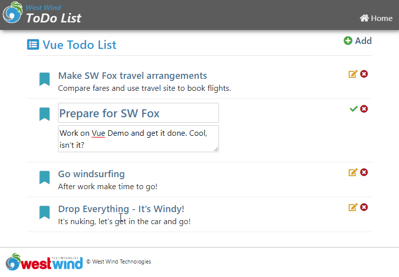

When done I can click on the check button to essentially toggle the todo's `isEditing=false` state. When I do the view toggles back to display mode and then updated value display.

Pretty cool, right? Without writing any DOM manipulation code we've just made changes to two input fields and update the UI with the new values.

So that works, but now let's take a look and load data from a server and FoxPro running a Web Connection application.

## Adding Server Data
So far we've updated local data which means every time the page reloads, the original data is restored as it's statically recreated. More realistically we'd want to load data from a server.

I'm going to use a [Web Connection Web Server](https://webconnection.west-wind.com) serving data using FoxPro.

The first step is to create a new project with Web Connection. I'm going to create:

* `Vue` project program and `VueProcess.prg` Process Class
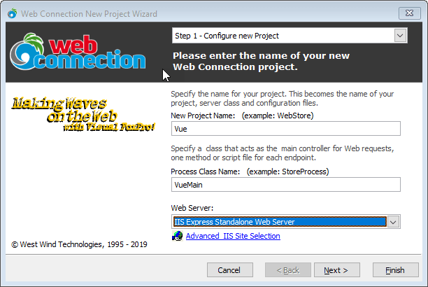

* Set up Virtual called `Vue` and a scriptmap of `.wcvue`
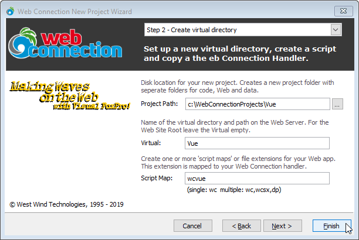

* Finally choose to create a REST Service
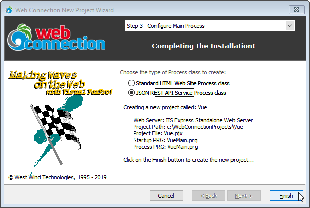

This will create a new Web Connection project that's ready to run. It'll open a command window in the project directory and you should be able to run:

```foxpro
launch()
```

to start the project and display a JSON status message.

Once that's working lets add some server side requests to serve todo items. Let's start with the list of todo items. Open `vueprocess.prg` and add:

```foxpro
FUNCTION ToDos()

IF !FILE(".\todos.dbf") 
   ReloadData()	
ENDIF

SELECT id, title, descript as Description, entered, completed, isEditing ;
     FROM TODOS ;
	 ORDER BY entered DESC ;
	 INTO CURSOR Tquery

Serializer.PropertyNameOverrides = "isEditing"

RETURN "cursor:TQuery"
ENDFUNC
*   Todos

FUNCTION ReloadData()

if (FILE("todos.dbf"))
   ERASE FILE Todos.dbf
endif  

CREATE TABLE TODOS (id v(20), title v(100), descript M, entered T,completed L, isEditing L)

INSERT INTO TODOS VALUES ("1","Load up sailing gear","Load up the car, stock up on food.",;
                        DATETIME(),.f.,.f.)
INSERT INTO TODOS VALUES ("2","Get on the road out East","Get in the car and drive until you find wind",;
                        DATETIME(),.f.,.f.)
INSERT INTO TODOS VALUES ("3","Wait for wind","Arrive on the scene only to find no wind",;
                        DATETIME(),.f.,.f.)
INSERT INTO TODOS VALUES ("4","Pray for wind","Still waiting!",;
                         DATETIME(),.F.,.F.)
INSERT INTO TODOS VALUES ("5","Sail!","Score by hitting surprise frontal band and hit it big!",  
                        DATETIME(),.F.,.f.)

RETURN .T.
ENDFUNC
* ReloadData
```

This code is simply created in a REST process class which turns each method into a REST endpoint. Any parameters passed are created from deserialized JSON, and you can also look at `Request.QueryString()` to retrieve query values from the URL.

The code then runs the logic to either create a new set of Todos, or returns an existing set. The set can be updated so it can be changed with the data from the client as we go through this demo.

To test this you can navigate to (assuming IIS Express here):

```http
http://localhost:7000/Todos.wcvue
```

For IIS you can use:

```http
http://localhost/vue/Todos.wcvue
```

which gets you:

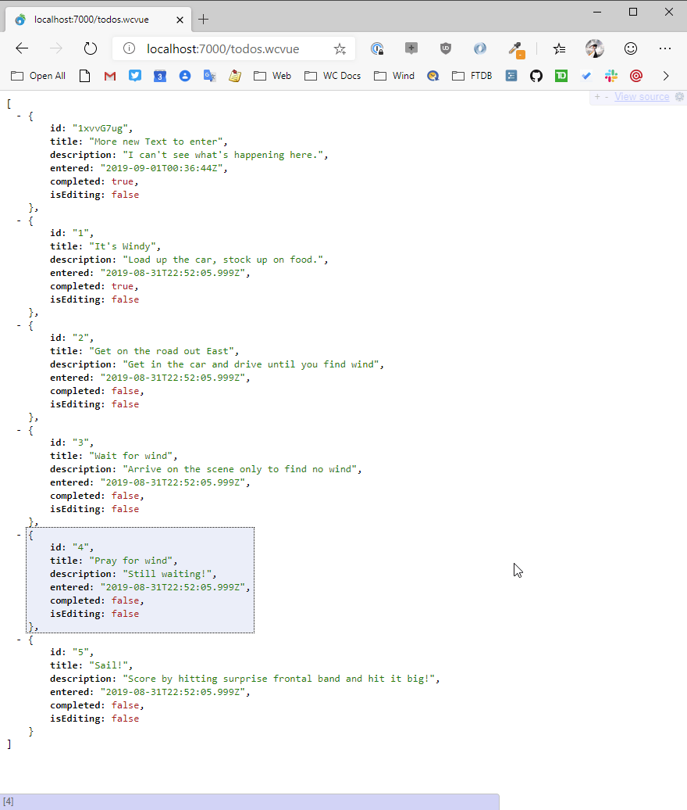

By default FoxPro serializes data using lower case because FoxPro can't properly determine case for database data in free tables (always upper case returned). You can overide by specifying any property name explicit like this:

```foxpro
Serializer.PropertyNameOverrides = "isEditing"
```

Generally you'll want to do this for any multi-part field names like `lastName`, `homePhone` etc.

Cool - so this works. Let's add a few more functions to handle the same operations we handled on the client todo example. `ToggleTodo()` first:

```foxpro
FUNCTION toggleTodo(loTodo)
LOCAL lcID

IF ISNULLOREMPTY(loTodo)
   ERROR "No Todo item passed."
ENDIF

lcId = loTodo.Id

SELECT * FROM TODOS ;
       WHERE id = lcId ;
       INTO CURSOR TTodo
   IF _Tally = 0
  	   ERROR "Invalid Todo to update."
   ENDIF

UPDATE Todos SET completed= loTodo.completed WHERE id = lcId

RETURN .T.
```

This is a POST request where the client is meant to post a full `Todo` record which is serialized as JSON, then deserialized and passed as a parameter to this function. The code then sets the value (that was already toggled on the client) and updates the database if the record exists based on the `id` of the record. Simple.

The `Todo()` handler is a little more complex because it handles:

* retrieving Todo item by id
* updating a Todo item
* adding a new Todo item

The single method basically looks at the **HTTP Verb** to determine which action to take.

```foxpro
FUNCTION ToDo(loToDo)

IF !USED("ToDos")
   USE ToDos IN 0
ENDIF
SELECT ToDos

lcVerb = Request.GetHttpverb()

IF lcVerb = "GET" 
   lcId = Request.Params("id")
   IF IsNullOrEmpty(lcId)
   	   ERROR "No Id provided to load a Todo item"
   ENDIF  
   
   SELECT * FROM TODOS ;
       WHERE id = lcId ;
       INTO CURSOR TTodo
   IF _Tally = 0
  	   ERROR "No Id provided to load a Todo item"
   ENDIF

   SCATTER NAME loTodo MEMO
   RETURN loTodo       
ENDIF

IF lcVerb = "PUT" OR lcVerb = "POST"
	IF VARTYPE(loTodo) # "O"
	   ERROR "Invalid operation: No To Do Item passed."
	ENDIF

   loTodo.IsEditing = .F.

	llNew = .F.
    LOCATE FOR id == loToDo.id
    IF !FOUND()
		APPEND BLANK
		loTodo.id = GetUniqueId(8)
      loTodo.entered = DATETIME()
		llNew = .T.
	ENDIF
	GATHER NAME loTodo MEMO
	
	*** Fix for differing field name
	REPLACE descript WITH loTodo.description
	SCATTER NAME loTodo Memo
ENDIF

IF lcVerb = "DELETE"
   lcid =  Request.QueryString("id")
   LOCATE FOR id == lcId 
   IF !FOUND() OR EMPTY(lcId)
      Response.Status = "404 Not found"
      ERROR "Invalid Todo - can't delete."      
   ENDIF
   
   DELETE FOR id == lcId
   RETURN .t.
ENDIF

RETURN loTodo
```

To test this you can't easily use a browser except for the GET operation because you actually need to post data to the server.

You can use a tool like [PostMan](https://www.getpostman.com/) or as I like to use my own product [West Wind WebSurge](https://websurge.west-wind.com/) which is a load testing tool that can also be used for testing individual URLs.

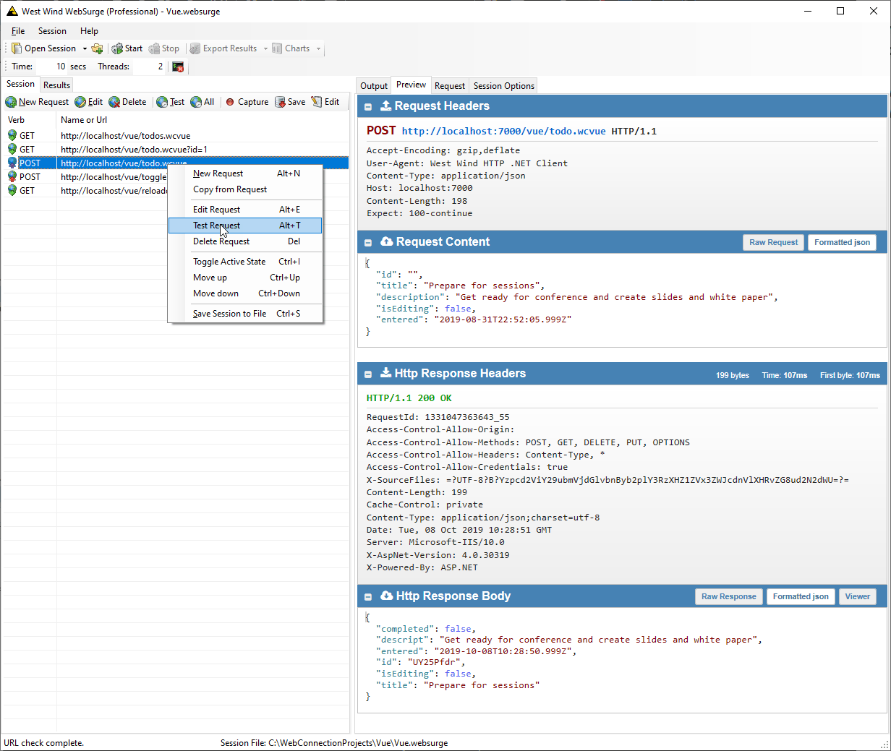

Using a tool like this makes it very easy to debug your server side code without having to run a client side application to hit the server first.

Ok we now have or server API - lets hook it up to the client.

## Calling Server Side API Code from the JavaScript Client
The updated application will use the same styling and HTML template logic - all we're going to do is essentially change the View model to get data from the server. 

Todo this I copied the original application and renamed the main HTML to `TodoList-RemoveData.html` and `todoAppRemoteData.js`.

Here's what the running application looks like:

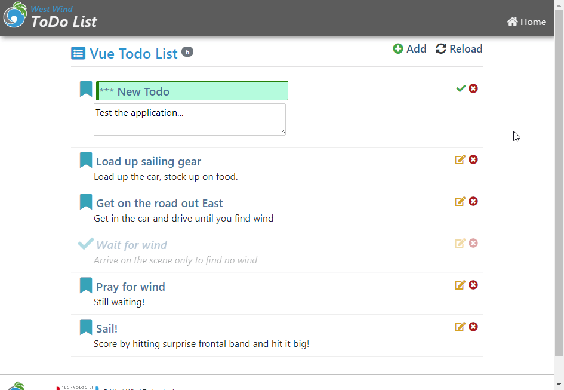

The only things that change are the View Model code in `todoRemote.js` so lets jump there first.

```js
ar vm = {
    appName: "Vue Todo List",
    todos: [],        
    errorMessage: "",

    loadTodos: ()=>{
        vm.errorMessage = null;
        vm.todos = null;
        return ajaxJson("todos.wcvue",null,
            (todos) => vm.todos = todos,
            (error)=> vm.setError(error));
    },
    ...
}    
```

So now we're retrieving data from the server and I'm using a Web Connection helper called `ajaxJson()` (in `ww.jquery.js`) here to make the call to the server. You can use `$.ajax()` or `Axios` or the native browser.  

For a Web Connection app you can add `ww.jquery.js` to the page you can do:

```html
<script src="lib/jquery/dist/jquery.min.js"></script>
<script src="scripts/ww.jquery.min.js"></script>

</body>
```

`ajaxJson()` is called with a Url, an optional value that is posted to the server, and a pair of functions with a success result that receives the deserialized result data, and an error handler that receives an error object with a `.message` property.

Errors display a message using the `toastr` library which provides pop up messages on the bottom of the screen.

```js
setError: (error)=>{
    vm.errorMessage = error.message;
    toastr.error(error.message)
}
```

The `ajaxJson()` call is asynchronous, meaning it returns immediately, leaving the data blank initially. Once the data arrives from the FoxPro server, it is simply assigned to the `vm.todos` which populates the model.

Remember that Vue monitors properties for changes, and so initially it renders with no data and shows an empty list and then when the data arrives renders the list that was retrieved. On the local machine this happens so quick it might as well be instant. On a remote machine with a slow connection it might take a second or so.

Here's what toggling looks like:

```javascript
toggleCompleted: (todo)=> {
    vm.errorMessage = null;
    var newStatus = !todo.completed;
    ajaxJson("toggleTodo.wcvue",
            { id: todo.id, completed: newStatus },
            (status)=> todo.completed = newStatus;
            (error)=>  { 
                todo.completed = !todo.completed;  // untoggle
                vm.setError(error); 
            } 
    );
},
```

The todo comes in and a new value is calculated. The todo status is not immediately changed however, because the call is asynchronous. So the ajax result call is what actually flips the completed value, so that the value is only updated if the call succeeds.

To remove a Todo works in a similar way:

```javascript
removeTodo: (todo)=> {        
    ajaxJson("todo.wcvue?id=" + todo.id,null,
        ()=> {
            vm.todos = vm.todos.filter((td) => td != todo);    
            toastr.success("Todo removed.");
        },
        vm.setError,
        { method: "DELETE" });
    
},
```    

The call requests to remove the todo with the given id. If the ID is found it's removed on the server and the server returns `.t.`. Only once the call returns do we then filter the data and remove the Todo that has been requested to be removed.

Finally let's look at the `SaveTodo()` function which saves an updated Todo.

```javascript
saveTodo: (todo)=>{
    vm.errorMessage = null;
    ajaxJson("todo.wcvue",todo,
    (td) => {
        // update id from server
        todo.id = td.id;
        todo.completed = td.completed;
        todo.entered = td.entered;
        todo.isEditing = false;        

        toastr.success("Todo updated.");
    },
    vm.setError);
},
```

The code passes in a Todo which is sent to the server to be saved. When the result comes back from the server we updated the relevant fields such as an id (for new entries) the server update time, and we explicitly flip the editing flag to `false`.

There are a few more requests but the idea is pretty much the same. As you can see to switch from the memory based Todo list to the server based list required only a little reworking of existing requests and didn't require any changes to the HTML UI - the only changes made were in the View model that's updating data.


## Hybrid Silo Application
So far I've shown what we could call a mini spa. A little self contained application which happened to run for the scope of the entire page. Vue supports adding components and components can be much smaller bits of code that can be combined to make up an application.

But you can also drop an interface like what I've shown here into a larger page as a 'sub-application'. So imagine you have a larger human resource application running and the todo app is a small sidebar that runs 'on the side' of the larger page.

Vue makes that entirely possible by allowing you to pick a DOM element and take over processing from that DOM element down.

Here's an example in a server rendered Time Trakker application. There's a project list that can be edited and new projects can be added interactively. This is perfect use case for Vue as you can provide interactive editing of content while the rest of the server rendered application continues to be server rendered and behave as you'd expect it. It's essentially an embedded mini-spa application inside of a server rendered page. This one happens to be very simple, but it's quite feasible the that you can have very complex interactions in the sub app.

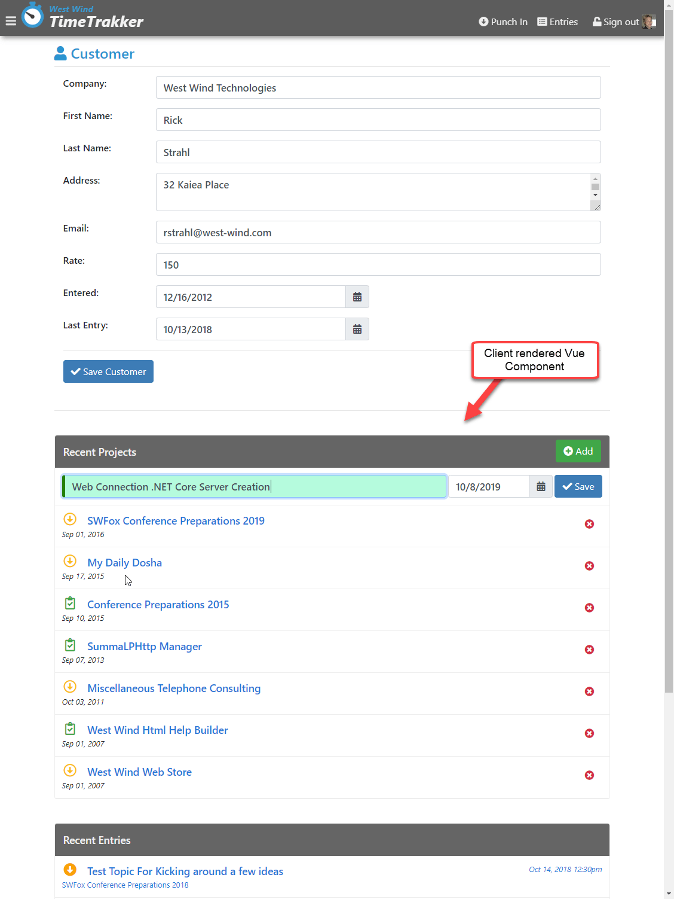

Let's take a look by starting with the HTML. I've removed the edit code for the moment, so this list is now basically just displaying data that is retrieved separately from the server page after the top part has loaded. In this way the page can lazy load recent project list.


```html
<div class="list" v-bind:class="{'hidden': !ready }">
    <div class="list-header">
        <button type="button" id="btnAdd"
                class="btn btn-success float-right" style="margin-top: -7px"
                v-on:click="addRowVisible = !addRowVisible">
            <i class="fa fa-plus-circle"></i>
            Add
        </button>
        Recent Projects
    </div>
    
    <div v-for="project in projects"
         class="list-item">
        <a v-on:click="removeProject(project)"
           class="float-right btn">
            <i class="fas fa-times-circle text-danger"></i>
        </a>
        <div class="list-item-header ">
            <i class="float-left fa-2x fa-fw far project-icon "
               v-bind:class="{
                'fa-clipboard-check': project.status == 1,'text-success': project.status == 1,
                'fa-arrow-alt-circle-down': project.status ==0, 'text-warning': project.status ==0   }"></i>
            <a v-bind:href="'project.ttk?id=' + project.pk">{{project.projname}}</a>
        </div>
        <div class="small font-italic">
            {{project.entered}}
        </div>
    </div>
</div>
```

This should all look pretty familiar by now. There are mustache bindings to the list fields and a bit of `:class` bindings to make sure the right icon is displayed. That bit is a little messy because it's inline but it's actually pretty straight forward.

The code to do this should also be familar:


```javascript
vm = {
    baseUrl: "./",
    projects: [],
    entries: [],
    
    newProject: createProject(),
    ready: false,
    addRowVisible: false,

    initialize: function () {
        vm.loadProjects();
    },
    loadProjects: function () {
        ajaxJson(vm.baseUrl + "projects.ttr", null,
            function (projects) {
                vm.projects = projects;
                // don't show projects until loaded
                vm.ready = true;
            }, function (error) {
                console.log(error);
            });
    },
    ...
}    

var app = new Vue({
    el: "#CustomerPage",
    data: function () {
        return vm;
    }
});
```

The model has a `projects` property that is populated by an Ajax call. When the data arrives the table is made visible and the data shows.

The more interesting part here is adding and removing records. But again, the process is roughly the same as we saw with the todo list.

To add a new Project a single row is added to the list that provides the editing surface. 

```hmtl
<div class="responsive-container">
    <input type="text" class="form-control" placeholder="New project name"
           v-model="newProject.projname"
           v-validate="'required|min:3'"
           name="ProjectName" id="ProjectName" />

    <div style="width: 250px;">
        <%= HtmlDateTextBox("StartDate","",[ placeholder="starts on" v-model="newProject.startdate"]) %>
    </div>
    
    <button type="button"
            class="btn btn-primary"
            @click="saveProject()"
            v-bind:disabled="errors.any() || !newProject.projname">
        <i class="fa fa-check"></i>
        Save
    </button>
</div>
    
<div class="text-danger" style="margin-top: 6px;" v-show="errors.any()">
    {{errors.first('ProjectName')}}
    {{errors.first('StartDate')}}
</div>
```

A new record is shown for editing when you click the Save button it's sent off to the server.

```javascript
saveProject: function () {

    ajaxJson(vm.baseUrl + "project.ttr", vm.newProject,
        function (project) {                    
            vm.projects.unshift(project);
            vm.newProject = createProject();
            vm.addRowVisible = false;

            toastr.success("New project added.");
        }, function (error) {
            toastr.error("Couldn't save project." + error.message)
        });
},
```

When the Ajax call returns the project from the server is added to the list of projects using `unshift()` which inserts an item at the beginning. Then there's some cleanup to remove the entered text and hide the add-row by way of an `v-if` flag.

This should give you an idea, what integration into another page looks like. The behavior inside of an existing page is not much different from the way we built the standalone Todo applet.

It's very common to have mini embedded sub-applets like this and Vue is well suited for this type of scenario because it can easily embed into a project.

## Some Things to Watch out for
So I've been very positive about Vue and for good reason. It's easy to use, has many very throughtful features that save time, it's fast and lightweight and works with existing applications. Few tools can boast half the claims that Vue makes including many of the other big boy frameworks. Because it is easy to work with and flexible Vue has become very popular.

However there are also a few caveats that you have to watch out for. More and more Vue has been pushed into the realm of build processes, Web Pack and CLIs and while it works great there, that also has had an effect on the plain vanilla JavaScript hosting in that there is a lack of documentation for features using plain Javascript. Many examples assume you using the Vue CLI and a WebPack based module loading approach and transpilation plus `.vue` pages. While that's cool for full SPA applications it's overkill for the scenarios we've discussed here.

Another problem along the same lines is that many components are designed to be used with Vue pages. While supposedly most components should work just fine standalone and through CLI projects, I found many components next to impossible to use with plain ES2015+ JavaScript due to incompatible module loading. Essentially few components support ES2015+ module loading and expect WebPack to fix up all the JavaScript binding nonsense.

Using ES5 style global namespace loading via script is often the only way to get many components to work if at all if you're not using a full WebPack build.

In short, make sure you test any Vue components you might need before jumping in or making assumptions of what works.


## Summary
Vue is no longer a new library, but it still has the feel of a breath of fresh air in the stodgy world of JavaScript frameworks that seem to pride themselves of making things ever more cryptic and complicated. Vue is wonderfully light weight and easy to integrate into existing applications.

It's an especially good fit for incrementally enhancing existing server side applications with JavaScript mini-spa or in page applets. I've been using this approach frequently in a number of applications with good results and i like the flexibility it affords by breaking up complex applications into smaller more manageable pages, rather than a massive SPA application.


## Resources
* [Slides, White Paper and Samples](https://github.com/RickStrahl/SWFOX2019_Vue)

<div style="margin-top: 30px;font-size: 0.8em;
            border-top: 1px solid #eee;padding-top: 8px;">
    
    this post created and published with the 
    <a href="https://markdownmonster.west-wind.com" 
       target="top">Markdown Monster Editor</a> 
</div>