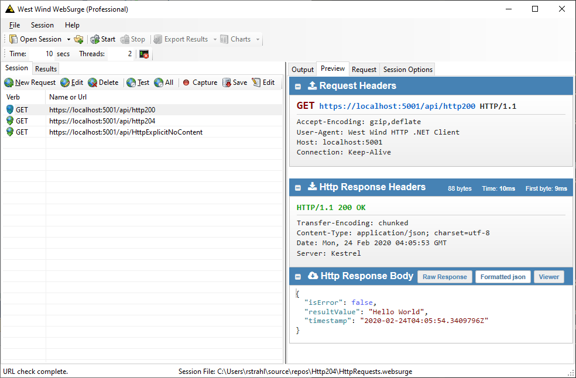
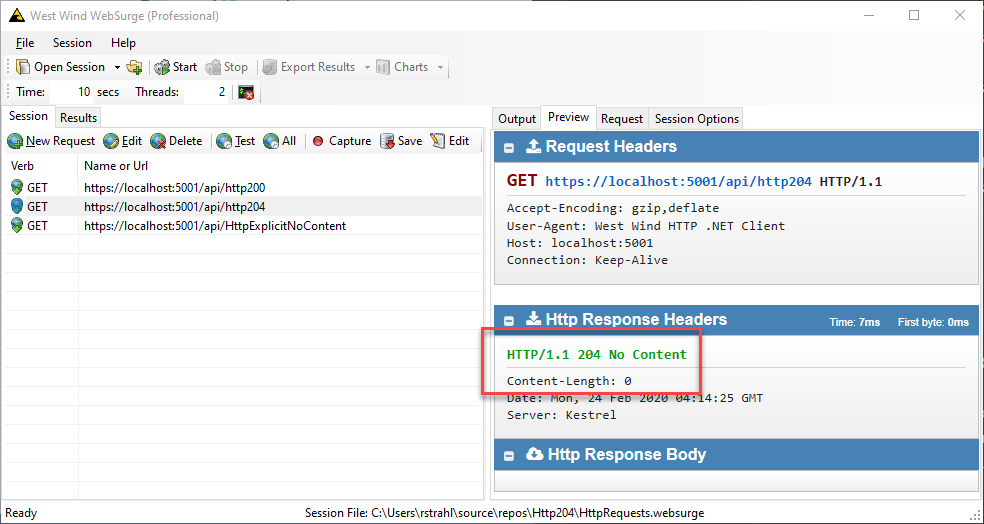
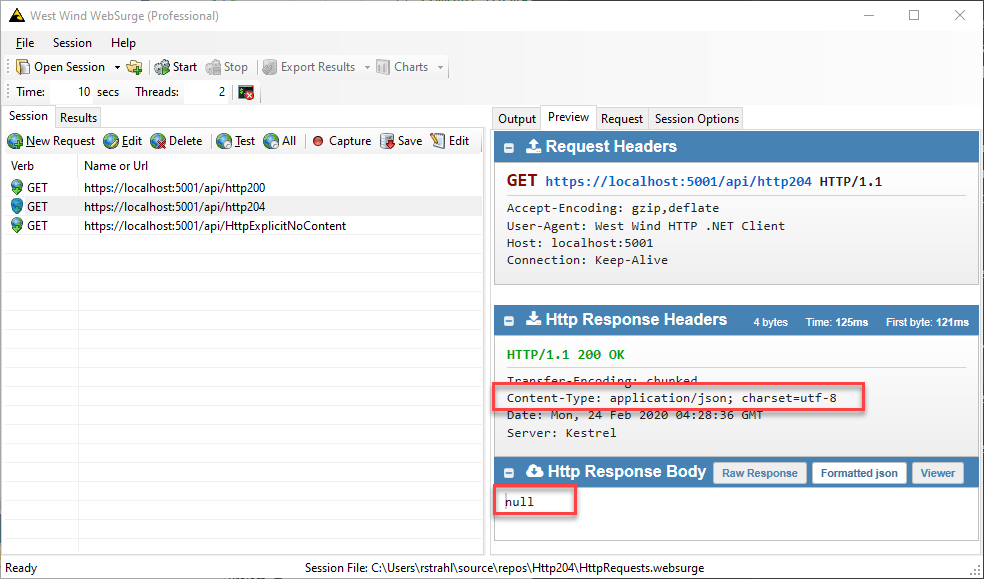

# Null API Responses and HTTP 204 Results in ASP.NET Core


ASP.NET Core 3.x has a behavior that results in API results that return null from the controller action returning a `HTTP 204 - No Content` response rather than a **null JSON result**. Presumably the idea is that if you return null from an API, your intention is to return *'no content'* and that sort of make sense in some cases. Except... when you're building an API **null may actually have a meaning on the client** or the client at minimum may be expecting a proper JSON response.

I've never been a fan of ASP.NET's API controllers 'helpfully' fixing up content like this. [String API results](https://weblog.west-wind.com/posts/2017/Sep/14/Accepting-Raw-Request-Body-Content-in-ASPNET-Core-API-Controllers) also don't return an `application/json` string result, but rather unhelpfully return `text/plain` raw text. That has never made sense to me and the auto 204 result is no better.

### Why so angry?
The reason this is a problem is because some frameworks that use HTTP clients look for specific HTTP result codes or expect a specific content type result for a 'data request'. Specifically Angular's `HttpClient` expects a 200 response or an `application/json` content type for successful requests. Fire back a 204 and it turns the response into an **error result** which is a pain in the ass to work with at that point.

That's not helpful.

### What does this look like?
To give you a better idea what I'm talking about here is a simple controller that demonstrates 3 different results using the default behaviors:

* A full object response (JSON)
* A null response (204)
* And an explicit NoContent Action (204)

Here's the simple controller:

```csharp
[ApiController]
[Route("api")]
public class HttpResultController : Controller
{
    [HttpGet,  Route("Http200")]
    public ResponseResult Http200()
    {
        return new ResponseResult {ResultValue = "Hello World"};
    }

    [HttpGet, Route("Http204")]
    public ResponseResult Http204()
    {
        return null;
    }
    
    [HttpGet, Route("HttpExplicitNoContent")]
    public IActionResult HttpExplicitNoContent()
    {
        return new NoContentResult();
    }
}

public class ResponseResult
{
    public bool IsError { get; set; }
    public string ResultValue {get; set;}
    public DateTime Timestamp { get; set; } = DateTime.UtcNow;
}
```


The first response from this request:

```csharp
[HttpGet,  Route("Http200")]
public ResponseResult Http200()
{
    return new ResponseResult {ResultValue = "Hello World"};
}
```

as you would expect **returns a JSON object**:



The result content-type is `application/json` and the output is a JSON string of the object's result.

The second request returns `null` from the controller action:

```csharp
[HttpGet, Route("Http204")]
public ResponseResult Http204()
{
    return null;
}
```

but **returns a HTTP 204 response**:



As you can see the result is `HTTP 204` and there's no `application/json` content type set for the Response. It's a pure No Content result.

Finally the last request is just for reference to demonstrate how to **explicitly return a no content result**:

```csharp
[HttpGet, Route("HttpExplicitNoContent")]
public IActionResult HttpExplicitNoContent()
{
    return new NoContentResult();
}
```

It also returns an HTTP 204 response which mirrors the previous request's `HTTP 204` output.

My point in showing this last request is that if you intend to return a no content result, it's not exactly difficult to do. So, having a shortcut that turns nulls into HTTP 204's seems... superfluous to say the least.

Personally I prefer the last method when I explicitly want to return a `HTTP 204` response. As mentioned a 204 or non JSON result may be interpreted incorrectly by a client framework as an error rather than a successful request and for that reason alone being explicit is a good idea.

Whether Angular's handling of the No Content Response is appropriate is up for debate (IMHO - no!), but that's another matter.

### Working around the Default Null to Http 204 Conversion
So, to fix the auto 204 conversion, there's an easy workaround: You can  remove the `HttpNoContentOutputFormatter` in `Startup.cs` and your `ConfigureServices()`method:

```cs
services.AddControllers(opt =>  // or AddMvc()
{
    // remove formatter that turns nulls into 204 - No Content responses
    // this formatter breaks Angular's Http response JSON parsing
    opt.OutputFormatters.RemoveType<HttpNoContentOutputFormatter>();
})
```

Et voila! Now when you re-run the null result request - it no longer produces a `HTTP 204` response, but rather creates the full JSON `null` result:



Problem solved. 

### Other solutions: Using a Result Message Type
This cat can also be skinned a different way by returning richer result values that guarantee that an object is return for **any valid result**.

Rather than returning `null` or any simple type values like strings, you can use a result message object that includes some status properties to indicate success and failure or a no data status. It always returns an object even if the actual result data might be null.

This pushes the check for no data or null to the client rather than the framework intercepting the HTTP call and guarantees that there's always a value returned, and non-value results only occur when an actual error occurs.

This also solves the problem in the aforementioned Angular example.

A typical result type might look like this:

```csharp
public class ResponseResult
{
    public string ResultValue {get; set;}
    
    public bool IsError { get; set; }
    public bool NoData { get; set; }
    public string Message {get; set;}
    public DateTime Timestamp { get; set; } = DateTime.UtcNow;
}
```

Rather than returning null, perhaps you set `IsError = true`  or `NoData = true` to indicate the actual result state to the client. But you can still set `ResultValue = null` if that means anything to your client application.

While this works, it does add some overhead in the form of extra types that have to be created. This is made even worse by the new `System.Json` Serializer which can't serialize dynamic or anonymous types, so you **can't do** something like this:

```cs
return new { ResultValue = null, IsError = false };
```

unless you re-enable JSON.NET as I tend to do in just about any project as I often return anonymous type results.

This approach is not my preference, but it's a good way to get around the null result issue described in this post.

### Summary
Yeah, I can bitch and moan about the choices the ASP.NET Core team is making for 'fixed up' API results, but at least there are always work arounds available to make this work as your application requires. 

The solution for the `null` result is simple, by removing the `HttpNoConteOutputFormatter` in the configuration. For the string issue there's more work required unfortunately and for that you can check [my older blog post on Accepting and Returning Raw Content](https://weblog.west-wind.com/posts/2017/Sep/14/Accepting-Raw-Request-Body-Content-in-ASPNET-Core-API-Controllers?Page=2). 

Hopefully this post will help a few of you to resolve HTTP 204 issue if it crops up for you more quickly than I did...

<div style="margin-top: 30px;font-size: 0.8em;
            border-top: 1px solid #eee;padding-top: 8px;">
    
    this post created and published with the 
    <a href="https://markdownmonster.west-wind.com" 
       target="top">Markdown Monster Editor</a> 
</div>