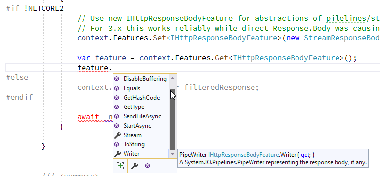

# Content Injection with Response Rewriting in ASP.NET Core


In building my [Westwind.AspNetCore.LiveReload middleware component](https://github.com/RickStrahl/Westwind.AspnetCore.LiveReload) a while back, one issue that came up was how to handle Response rewriting in ASP.NET Core. This middleware provides optional live reload functionality to ASP.NET Core projects letting you reload the active page as soon as any monitored file is changed. Rather than an external tool it provides this functionality as middleware that can be plugged in and turned on/off via configuration.

As part of that middleware logic, the component needs to inject some JavaScript for the WebSocket interaction into any HTML pages sent to the client for display in the browser. Each HTML page includes the content so the server can trigger a reload when a monitored file is changed on the server. In order to do this the middleware needs to look at any original HTML output and transform it with the injected script code.

## HTML Injection in ASP.NET Core Content
Let's back up for a second and talk about Response filtering and modifying content in `Response.Body`. If you want to do Response filtering you need to intercept the Response output stream and then intercept and look at the outgoing bytes written and rewrite them with your updated data. 

The way this used to work in classic ASP.NET was by using a special `Response.Filter` property, which was basically a filter stream applied to the Response stream. ASP.NET took care of taking your stream and chaining it to the `Response.Stream`. Multiple filters could be applied, effectively chaining the streams together.

### Response Wrapping in .NET Core 2.x
In ASP.NET Core there's no `Response Filter` so the process looks a bit different in ASP.NET Core, but essentially the concepts are the same. Instead of a filter you need to directly wrap the  `context.Response.Body` or - as I'll show in a minute by using an `IHttpResponseBodyFeature` wrapper. 

The raw filter wrapping looks something like this and this works both in .NET Core 2.x and 3.x:

```csharp
private async Task HandleHtmlInjection(HttpContext context)
{
    using (var filteredResponse = new ResponseStreamWrapper(context.Response.Body, context))
    {
        context.Response.Body = filteredResponse;
        await _next(context);
    }
}
```

This essentially wraps the existing `context.Response.Body` stream with a new stream. `ResponseStreamWrapper` in this case is a custom `Stream` implementation that  forwards most stream operations to the old stream and specifically overwrites the various `Write` methods to look at the outbound `byte[]` array to check for certain content and rewrite it - in this case looking for the ending `</body>` tag and injecting the LiveReload script there.

### ASP.NET Core 3.x Response Rewriting with IHttpResponseStreamFeature
While the above approach also works in ASP.NET Core 3.1, there are some changes in how ASP.NET Core processes response output and the recommendations for writing Response output have changed.

A while back when having some discussions around Response filtering with this Live Reload component, [Chris Ross](https://github.com/Tratcher) from the ASP.NET Core team mentioned that it would be better to use the new `IHttpResponseBodyFeature` functionality instead of directly taking over the Response output stream. 

The reason for this suggestion is that in ASP.NET Core 3.x there have been a lot of **under the cover performance changes on how Request and Response data is moved around** using `Pipeline<T>` instead of `Stream`. There are a number of `IHttpXXXXFeature` interfaces and corresponding implementations that are helping to abstract those new implementation details in higher level interfaces and implementations that are don't have to take the differences between a raw stream and Pipeline IO into account. It's a nice way to handle the new functionality without breaking based on different implementations under the covers. But it makes the process of intercepting a little less obvious - especially since some of those new interfaces aren't even documented (yet?). 

For response body access the specific Feature is `IHttpResponseBodyFeature`. The only place I could find any information on `IHttpResponseBodyFeature` was in the ASP.NET Source code. After some digging there, I ended up with the following code ([full code on GitHub](https://github.com/RickStrahl/Westwind.AspnetCore.LiveReload/blob/2de8bb64a417b7fd5986b9808d7707f3e1e8c6ee/Westwind.AspnetCore.LiveReload/LiveReloadMiddleware.cs#L68)):

```csharp
private async Task HandleHtmlInjection(HttpContext context)
{
    // Use a custom StreamWrapper to rewrite output on Write/WriteAsync
    using (var filteredResponse = new ResponseStreamWrapper(context.Response.Body, context))
    {
#if !NETCORE2  
        // Use new IHttpResponseBodyFeature for abstractions of pilelines/streams etc.
        // For 3.x this works reliably while direct Response.Body was causing random HTTP failures
        context.Features.Set<IHttpResponseBodyFeature>(new StreamResponseBodyFeature(filteredResponse));
#else
        context.Response.Body = filteredResponse;
#endif
        await _next(context);
    }
}
```

Because `IHttpResponseBodyFeature` is a new feature in ASP.NET Core 3.x I need the bracketed `#IF !NETCORE2` block to run the new code in 3.x and the old `Response.Body` assignment in 2.x.

To get that to work the Compiler constant has to be defined in the project:

```xml
<PropertyGroup Condition="'$(TargetFramework)' == 'netcoreapp2.1'">
    <DefineConstants>NETCORE2</DefineConstants>
</PropertyGroup>
```  

Since `IHttpResponseBodyFeature` is  a new feature in 3.x and its purpose is to abstract response stream writes, instead assigning the `Response.Stream` directly you use the `context.Features` to assign the feature and pass in the stream:

```cs
context.Features.Set<IHttpResponseBodyFeature>(new StreamResponseBodyFeature(filteredResponse));

// optionally - if you need access to the 'feature' you can do this
var feature = context.Features.Get<IHttpResponseBodyFeature>();
```

Once added, you can only get access to the `IHttpResponseBodyFeature` by explicitly retrieving it from the Features list, which is kind of wonky.  There's not much there though so most likely you won't ever talk directly to the feature interface but here's what the interface looks like:



It seems like a mixture for helpers for writing the stream and controlling the response.

Although undocumented and not very discoverable, the good news is that it's easy enough to use once you figure out you need this interface, and you can replace the old code with a the alternative shown in the code snippet with a single line of code.

Just remember that `IHttpResponseBodyFeature` only exists .NET Core 3.x and later.

## Wrap it up: HTML Injection with Response Wrapping in more Detail
Ok, so I've shown the top level of how to replace the output stream to intercept and write out a custom response. For completeness' sake I'm going to describe the Response wrapping code and stream implementation that handles the HTML injection logic here, because this actually turned out to be more tricky than it should be due to a few difficulties in ASP.NET Core access to Response header information.

For this middleware component, in order to inject the Web Socket script into **any HTML output** that the application renders - static HTML, or Razor/MVC generated pages or views - I need to rewrite the `</body>` tag in the HTML output, and when I find it, inject the WebSocket script into the output.

To do this the only way I could find is to capture the Response stream and as part of that process the stream logic has to:

* Check to see if the Response Content Type is HTML
* If so force the Content Length to `null`  (ie. auto-length)
* If so update the stream and inject the Web Socket script code if the marker is found
* If not HTML pass raw content straight through to the base stream

This pretty much like what you had to do in classic ASP.NET with `Response.Filter` except here I have to explicitly take over the Response stream (or Http Feature) directly. 

There are a few quirks that make this **a lot harder** than it used to be, that has to do with the fact ASP.NET Core that you can't write headers after the Response has started outputting. There's also no clean way I could find outside of the Output Stream implementation to check the `Response.ContentType` and set the `Response.ContentLength` for the current request before it hits the stream. This means that the stream handles those two tasks internally which is messy to say the least.

Let's start with the `ResponseStreamWrapper` which is a custom `Stream` implementation. Here's what the relevant overridden methods in this stream class look like . I've left out the methods that just forward to the base stream leaving just the relevant methods that operate on checking and manipulating the Response ([full code on Github](https://github.com/RickStrahl/Westwind.AspnetCore.LiveReload/blob/master/Westwind.AspnetCore.LiveReload/ResponseStreamWrapper.cs)):

```cs
public class ResponseStreamWrapper : Stream
{
    private Stream _baseStream;
    private HttpContext _context;
    private bool _isContentLengthSet = false;

    public ResponseStreamWrapper(Stream baseStream, HttpContext context)
    {
        _baseStream = baseStream;
        _context = context;
        CanWrite = true;
    }

    public override Task FlushAsync(CancellationToken cancellationToken)
    {
        // BUG Workaround: this is called at the beginning of a request in 3.x and so
        // we have to set the ContentLength here as the flush/write locks headers
        // Appears fixed in 3.1 but required for 3.0
        if (!_isContentLengthSet && IsHtmlResponse())
        {
            _context.Response.Headers.ContentLength = null;
            _isContentLengthSet = true;
        }

        return _baseStream.FlushAsync(cancellationToken);
    }

    ... 

    public override void SetLength(long value)
    {
        _baseStream.SetLength(value);
        IsHtmlResponse(forceReCheck: true);
    }

    public override void Write(byte[] buffer, int offset, int count)
    {
        if (IsHtmlResponse())
        {
            WebsocketScriptInjectionHelper.InjectLiveReloadScriptAsync(buffer, offset, count, _context, _baseStream)
                                          .GetAwaiter()
                                          .GetResult();
        }
        else
            _baseStream.Write(buffer, offset, count);
    }

    public override async Task WriteAsync(byte[] buffer, int offset, int count,
                                          CancellationToken cancellationToken)
    {
        if (IsHtmlResponse())
        {
            await WebsocketScriptInjectionHelper.InjectLiveReloadScriptAsync(
                buffer, offset, count,
                _context, _baseStream);
        }
        else
            await _baseStream.WriteAsync(buffer, offset, count, cancellationToken);
    }


    private bool? _isHtmlResponse = null;
    private bool IsHtmlResponse(bool forceReCheck = false)
    {
        if (!forceReCheck && _isHtmlResponse != null)
            return _isHtmlResponse.Value;

        _isHtmlResponse =
            _context.Response.StatusCode == 200 &&
            _context.Response.ContentType != null &&
            _context.Response.ContentType.Contains("text/html", StringComparison.OrdinalIgnoreCase) &&
            (_context.Response.ContentType.Contains("utf-8", StringComparison.OrdinalIgnoreCase) ||
            !_context.Response.ContentType.Contains("charset=", StringComparison.OrdinalIgnoreCase));

        // Make sure we force dynamic content type since we're
        // rewriting the content - static content will set the header explicitly
        // and fail when it doesn't match if (_isHtmlResponse.Value)
        if (!_isContentLengthSet && _context.Response.ContentLength != null)
        {
            _context.Response.Headers.ContentLength = null;
            _isContentLengthSet = true;
        } 
            
        return _isHtmlResponse.Value;
    }
}
```

There are a couple of things of note here. 

### Everything is forced through the Stream
This approach requires **that all content** - not just the HTML content - goes through this filtering stream because I have no other way to determine the Response `Content-Type` reliably before the stream is accessed to determine if the output is HTML. Even the detection of whether output is HTML is rolled into the stream logic because that was the only way I could figure out how to get the `Content-Type` before the Response starts writing. All those calls to `IsHtmlRepsonse()` check for the content type and are required on all the write operations so that the content can be passed straight through for none HTML respsonses.

The filter stream is pretty efficient as it passes through all stream methods to the base stream in the case of non-HTML content. It does have to check whether the content is HTML but that check only happens once and after that uses a cached value. Still, it seems that it would be much more efficient if there was a way to tell whether the stream needs to be wrapped **before** creating a new wrapping stream. 

Maybe there's a better way to do this which would make non-HTML content more efficient, but I couldn't find one.

### No Header Access after first write in ASP.NET Core is Tricky
Another small problem is that in ASP.NET Core headers **cannot be modified once you start writing to the Response** stream. That makes sense in some scenarios (such as streaming data or dynamic data), but seems infuriating for others when you know that ASP.NET has to still write the `Content-Length` anyway when it's done with content because the size of the content isn't known until the output has been completely rendered. So there's some sort of buffering happening - but your code doesn't get to participate in that unless you completely reset the Response.

Regardless, since this middleware injects additional script into the page, `Content-Length` **always** has to be set to `null` for HTML content because even if the size was previously set, with the injected script the size is no longer accurate. So `Response.ContentLength=null` is still a requirement and it has to be set **before writing to the header**.

To make this scenario even worse, in [ASP.NET Core 3.0 there was a bug](https://github.com/dotnet/aspnetcore/issues/14056#issuecomment-532066740) that fired the stream's `FlushAsync()` method **before the first `Write` operation** when the initial Response stream was created. Arrgh! So the code also checks `FlushAsync()` for HTML content and resets the `Content-Length` there. That was a fun one to track down. . Luckily it **looks like that issues was fixed in ASP.NET Core 3.1.**.

## The Actual Rewrite Code
The actual rewrite code rewrites the incoming byte buffer as it comes into any of the Stream write operations. Because there are a number of overloads and sync and async versions, this code is moved out into separate helper methods that are called from the appropriate Write methods.  The code uses `Span<T>` to split the inbound buffer to avoid additional allocation of an extra buffer and then writes the three buffers - pre, script, post - out into the stream:

```cs
public static Task InjectLiveReloadScriptAsync(
            byte[] buffer, 
            int offset, int count, 
            HttpContext context, 
            Stream baseStream)
{
    Span<byte> currentBuffer = buffer;
    var curBuffer = currentBuffer.Slice(offset, count).ToArray();
    return InjectLiveReloadScriptAsync(curBuffer, context, baseStream);
}

public static async Task InjectLiveReloadScriptAsync(
        byte[] buffer, 
        HttpContext context, 
        Stream baseStream)
{
    var index = buffer.LastIndexOf(_markerBytes);

    if (index > -1)
    {
        await baseStream.WriteAsync(buffer, 0, buffer.Length);
        return;
    }

    index = buffer.LastIndexOf(_bodyBytes);
    if (index == -1)
    {
        await baseStream.WriteAsync(buffer, 0, buffer.Length);
        return;
    }

    var endIndex = index + _bodyBytes.Length;

    // Write pre-marker buffer
    await baseStream.WriteAsync(buffer, 0, index - 1);

    // Write the injected script
    var scriptBytes = Encoding.UTF8.GetBytes(GetWebSocketClientJavaScript(context));
    await baseStream.WriteAsync(scriptBytes, 0, scriptBytes.Length);

    // Write the rest of the buffer/HTML doc
    await baseStream.WriteAsync(buffer, endIndex, buffer.Length - endIndex);
}

static int LastIndexOf<T>(this T[] array, T[] sought) where T : IEquatable<T> 
                          => array.AsSpan().LastIndexOf(sought);
```

Again the complete code including the dependencies that are not listed here are on Github in the [WebSocketScriptInjectionHelper class](https://github.com/RickStrahl/Westwind.AspnetCore.LiveReload/blob/master/Westwind.AspnetCore.LiveReload/WebsocketScriptInjectionHelper.cs). This code has all the logic needed to inject additional bytes into an existing byte array which is what's needed to rewrite the content from an individual (or complete) `Response.Write()` or `Response.WriteAsync()` operation.


## Summary
As you can see the by all of this, rewriting Response is by no means trivial - there are quite a few moving parts that need to be implemented all essentially in the customized response stream. Getting all the relevant information at the relevant time in the pipeline processing in ASP.NET Core is a lot harder to find than it ever was in classic ASP.NET. All these piled up abstractions make for an alphabet soup of functionality layered on top of each other. The good news is that once you find the right levers to turn, there are ways to manipulate just about anything in the pipeline. Just don't expect it to be easy to figure out.

The bottom line is that re-writing HTTP Response content is still a pain in the ass in ASP.NET Core. It still requires capturing the active Response stream and rewriting the content on the fly. You have to be careful to set your headers **before** the re-write and especially you have to ensure that if you change the content's size that the `Content-Length` gets dynamically set by ASP.NET internally by setting `context.Response.Headers.ContentLength = null;`.

It's not much different from what you had to do in classic ASP.NET, except for the header manipulation which makes some of this more cryptic. The fact that some of the new interfaces like `IHttpResponseBodyFeature` aren't documented also isn't helpful. 

Hopefully walking through this scenario is useful to some of you heading down the same path of rewriting output as I did.

## Resources

* [Westwind.AspNetCore.LiveReload on GitHub](https://github.com/RickStrahl/Westwind.AspnetCore.LiveReload)

<div style="margin-top: 30px;font-size: 0.8em;
            border-top: 1px solid #eee;padding-top: 8px;">
    
    this post created and published with the 
    <a href="https://markdownmonster.west-wind.com" 
       target="top">Markdown Monster Editor</a> 
</div>