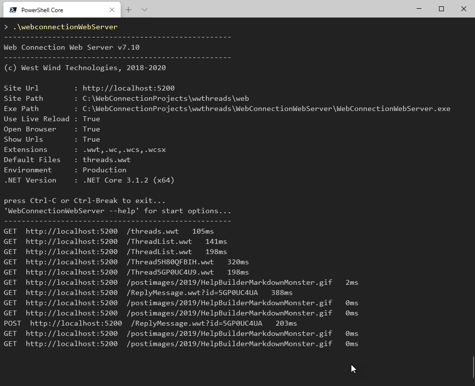
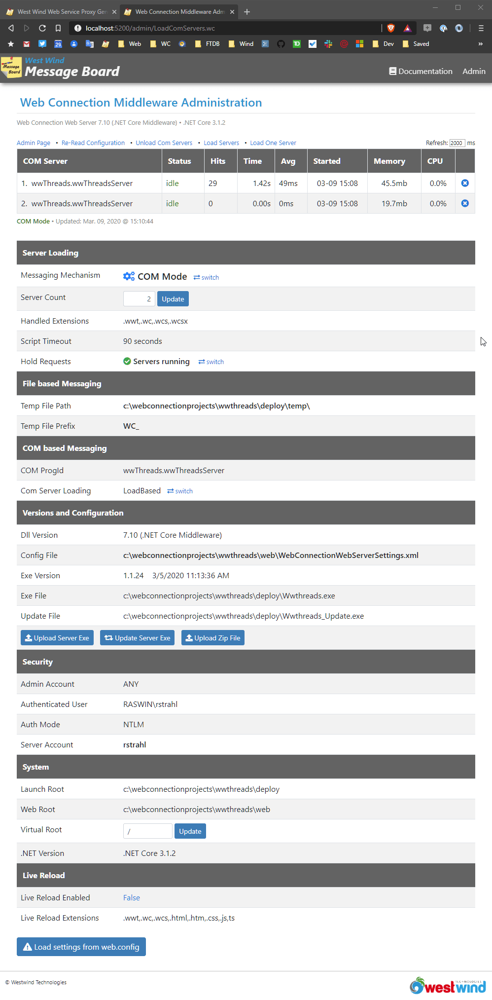
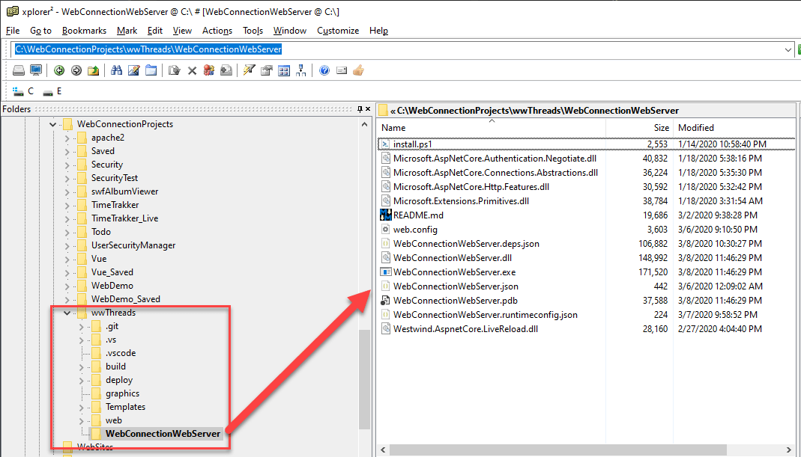
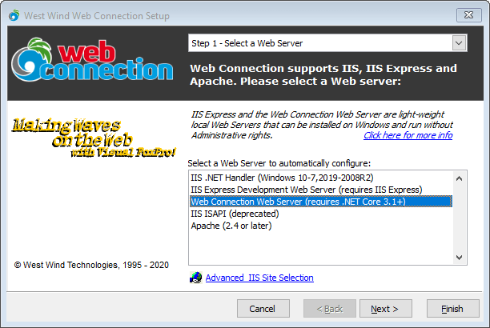
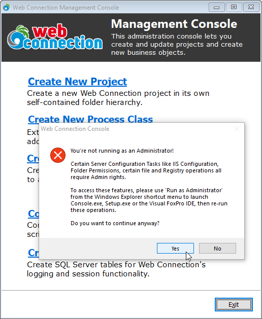
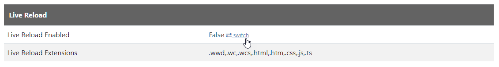

# Web Connection 7.10 is here
[Web Connection 7.10](https://webconnection.west-wind.com) is out and this release brings a few significant enhancements. Here are some of the highlights I'll cover in this post:

<!-- Start Document Outline -->

* [A new self-contained Web Connection Web Server](#a-new-self-contained-web-connection-web-server)
* [Updates to the Module and new Middleware Administration Pages](#updates-to-the-module-and-new-middleware-administration-pages)
* [Console and Project Creation Improvements](#console-and-project-creation-improvements)
* [Launch.prg Improvements and Updating Launch.prg](#launchprg-improvements-and-updating-launchprg)
* [Non Admin Console Operation](#non-admin-console-operation)
* [Simplified Live Reload Configuration for ASP.NET Module](#simplified-live-reload-configuration-for-aspnet-module)
* [New wwCookie Class for Response.AddCookie()](#new-wwcookie-class-for-responseaddcookie)
* [Easy Async Method Invocation for wwDotnetBridge](#easy-async-method-invocation-for-wwdotnetbridge)
* [Breaking Changes](#breaking-changes)

<!-- End Document Outline -->

## A new self-contained Web Connection Web Server
The big news in this release is a new .NET Core based Web Server that has been added - for now as a working preview. The new **Web Connection Web Server** is a self-contained console application that can be used locally or hosted inside of IIS. To use it you point it at a `--webroot` folder and it will run a Web Connection application out of that folder. Or run it out of the current folder.



Once you've pointed at a Web folder, the site runs just like it would in IIS or IIS Express, but hosted by this Web server. The only thing that wil be slightly different is configuration and the Middleware Administration page.



This should look familiar - the page has  most of the same content as the ASP.NET Module Administration page, but there are a few additional items on this one. Most importantly and key to making everything completely self-contained is that the you can specify the extensions for your FoxPro Web Connection Server to handle right via a simple setting.

### Pros and Cons
Some of the advantages of this new server are:

* Fully Self Contained (but requires .NET Core Runtime)
* Pre-Configured for Web Connection
* Just point at a folder with `--webroot` and go
* Uses a single configuration file
* Easy to configure
* Web Connection specific configuration
* Optimized operation for Web Connection Requests
* Command Line EXE - can be fully automated
* Built-in native Live Reload functionality
* Can also run hosted inside of IIS for production
* Can run on Linux in File Mode (Fox server still needs Windows)
* 64 bit support
* 99% compatible with existing Web Connection ASP.NET Module
* Can be distributed with your application

Some considerations:

* It does require a .NET Core installation ([.NET Core SDK](https://dotnet.microsoft.com/download)) 
* Requires a different but very small `web.config` for IIS Hosting

Although in theory you can use this Web Server as a production Web Server without a front end Web server like IIS, generally the accepted approach is to run a production application behind IIS to provide features, auto-restart, lifetime management of the server, SSL Certificates, Host Header support for multiple domains on a single IP Address, static content compression, static file caching etc.  All these things can be handled by the Web Connection Server (courtesy of ASP.NET Core) but IIS is much better suited and vastly more efficient for these non-application Web Server tasks due to its tight Windows Kernel integration.


### Easy Configuration
The most compelling reason for this new Web Server is that it's very easy to get started with. When you create a new project, the Web Connection Console now automatically creates a configuration file for both classic ASP.NET and the ASP.NET Core module. 

For now the primary goal is to provide an easy server to get started with for development time. There's no configuration or installation of system components and the server can be auto-started as part of the new `Launch("WEBCONNECTIONWEBSERVER")` command that new projects provide. That command launches the Web Server, starts your Web Connection server, and automatically opens a browser window at the appropriate Web page.

Another important point: all configuration is in a single Web Connection specific XML configuration file that holds everything needed to serve static and Web Connection content. This includes scripts, default files, folder locations etc. It's basically the same stuff you've always configured in Web Connection.
  
The idea is when you get started with Web Connection you don't need to immediately start understanding all the details of how IIS works and how to configure that Web Server. You still need IIS for production, but for development none of that is necessary - unless you want to in which case you can still use IIS for development as well.

The Web Connection Web Server uses a separate, self-contained XML configuration file that holds all the settings related to the server. Here's what `WebConnectionWebServerSettings.xml` looks like:

```xml
<?xml version="1.0" encoding="utf-8"?>
<WebConnectionWebServerSettings xmlns:xsi="http://www.w3.org/2001/XMLSchema-instance" xmlns:xsd="http://www.w3.org/2001/XMLSchema">
   <HandledExtensions>.tp,.wc,.wcs,.wcsx</HandledExtensions>
   <DefaultFiles>default.tp,Default.htm,index.html</DefaultFiles>
   <VirtualDirectory>/</VirtualDirectory>

   <MessagingMechanism>File</MessagingMechanism>
   <ServerCount>2</ServerCount>
   <AutoStartServers>false</AutoStartServers>

   <ComServerProgId>Testproject7.Testproject7Server</ComServerProgId>    
   <ComServerLoadingMode>RoundRobin</ComServerLoadingMode>
   <UseStaComServers>false</UseStaComServers>
   
   <TempPath>..\deploy\temp\</TempPath>
   <TempFilePrefix>WC_</TempFilePrefix>
   <Timeout>90</Timeout>

   <AdminAccount>ANY</AdminAccount>
   <AdminPage>~/admin/admin.html</AdminPage>
   
   <ExeFile>..\deploy\Testproject7.exe</ExeFile>
   <UpdateFile>..\deploy\Testproject7_Update.exe</UpdateFile>
   
   <UseLiveReload>true</UseLiveReload>
   <LiveReloadExtensions>.tp,.wc,.wcs,.md,.html,.htm,.css,.js,.ts</LiveReloadExtensions>
   
   <LogDetail>false</LogDetail>
   <MessageDisplayFooter>Generated by Web Connection IIS .NET Connector Module</MessageDisplayFooter>
</WebConnectionWebServerSettings>
```

Again this should be familiar for those of you that are using Web Connection already - the settings are identical to the ASP.NET Module settings, with a couple of additional ones (at the top) that compensate for 'Web Server' configurations:

```xml
<HandledExtensions>.tp,.wc,.wcs,.wcsx</HandledExtensions>
<DefaultFiles>default.tp,Default.htm,index.html</DefaultFiles>
<VirtualDirectory>/</VirtualDirectory>
```   

Handled extensions are all the extensions that are passed forward to the Web Connection server. This is the equivalent of script maps in IIS. The default pages are the default pages that are searched for when using extensionless URLs. Virtual Directory defines the application base path of the application which for the Web Server will almost always be `/`. If you're running an older application and you rely on a specific virtual path such as `/wconnect/` it can be specified there to make sure the various admin pages in the server can find related resources properly.

Other than that - same as it ever was :smile:

### Portable
Note that most of the settings are standard and **the same for every project** that uses the standard Web Connection project structure. The only thing that really changes are:

* Extensions
* Default Pages
* Live Reload Extensions

everything else pretty much stays the same from project to project. 

Oh and everything is portable - want to move the application to a new folder or run on a different machine? There's no additional config: Move your project to a new location and just start `WebConnectionWebServer` with a `--webroot` (or run the EXE from the folder) pointing at the new folder.

### Command Line
There's also an `install.ps1` script to make the server available in your PATH you so you can start it from anywhere. Preferrably you'd map this global version to the version in the Web Connection install folder. Once on the path you can do:

```ps
WebConnectionWebServer
```

in a Web root folder, or specify the folder from some other location:

```ps
WebConnectionWebServer --webroot "\WebConnectionProjects\TestProject7\Web"
```

When do run this it automatically opens the Web site in your default browser. By default Live Reload is also enabled so you're ready for productive work creating your application's content.

### Each Project gets its own WebConnectionWebServer
Each project gets its own copy of Web Connection Web Server, so you can easily pin your application to a specific version of the server. 


The reason for this is that if you decide to host your application using this new mechanism, the Web server interface is distributed with your application for easy configuration with IIS.
Having the server in your project in a *'known location'* also makes it easy for the tooling to automatically start the server via `Launch()`.

The server code is small (about 500k) so it's not a burden to provide it for each project.




### Running in Production
The main goal of this server is for use during development to provide an easy to get started environment. But **you can also host the Web Connection Web Server in IIS** using the ASP.NET .NET Core Module (ANCM) which hosts the application. This is similar to the way class ASP.NET is hosted in IIS, with tight integration directly into IIS for high performance operation.

This uses a much simpler hosting model in IIS that basically 'just runs' the .NET Core application. What this means is that a lot of the traditional IIS configuration that you had to do for ASP.NET falls away. In fact, IIS doesn't need to have a .NET Framework installation for this to work, although you do have to have the .NET Core Runtime installed on the machine.

Here's what the configuration for a Web Connection server application looks like in the `\web` folder of your project:

```xml
<?xml version="1.0" encoding="utf-8"?>
<configuration>
  <configSections>
    <section name="webConnectionVisualStudio" type="System.Configuration.NameValueSectionHandler,System,Version=1.0.3300.0, Culture=neutral, PublicKeyToken=b77a5c561934e089" />
  </configSections>
  <webConnectionVisualStudio>
    <!-- Configuration Settings for the Web Connection Visual Studio Add-in 
       Not used at runtime, only at the design time -->
    <add key="FoxProjectBasePath" value="c:\WebConnectionProjects\MyProject\deploy\" />
    <add key="WebProjectBasePath" value="c:\WebConnectionProjects\MyProject\Web\" />
    <add key="WebProjectVirtual" value="http://localhost:5200" />

    <!-- Optional PRG launched when VFP IDE launches -->
    <add key="IdeOnLoadPrg" value="" />

    <!-- The editor used to edit FoxPro code - blank means FoxPro Editor is used -->
    <add key="FoxProEditorAlternate" value="%LocalAppData%\Programs\Microsoft VS Code\Code.exe" />
  </webConnectionVisualStudio>

  <system.webServer>
    <handlers>
      <add name="StaticFileModuleHtml" path="*.htm*" verb="*" modules="StaticFileModule" resourceType="File" requireAccess="Read" />
      <add name="StaticFileModuleText" path="*.txt" verb="*" modules="StaticFileModule" resourceType="File" requireAccess="Read" />
      <add name="StaticFileModuleSvg" path="*.svg" verb="*" modules="StaticFileModule" resourceType="File" requireAccess="Read" />
      <add name="StaticFileModuleJs" path="*.js" verb="*" modules="StaticFileModule" resourceType="File" requireAccess="Read" />
      <add name="StaticFileModuleCss" path="*.css" verb="*" modules="StaticFileModule" resourceType="File" requireAccess="Read" />
      <add name="StaticFileModuleJpeg" path="*.jp*" verb="*" modules="StaticFileModule" resourceType="File" requireAccess="Read" />
      <add name="StaticFileModulePng" path="*.png" verb="*" modules="StaticFileModule" resourceType="File" requireAccess="Read" />
      <add name="StaticFileModuleGif" path="*.gif" verb="*" modules="StaticFileModule" resourceType="File" requireAccess="Read" />
      <add name="StaticFileModuleWoff" path="*.woff*" verb="*" modules="StaticFileModule" resourceType="File" requireAccess="Read" />
      <add name="StaticFileModuleZip" path="*.zip" verb="*" modules="StaticFileModule" resourceType="File" requireAccess="Read" />
      <add name="StaticFileModulePdf" path="*.pdf" verb="*" modules="StaticFileModule" resourceType="File" requireAccess="Read" />
      
      <!-- this is the only REQUIRED handler -->
      <add name="aspNetCore" path="*" verb="*" modules="AspNetCoreModuleV2" resourceType="Unspecified" />
    </handlers>

    <!-- check the path to the dll - in Project the below works   
         in a plain publish output use `.\WebConnectionWebServer.dll`  -->
    <aspNetCore processPath="dotnet.exe" 
                arguments="..\WebConnectionWebServer\WebConnectionWebServer.dll"
                stdoutLogEnabled="false"
                stdoutLogFile=".\logs\stdout"
                hostingModel="inprocess">
      <environmentVariables>
        <environmentVariable name="ASPNETCORE_ENVIRONMENT" value="Production" />
        <environmentVariable name="WEBCONNECTION_USELIVERELOAD" value="False" />
        <environmentVariable name="WEBCONNECTION_OPENBROWSER" value="False" />
        <environmentVariable name="WEBCONNECTION_SHOWURLS" value="False" />
      </environmentVariables>
    </aspNetCore>               
  </system.webServer>
</configuration>

```

This config does two things:

* Configures IIS to natively serve static files
* Hooks up the .NET Core application via the ASP.NET Core Hosting Module (ACHM)

Additional IIS configuration settings can still be applied but by default those aren't necessary, so the above is a typical `web.config` which is completely boilerplate - nothing in here needs to change between projects.

### Compatible with the existing ASP.NET Module
While the new server supports hosting under IIS, you can still use the existing battle tested ASP.NET based Web Connection Module. The new server and the old module are 99% compatible and can be used pretty much interchangeably. The module also saw a bunch of admin updates during these updates.

99%? There are a few obscure server variables that are IIS specific that are not available in the standalone server, but beyond that the code base for actual request processing is nearly identical to the old module.

Performance of the server is on par with the old module inside of IIS - in informal testing I don't see any significant performance gain or loss of using the .NET Core application inside of IIS.

### Linux?
And yes, it's also possible to run this Web Server on Linux (or a Mac for that matter). Which means that you can deploy this server on a cheap Linux machine. You can do this - same as on Windows - both in standalone mode running the Web Connection Web Server's HTTP services directly, or running it behind a Web front like [ngnix](https://www.nginx.com/) or [HAProxy](https://www.haproxy.org/) or [Apache](https://httpd.apache.org/) in reverse proxy mode behind one of these front Web services. Note that this latter approach is common for Linux environment application services - NodeJs, most Java frameworks and many other solutions use this same approach.

Now this is important: 

> While You can run Web Connection Web server on Linux the FoxPro Web Connection Server application you create still needs to run on Windows. 

The idea is that you use **File Mode** processing with temporary files written to a location that accessible both to the Linux Web Connection server, and your Web Connection FoxPro server. The shared file access makes it possible for the Windows application to take requests from the Linux based server.

Currently this is not documented yet, but you'll hear more on this going forward.

While I don't necessarily think this is the best solution, I've heard requests for this sort of functionality for years from many users as their company infrastructure doesn't use Windows web servers. This would allow those shops to use Linux Web servers with Windows application servers.

### Local Web Server
To be clear you can run the Web Connection Web Server on its own without any front end Web server on any of the supported platforms. This means you can copy the server with your application and run as a local server for a locally distributed application. If you have an internal network that you need to run the Web application on, you can expose a specific (typically non-80/222) port in the Firewall to serve the application **directly from the Web Connection Server**. For non-public facing applications, or APIs where URL syntax optics are not critical this is a acceptable scenario.

The key is that you have options: Need a fully reliable and recoverable server setup? Use IIS or run the Web Connection server behind something like nginx on Linux. Your needs are simple and you need to expose HTTP services from an existing application? You can use the Web Connection server's HTTP services directly without anything else.

It gives you choices that simply weren't available before.

### Why this server?
As mentioned the main motivation for this server is the self-contained nature that makes it much easier to get started with Web Connection. You can simply install Web Connection - and make sure a .NET Core 3.x+ runtime is installed - and then run the WebConnectionWebServer locally. With integrated `launch()` behavior this can make getting started a no-configuration process.

The other reason is - progress. Microsoft has essentially discontinued .NET full Framework with all future improvements going into .NET Core. While there's not a huge difference in terms of how applications/servers are built, the way they are hosted is definitely different. This approach of using a runnable command line server, that can be automated easily is a good way to bring Web Connection in line with what is expected of other server solutions (like Node based apps for example). 

So going forward this option (and it's only **one** option) provides some future proofing for Web Connection continuing to run on modern platforms - at least as long as FoxPro continues to run :-).

## Updates to the Module and new Middleware Administration Pages
In concert with the new Web Server a bunch of work has been done to clean up the Module Administration interface. There are a number of enhancements here:

* Clearer delineation between File Mode and COM Mode
* Switching modes now shuts down servers both ways  (didn't before)
* Live Reload is now switchable on the Admin page
* Additional editable fields in this view for quick updates

Both the Module and Middleware Admin pages have the same basic layout so for documentation purposes you'll see the same settings in both.

## Console and Project Creation Improvements
The new Web Connection Web Server has been integrated into Setup and Project creation code:



so it works the same as other server types. 

For now, when you choose **Web Connection Web Server** it will set up a **local** configuration which is self-contained execution via the EXE. For this reason the Console currently **also configures** `web.config` for operation using the ASP.NET Module. This allows you to run both with the new Web Connection Web Server as well as IIS Express (assuming it is installed).

If you want to use the Web Connection Web Server for a production site, you need to host it in IIS which requires a separate IIS `web.config` configuration. For this purpose a `web.DotnetCore.config` file is provided which you can simply use to replace the `web.config` with. 

This is not an ideal situation but if and when the Web Connection Web server becomes a primary solution for now it's more flexible to assume people will want to run the Web Connection server for development and IIS and ASP.NET for production in which case the current setup works as configured.

We'll see what adoption looks like going forward...

## Launch.prg Improvements and Updating Launch.prg
The new Web Server has also been integrated into the `Launch.prg` so you can now do:

```foxpro
Launch("WEBCONNECTIONWEBSERVER")

*** or
DO .\Launch with "WEBCONNECTIONWEBSERVER"
```

There have been a ton of improvements in the new `Launch()` behavior to make it easy to switch between different server installations to start and run your Web applications.

Switching between modes is as easy as using a different Launch mode:

* `Launch("IIS")`
* `Launch("IISEXPRESS")`
* `Launch("WEBCONNECTIONWEBSERVER")`

*(assumes that the appropriate Web Server is installed and configured)*

You can switch between modes as long as each mode has been configured. For now choosing **Web Connection Web Server** will also create a `web.config` that works with IIS Express even though the Web Connection Web Server doesn't use it when running local. This is so you can switch between modes. The new server **only needs and uses web.config when hosted in IIS on a production server**. 

Because there are different modes, the Console writes separate config files:

* `web.AspNetHandler.config`
* `web.DotNetCore.config`

which are configured for the application and can be swapped into the live `web.config`. Typically you only use this for a production site swapping `web.DotnetCore.config` into the production `web.config` file for IIS hosting.


The `Launch.prg` file has been updated to make it easier to launch in different modes more easily. If you haven't used `Launch.prg` before, it provides application launching with a single command that:

* Starts the Web Server (if required - for IIS Express/Web Connection Web Server)
* Opens the Web site in your browser
* Starts your FoxPro Web Connection server

all in a single command. 

The `Launch.prg` files are generated for new projects, but the files are mostly generic with only a few generated values. 

If you want to use an up to date `Launch.prg` for your project you can copy the template from `\templates\Launch.prg` and replace these `<%= %>` parameterized values defined near the top:

```foxpro
lcAppName = "MyApp"          && Project Name
lcVirtual = "MyApp"          && Project Name - used for IIS with Virtual folder
lcServerType = "IISEXPRESS"  && default server type when no parm is passed
lcWcPath = "c:\wconnect"       && or whereever Web Connection is installed
```

Once you've done this you now have an up to date `Launch.prg` file with all the latest and greatest settings.

Note that in recent versions this file has shuffled around a bit in how it works due to changes in project structure, the new Web Connection Web Server, Live Reload changes and a few other things. Going forward, this output should be more stable and not change between versions.

## Non Admin Console Operation
The latest release of the WEb Connection Console is less strict about accessing various Console operation as Administrator. You might have run into this prompt:



Previously you couldn't continue, but now you can continue at your own risk :-).

You can now bypass Admin access if:

* You're not installing for full IIS 
* You know that your account has permissions 
  to write files in the targeted project folders
  
 
If you're not sure on the latter point - Windows can be a pain with where your local account can write to - it's still best to run as Admin.

What this means if you're creating new projects locally and you choose IIS Express or the new Web Connection Web Server it's possible to do those operations without Admin requirements.


## Simplified Live Reload Configuration for ASP.NET Module
Previously the ASP.NET Module configuration for Live Reload required two steps:

* Enabling the Live Reload Flag
* Adding an additional handler for HTML/HTM files so Live Reload works for those

The reason for the latter was a pain point because you have to add it when you want live reload and remove it when you don't - it was easy to forget.

In this update Web Connection adds an internal Module that checks for HTML content and automatically injects the Live Reload scripts only **if Live Reload is enabled**.  

So now, you only need to set the **EnableLiveReload** flag in one place both for the Web Connection Handler and Web Connection Web Server.

The Module/MiddleWare Admin page now also lets you toggle the state:



Toggling this switch now also automatically attempts to update the `EnableLiveReload=On` setting your `MyApp.ini` file. If there's only a single INI file in the `\deploy` folder the module now sets the value. You may have to restart the Web Connection FoxPro server to see the change however for server side code changes. Client side and Script code changes work immediately.

## New wwCookie Class for Response.AddCookie()
The Web Security keeps getting more complex and managing cookies these days reflects that. There are tons of options you can set on a Cookie and the old behavior of the `Response.AddCookie()` method was quickly getting out of hand.

Instead of passing a ton of parameters, you can now pass a new [wwCookie](https://webconnection.west-wind.com/docs/_5m50nocs1.htm) object that encapsulates all those settings more easily:

```foxpro
loCookie = CREATEOBJECT("wwCookie")

loCookie.CookieName = "testvalue"
loCookie.Value = "NewValue"
loCookie.Expires = DATE() + 10
loCookie.SameSite = "None"
loCookie.Secure = .T.
loCookie.HttpOnly = .T.

* ? loCookie.ToString()  && outputs the generated cookie string

*** Pass the cookie to set on the current request
Response.AddCookie(loCookie)
```

The cookie object has a number of new options that weren't available for the parameters only `.AddCookie()` method and this new object allows for adding additional features should they come along later.

## Easy Async Method Invocation for wwDotnetBridge
wwDotnetBridge already includes an Async helper that allow you execute any method asynchronously on a new thread via [.InvokeMethodAsync()](https://webconnection.west-wind.com/docs/_4iu0wxvi1.htm) method. The process works by calling a method with its normal parameters plus a callback object that is called when the operation is complete.

However, one issue that's getting more common is that .NET supports `async/await` which is an async pattern that the .NET Runtime uses to process `Task` based APIs. It's been possible to work with Task based APIs via wwDotnetBridge, but it wasn't a good approach as you had to capture the `Task` returned from .NET and eventually synchronously wait for it to complete.

The new [InvokeTaskMethodAsync()](https://webconnection.west-wind.com/docs/_5pj0xl2yp.htm) provides a better way to do this using the same callback mechanism used for `InvokeMethodAsync()`: Passing an extra callback object to the method that can call you back when the result completes.

Here's an example of what you can do calling the Async .NET `WebClient.DownloadStringTaskAsync(url)` method:


```foxpro
do wwDotNetBridge
LOCAL loBridge as wwDotNetBridge
loBridge = CreateObject("wwDotNetBridge","V4")

loClient = loBridge.CreateInstance("System.Net.WebClient")

loCallback = CREATEOBJECT("HttpCallback")

*** execute and returns immediately
loTask = loBridge.InvokeTaskMethodAsync(loCallback, loClient,"DownloadStringTaskAsync","https://west-wind.com")
? loTask  && object

? "Done..."

RETURN


DEFINE CLASS HttpCallback as AsyncCallbackEvents

*** Returns the result of the method and the name of the method name
FUNCTION OnCompleted(lvResult,lcMethod)

? "File received. Size: " + TRANSFORM(LEN(lvResult))
? SUBSTR(lvResult,1,1500)

ENDFUNC


* Returns an error message, a .NET Exception and the method name
FUNCTION OnError(lcMessage,loException,lcMethod)
? "Error: " + lcMethod,lcMessage
ENDFUNC

ENDDEFINE
```

This code executes and doesn't stop when the method is invoked. Instead the `HttpCallback.OnCompleted()` handler is called back when the result has been downloaded.

This makes it a lot easier to consume async .NET APIs and still get the benefit of the Async functionality. Note that unlike `InvokeMethodAsync()` this method typically executes on already allocated threads from the .NET Thread pool so it's less resource intensive that `InvokeMethodAsync()` which uses threads.

## Breaking Changes
There are a few small breaking changes in this release. 

### wwRequestLog Structure Changes
First you should delete your `wwRequestLog.dbf` file as the structure has changed. There's a new field that's been added for Account and the field widths have been tweaked.

### Live Reload Configuration Changes
Live Reload Configuration has changed and is simpler now, but if you were using it previously you'll want to update your web.config file to reflect the simpler settings.

**Remove old Handler** (if you have it)

```xml
<handlers>
   <add name=".LiveReload_StaticHtml_wconnect-module" path="*.htm*" verb="*" type="Westwind.WebConnection.WebConnectionHandler,WebConnectionModule" />
   ... leave additional handlers
</handlers>
```

**Add new Handler**
    
```xml
<modules>
  <add name="WebConnectionModule" type="Westwind.WebConnection.WebConnectionModule,WebConnectionModule"/>
</modules>
```

## Summary
So these are the highlights of new and improved features - there are a handful more and you can look at the [complete change log](https://webconnection.west-wind.com/docs/_s8104dggl.htm) and the referring links in there.

Enjoy...

<div style="margin-top: 30px;font-size: 0.8em;
            border-top: 1px solid #eee;padding-top: 8px;">
    
    this post created and published with the 
    <a href="https://markdownmonster.west-wind.com" 
       target="top">Markdown Monster Editor</a> 
</div>