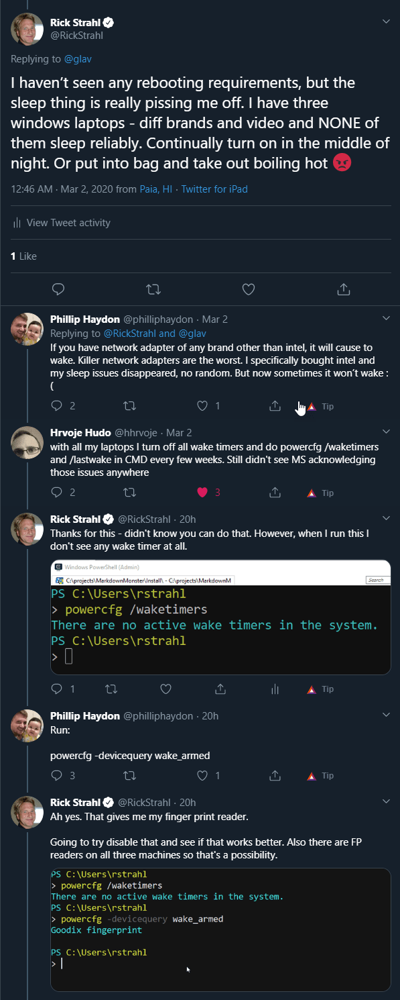
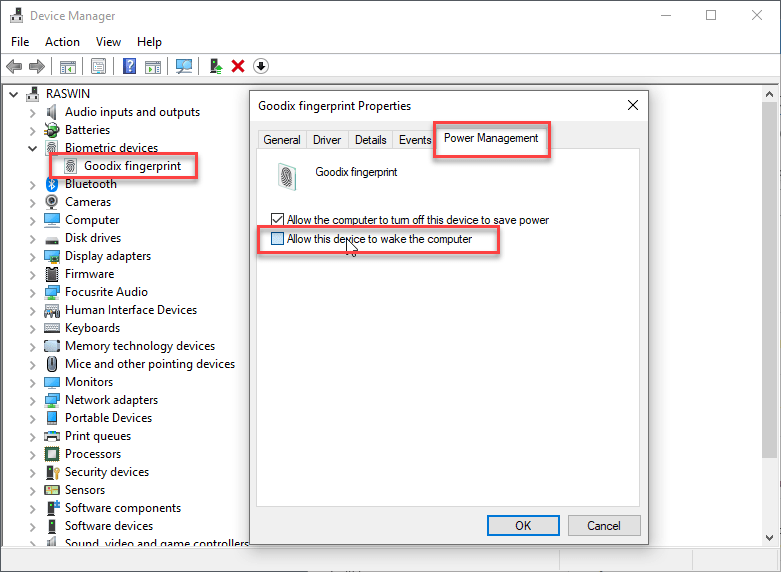

# Troubleshooting Windows Sleep Insomnia


This isn't anything new, but I I've struggled with Windows machines that don't stay asleep when you shut them down.  It's been going on for years and across many different machines and configurations.

Right now I have 3 different Windows laptops of various makes and age, and **none of them sleep properly**. They pretend to sleep, but as soon as you walk away - like a petulant child - the machine wakes up and parties on its own all night long!

You know the problem, right:

* You shut down for the night
* The machine goes to sleep
* You walk by the office a bit later
* The screen is on and the machine sits at the Login screen
* All...night...long

It doesn't stay asleep and it doesn't go to sleep again when the Windows idle timeout is reached.

Seems Windows is not sleepy...

Another favorite in this Hit Parade: 

* Close the lid or explicitly sleep the computer
* Put it into your computer bag. 
* Take the computer and go about your business 
* An hour or two later take the machine out of the bag 
* It's breakfast time: You can now fry an egg on the surface of the laptop
* The fans are ready for internal drone liftoff

Both of these happen to me **all the time**.  New machines, old machines, machines with one set of drivers, or with others, from this manufacturer or that. It doesn't matter, Windows is an equal opportunity insomniac.

Who do we blame? Windows? (yeah I do! regardless of whether this is a hardware issue or not), or the hardware? Both? The latter is probably right.

But this is a problem that simply should not happen. While I understand that it's nice to be able to have some devices wake the computer, there's a lot of things that Windows should be able to do to determine the state of the machine to figure out whether it actually **should** wake up. A finger print reader that activates while the lid is closed and the reader is hidden is not something that would ever be useful...

Windows could certainly provide better troubleshooting for this, given that I've heard this complaint from sooooo many people besides myself. It's low hanging usability fruit given how much of a pain this issue is, and how many people it affects. And... how often that's held up as one of the pain points Windows haters loooove to point out.

Apple certainly has that one figured out with Macs, but to be fair they control the hardware in addition to the software so they certainly have more control over what triggers system wake events. But hey even running Windows on a Mac with Parallels will cause these problems. So there's that!

### Using PowerCfg
Over the weekend I ended up in a discussion of Windows problems on Twitter and I was - yup once again -  complaining about the constant and very annoying sleep issues I've been experiencing.



Thanks to [@philliphaydon](https://twitter.com/philliphaydon) and [@hhrvoje](https://twitter.com/hhrvoje) who both pointed me at `powercfg.exe` which lets you check for all things that affect power operations. Using `powercfg` I was actually able to address the sleep insomnia.

With `powercfg` there are two things you can check:

* **WakeTimers**  
These are operations or events (like Windows updates) that can trigger the machine to wake up.

* **Wake Armed Devices**  
These are hardware devices that can trigger the machine to wake up from sleep.

### Wake Timers
In my case I don't have any Wake Timers on my machine, so there's no hardware or software drivers that trigger waking up the computer. 

To check of you have any Wake Timers:

```ps
# list wake timers
powercfng /waketimers

# show last item that woke Windows
powercfng /lastwake
```

Since I don't have any devices that are using wake timers I couldn't play around with this much, but if you have one that wakes up you can use the Device Manager settings to disable the wake up features for the device(s) listed or temporarily disable the device(s) to see if that helps.

### Wake Armed Devices
The second and probably more important option lets you worked with **armed devices** which are devices that have sleep waking enabled.

There are three commands in `powercfg`:

* `powercfg /devicequery wake_armed`
* `powercfg /devicedisablewake`
* `powercfg /deviceenablewake`

In my case putting it all together looked like this:

```ps
# list devices
powercfg /devicequery wake_armed

# disable wake for specific device
powercfg /devicedisablewake "Goodix fingerprint"
  
# reenable  wake for specific device
powercfg /deviceenableewake "Goodix fingerprint"
```             

The `/devicequery` command has a number of options you can work with `powercnfg /devicequery /?` but for this discussion the `wake_armed` parameter is probably the only one that is significant.

As you can see above, the only device that is armed (according to the command anyway) is my Finger print reader on this Dell XPS 15. Once I disabled that device's wake option, my machine now stays asleep both when I put it to sleep explicitly at night and when I close the lid and stick it in a bag to carry around.

For the last 3 days - no problems with random wake ups and no fried eggs after bagging it either. Yay!

Oddly though, I know that there are other devices that will wake the computer. The mouse and keyboard certainly will bring the laptop back from the dead, as will the lid and powerbutton (obviously). None of these devices show in the device query, but perhaps these are the base, essential devices that are not even considered in the list above.

### Using Device Manager
Besided `powercfg` you can also use Device Manager to enable and disable device wake settings. If you want to go that route you can find the device in Device Manager and use the **Power Management Settings** to toggle the *Allow this device to wake the computer* setting:



This is the same setting that `powercfg /devicedisablewake` actually affects when enable/disable with it.

Although you can use Device Manager for enabling disabling there are no UI tools that let you **find** or suggest devices that affect the wake state, so most likely you'd be using the `powercfg` command line tool  anyway, at which point you might as well enable and disable using `powercfg`. :shrug:

### Summary
Sleep insomnia of Windows machines is a big pain point with Windows - I know just about every machine I use has this problem and I'll be looking at all the others to see if there are devices that are triggering the machine to wake up on those too.

It sure would be nice if this was more obvious than some obscure command line tool. Like a nice link to a tool in the `Power Options`. Or heck just a list of devices that are can cause the computer to wake up would be nice somewhere in the UI where you can find.

But alas once you know about `powercfg` it's an easy way to find devices and if necessary turn them off.

This is not new, nor unknown if you search around. I think I looked at this in the past for another machine but in the years that have passed since I've forgotten how to do this. So once again I'm writing a blog post to jog my memory. Hopefully it's useful for a few of you too as it was for me (repeated or not :smile:)...

<div style="margin-top: 30px;font-size: 0.8em;
            border-top: 1px solid #eee;padding-top: 8px;">
    
    this post created and published with the 
    <a href="https://markdownmonster.west-wind.com" 
       target="top">Markdown Monster Editor</a> 
</div>