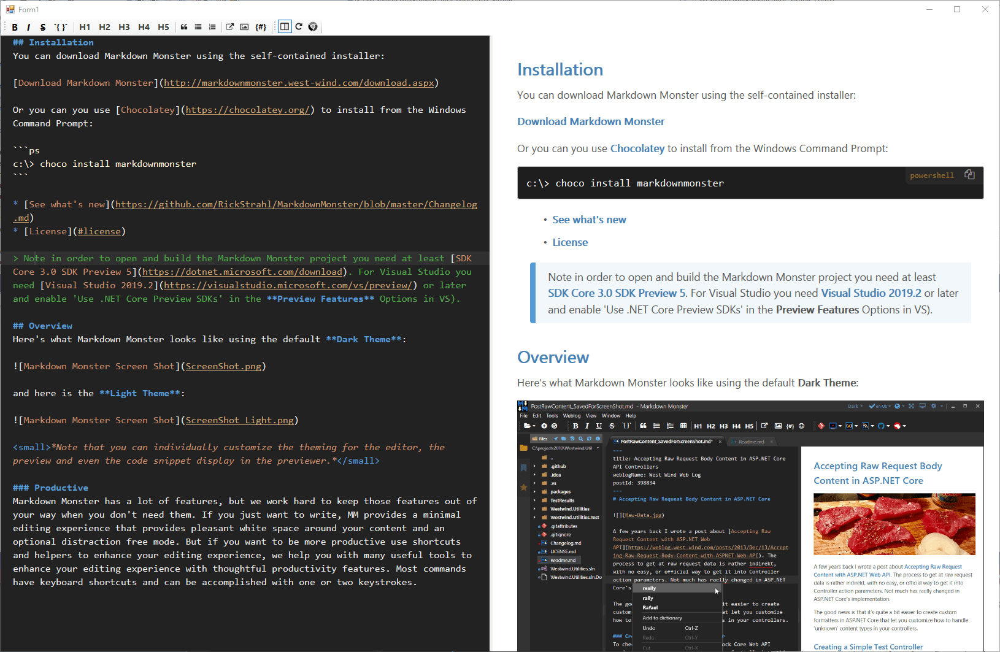
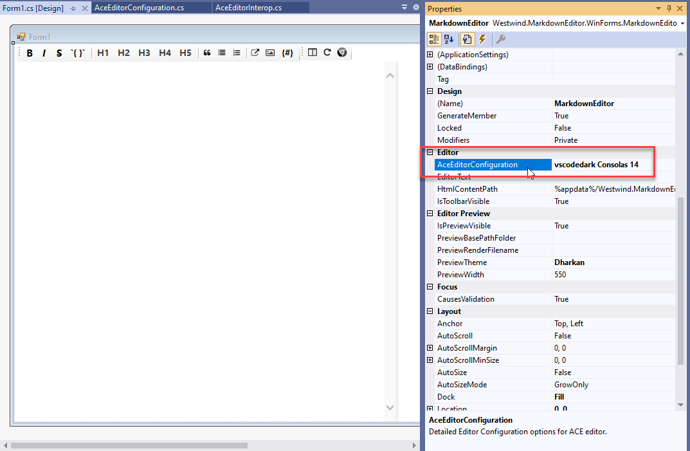
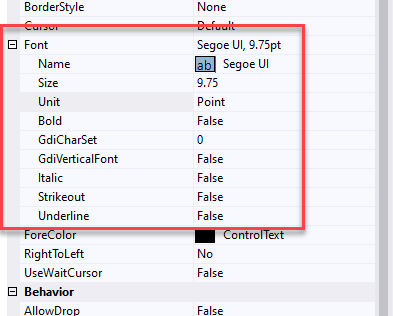
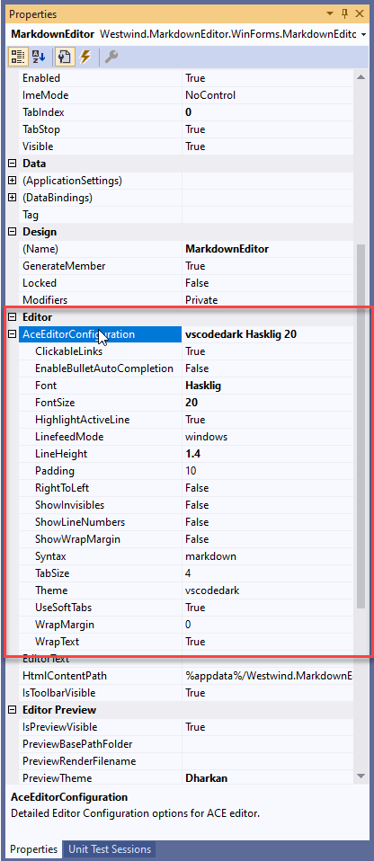
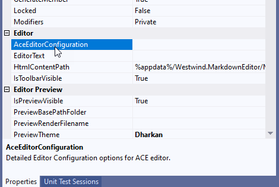
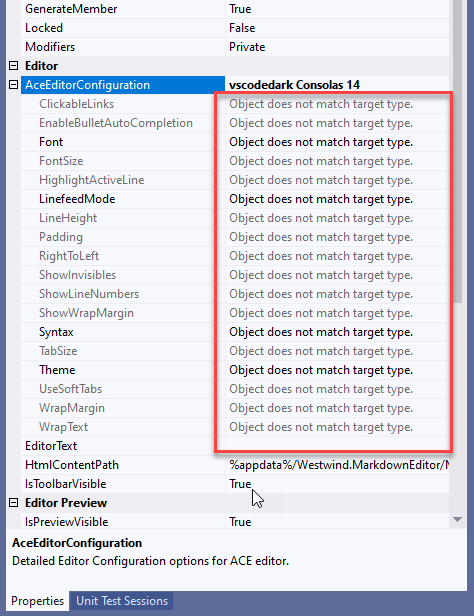

# Displaying Nested Child Objects in the Windows Forms Designer Property Grid


It's been a while since I've used WinForms and for the last few days I've been working on a new Markdown editing control for an application. One of the issues that I ran into is that I have a ton of configuration for this control and I didn't want to expose all of it at the top level control object. Rather I want to get a child property - or several of them actually - to handle the more specific sub-configuration tasks with cleaner delineation of responsibility. The application also passes these config objects to the underlying editor and previewer, and the object acts as the persistent state of the control. So rather than having to pass the entire control I can just pass these state objects. This is especially relevant for the editor which needs to serialize the data to JSON to pass it into the HTML/JavaScript code inside of a browser.

For the designer it's probably fine to use a ton of top level properties since you can use the category property, but for code having 50 different properties scattered alongside the myriad of already busy user control properties it's a pain when you bring up IntelliSense and end up looking for the right editor setting to apply. Sub-objects delineate functionality much nicer, and make it easier to find what you're looking for.

But... the WinForms designer doesn't handle nested properties in the Property Grid automatically, and so there's a bit of extra work required to make nested properties work at design time and that's the focus of this blog post.

No, this is not a new topic obviously, but it's getting harder to find this sort of information given that WinForms is uh a bit dated these days and some of the old information is slowly either disappearing off the Internet or at least not being indexed very well anymore. So you can think of this as a sort of refresh of an old topic :smile:

## An Example of a nested Control Sub Object
So my specific scenario is a UserControl that contains a Markdown Editor that has both an editor and previewer in a dual pane interface. You can drop the editor onto a form, set the `EditorText` and you have a rich text editor to work with in your app.

The control dropped on a form looks something like this:



For the discussion here, I'm focusing on the Editor specific configuration which concerns the operation of the left hand pane in this dual pane control.

The control has:

* A MarkdownEditor User Control
* An `AceEditorConfiguration` class that holds editor specific config values
* An `AceEditorConfiguration` property on the User Control for persistent storage of the config values

There's another set for of configuration for the Previewer on the right but that's not relevant for the discussion here.

The configuration setup looks something like this in the Markdown control code:

```cs
public partial class MarkdownEditor: UserControl, IMarkdownEditor
{
    [Category("Editor"),
     Description("Detailed Editor Configuration options for the ACE text editor.")]
    public AceEditorConfiguration AceEditorConfiguration { get; set; } = new AceEditorConfiguration();

    ... 
}
```

The `AceEditorConfiguration` implementation then is a simple POCO class that has a bunch of simple properties -  string, number and Boolean - to hold the editor specific configuration values:

```cs
public class AceEditorConfiguration
{
    [DefaultValue("markdown")]
    public string Syntax { get; set; } = "markdown";

    [DefaultValue("vscodedark")]
    public string Theme { get; set; } = "vscodedark";

    [DefaultValue(14)]
    public int FontSize { get; set; } = 14;

    [DefaultValue("Consolas")]
    public string Font { get; set; } = "Consolas";
    ...
    
    public override string ToString()
    {
        return $"{Theme} {Font} {FontSize}";
    }
}
```

If I do nothing else to the `AceEditorConfiguration` property and then add the control to a form and bring up the WinForms designer I end up with the `AceEditorConfiguration` property in the Property Grid looking like this:



Notice how the object shows up in the Property Grid, **but is not editable in any way**. The text you see comes from the overridden `.ToString()` method but there's no expansion. The behavior I would like to have for `AceEditorConfiguration` is like the `Font` property for example, which looks like this:



The `Font` property expands to show the child properties of the `Font` class for individual editing.

**It's a shame that expandable nested properties don't work automatically in the designer** or that there isn't a simple standard attribute that can be used to make a POCO object expandable. Luckily it's not too difficult to set up although it takes a bunch of yak shaving to get there.

### Using a TypeConverter to provide a Nested Object in the Property Grid
So the key to making this work is to create a custom `TypeConverter` class and attach the type converter to the class that you want to display in the Property Sheet as a nested property.

To do this create a type converter for the specific type and override the `CanGetProperties()` and `GetProperties()` methods:

```csharp
public class AceEditorConfigurationTypeConverter : TypeConverter
{
    public override bool GetPropertiesSupported(ITypeDescriptorContext context)
    {
        return true;
    }

    public override PropertyDescriptorCollection GetProperties(ITypeDescriptorContext context, object value, Attribute[] attributes)
    {
        return TypeDescriptor.GetProperties(typeof(AceEditorConfiguration));
    }
}
```

This simply provides a mechanism for the Property Editor to get a list of properties that need to be displayed in the nested display. The only thing that changes here is the `typeof(AceEditorConfiguration)`

The property sheet then displays the properties using the appropriate editors. For simple classes with strings, numbers, Boolean the plain input editors are used. For other 'known' types that have type converters, it uses the custom editors associated with it. For example if you reference a `Font` object, it will be expandable and let you pop up the Font Dialog to set values. If you have arbitrary nested objects and they have a type converter they also show as yet another nested object. Cool that it works, but try to avoid doubly nested object - multi-nesting hell is no fun.

In this case my object only has simple properties so it *just works*.

Once the type converter exists, I have to attach it to the `AceEditorConfiguration` object:

```cs
[TypeConverter(typeof(AceEditorConfigurationTypeConverter))]
public class AceEditorConfiguration 
{ ... }
```

Finally, mark the property on the Control or Form with  the `DesignerSerializationVisibility.Content`:

```cs
public class MarkdownEditor : UserControl 
{
    [ Category("Editor"),
      Description("Detailed Editor Configuration options for ACE editor."),
      DesignerSerializationVisibility(DesignerSerializationVisibility.Content) ]
    public AceEditorConfiguration AceEditorConfiguration { get; set; }  = new AceEditorConfiguration();
    ...
}    
```

With all that busy work in place  the child property now expands:



Yay!

### Gotcha: JSON Serialization
I was pretty excited that this worked after spending quite a while tracking down this solution. The code above works **great for the Property Sheet**, but once I attached the type converter I ran into another more serious problem:

I use the `AceEditorConfiguration` to pass information from my control into the JavaScript ACE Editor component via a **JSON serialized string**. I take the convfiguration object and serialize it into JSON and pass it to the Editor during configuration or when settings are updated:

```cs
public void ConfigureEditor(AceEditorConfiguration config = null)
{
    if (config == null)
        config = EditorControl?.AceEditorConfiguration;
    if (config == null)
        return;

    var json = SerializeEditorConfiguration(config);
    Invoke("setEditorStyle", json, null);
}

public string SerializeEditorConfiguration(AceEditorConfiguration config)
{
    var settings = new JsonSerializerSettings()
    {
        ContractResolver = new CamelCasePropertyNamesContractResolver(),
    };
    return JsonConvert.SerializeObject(config, settings);
}
```

I was in a for a rude surprise with this code. The value passed to the editor turned out to be the `ToString()` result. This:

```cs
var json = SerializeEditorConfiguration(config);
```

produced `\"vscodedark consolas 18\"` rather than the expected JSON serialized string of the actual object data. It basically serialized the result from `.ToString()` into JSON. Say whaaaat?

I'm using [JSON.NET](https://www.newtonsoft.com/json) for the serialization. Turns out JSON.NET will use a `TypeConverter` if one is configured on an object to serialize an object. The default type converter is to use `ToString()` JSON.NET then turns that string into JSON. So after adding the type converter all of a sudden my editor failed to initialize properly because the data passed was not the expected JSON object. That was... unexpected.

There are a number of ways around this problem by effectively creating a new JSON.NET Contract Resolver pipeline that removes that functionality or by adding logic to the type converter to pass back the serialized object.

But... since I'm not actually using the type converter for conversion of the type data, but just to cajole the designer to display the property as a nested property,  there's an easier way by telling the editor to not use the converter to convert to string. I can add another method to Type Converter that checks for a string output request and then disallows that.

In the `AceEditorConfigurationTypeConverter` I can do:

```cs
public override bool CanConvertTo(ITypeDescriptorContext context, Type destinationType)
{
    // JSON.NET checks for this and if false uses its default
    if (destinationType == typeof(string))
        return false;

    return base.CanConvertTo(context, destinationType);
}
```        

**And that works!** Serialization is back to the way it worked prior to the TypeConverter, and the Config property still displays properly in the Property Grid.

Whew that was weird!

### Gotcha: Don't forget to initialize the Child Property
When I originally figured out to use TypeConverter I had it hooked up correctly, but still was not getting any object dropdown - in fact a totally blank property:



I had the property set up like this:

```cs
public AceEditorConfiguration AceEditorConfiguration { get; set; }
```

Notice I **failed to initialize the object** - ie. the value is null (and not initialized until a bit later) which is why that displayed as blank. That seems obvious in retrospect but because of the way control initializes the value wasn't set until much later in the initialization pipeline.

So to make this work I had to ensure that the instance is assigned as part of the form's load sequence that fires at design time. 

This does it:

```cs
public AceEditorConfiguration AceEditorConfiguration { get; set;  }
                 = new AceEditorConfiguration();
```

### Gotcha: *Object does not match target type* Property Values
Another funky problem with the designer has to do with values being null or not available and with the underlying types being recompiled. If you're in development mode and you recompile the configuration type and control you may see errors like this after you re-open the editor:



It looks like this is a designer refresh issue where the designer if not resolving the type properly after a result. The designer is picking up the property names, but somehow can't match the property types. Sounds like a version conflict, that feels like some sort of caching issue. Closing the designer and full clean/recompilation did not seem to help.

The only way I could resolve this issue was to completely exit Visual Studio and restart.  `<shrug>`

### Code Summary: All in one Place
To wrap up this post up here's a quick summary. To display nested properties in the Property Grid you need to:

* Create your class that you want to use as a child object property
* Create a `TypeConverter` and implement `CanGetProperties()` and `GetProperties()`
* Add the `[TypeConverter]` attribute to the class to display as a child
* Add the `[DesignerSerializationVisibility]` attribute to the Property of the Control
* Make sure you initialize the Child Property with an instance

Here are the complete final code snippets summarized in one place:

#### The Class with the `[TypeConverter]` attached

```cs
[TypeConverter(typeof(AceEditorConfigurationTypeConverter))]
public class AceEditorConfiguration 
{ ... }
```

#### The TypeConverter Implementation (including optional string serialization fix)

```cs
public class AceEditorConfigurationTypeConverter : TypeConverter
{
    public override bool GetPropertiesSupported(ITypeDescriptorContext context)
    {
        return true;
    }

    public override PropertyDescriptorCollection GetProperties(ITypeDescriptorContext context, object value, Attribute[] attributes)
    {
        return TypeDescriptor.GetProperties(typeof(AceEditorConfiguration));
    }

    /// <summary>
    /// Overridden so that serialization still works - don't allow string serialization in the converter
    /// which allows JSON.NET to use its standard serialization. This also still works for the
    /// WinForms property sheet.
    /// </summary>
    public override bool CanConvertTo(ITypeDescriptorContext context, Type destinationType)
    {
        if (destinationType == typeof(string))
            return false;

        return base.CanConvertTo(context, destinationType);
    }
}
```

#### The Property Declaration on the Top Level Control

```cs
public class MarkdownEditor : UserControl 
{
    [ Category("Editor"),
      Description("Detailed Editor Configuration options for ACE editor."),
      DesignerSerializationVisibility(DesignerSerializationVisibility.Content) ]
    public AceEditorConfiguration AceEditorConfiguration { get; set; }  = new AceEditorConfiguration();
    ...
}  
```        

## Summary
Creating nested editor properties is not too difficult once you know what to do. There's a lot of ceremony to do this however as I've shown in this post - all of this seems like a bunch of busy work for not very much gain, but it's what has to be done to get nested properties to property display in the Property Grid. I spent a few hours on hunting this down and that's why I'm writing this down to hopefully save others the same churn.

It sure would be nice if nested types *'just worked'* or at minimum if there was a pre-made generic TypeConverter that could be applied (`TypeConverter<T>`) to any type. But that won't work for Attributes unfortunately so we have to create these brain-dead TypeConverters and manually attach them.

And now back to my regular scheduled programming after this detour...

<div style="margin-top: 30px;font-size: 0.8em;
            border-top: 1px solid #eee;padding-top: 8px;">
    
    this post created and published with the 
    <a href="https://markdownmonster.west-wind.com" 
       target="top">Markdown Monster Editor</a> 
</div>