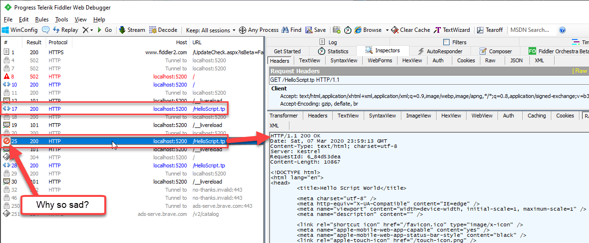
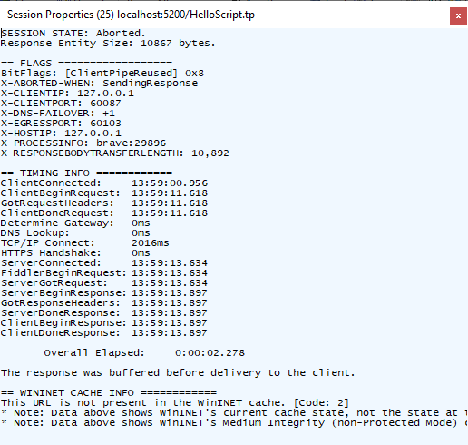
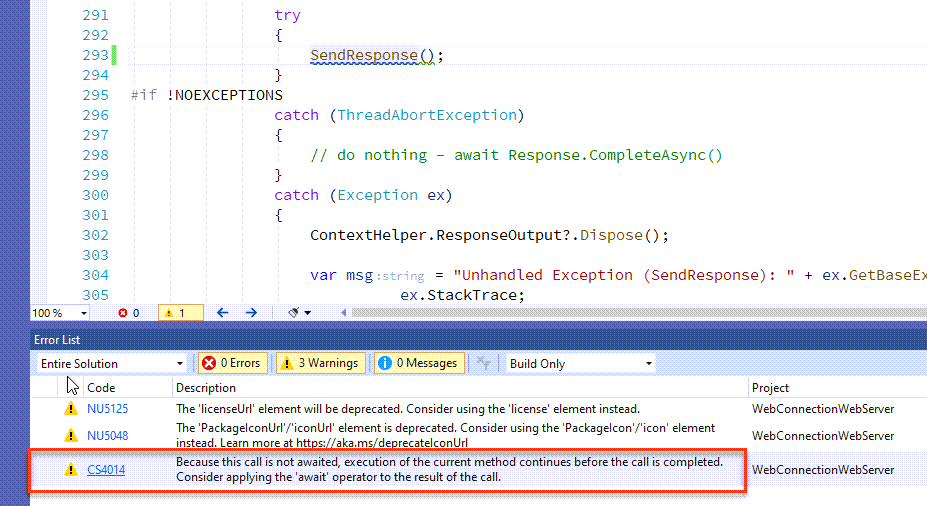

# Don't get Burned by missing await Calls for Async Code in ASP.NET Core Middleware

This falls in the category of stupid developer mistakes tnat are difficult to track down. In this post I'll discuss a nasty bug I ran into with my code that I totally misdiagnosed. It refers to an intermittent failure of HTTP requests in a custom middleware component where I would get HTTP errors **even though the actual response apparently was received properly**.

 Check out this request trace in Fiddler:



Notice that the response code is a `200` response, but yet it shows with an error icon next to it. Per Eric Lawrence (the original author of Fiddler) I also checked the Session properties:



which seems to suggest that the response was aborted (`X-ABORTED-WHEN`). But looking at the actual response, it looks like the HTML output is all there and matches the content length. The content looks good, the size is good. It took a while to guess at it: Apparently ASP.NET is cutting the connection before the final output is sent, even though it appears that all bytes have been received per fiddler.

Worse: **it works most of the time - it only fails occasionally** on the same pages, creating the exact same content. Lovely!

### A Legacy Rewrite
This particular problem was rearing its ugly head in a custom middleware component that interfaces with a **legacy backend application server** with the middleware middle more less serving as a request forwarder. The incoming request data is routed to the application server, which turns around and produces resulting byte stream output which the middleware then pipes into the ASP.NET Core HTTP output stream.  

The implementation of this middleware interface was ported from a **classic ASP.NET `IHttpHandler`** and re-built into ASP.NET Core middleware. Surprisingly this process was not too difficult - in fact the vast majority of this ancient .NET codebase originally written in .NET 1.1 (but updated through the years to run on 4.x) **just ported right over into .NET Core**. All the core application server interface features more or less worked using the old classes and data structures.

The middleware then basically re-implements the seams that push the data to the Application Server and receives back the resulting byte data. For the most part the code just ported, but the interface seams where the code hits the ASP.NET Core pipeline ran into the Async requirements of the HTTP output functionality - in ASP.NET Core all output creation has to be sent via Async calls like `WriteAsync()`. This of course resulted in the classic **async cascade** down the chain requiring all methods that send output be made `async`. Not hard, but tedious. And - as I was to find potentially error prone!

### Misdiagnosis after .NET Core 3.1 Failures
I originally built this middleware for .NET Core 2.2 and it worked without any issues. 

Then I upgraded the application .NET Core 3.1 which by itself was a pretty easy process. When I started running the application in .NET Core 3.1 the aforementioned errors started showing up - infrequently which was puzzling. Switching back to .NET Core 2.2 the problems would go away, but when running under 3.1 the errors kept coming back.

In trying different things one thing I did is move the Response processing to use `IHttpResponseBodyFeature` instead of directly updating the Response stream and that seemed to improve things at first. In fact I thought it was fixed, because the failures now became even less frequent... My assumption was it had something to do with changes in .NET Core 3.x.

### The Real Culprit: A Non-Async call of an Async Method
It turned out the error was a simple mistake made during the fixing of the **Async Cascade** - I updated one of the methods to an Async method, but **failed to actually call that method with an `await`**. 

```cs
public async Task SendResponse()
```

SendResponse then goes on to use async operations to write the incoming data into HTTP output stream using async methods. This of course works fine because the method is async.

However, when calling this method in my mainline code, I forgot to with the `await` keyword:

```cs
SendResponse();
```

This actually compiles **and runs** just fine - well, most of the time anyway. On ASP.NET Core 2.2 I never saw any failures either in person or in my logs. Under 3.1 the errors are infrequent, but inconsistently so.

So what's actually happening here? The code works because behind the scenes ASP.NET Core is still sending the output to the client. That's why the full response appears to show up on the client in most cases.

But, because the call is not awaited, there's no guarantee that when the request is finished ASP.NET Core has completed sending the response. I think the failures are so inconsistent because if the timing is right the response probably sends before the entire request processing is complete and if that happens then there's no error. However, if the request completes quicker (or the response output is longer likely) then the problem shows up.

The fix of course was simply to use the `await` clause on the call:

```cs
await SendResponse();
```

Problem solved.

### How could this happen?
So, you might ask how could this happen? The .NET Core C# compiler actually warns of  `await`-not-used errors like this. In Visual Studio you actually get a warning like this:



Yup... clearly operator error. 

But for me the problem was that this ported project originally had a boatload of warnings (in the hundreds) that I was slowly shlogging through one at a time. This particular `await` warning and a couple of others were lost in the shuffle. But the code ran and seemed to be working perfectly especially in .NET Core 2.2 originally. But alas - cutting corners rarely works out :-)

Yes, I eventually got through the pile of warnings, and by now all of that's cleaned and for sure in a clean project you'd see this warning right away.

Unfortunately that was way after I tried to trace down the problem in other ways...

### The Moral of the Story
The moral is this: Make sure your Async methods are actually called asynchronously especially if it deals with ASP.NET Core Response output. Without it the code might work - or it might not depending on timing of the async code running making for some really crazy inconsistent errors.


