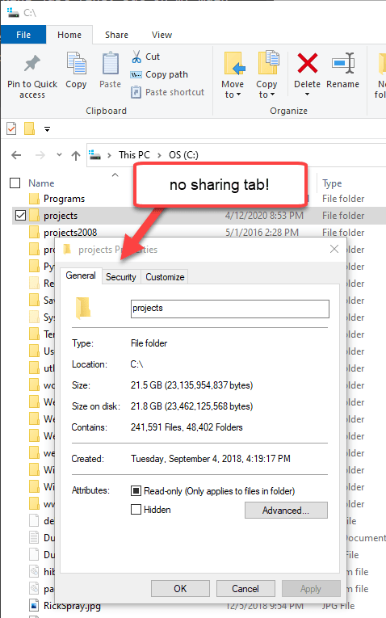
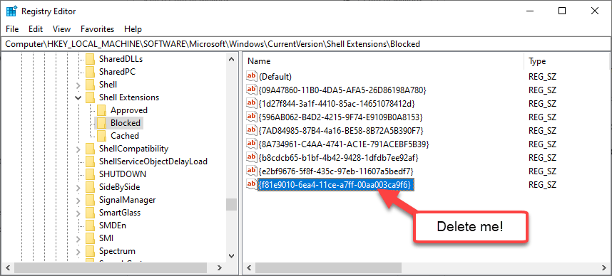
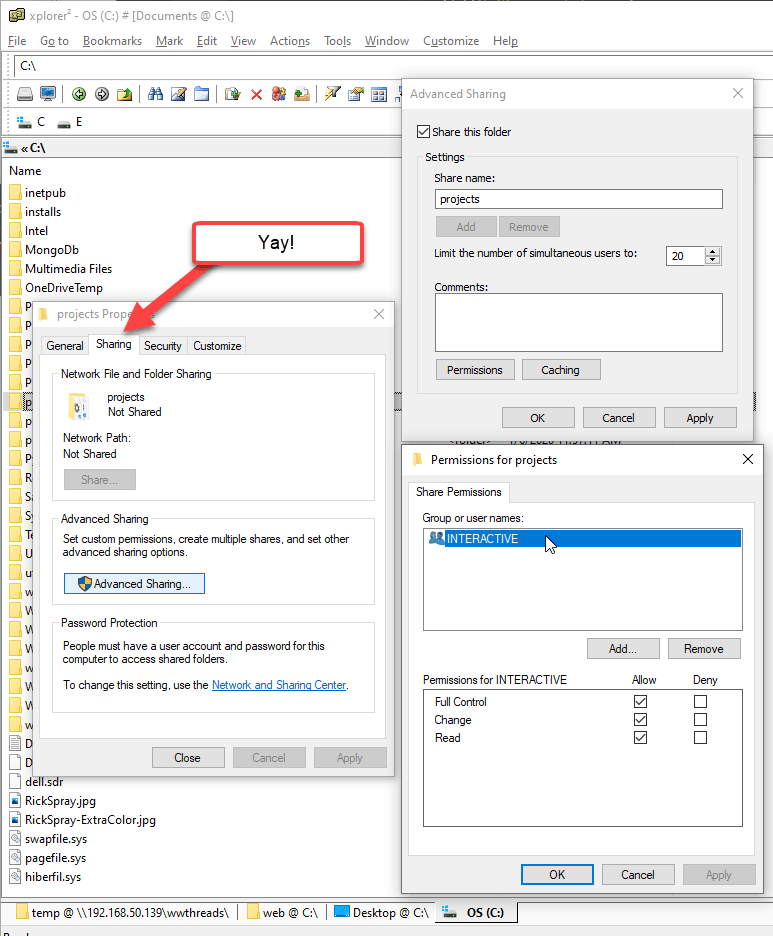
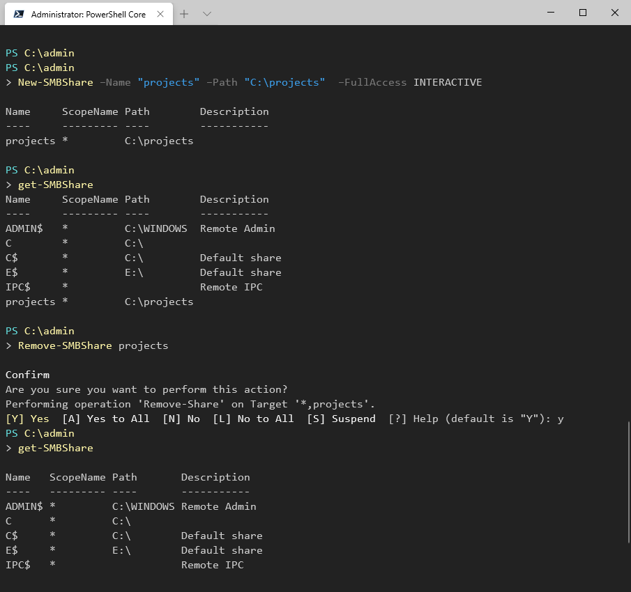

---
title: Missing Sharing Tab in Windows Explorer and Sharing with PowerShell
abstract: "On several of my machines I've found that the 'Sharing Tab' in Explore had gone missing and I've been unable to create a share through the Windows UI. Apparently some update or software installed mucked with my settings that created an explicit exclusion to disable this Shell Addin. In this post I describe how to fix this problem and then offer several solutions: Fixing the UI problem and maybe more usefully show how you can use Powershell to share a folder or drive instead of the Windows UI."
keywords: Sharing Tab,Sharing,Explorer,New-SMBShare,Get-SMBShare
categories: Windows
weblogName: West Wind Web Log
postId: 1667706
permalink: https://weblog.west-wind.com/posts/2020/Apr/13/Missing-Sharing-Tab-in-Windows-Explorer
postDate: 2020-04-13T21:56:59.8493442-10:00
---
# Missing Sharing Tab in Windows Explorer and Sharing with PowerShell


On several of my machines I've not been able to share a drive for some time. Oddly on other machines it's working just fine, but on my main dev box I've for the longest time had issues sharing a drive. As I'm starting to do most of my work on a separate Ubuntu box lately being able to push data into the Windows machine is pretty useful, but alas I was unable to do it.


### No Shares for you!
Specifically I wanted to share my `projects` work folder with development work but here's what that looks like:



Nope - no soup - errr, Sharing Tab for you!

### Blocked Shell Extensions
After a long bit of searching I ran into an obscure comment on [a Windows Club post](https://www.thewindowsclub.com/sharing-tab-is-missing-windows) which points at the solution:

Windows has a Blocked Shell Extensions Section in the registry and in my case the Sharing Tab somehow ended up on that list.

#### Make sure Sharing is Enabled
The Windows Club article doesn't go into the blocked shell extensions, but it shows how to enable the sharing tab feature in Windows if for some reason it's disabled by enabling in the registry:

* Use RegEdit
* Create `HKEY_CLASSES_ROOT\Directory\shellex\PropertySheetHandlers\Sharing`  
if it doesn't exist
* and add `{f81e9010-6ea4-11ce-a7ff-00aa003ca9f6}`

This enables the functionality, but I suspect that for most installations this setting will already be there as it was in my case. So I didn't have to add anything **yet the Sharing Tab was still missing**.

#### Check to ensure Sharing isn't Blocked
The actual problem is that the extension was explicitly blocked in my registry Blocked Shell Extensions list. Remember that Shell ID Guid from above? That sucker ended up in the exclusion list effectively blocking the Sharing Tab.



To fix this:

* Use RegEdit
* Goto `HKEY_LOCAL_MACHINE\SOFTWARE\Microsoft\Windows\CurrentVersion\Shell Extensions\Blocked`
* Check for the `{f81e9010-6ea4-11ce-a7ff-00aa003ca9f6}` Id

If that id is present then the Sharing Tab is blocked. For me it was in there and hence - no Sharing Tab.

* Remove the `{f81e9010-6ea4-11ce-a7ff-00aa003ca9f6}` entry   
from the Blocked list
* Shut down and restart all Explorer Shell Instances  or reboot

And voila now it's working:



### Sharing with PowerShell
The sharing tab works, but it would be a lot easier if we could just do this from the command line. It turns out you can do this with a PowerShell commandlet:

```ps
# requires an Administrator Console
New-SMBShare –Name "projects" –Path "C:\projects"  –FullAccess INTERACTIVE
```

[New-SMBShare](https://docs.microsoft.com/en-us/powershell/module/smbshare/new-smbshare?view=win10-ps) creates the same share I showed using the UI, but now using Powershell.

Note that this works **even if the Sharing Shell Addin is disabled**  because this actually doesn't use the shell but directly manipulates the shares.

A couple of other useful commands are `Get-SMBShare` to list all the shares available:

```ps
Get-SMBShare
```

And `Remove-SMBShare` to remove a share:

```ps
Remove-SMBShare projects
```

Here's what the sequence of those 3 commands looks like in PowerShell:



There are a number of other [SMB related commands](https://docs.microsoft.com/en-us/powershell/module/smbshare/?view=win10-ps) to control folder shares or mappings, set permissions and control access etc. For my purposes the above 3 commands are all I'm likely to need. 
  
### Summary
Cool both of these work. I have no idea what screwed up my sharing Wizard and forced it onto the Shell Exclusion list - it certainly wasn't any conscious decision of mine. All I can think of is perhaps some issue with an Insider build update. I can't think of what else could possibly be mucking with Sharing settings on my machine.

The PowerShell commandlets are a bonus and although I was looking for the UI solution at the time, I think I'll be using the command line version from here on forward if I can remember the command :-). Hopefully this post is visible enough to come up on a search because I'm almost certain I'll forget I wrote it, by the next time I need to review this topic... 

### Reference

* [Original Sharing Tab Article](https://www.thewindowsclub.com/sharing-tab-is-missing-windows)
* [Powershell SMB Commands](https://docs.microsoft.com/en-us/powershell/module/smbshare/?view=win10-ps)

<div style="margin-top: 30px;font-size: 0.8em;
            border-top: 1px solid #eee;padding-top: 8px;">
    
    this post created and published with the 
    <a href="https://markdownmonster.west-wind.com" 
       target="top">Markdown Monster Editor</a> 
</div>