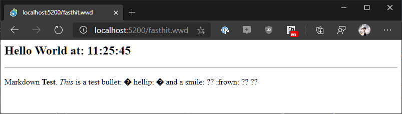
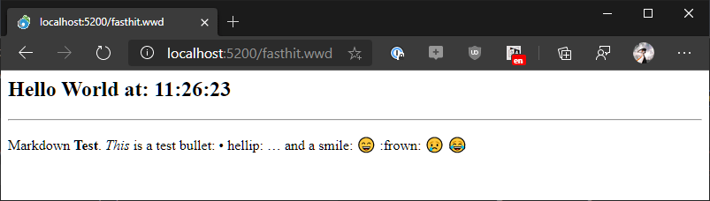

# UTF-8 Encoding, Markdown and Extended Character Woes

Character encoding in a language that doesn't do Unicode is... hard. Character encoding deals with character sets and string encoding issues that are necessary to display text content as text. As you probably know FoxPro does not support Unicode so it uses what is known as **Multi-Byte encoding** and specific **Code Pages** that represent individual 255 sets of characters that represents the gamut of characters that can be displayed on the same screen.

For desktop applications that usually works fine because you're mostly dealing with text data and usually a single language at a time. As long as you are using a single language this code page approach works reasonably well, but as soon as you need to mix multiple character sets (or Code Pages) FoxPro's approach becomes a nightmare.

Most other languages these days don't have these problems because they support Unicode, which can represent just about all character sets in a single very large character set. That's oversimplifying things by a country mile, but in JavaScript or .NET for example you can easily mix Chinese and English text and things like Emojis or custom fonts using extended glyphs without any issues.

In FoxPro this is much more difficult - the problem is that in FoxPro you are limited to 255 characters in a character set so every thing displayed has to fit into this limited set of characters. If you end up using characters out side of it you end up with:



What we're looking at is a string that **should look like this**:



What's happening in that first image is that the code that is generating the output is generating some extended characters - in this case a bullet, an extended ellipses and a couple of Emoji. These are valid Unicode characters but they don't exist in my default FoxPro character set (CodePage 1252).

In desktop application this sort of thing is dreadful as there are literally no good workaround short of finding ActiveX control replacements that can support individual character sets on a per control basis.

Fortunately on the Web you have a few more choices by using `UTF-8` encoding.

## Enter UTF-8
UTF-8 is a multi byte representation of the Unicode character set. What this means is that you can express extended characters - any characters beyond the lower 127 which are standard on all character sets, are represented as multi-byte representations using some funky looking encoded characters. UTF-8 basically encodes any extended characters into a sequence of simple characters that can be used by environments that are not Unicode aware.

The most common scenario is a Web Browser - Web Content pretty much runs on UTF-8 and if you're building Web Connection applications content is by default UTF-8 encoded when it is displayed in the browser. Web Connection basically text your final string output before it gets dumped into the output stream and UTF-8 encodes the entire content. That works **most of the time** - but really only works if the content you can create **fits into the default CodePage you're running in FoxPro**. IOW, if your text is plain English text (for page 1252) with perhaps some upper default character set characters in that same CodePage, the UTF-8 encoding works totally fine.

Using UTF-8 encoding it's possible for FoxPro code to express special characters as UTF-8 which then on the Web correctly display characters that FoxPro otherwise could not possibly display like the Emoji in the second screenshot above. But it's not exactly easy to do this because somehow you first have to get those upper ASCII characters from FoxPro into a string that can be converted to UTF-8.

You run into problems if you want to capture user input with 'extended' characters. For example, I am a huge fan of Markdown content, so the message board application for example, uses Markdown text to represent message content. Users use HTML text boxes which are Unicode aware and when that data is captured it comes back as string a string that first goes into FoxPro. At the time of capture into a string the string ceases to be Unicode (or UTF-8) and becomes a FoxPro string which can't express the upper ASCII characters. Yuck.

### Don't convert to FoxPro Strings!
The key issue to remember is this:

> If you generate an invalid code page character FoxPro will turn that character into a `?` and return replace the character with it. Anytime you generate 'invalid' output this way your string breaks.

This is easier said than done unfortunately. In a desktop application for example, there's no way to control the input from a textbox. In fact a FoxPro textbox won't let you enter text isn't part of the CodePage, or rather it turns any extended characters into `?`. 

For Web Applications there's a work around in that the data can be explicitly captured as UTF-8 text, and it's potentially possible to capture the data as UTF-8 text and write it to the database. Now you have UTF-8 text, but you know to convert that text if used in FoxPro, or if used on the Web return it as raw text.

Confused yet? Yeah, it's very difficult to get your head around this and even if you figure it out, it's difficult to manage in applications based on the use case.
  
Bottom line: Remember that once you convert Unicode or UTF-8 to FoxPro with extended characters outside of the active CodePage, you **lose those extended characters** with no way to get them back.

### Turn off Default Utf-8 Encoding
Here's a scenario where this hit me: On my message board I capture Markdown content which is entered on a Web Page. So content **can contain extended characters** that FoxPro can't express. So in the Web Connection Application I can do the following:

* Make sure UTF-8 encoding is off in the `Request` so data is captured 'raw'
* Store data to the database as encoded UTF-8

This means the data that is actually stored as text contains potentially UTF-8 encoded extended characters.

The data is then run through a Markdown parser. The Markdown Parser is a .NET Component and I can use 
`SYS(3101,65001)` to set the active CodePage used for COM to UTF-8 in FoxPro:

```foxpro
IF (llUtf8)
   lnOldCodePage = SYS(3101)
   SYS(3101,65001)
   lcMarkdown = STRCONV(lcMarkdown,9)
ENDIF

lcHtml = this.oBridge.InvokeStaticMethod("Markdig.Markdown","ToHtml",lcMarkdown,loPipeline)

IF llUtf8
  SYS(3101,lnOldCodePage)  
ENDIF
```

`SYS(3101)` treats incoming data as UTF-8 text and returns the result as UTF-8 encoded text.