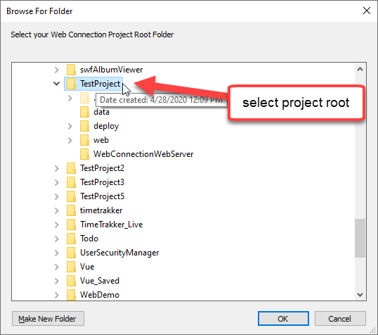
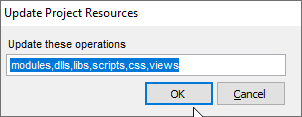
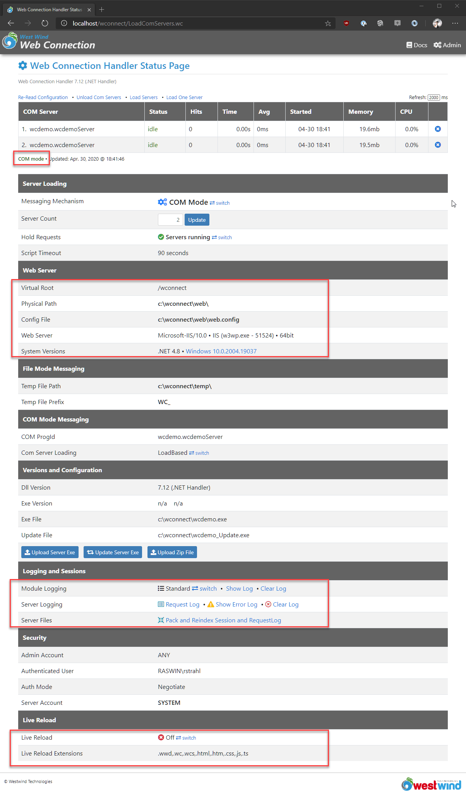
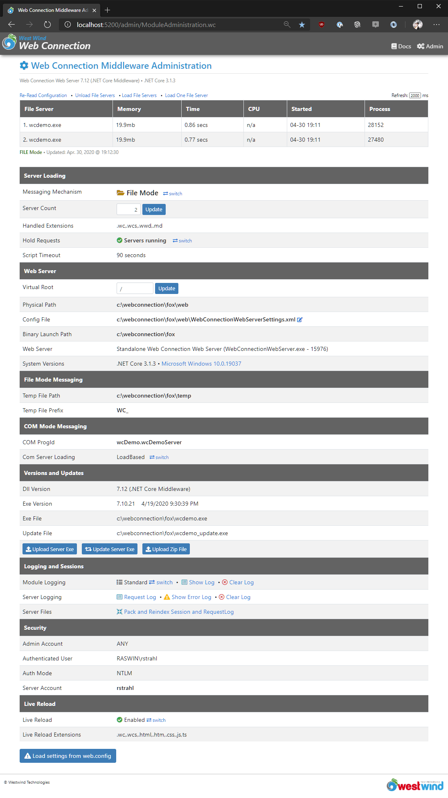
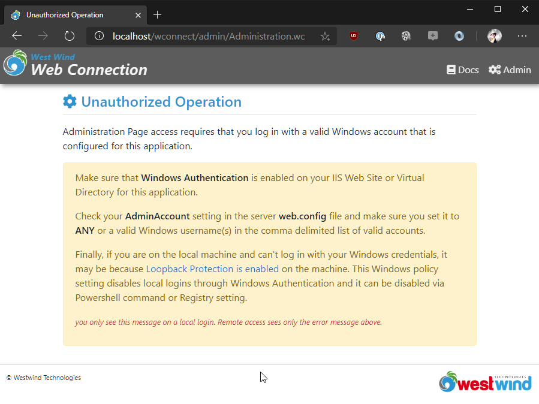
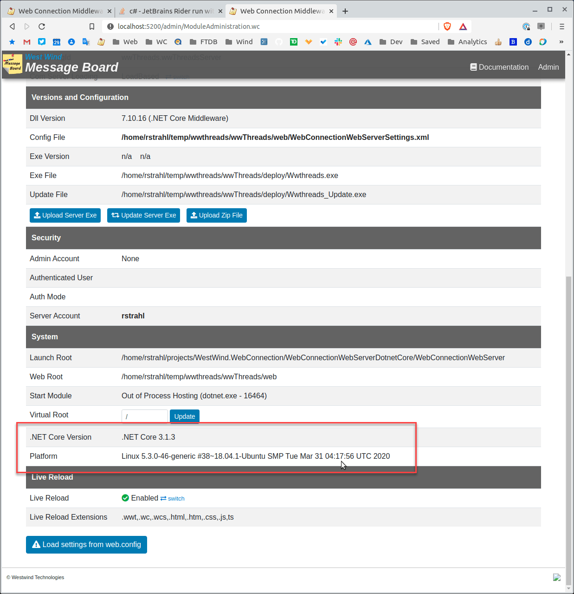

# Web Connection 7.12 Release Notes

We've just released another update to [Web Connection](https://webconnection.west-wind.com) - Version 7.12 is a maintenance release that brings a handful of new features and fixes a few small issues.

This release continues on the current trajectory of improving installation, project management, debugging, executing, deploying and managing Web Connection applications more easily with focus on the project creation and `Launch` tooling, improved administration interfaces and improved deployment tools.

Let's look at a few of the highlights in this release.


## Update Project Resources Helper Console Task
This release adds a new Console [UpdateProjectResources](https://webconnection.west-wind.com/docs/_0r10slean.htm#updateprojectresoures) operation that allows you to update an existing project's support resources to the latest files that an Web Connection update ships.

When you install a new version of Web Connection, there may be new versions of a number of files added to the distribution:

* Updated Web Server Module DLLS (in `templates\scripts`)
* Updated FoxPro support library DLLS (in `deploy`)
* Updated Web Resources (in `templates\ProjectTemplate\Web`)

While there are not that many files, it's hard to keep track of which files have been updated and which have not.

The new feature is in the form of a CONSOLE command that you can issue from inside of FoxPro:


```foxpro
* Prompts for everything
do Console with "UPDATEPROJECTRESOURCES"

* Use command line parameters
do Console with "UPDATEPROJECTRESOURCES",  ;
                "c:\WebConnectionProjects\TestProject",;
                "modules,dlls,libs,scripts,css,views"

```

If you run without parameters you're prompted for the root folder of a Web Connection project (6.x+):



The expectation here is that it uses the standard Project structure with `deploy` and `web` folders and with the `web` folder having `lib`, `scripts`,`css` and `views` folders. 

The second parameter prompts for the type of resources to update:



These are the 'items' to update:

* **modules**  
The Web Connection Web Server dlls: webconnectionmodule.dll, wc.dll or the Web Connection Web Server folder.

* **dlls**  
Updates the DLLs in the deploy folder. This is `wwipstuff.dll`, `wwdotnetbridge.dll`, and the various support dlls like `newtonsoft.json.dll`, `markdig.dll` and `renci.ssh.dll`. Note that in v7 projects install with private copies of these files so that when you deploy you have a self-contained install of files and during dev you run with the same DLLs you are likely to deploy.

* **libs**  
Updates the standard JavaScript and CSS libraries used by the default Web Connection templates. This includes `Bootstrap`, `FontAwesome`, `jquery` and a few others.

* **scripts**  
These are Web Connection specific scripts like `ww.jquery.js`, `jquery.makeTableScrollable.js` and some older Angular support libraries.

* **css**  
Replaces the default CSS stylesheet `application.css`. The old one is backed up with a date name attached.

* **views**  
Updates the `web\Views` folder which holds the default page template views that are used to render the stock UI used in the samples and for default layouts used in the Visual Studio and Visual Studio code templates.

**Make sure you back these up before updating if you've made changes to them**. I recommend creating a back up folder and then comparing with [BeyondCompare](http://scootersoftware.com/) or similar tool to see what's changed.


When you run this tool please make sure you carefully look at the options in the second dialog (or provide them directly on the command line) as these **will overwrite** existing files and if you've changed your templates/stock files this will blow away your changes. Make a backup first - always when running this command against a project.

We've had a feature like this before in Web Connection but it wasn't complete and kind of buried. In the next version I'll add this officially to the Console window with a dialog that will make this even more visible and perhaps a little easier to use yet but for now the command line version should be big step up to keep your projects up to date.

## Updated and Consolidated Module/Middleware Administration Page
The Module Administration Page traditionally has held only the configuration information for the Web Connection ASP.NET Module or now also the ASP.NET Core Middleware for the Web Connection Web Server. The settings you could see and set there were **only for the Web Server specific settings**.

### Consolidated Administration Page
In this latest update the relevant `admin.aspx` or `admin.html` page options, have been moved into the Module Administration Page.

The URL for the Module Administration page is:

* `/admin/Administration.wc` 
* `/admin/ModuleAdministration.wc`

Actually you don't need the `/admin` path - it works from anywhere.
  
The new page looks like this:



This may look familiar, but there are a number of new items on this page.

* Clearer COM/File Mode indicators
* Summary of server settings at a glance (Web Server Section)
* Logging Section that shows both Module logging and Fox Server Logging
* Pack and Reindex Session and Request log is on this page now
* Live Reload Settings including turning on and off

Note that the ASP.NET Core Middleware for the Web Connection Web Server has a slightly different but functionally equivalent admin page.




### Consolidated Module and FoxPro Links

**This is now the main Administration page that replaces the default `admin.aspx`.** 

The old `admin.aspx` pages had a number of options that were linking to operations that are now on this page and a few options that weren't really supported anymore. IOW, this page has everything that pertains to Administration now.

This means there's a single page to go to so you don't have to click through.

### Admin Authentication Clarifications
With the single `Administration.wc` page, there's now also is only a single Authentication that occurs and we have a little more control over that process.

If Authentication fails **on the local machine**, there's now a detailed error page:



The text in yellow is only shown if accessing the page locally which hopefully will help troubleshoot any login issues. 

## .NET Core self contained Web Connection Web Server
Web Connection 7.10 introduced a new Web Server for Web Connection: The Web Connection Web Server which is based on .NET Core and provides a standalone, fully self contained, .NET Core based Web Server that you can run from the command line and that includes built-in Live Reload Features that can detect changes in HTML, CSS, Script pages as well as code changes and automatically refresh your browser on these changes.

The server **requires that .NET Core 3.x** is installed, but otherwise is fully self contained and can be run from the command line which means you can easily automate launching it. The server also is installed as part of every project so **it's there for every project**, meaning you can move this to a different machine, make sure .NET Core is installed, and then run the application out of a folder.

> #### @icon-info-circle Self-Contained Local and Intranet Web Sites
> A self-contained Web Server may not sound that impressive, but it is actually quite cool: You can easily deploy a **local, fully self contained application** that runs a Web Connection Web site. Since **the Web Server is part of the project** everything you need to run the site can be bundled into an XCOPY deployable folder. 
>
> To launch your site you can then simply do:
>
> ```ps
> cd \WebConnectionProjects\TestProject\web
> ..\deploy\testproject.exe
> ..\WebConnectionWebServer\WebConnectionWebServer
>```
> 
> You can run a site on a local machine either in a browser, or build a desktop application around it that accesses the site via a Web Browser control, or makes REST API calls into the Web Connection application.

You can read more about this new Web Server in the documentation, both on how to run it locally for development as well as in deployed applications:

* [Standalone Web Connection Web Server and IIS Host Middleware](https://webconnection.west-wind.com/docs/_5lw0ysxq9.htm)

### IIS Integration for the .NET Core Middleware Added
The standalone server is great for local development because you can simply launch it as part of a startup program - like the provided `launch()` command that is created with new projects - and just be up and running. Other than the .NET Core 3.x requirement there's nothing else to install. It just works.

But you can also run the .NET Core Server inside of IIS using the **ASP.NET Core Hosting Module** that is part of IIS. This Microsoft provided module basically runs a .NET Core based server inside of IIS as an InProcess component in much the same way classic ASP.NET applications were run. You can now use this feature to host a site in IIS using .NET Core.

The [West Wind Message Board](https://support.west-wind.com) has been running using the Web Connection Web Server middleware inside of IIS for nearly a month, and it's been working as well as the classic ASP.NET handler. There have been no issues or incompatibilities and performance is on par with the ASP.NET Module.

7.12 also eliminated a few of the outstanding differences between the ASP.NET Module and the ASP.NET Core Middleware which related to handling Windows authentication. Both Module and Middleware are now nearly 100% compatible. There are few differences in the server variables that are published since the middleware has to mimic the behavior of the ASP.NET variables published and some of those values are not published. However, differences here should be very rare unless you use some obscure IIS Server Variable.

### Running on Linux? Yes you partially can now!
Yes, hell may be freezing over, but with the .NET Core middleware it's actually possible to run the Web server portion of Web Connection on a Linux server. The following is a screen shot of Web Connection running on my Ubuntu Linux machine:



As cool as that is, it's important to understand that you **still need Windows in order to run the FoxPro server with your application code**. But it is possible to run the Web Server either standalone as I'm doing in the example above, or hosted behind a Web Server front end like nginX or haProxy.

In order for this to work you have:

* Web Connection Web Server ASP.NET Core server running on Linux
* Optionally the server is launched behind nginX or haProxy, Apache etc.
* Using File based messaging with Temp files going to a Shared location
* The Web Connection FoxPro Server runs on Windows


The key here is that it requires:

* Running in File based mode
* Using a shared Temp file location for File based message files
* Separating Web (on Linux) and Deploy Folders (on Windows)
* Having the Windows Machine Access the Linux File System (via Samba)

Running some proof of concept tests of this setup allowed me to run the West Wind Message Board application in this mixed environment where the Linux provides the *Web Server*, and Windows provides the *Application Server*. 

It works, but there are still a few issues to work out - namely Administration authentication which currently relies on built-in Windows Authentication that's not available on Linux. An alternate authentication mechanism may be required.

The other consideration is this: Since you still need a Windows box to run the FoxPro application, is this even of interest to anyone? Over the years I've heard requests for this feature on numerous occasions from developers at organizations that don't use any Windows Web servers and in these scenarios it may be possible to deploy this as a solution even though a Windows server (or desktop?) machine somewhere on the network may still be required.

The other downside here is that it has to run in file mode. OBviously COM doesn't work on Linux, so the only way to communicate between Windows and Linux then is file based mode. This in turn requires some logic to manage the FoxPro servers so that when servers die new ones can be started.

Interested to hear if there are people reading this and thinking that this might be an interesting to use, or whether this is all academic...

## Binary Server Communication for COM
The last item here is an internals feature, but it actually it turns out that this has quite a positive impact on memory usage and performance both for the .NET Core and ASP.NET implementations.

Web Connection in the past has always send COM server messages for request data and response data via strings. FoxPro treats binary strings and binary data identically, and in the past COM also was able to pick up raw ASCII text data and deal with it as binary. 

The `wwServer::ProcessHit()` method in the server takes a string input of the server's request buffer, and returns a string result of the Response output.

While building out the COM interface for the .NET Core Server I unfortunately found out that .NET Core apparently handles Unicode string conversions over COM slightly differently than classic .NET which resulted in binary or even extended ASCII data getting corrupted in some situations.

As a result I changed the entire data message pipeline for both the .NET Core Middleware and the ASP.NET Module to use binary data. The request data from .NET is now sent as raw binary data to FoxPro and FoxPro turns its final Response output into a binary stream that is sent back to .NET. 

There's now a `wwServer::ProcessHitBinary()` method that receives a `BLOB` input of raw binary data from the COM object, and returns the final out as a `BLOB` back to the COM server.
  
The binary messages eliminate the COM Unicode string conversions which were quite expensive in terms of memory and also overhead on large request or response bodies. Unicode conversions required an extra string variable to hold the temporary data, and that is now eliminated. This removes the overhead of processing the string as well as the extra (double sized) memory used by the intermediate string. This change should help reduce memory overhead in the Web Server process for large request or response bodies as well as improve performance slightly as that memory conversion is performed. Now data is just raw binary that is converted directly in FoxPro as UTF-8 for inbound data, or as a raw binary array that is sent straight into the ASP.NET output pipeline without any conversions.

## Template and Library Updates
The Web Connection default UI templates have seen some minor tweaks and adjustments and if you use the stock templates you might want to update to the latest versions. We've also updated Bootstrap and FontAwesome to the most recent versions and Bootstrap is now integrated with the bundled script library that doesn't load the support `Popper.js` support library anymore. That library has been removed (but will still be there if you upgrade).

All the Administration links in the default templates have been updated to point at `admin/Administration.wc` instead of `admin/admin.aspx`. 

You can use the new `DO CONSOLE "UPDATEPROJECTRESOURCES"` command to update resources in your project(s) as described earlier in this post. Make sure you back up or commit changes to your project first before updating templates.

Note that template changes are always optional - if you're using existing templates you can just use the old ones, but from time to time it might be a good idea to compare (using BeyondCompare for example) to see what's changed over time and merge changes that you like into your templates if you don't want to do a wholesale change.

## Summary
Functionally Web Connection 7.12 is a maintenance update and there are no breaking changes in this release other than you might want to optionally update your default templates in your projects.

The changes I've described here are all operational and they don't affect your application code - all these changes deal with administration and management of your projects and applications so updating in this release should be pretty smooth.

Enjoy.