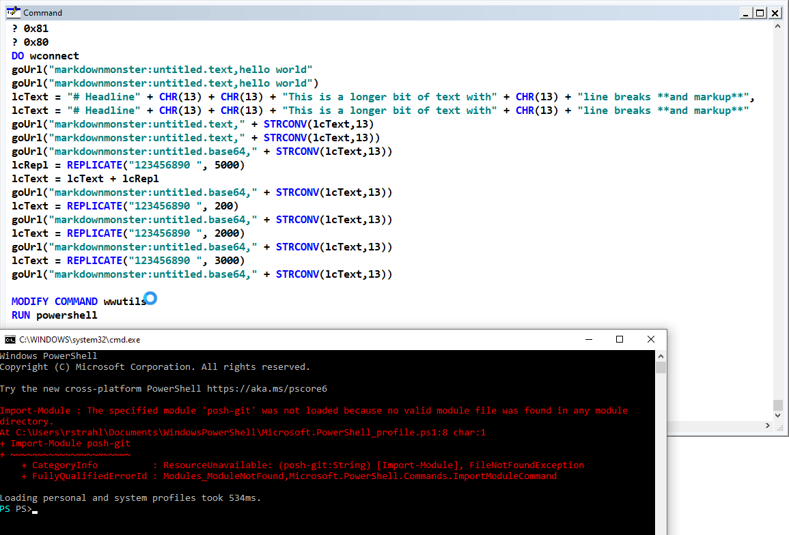

# External Process Execution in FoxPro

If you need to execute an external applications there are a bunch of different ways you can do that in FoxPro:

* FoxPro `RUN` Command
* ShellExecute Windows API
* CreateProcess Windows API
* The .NET `Process` class

The West Wind Internet and Client Tools and West Wind Web Connection also provide quite a few wrappers around the `ShellExecute()` and `CreateProcess()` APIs.

* **GoUrl()** - ShellExecute wrapper
* **CreateProcess()** - Simple CreateProcess wrapper
* **CreateProcessEx()** - More options for CreateProcess
* **ExecuteCommandLine()** - Shell Execute commandline wrapper

Let's take a look at all the commands and their capabilities

### Different Types of Applications
Part of the reason for all these different mechanisms is that while it seems like a simple thing to say that "Hey I just want to run this program...", there are a lot of different ways that you can run an application and interact with it.

Some applications are interactive, some are transactional and other yet are long running server-like processes. Each of these has different requirements. Not all of the above process launching mechanims work for all scenarios.

It helps to understand the difference between:

* Console Applications
* Desktop UI Applications

Console application run a Windows Command prompt, Powershell, Bash or command line tools like RoboCopy, LetsEncrypt or even a long running server like the new Web Connection Web Server.

Console applications come in multiple flavors: 

* Fully automated with a clear expected end and result output
* Long running, service like applications that act as servers

Desktop applications tend to be more obvious in their requirements: They start and run independently of other applications and generally you just want to launch them and then leave them running or interact with them via some sort of interprocess communication outside of the process launch mechanism (COM, Named Pipes, Sockets/Web Sockets for example).

In short there's a lot of variety when it comes to launching processes and the variety of tools available reflects that

### The FoxPro Run Command
Most developers are likely to look at the `RUN` command first when they look at launching an external application. After all it's a built-in command so it's just there. All the other mechanisms described here require some additional library code so `RUN` certainly seems easy.

But `RUN` is a confusing command and also has many frustrating shortcomings, so while it works well for simple execution scenarios for more complex things it can be very inconsistent in behavior.

This post is inspired by the inconsistencies in `RUN` which I ran into recently trying to execute an external editor which worked for some executables but not for others.

The `RUN` command has its roots in **FoxPro for DOS** and the orginal **Foxbase** before that and it was meant for command line execution of code. The command originally was modal - meaning it would wait for completion.

If you today in FoxPro for Windows type:

```foxpro
RUN powershell
```

into the command window you'll find a Powershell window pop up, but the Foxpro instance will be frozen waiting for you to exit powershell.



Notice the spinning cursor in the screen shot - FoxPro is waiting for the application to finish before it becomes responsive again.

The same thing happens with **most** other applications - even desktop applications. If you do:

```foxpro
RUN notepad
```

you still get that modal behavior where FoxPro will now wait until you shut down Notepad.

Some applications though use a launcher (namely most Windows Store apps, as well as number of Chocolatey hoisted applications that use a launcher).

For example the following works:

```foxpro
RUN code
```

which launches VS Code if you have it installed. VS Code uses a small command line launcher that pops up and goes away immediately and that actually make VS Code asynchronously without extra parameters.

Another one Windows Terminal:

```foxpro
RUN wt
```

Unfortunately both for `code` and `wt` and other launcher based tools, sometimes the command window doesn't exit and then FoxPro still acts like the application is modal.

The quick workaround for any application if you want it to run asynchronously and immediately return control to FoxPro is to your use the `/N` parameter:

```foxpro
RUN notepad /N1
```

Now Notepad comes up and you get control back in FoxPro immediately.

```foxpro
RUN /N1 notepad
```

> Unlike most FoxPro commands the `/N` parameter has to come **before the command line**! The command line has to be the last parameter.

The number in the `/N` determines how the window is shown. `/N1` is normal `/N4` is hidden and there are a few other options.

One nice thing about `RUN` is that it's OS Path aware - it finds things like `notepad` or `code` or `wt` that are on the Windows path. 

`RUN` uses a custom internal parser to find executables. This is a little bit like ShellExecute() but it's not using ShellExecute. For example you can't 'run' a URL or another Application Protocol handler like `skype:<phone-number>`

#### Problems with RUN
One problem with `RUN` is that it can be difficult at times to build command lines with parameters. If you have long parameters or paths on command lines it's easy for `RUN` to interpret the parameters wrong. This is because `RUN` parses the command line and breaks out the filename and arguments and because FoxPro has many string parsing rules there are a few ways that RUN can get it wrong.

I've also had problems with `RUN` with paths that include spaces or long filenames. 


To work around this you can use the `/N` command with various numeric arguments which runs the launched application asynchronously.