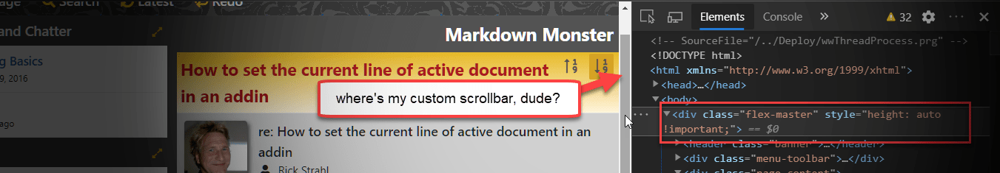
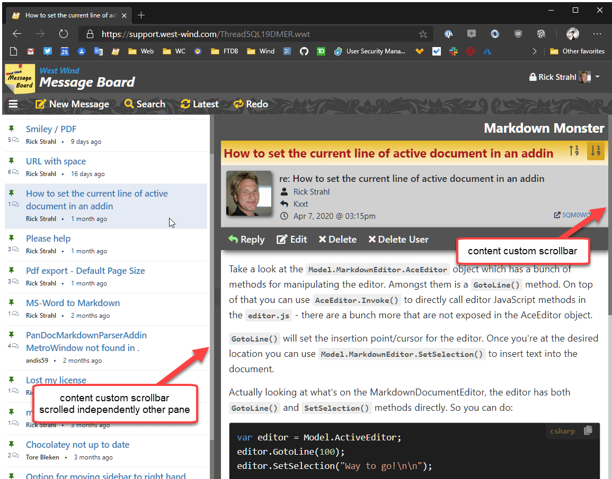
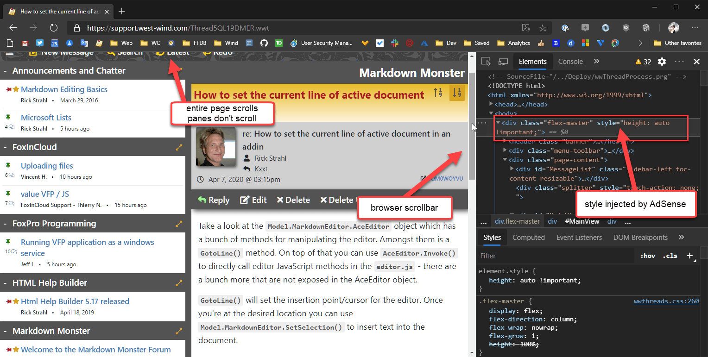

---
title: "Fixing Adsense Injecting 'height: auto !important' into scrolled Containers"
abstract: Ran into a weird issue today with AdSense in one of my older Web sites. I noticed that the site was not using the custom scrolling in containers that I've been using for years. Turns out Google's AdSense on this page is injecting some extra styling that changes the scroll behavior - and the way the entire page works. Here's what the problem is and how you can work around it.
categories: HTML
keywords: AdSense, injection, scrollbar, container, height
weblogName: West Wind Web Log
postId: 1755662
permalink: https://weblog.west-wind.com/posts/2020/May/25/Fixing-Adsense-Injecting-height-auto-important-into-scrolled-Containers
postDate: 2020-05-25T21:54:32.5792028-10:00
---
# Fixing Adsense Injecting 'height: auto !important' into scrolled Containers



Ran into an AdSense problem today with one of my older Web sites. On this Message Board site I maintain, content is split into two split containers that span the height of the page and provide their own customized scrollbars for each 'pane'. It's basically two split `<div>` tags that are sized inside a `flex` container that manages the header and the list and content panes to fill the entire page. 

One reason for this is specific layout is that FlexBox makes it very easy to create pages that 'fit' properly into a `height: 100%` page without overflow that requires a page scrollbar. Rather, each of the panes have their own independent scrollbars so the longish content on either side can be navigated independently. Also the header can stay visible on the top of the page.

I use this sort of layout for a number of sites and pages and it has been working  great for years. 

The way this should work looks like this:



## Really AdSense?
Recently however several people complained that their view of this page was not working as it used to - rather than scrolling panes independently, the entire page pops up a browser scrollbar on the right, and both of the 'panes' are not showing any scrollbars.

It turns out that at some point AdSense has changed its scripting behavior **to automatically detect when the ad content is placed into some sort of scrolling container**. When that's the case the AdSense script code injects a `style="height: auto !important ` attribute into the flex container, which completely changes the behavior of the page behavior:



Notice the big browser scrollbar on the right instead of the custom slim scrollbars which have disappeared. Also notice how the entire page including the header now scrolls down instead of as before the individual panes only scrolled each pane's content.

The script code injected is a `style="height: auto !important"` and that bit is what's causing the document browser scroll bar to pop up. The document no longer set to `height: 100%` and the content now overflows, which in turn removes the scrollbars from the the two panes, because the document is now as long as the longer of the two panes.

Grrrrr....

The original layout in my application uses FlexBox to constrain the content  to `height: 100%` and then lets the content and sidebar panels size themselves to the full 100% size of the document.

```css
.flex-master {        
        display: flex;
        flex-direction: column;
        flex-wrap: nowrap;
        flex-grow: 1;
        height: 100%;
    }
.page-content {    
    flex: 1 1 auto;   /* grow & shrink*/

    display: flex;
    flex-direction: row;                         
    
    overflow: auto;
}    
.sidebar-left {
    flex: 0 0 auto; /* don't grow | shrink horizontally */
    width: 400px;
    max-width: 100%;
    overflow-x: hidden;
    overflow-y: auto;
    border: none;
    white-space: normal;
    transition: width 0.2s ease-in-out;
    z-index: 100;

    scrollbar-track-color: #686868;;
    scrollbar-arrow-color: cornsilk;
    scrollbar-face-color: #555;    
    -ms-overflow-style: -ms-autohiding-scrollbar !important;
    -webkit-overflow-scrolling: touch;
}
```

It's a simple layout and it works well. 

But with Google injecting this style tag:

```html
<div class="flex-master" style="height: auto !important">
```

the flex layout height goes to shit, and all height calculations now are free flowing to whatever the larger of the two panels is. The usability result is that the entire page - header and both panes - scroll tied to the browser's main scrollbar. It still works but behavior has changed **drastically**!

I suppose this is meant to keep people from running hidden content in frames/panels that are not visible, but this particular use case I'm using seems legit in that I simply want more control over how the content is displayed and navigated independently. By injecting that attribute AdSense is actually completely breaking my page scroll behavior.

**Not cool, Google!**

The AdSense script does this not only on initial page load, but also after loading additional pages dynamically with a `fetch`  request. The ads are updated via script with:

```javascript
// fire google ads  
setTimeout(function() {
    (adsbygoogle = window.adsbygoogle || []).push({});
    _gaq.push(['_setAccount', 'UA-9492219-13']);
    _gaq.push(['_trackPageview']);
}, 500);
```

This code too triggers the attribute injection.

## Fixing Google's Overbearing Behavior - Take 1
The simplest solution I could think of was to simply run some script to essentially remove the tags.

```javascript
// Remove Google fixup code for the Flex scroll box
setTimeout( function() {        
    var flex = document.getElementsByClassName('flex-master')[0];                        
    flex.setAttribute("style","");  
},700);       
```

And that does work... Note that the update has to be delayed long enough so that the AdSense code has actually applied the `style` tag.

This code is definitely not ideal: **The page jumps around  terribly** every time content is first shown or updated. First the page shows properly with the custom toolbars and perfectly sized content and list panes, but then the browser toolbar from the AdSense injection pops up a which slightly changes the page dimensions and the entire view shifts a little. Then a fraction of a second later it snaps back to the original view. And - with the timeout it's possible a slow render may be too early to actually update the style attribute before AdSense has updated it.

Yeah - Dumpster Fire! :fire:

## A better way - Using MutationObserver
After some experimentation with different things trying to minimize the jitters in the rendering I decided to take another shot at searching for this problem, because it certainly seems that somebody must have run into this before. And sure enough now that I knew what I was looking for exactly, I ran into this [StackOverflow post](https://stackoverflow.com/questions/55695667/adsense-injecting-style-tag-into-my-page-in-chrome) that uses a MutationObserver. Of course, I should have thought of that myself.

[MutationObserver](https://developer.mozilla.org/en-US/docs/Web/API/MutationObserver) is a DOM API that allows you to watch for changes on DOM elements and get notified when a change occurs. It's very powerful and while you don't need it often in normal page level development, it can be very useful if you need to generically trap changed content which is exactly the scenario I'm looking at here.
  
I change the `setTimeout()` code I was using before to this:

```html
<script src="https://pagead2.googlesyndication.com/pagead/js/adsbygoogle.js" async></script> 
<script>
    // based on code found at:
    // https://stackoverflow.com/questions/55695667/adsense-injecting-style-tag-into-my-page-in-chrome
    var flex = document.getElementsByClassName('flex-master')[0];
    const observer = new MutationObserver(function (mutations, observer) {
        flex.style.height = "";
    });
    observer.observe(flex, {
        attributes: true,
        attributeFilter: ['style']
    });
</script>
```

And this works perfectly.

This code observes the `flex-master` element and when AdSense changes the value of the style I get the notification that immediately un-sets the style attribute again. This all happens in the same execution cycle as the update so there's no annoying bouncy document to contend with.

One nit here is that the observer fires multiple times - as the `height` is updated the style changes again and so another event is fired. It's not a big deal, since this code is minimal.

So this works and **problem solved** for now.

## Summary
It sucks that Google is so heavy-handed in explicitly changing content on my page. It's part of the content guidelines, but these days, especially with client side loaded code it's not uncommon to have content that lives in containers that manage their own page scrolling for a cleaner 'application-like' experience. But alas here we are... Google does whatever the heck Google does and we can either take it or leave it.

At least there's a hacky workaround for this, although I suspect this doesn't make Google very happy as this certainly can be abused to hide ads after they are loaded which I suspect is the main reason for this behavior. Who knows, Google is likely to shuffle things around again in the future, but for now this hack works and I have my original navigation back...

<div style="margin-top: 30px;font-size: 0.8em;
            border-top: 1px solid #eee;padding-top: 8px;">
    
    this post created and published with the 
    <a href="https://markdownmonster.west-wind.com" 
       target="top">Markdown Monster Editor</a> 
</div>