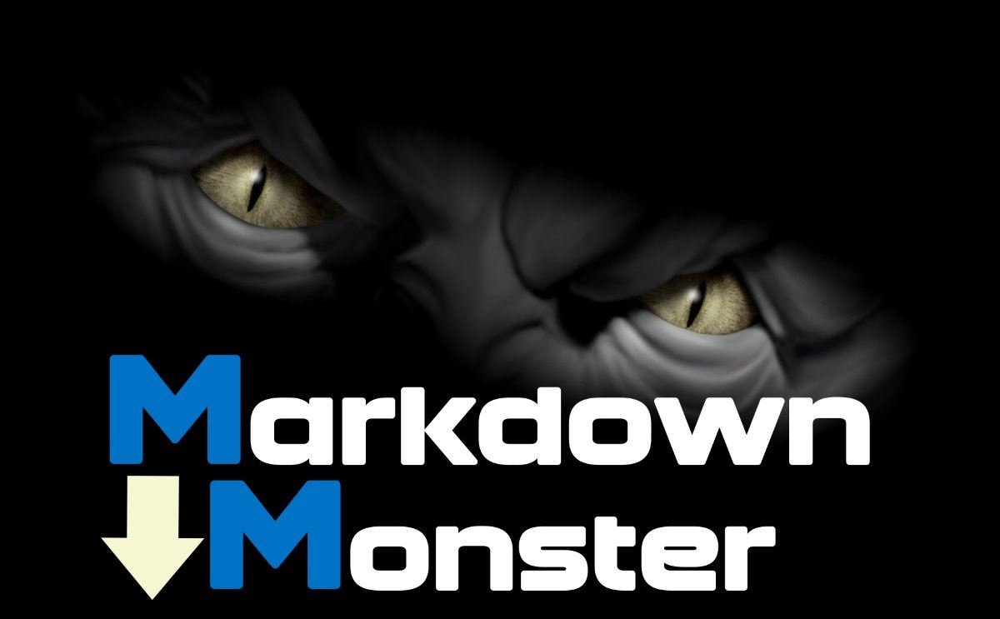

# Jekyll Test Post

This is a Jekyll Test Post - no really:

<b>Points:</b>

* Getting Started
* Working with Jekyll posts
* Updating the data

> Note there's a no good reason to ignore this content.