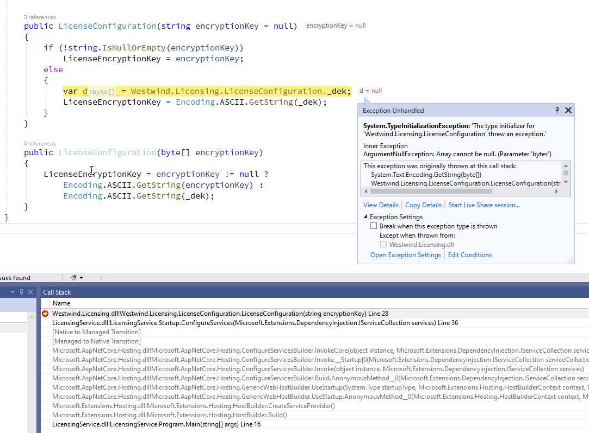

# Static Constructor Failures and Declaration Order 

{title='Oooops...'}

I ran into a weird and hard to identify error today that wasted way more time than I care to admit because you know... assumptions on what you know when you don't actually know :smile: And yes this squarely falls in the **Operator Error** category, but I think a mistake that's relatively easy to make - and miss.

Check out the following bit of code and see why this would fail (you can paste this into [LinqPad](https://www.linqpad.net/) to execute):

```cs
void Main()
{
	var lic = new LicenseConfiguration();
	lic.Dump();
}

public class LicenseConfiguration
{
	public static LicenseConfiguration Current { get; set; } = new LicenseConfiguration();
	
	static readonly byte[] _dek = new byte[] { 88, 103, 77, 81, 66, 56, 89, 120 };

	public string LicenseEncryptionKey { get; set; }

	public LicenseConfiguration(string encryptionKey = null)
	{
		if (!string.IsNullOrEmpty(encryptionKey))
			LicenseEncryptionKey = encryptionKey;
		else
		{
			var d = LicenseConfiguration._dek;
			LicenseEncryptionKey = Encoding.ASCII.GetString(d);
		}
	}
}
```

In LinqPad this fails with the following error:


Can you spot the problem here?  No? Yeah well, me either at least for a while! If you did figure this out just by looking at it your eye to code coordination is much better than mine :smile:.

The problem in the code as shown is that the `LicenseConfiguration._dek` value is always `null` when accessed in the constructor, **even though there's a field initializer** on the field. This in turn blows up the `.GetString()` call that cannot be passed a null value. But that value should never be `null` because it's assigned with the (implicit) static constructor - but there it is blowing up in my face. 

I tried a few different things like explicitly adding a static constructor and assigning the `byte[]` value there, but the static CTOR never actually fired. Double WTF? But it did give a hint to the problem.

## Order Matters
To make a very long story short the problem is

* **Static Declaration Order matters!**

Notice the order in how I have the two static properties declared:

```cs
public static LicenseConfiguration Current { get; set; } = new LicenseConfiguration();
static readonly byte[] _dek = new byte[] { 88, 103, 77, 81, 66, 56, 89, 120 };
```

Notice that `Current` comes before the private `_dek` declaration and it does... drum roll please: a `new LicenseConfiguration()`. Classic case of recursive ctor calls.

More explicitly the compiler translates the implicit property/field declarations into a static CTOR which does something like this:

```cs
static LicenseConfiguration() 
{ 
    Current = new LicenseConfiguration();
    _dek = new byte[] { 88, 103, 77, 81, 66, 56, 89, 120 };
}
```

Now can you spot the problem? :bulb:

When the non-static constructor fires it does:

```cs
var d = LicenseConfiguration._dek;
LicenseEncryptionKey = Encoding.ASCII.GetString(_dek);
```

So it tries to get the `_dek` property, which triggers the static CTOR. Then it tries to create the `.Current` instance and here's where the recursive call happens launching into another static initialization. At this point the `_dek` field still has not been initialized. When the code falls through to the `.GetString()` call with the `_dek` default value in the constructor the value is `null` and things go **boom**.

Oddly when looking at the Visual Studio call stack display, it doesn't show the recursive constructor nesting:



But the error message in Visual Studio provides a hint in that it points `GetString()` where it blows up. 

I'm sitting on the first use of the `_dek` field when the type initialization error occurs. In that scope `.GetString(_dek)` **has not fired yet**, but the error says it errors at `.GetString(_dek)`. It's the nested CTOR call that's blowing up. Aha! :bulb:

Notice that the exception message correctly points at the nested `.GetString()` call which hasn't fired in the top level constructor, but is being fired for the nested static constructor initialization of the `.Current` instance.

Yikes - how is that for an esoteric error? 

The quick fix for this is to shuffle the declarations into desired execution order where the byte array is initialized before the Current instance is set.

```cs
static readonly byte[] _dek = new byte[] { 88, 103, 77, 81, 66, 56, 89, 120 };
public static LicenseConfiguration Current { get; set; } = new LicenseConfiguration();
```

This lets the non-static constructor work without a failure and the code goes on its merry way without errors.

Since the declaration order is significant here, it's probably a good idea to be explicit and create a static constructor instead of the auto-declarations, which makes it more obvious and allows for a comment notice:

```cs
static LicenseConfiguration() 
{
     // Note: Declaration Order is important!
     _dek = new byte[] { 88, 103, 77, 81, 66, 56, 89, 120 };
     LicenseConfiguration Current = new LicenseConfiguration();
}
```

And now it works:


## Summary
Another one of those edge case scenarios where you look at code and go "How could this possibly be failing?" Yet there's a fairly logical reason why this is actually failing the way it is, once you look at the whole picture.

The moral of this little fable is: Make sure you know how automatic properties are assigned and ensure that the order is such that each property has what it needs before it auto-initializes, including potentially properties/fields that were declared first.

Auto-initialization is nice compiler sugar, but it's not magic, so you're still responsible for making sure the initialization fires in the right order.

If you have a bunch of properties that do depend on others, it's probably a very good idea to create explicit constructors, static or otherwise. Note that although this post is about a static constructor blowing up due to declaration order, the same rules apply for non-static auto initialized fields and properties. Order matters no matter what.

Constructor nesting calls are always tricky and usually unintended or a side effect. When something goes wrong with constructor code it's often difficult to debug, because it's easy to lose sight of what's firing when, unless you look very closely. And apparently the debugger can be deceiving you you too sometimes, not stepping into the nested calls as is the case here. 

This is clearly an edge case but that makes it all the more annoying to track down. A silly mistake was causing me an unexpected error and a good hour of wasted time. Hopefully this post can save someone from wasting that hour and doubting their sanity as I did :smile:...

<div style="margin-top: 30px;font-size: 0.8em;
            border-top: 1px solid #eee;padding-top: 8px;">
    
    this post created and published with the 
    <a href="https://markdownmonster.west-wind.com" 
       target="top">Markdown Monster Editor</a> 
</div>