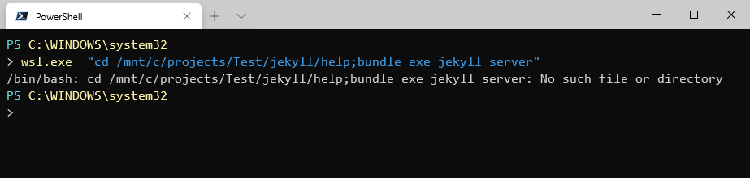
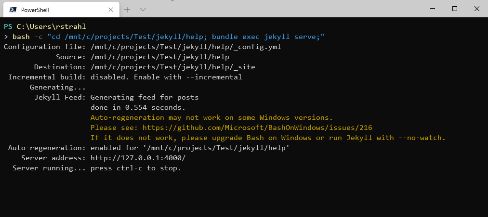
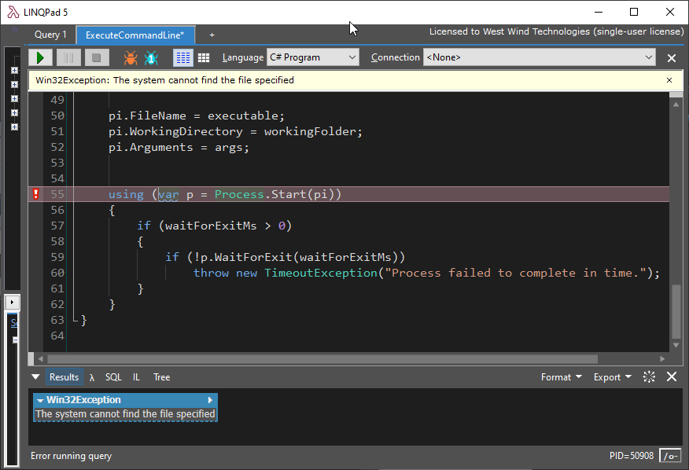
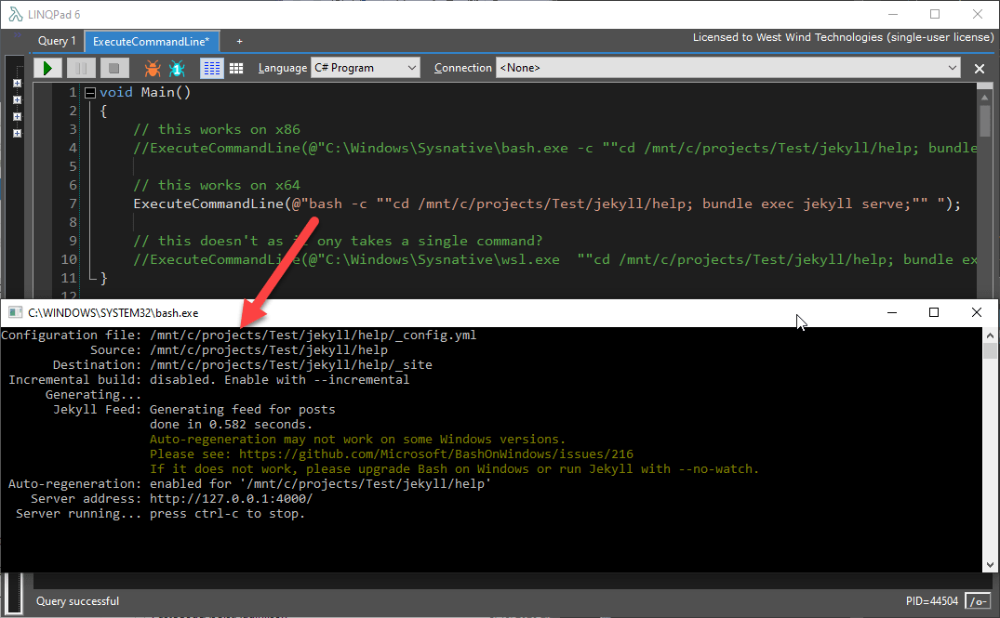

# Using WSL to Launch Several Bash Commands from an Application


I just spent way too much time trying to figure out a way to launch the Windows Subsystem for Linux to run multiple commands for a  server script from a full framework desktop application.  

### The Premise
I'm working on a feature for Jekyll Weblog publishing in [Markdown Monster](https://markdownmonster.west-wind.com). Markdown Monster supports posting to a variety of online blog engines, but after a few requests I'm looking into publishing a post (which is really just a document with some extra meta data) into the Jekyll project folder structure locally. So 'publishing' in this case merely means copying files and adjusting asset links in the post.

I want to allow editing a post like normal, which for Markdown Monster means create a new Blog Post (optional), which creates a dedicated folder for the post underneath a configured Weblog Entries folder (in Documents or DropBox/OneDrive usually). A new post gets some basic meta-data based on the title entered when the post is created. It's similar to what Jekyll post metadata looks like but there's more of it. The 'publish' process then fixes up the YAML header for Jekyll, and copies the post Markdown file and related assets into the appropriate Jekyll folders. Pretty straight forward, all that.

The last thing then is to optionally allow launching a command line operation to build the Jekyll site and run the server to preview the new post. This is the part I want to talk about here - launching a `WSL` Windows SubSystem process to run the Jekyll project inside of the Jekyll install on the Linux WSL installation. 

### WSL Awesome Tool - not so awesome if you need to launch it
WSL is pretty damn cool if you think about I'm doing here. I basically have Jekyll running on Linux in WSL because Jekyll isn't officially supported to run on raw Windows and Ruby which is what runs Jekyll to this day doesn't install and run well natively on Windows. So WSL makes it possible to run Jekyll natively while interacting with it externally from Windows via the WSL command processing.

Yeah - nice!

But... as cool as that is, if you want to automate WSL externally from another application like I'm doing from Markdown Monster here, there are some complications that make that interaction less than optimal.

So, using WSL from the command line to 'simulate' the final Jekyll build operation, it looks something like this:

```ps
# Start WSL
wsl   

# inside of WSL/Ubuntu command line
cd /mnt/c/projects/Test/jekyll/help
bundle exec jekyll serve;
```

Simple right? This should be a piece of cake.

To then automate this from a Windows application, it would be nice if you could just do the following:

```ps
wsl "cd /mnt/c/projects/Test/jekyll/help; bundle exec jekyll serve;"
```

But **that does not actually work** with the dual commands. While [WSL has a 'command' parameter](https://docs.microsoft.com/en-us/windows/wsl/reference#wslexe), it only allows a single command. When I pass the command line above it seems WSL is interpreting the command line as a single invokation:



However the following using the `bash` command works:

```ps
bash -c "cd /mnt/c/projects/Test/jekyll/help; bundle exec jekyll serve;"
```

Running this from within Windows Terminal with a Powershell prompt to start it looks like this:



It works!

So... Ugh! `wsl` and `bash` are the same but not the same.  It was suggested to me that `wsl.exe` is the recommended command line to use because it uses the Linux Distro you have configured as your preferred distro. `bash` apparently always uses the default distro.

The two commands also have different command line options and especially related to executing commands on startup.

Ok - so for what I need here `bash` is the way this has to go.

### Next Problem - invoking WSL from an Application
As if the above wasn't confusing enough, now it gets really odd. First here's the code I'm using to launch an application from Markdown Monster. This is a generic helper function I use that lets you pass in a full command line and has a number of options in a single parameterized method call:

```cs
public void ExecuteCommandLine(string fullCommandLine, 
                                string workingFolder = null, 
                                int waitForExitMs = 0, 
                                string verb = "OPEN",
                                ProcessWindowStyle windowStyle = ProcessWindowStyle.Normal)
{
	string executable = fullCommandLine;
	string args = null;
	
	if (executable.StartsWith("\""))
	{
		int at = executable.IndexOf("\" ");
		if (at > 0)
		{			
			args = executable.Substring(at+1).Trim();
			executable = executable.Substring(0, at);
		}
	}
	else
	{
		int at = executable.IndexOf(" ");
		if (at > 0)
		{
			
			if (executable.Length > at +1)
				args = executable.Substring(at + 1).Trim();
			executable = executable.Substring(0, at);
		}
	}

	var pi = new ProcessStartInfo();
	//pi.UseShellExecute = true;
	pi.Verb = verb;
	pi.WindowStyle = windowStyle;

	pi.FileName = executable;
	pi.WorkingDirectory = workingFolder;
	pi.Arguments = args;


	using (var p = Process.Start(pi))
	{
		if (waitForExitMs > 0)
		{
			if (!p.WaitForExit(waitForExitMs))
				throw new TimeoutException("Process failed to complete in time.");
		}
	}
}
```

So using that code what I want to do should look something like this to mimic the command line code that worked above:

```cs
ExecuteCommandLine(@"bash -c ""cd /mnt/c/projects/Test/jekyll/help; bundle exec jekyll serve;"" ");
```

This is basically the same command line I used in Powershell, so I expected this to work - **but it doesn't work**  (running in LinqPad 5 32 bit):



Well... that sucks!

A lot of false starts and some Twitter help from [Richard Turner](https://twitter.com/richturn_ms) and [Martin Sundhaug](https://twitter.com/sundhaug92) later, I figured out that the problem here is - Processor Architecture. 

Running **the same code** in LinqPad 6 which is 64 bit **works**:



### Architecture Hell
So Markdown Monster is a 32 bit application running an x86 compiled EXE. It can run 64 bit, but for reasons I've discussed before [Markdown Monster is considerably more stable in 32 bit mode](https://weblog.west-wind.com/posts/2016/Dec/23/Downgrading-a-NET-Applications-from-64-bit-to-32-bit-for-the-WebBrowser-Control#Running-into-64-bit-issues-with-the-WebBrowser-Control), so it defaults to 32 bit.

The differences between 32 bit and 64 bit applications are subtle, but one thing that's different is file locations and paths and where system files are found.

The issue here is this:

`wsl.exe` and `bash.exe` live in `\Windows\System32`. 64 bit applications have that path mapped into their path on where to look for files.

However, 32 bit applications **do not look in `System32`** for files - they look in the `SysWow64` folder. Turns out `wsl.exe` and `bash.exe` are not in those folders. So trying to load `bash` or `bash.exe` or `wsl` or `wsl.exe` doesn't find anything.

I'd call that a shortcoming since these executables are only small launchers that don't do much - there should be files in the 32 bit folder location as well.

There's a way around this using a folder `SysNative` folder alias. Using that alias I can now use the following command:

```cs
ExecuteCommandLine(@"C:\Windows\Sysnative\bash.exe -c ""cd /mnt/c/projects/Test/jekyll/help; bundle exec jekyll serve;"" ");
```

### Check for Architecture and Vary Operation
But be aware this **only works in x86 architecture mode**. For x64 bash.exe is found in the system path and it just works.

So for reliable operation in a .NET application you need something like this:

```cs
if (Environment.Is64BitProcess)
	// this works on x64
	ExecuteCommandLine(@"bash -c ""cd /mnt/c/projects/Test/jekyll/help; bundle exec jekyll serve;"" ");
else
	// this works on x86
	ExecuteCommandLine( 
            Environment.GetEnvironmentVariable("WinDir") +
            "\\SysNative\\bash.exe -c " +
            "\"cd /mnt/c/projects/Test/jekyll/help; bundle exec jekyll serve;\" ");
```	

And that now works! 

### Summary
So that's a lot of confusion for a pretty common scenario: Launching a shell process from within another application.

To summarize:
* `wsl.exe` only supports single commands via `wsl "command or executable"`
* Use `bash.exe` to allow multiple commands to be executed
* `wsl` and `bash` live in System32 and are auto-mapped **only for 64 bit apps**
* 32 bit apps need to use `\Windows\SysNative\bash.exe` to launch

That's quite a bit of inconsistency. It sure seems that `wsl.exe` and `bash.exe` should be available on the path regardless of whether you're running in 64 bit or 32 bit mode.

Also, if `wsl.exe` is going to be the recommendation for running WSL, it needs a way to reliably support launching with multiple commands similar to the way `bash -c` works. The command line options for `wsl.exe` are pretty limited.

What I've described here is not something you're likely to run into often, but if you do, it sure can be a head scratcher. 32 bit and 64 bit differences are always trouble because they are often very difficult to track down as people see different behavior between architectures - 'hey it works for me, but it doesn't work for you' - just because cause you're running 32 bit. 

Hopefully this post is useful to some of you so you can avoid some of this pain. And even more hopefully some of these external startup issues can be ironed out in `wsl` to make it easier and more flexible to launch `wsl` from other applications.