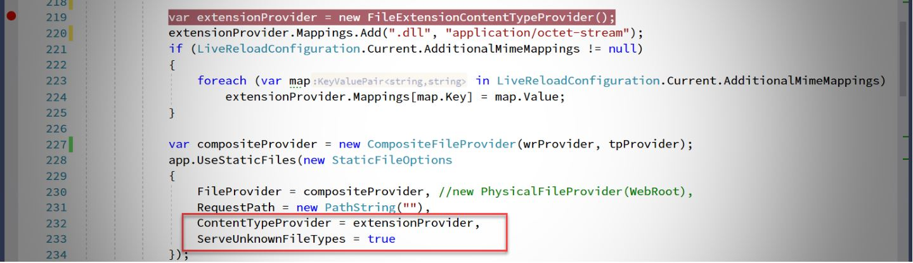
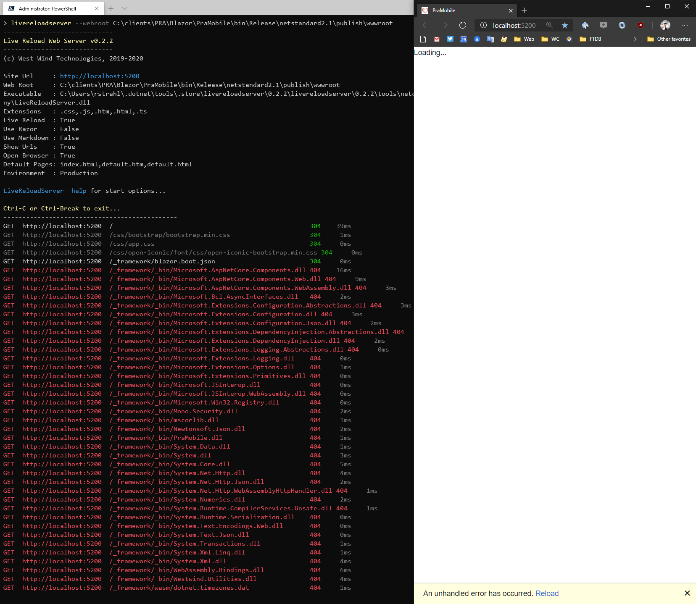
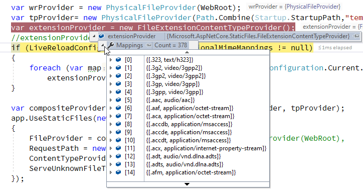

# Add Additional Mime Extension Mappings to the ASP.NET Core Static Middleware



As you may know, I have a .NET Core based [generic LiveReloadWebServer](https://github.com/RickStrahl/Westwind.AspnetCore.LiveReload/blob/master/LiveReloadServer%2FREADME.md) that can serve static (and Razor Pages) Web content generically out of an arbitrary folder. 

The other day I tried to fire up a Blazor WASM site to check it out standalone running in a plain old Web server and the LiveReloadServer is perfect for that:

```ps
LiveReloadServer --webroot C:\clients\PRA\Blazor\PraMobile\bin\Release\netstandard2.1\publish\wwwroot
```

But unfortunately it turns out that didn't work so well for the Blazor site and I ended up with a *sea of red*:



What's happening here is that is that the `.dll` extension is served as a static file in ASP.NET Core. Although it is a binary file, as far as the server is concerned it's just a static file that's sent to the client, to be processed by the client side Blazor engine. 

But, the ASP.NET Core `StaticFileProvider` by default doesn't serve `.dll` files that are required for Blazor WASM to work. All those 404 errors are Kestrel rejecting the requests for DLL files that exist, but aren't served by the static file provider. 

> #### @icon-info-circle But it works in a proper Blazor Application?
> A proper Blazor application with a Blazor configuration entry point handles adding the appropriate mime type mapping implicitly, so loading `.dll` files works out of the box. But if you build **a custom Web server** as I do here in this generic live reload server, the `.dll` extension has to be explicitly added and that's what I talk about below.

### The StaticFiles Middleware
The [StaticFile Middleware in ASP.NET Core](https://docs.microsoft.com/en-us/aspnet/core/fundamentals/static-files?view=aspnetcore-3.1) is at the center of the `LiveReloadWebServer` application/dotnet tool. It's responsible for serving any non-dynamic files, which in the use case of this server is pretty much **everything**. Static HTML files, CSS and JavaScript resources, images - all static files served from some folder. The Live Reload Server lets you specify a root folder and the application points the static file provider at that folder using an explicit `FileProvider` assignment.

In a typical Web application you use the StaticFile middleware to serve well-known static file types very simply by doing this:  

```cs
app.UseStaticFiles();
```            

But this middleware has an optional parameter that allows you configure a number of options like a FileProvider that can customize and combine multiple locations, add custom mappings and more.

For example, in the LiveReload server I specify a couple of default file locations like the passed in `WebRoot` folder and a `templates` folder that provides some support resource files for Markdown pages. Using the `CompositeFileProvider()` allows combining multiple providers together:

```cs
var wrProvider = new PhysicalFileProvider(WebRoot);
var tpProvider= new PhysicalFileProvider(Path.Combine(Startup.StartupPath,"templates"));

// combine multiple file providers to serve files from
var compositeProvider = new CompositeFileProvider(wrProvider, tpProvider);
app.UseStaticFiles(new StaticFileOptions
{
    FileProvider = compositeProvider, //new PhysicalFileProvider(WebRoot),
    RequestPath = new PathString("")
});
```             

The above is the original code I had in the `LiveReloadServer` and this code **does not** serve `.dll` files required for Blazor support.

### Adding Additional Extension/Mime Mappings
So the problem in the `404` responses returned by the `LiveReloadServer` is that the Static File middleware doesn't have `.dll` in it's mime mappings.

There are a couple of ways around this:

#### Allowing all unknown Files
There's a `ServeUnknownFileTypes` option that can be set that effectively allows any and all unknown extensions to be served:

```cs
var compositeProvider = new CompositeFileProvider(wrProvider, tpProvider);
app.UseStaticFiles(new StaticFileOptions
{
    FileProvider = compositeProvider, //new PhysicalFileProvider(WebRoot),
    RequestPath = new PathString(""),
    ContentTypeProvider = extensionProvider,
    
    ServeUnknownFileTypes = true
});
```

Since `LiveReloadServer` is a local Web Server that's meant to serve serve static content that's probably OK, but still there might be unforeseen consequences of files being exposed that shouldn't be.

##### Adding specific File Extensions
The more granular option is to explicitly add content type provider to the Static File Module using the `FileExtensionContentTypeProvider` and explicitly specify the extensions to use in addition to the many defaults:

```cs
var extensionProvider = new FileExtensionContentTypeProvider();
extensionProvider.Mappings.Add(".dll", "application/octet-stream");
if (config.AdditionalMimeMappings != null)
{
    foreach (var map in config.AdditionalMimeMappings)
        extensionProvider.Mappings[map.Key] = map.Value;
}
...
app.UseStaticFiles(new StaticFileOptions
{
    FileProvider = compositeProvider, 
    // add the mimemappings
    ContentTypeProvider = extensionProvider
});
```

The default extensions provider already supports a huge number of default mime extension mappings:



And you can add additional mappings with:

```cs
extensionProvider.Mappings[".dll"] = "application/octet-stream";
extensionProvider.Mappings[".custom"] = "text/html";
```

So, now when I add the `.dll` extension I can serve my Blazor assemblies and LiveReload server works with Blazor (well - only in run mode, not live reloading since Blazor has to recompile in order to show changes).

### Happy Camper
So with this change - and another change I'll describe in my next post -  it's now possible to run the Live Reload server against Blazor sites. Live Reloading doesn't work (due to the external compilation requirements of Blazor), but the applications will run as static content.

If you want to try it out:

* [Live Reload Web Server Documentation](https://github.com/RickStrahl/Westwind.AspnetCore.LiveReload/blob/master/LiveReloadServer%2FREADME.md)
* [Live Reload Web Server Dotnet Tool (Nuget)](https://www.nuget.org/packages/LiveReloadServer/)

To install you can use:

```ps
dotnet tool install --global LiveReloadServer
```

then

```ps
LiveReloadServer --WebRoot \websites\MySite
```

### Summary
Extensions don't need to be set often, but you never know if you run into some obscure file type that the default extension mappings don't support, or some potentially insecure extension.

Like the `.dll` extension, which *normally you don't want to serve* because it's executable binary data. In an actual Blazor project the extension is internally added by the ASP.NET Core Blazor configuration setup, but if you host your own Web Server from scratch as I do for the `LiveReloadWebServer`, that extension has to be **explicitly** add to the content type mappings and using the solutions described in this post you can make short work of adding custom mime type mappings.

Onward - the next issue in getting Blazor to run properly in the LiveReload server is handling the SPA server fallback URLs when refreshing a page. That'll be next in line... Until then rock on!

### Resources

* [Static Files Middleware](https://docs.microsoft.com/en-us/aspnet/core/fundamentals/static-files?view=aspnetcore-3.1)
* [Live Reload Web Server (GitHub)](https://github.com/RickStrahl/Westwind.AspnetCore.LiveReload/blob/master/LiveReloadServer%2FREADME.md)

<div style="margin-top: 30px;font-size: 0.8em;
            border-top: 1px solid #eee;padding-top: 8px;">
    
    this post created and published with the 
    <a href="https://markdownmonster.west-wind.com" 
       target="top">Markdown Monster Editor</a> 
</div>