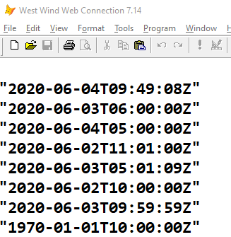
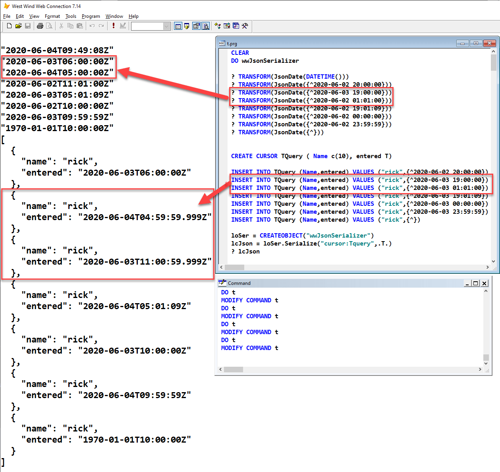

# FoxPro Date Rounding Errors in COM and .NET

Ran into a nasty problem with COM Interop in .NET recently based on a [message on the West Wind Message board](https://support.west-wind.com/Thread5S60R3YQD.wwt). Basically the initial message points out that dates were getting compromised in two way JSON conversions when using `wwJsonSerializer`. 

### .NET for Date Handling
Date handling in FoxPro is decidedly lacking because FoxPro dates have no concept of time zone association. FoxPro only supports 'local' dates meaning dates reflect current Windows timezone. For JSON serialization typically the date needs to be encoded either using a UTC date that adds or subtracts the timezone offset or by specifying the local date with a timezone offset.

There are ways to do this in FoxPro using the Windows Timezone APIs but it's pretty gnarly code that requires structures and several API calls which are generally fairly slow in FoxPro.

So `wwJsonSerializer` uses some .NET code to serialize dates properly and do both the UTC conversion and JSON encoding in .NET.

I then have a `JSONDate()` function that looks like this:

```foxpro
FUNCTION JsonDate(lvValue, llAssumeUtcDate)
LOCAL lcDate, loBridge

IF VARTYPE(lvValue) = "D"
	lvValue = DTOT(lvValue)
ENDIF	
IF EMPTY(lvValue)
	lvValue = {^1970-1-1 :}
ENDIF

*** Make sure wwDotnetBridge is loaded with DO wwDotnetBridge
loBridge = EVALUATE("GetwwDotnetBridge()")
RETURN loBridge.oDotnetBridge.ToJsonUtcDate(lvValue,llAssumeUtcDate)
```
  
There's similar code in `wwJsonSerializer()` that does the inline date serialization rather than calling this function and checking for the library for every date conversion. 
  
The original .NET function was super simple:

```cs
public string ToJsonUtcDate(DateTime dt, bool isUtc)
{
    if (!isUtc)
        dt = dt.ToUniversalTime();
    return JsonConvert.SerializeObject(dt,wwJsonSerializer.jsonDateSettings);
}
```

So far so good. The code works. In fact if I do this:

```fox
? TRANSFORM(JsonDate(DATETIME()))
? TRANSFORM(JsonDate({^2020-06-03 19:00:00}))
? TRANSFORM(JsonDate({^2020-06-02 20:00:00}))
? TRANSFORM(JsonDate({^2020-06-02 20:01:19}))
? TRANSFORM(JsonDate({^2020-06-02 23:59:59}))
? TRANSFORM(JsonDate({^2020-06-02 00:00:00}))
```

Everything works just fine - the dates are created as you'd expect:


  
No problems. The dates are offset by the UTC conversion and the values are coming back correctly.

### Dates out of a Database == Date Rounding Problems
However when using a cursor, **some** date values are getting slightly changed to what looks like a rounding error. Check it out:



Those two cursor dates for some reason contain fractional millisecond value. But as you can see the original values put in are exactly the same as the values I used in the straight JSON value conversion in the first code sample. The second scenario **always** renders the those two dates incorrectly. I'm not sure what about those date triggers the rounding but it looks like it's common as it occurs roughtly 30% of dates I tried. Looks like a typical floating point overflow problem. But...

**Weird!!!**

This seems to suggest that **FoxPro is doing something different with dates stored in a cursor than dates in a plain variable or raw value passed**.

I started looking closer at this to see where there problem is coming from and it definitely happens on the VFP or COM conversion end of the connection. When debugging into the .NET code that for the JSON conversion, the date parameter value that comes into the method call is invalid from the  get-go. This means it's not .NET that's mucking up the value. The failure is somewhere in FoxPro's conversion of:

* A DateTime value in the database
* COM Call into .NET

The important and very weird thing here is that **this only happens with cursor date values**. It doesn't happen - even with the very same date value - when the date is directly passed to .NET. 

If you look at the sample code above you can see I'm passing the **same exact date** in the first block, and then again in the cursor sample. It works in the first block without the fractional value, and gets munged in the second.

### Hack me up!
I went through a few iterations in trying to fix this, but in the end decided to create a very hacky fix in the  .NET function to fix up the date.

The idea is to basically create a new date and check for the millisecond value and round that value up if it's over 500 milliseconds. For problem values the millisecond value **always is 999**, so it's easy to find when there is a problem. FoxPro dates only have second resolution that you can set so in theory there never should be a millisecond value.

With that here's the code that checks and recreates a new date if the millisecond is set:

```js
public string ToJsonUtcDate(DateTime time, bool isUtc)
{
    // fix rounding errors
    int second = time.Second;
    int minute = time.Minute;
    int hour = time.Hour;
    int millisecond = 0;
    if (time.Millisecond > 500)
    {
        second = time.Second + 1;
        if (second > 59)
        {
            minute = minute + 1;
            second = 0;
        }
        if (minute > 59)
        {
            hour = hour + 1;
            minute = 0;
        }
        if (hour > 23)
        {
            hour = 23;
            minute = 59;
            second = 59;
            millisecond = 999; 
        }
    }

    // we need to fix the date because COM mucks up the milliseconds at times
    var dt = new DateTime(time.Year, time.Month, time.Day, hour, minute, second, millisecond );

    if (!isUtc)
        dt = dt.ToUniversalTime();
    var json = JsonConvert.SerializeObject(dt,wwJsonSerializer.jsonDateSettings);
    return json;
}
```

Yeah ugly as hell and it has one potential failure point in the 23:59 - 00:00 minute of the day. The code here opts to **not roll over the date** because adding a day gets way more complicated due to calendar issues. Luckily it looks like `23:59:59` and `00:00:00` both work and don't have these rounding problems.

### Other Ideas? Be very Careful!
As I mentioned I had a few other ideas that might seem simpler. For one FoxPro *sort of* has support for ISO 8601 via `TTOC(ltDate,3)`. The missing piece there is support for the time zone which can be retrieved using .NET or using the West Wind `GetTimeZoneOffset()` function.

The following uses .NET code to retrieve the timezone **once** then caches the value.

```foxpro
IF THIS.nUtcTimeOffsetMinutes == -1
	IF ISNULL(this.oBridge)
		THIS.oBridge = GetwwDotnetBridge()
	ENDIF
	
	THIS.nUtcTimeOffsetMinutes = this.oBridge.oDotnetBridge.GetLocalDateTimeOffset()
	*this.nUtcTimeOffsetMinutes = THIS.oBridge.GetProperty(loNow,"Offset.TotalMinutes")	
ENDIF

IF (!this.AssumeUtcDates)
    *** Date is not UTC formatted so add UTC offset
	THIS.cOutput = this.cOutput + ["] + TTOC(lvValue + (-1 * this.nUtcTimeoffsetMinutes * 60),3) + [Z"]
ELSE
	THIS.cOutput = this.cOutput + ["] + TTOC(lvValue,3) + [Z"]
ENDIF
```

Besides being simpler it's also faster since we can leverage a native FoxPro function and avoid COM (or API calls) which are relatively slow, other than the one call to get the timezone.

Great - this **seems to** work fine. Unfortunately it's not quite accurate. UTC dates reflect the timezone offset **at the time of the date** - not a single value applied to all dates.

So if you pick a date and time in January and one in June in a locale that has daylight savings time, the time of otherwise identical time values are going to be different in UTC format for June and July. The code above does not take that into account and this will cause problems in de-serialization. Unless the timezone is checked for every date the above doesn't work. Which means we're back to making a COM or API call anyway - and it's just as easy to do the fixup work in .NET then in one quick swoop.

In short it's very important that date conversion properly handles the UTC timezone conversion or writes out the proper timezone offset into the string. Both require **the correct timezone for the specific date**. This is hard as heck to do with FoxPro code and even the Windows APIs, but trivial in .NET which automatically handles proper UTC processing of dates time values. So a new `ToJsonUtcDate()` function in .NET it is to provide this functionality.

### Summary 
FoxPro's dates are simple, but when they travel over COM funny things can happen. And it looks like FoxPro dates that live in Cursors have some extra screwy characteristics that can cause problems with the seconds/milliseconds rounding down to fractional values that effectively corrupt dates for FoxPro's second resolution.

The workaround above I showed that explicitly recasts a date in .NET and checks for 'rounding' errors is nasty but it works and can be applied in other situations that need to accurately get FoxPro dates into .NET.