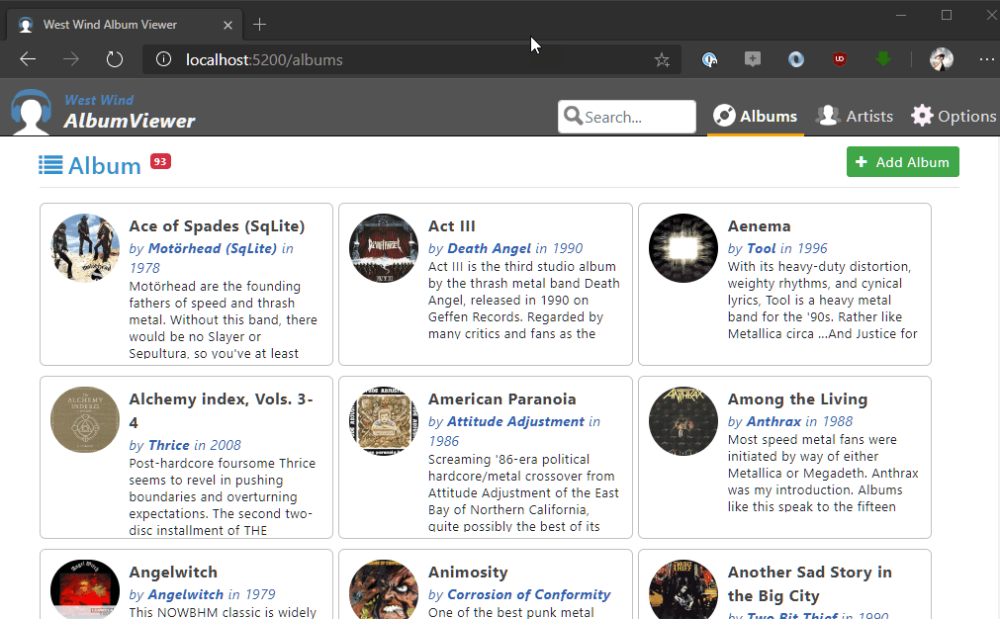

# Handling SPA Fallback Paths in a Generic ASP.NET Core Server


{style="max-width: 300px"}

In a  [recent post](https://weblog.west-wind.com/posts/2020/Jun/12/Adding-Additional-Mime-Mappings-to-the-Static-File-Provider) I talked about adding support for custom mime maps in my generic Live Reload Web Server that is a generic Web Server implementation in ASP.NET Core. Point it at a folder and go... When building a generic server like this you find out that there are all sorts of edge cases - like the `.dll` file extensions not being served that I covered in the last post for example.

In this post I deal with another application specific scenario:  Handling client side routed URL handling when the client side routes fall through to the server when a the client route is externally navigated to, or a page is hard refreshed in the browser.

If you're running a full ASP.NET Core application there are middleware components for this using `routes.MapFallbackXXX()` methods. While that works in an MVC or Razor Page application in a generic server there may not be any explicit routing beyond static file serving. So in this post I'll describe a simple middleware handler that generically and application specifically handles similar logic.

## Client Side Route Fallback?
What is client side route fallback and why does a site need it? 

When you run a client side application that includes client side routing, you're relying on client side routes - or extensionless URLs typically - to specify which component/page to load. 

A route like:

```text
https://site.com/albums/1
```

can be interpreted **either as a client side route or as a server side route**. 

### Client Side Navigation
In a client side SPA application this route triggers the client side router that knows how go to a specific album page [like this](https://albumviewer.west-wind.com/album/1). Behind the scenes this route is handled **entirely on the client side** by - in this case - the Angular router that intercepts the Browser client side navigation APIs to recognize that the URL has changed and tries to map the new URL to a pre-configured client side route. Effectively this code is all part of the single page - `index.html` - that is running the entire client side application.

This works just fine - as long as the user stays within the application and doesn't hard refresh the page. IOW, clicking through the application using app internal links will all trigger client side route navigation.


### Server Side Navigation of Client Side Routes?
But client side routes can fall apart if links are:

* Accessed from outside of the Client Application 
* A page is hard refreshed

In both of those scenarios the client application **does not have control of the routing** process which results in navigation that goes back to the server. 

So this route:

```text
https://site.com/albums/1
```

now goes all the way back to the server, which typically is not supposed to handle this URL. The result of that is usually a **404 - Not Found** server error. Hrrmmph - not what you want!

## Fixing Route Fallbacks
So, my LiveReloadServer application is a generic Web server which primarily allows you to serve static files. By default it doesn't know anything about routes of any kind and since it is a generic Web server that you simply point at a folder to start serving requests, it also **knows nothing about a client side application**. 

I can point the Live Reload Server at the above mentioned Angular AlbumViewer application local folder like this:


```ps
LiveReloadServer --webroot /projects/albumviewer/albumviewerserver/wwwroot
```

and it will serve that application from index.html and that works fine.

Notice that the default **client side route** is albums and it works:



But if I now navigate explicitly **to the very same URL** or hard refresh the previous page I get:


Now it **doesn't work!**. 

**Same URL - very different results!**

The first is a client side handled route. The second a server side failed route because the server has no idea how to process the client side route.

The reason for this is that the hard refresh or external browser address bar or external site link access is not getting routed at the client; it's getting routed through to the server. The only way the client gets involved is if somehow `index.html` is accessed and bootstraps the client side application and with it the client side router. But when I directly go to `/albums` from the address bar for example, that is not the case.

Unless the server has some special handling of these invalid client routes, it will try to serve these client routes and because nothing is mapped to these URLs it fails with a `404 - Not found`. In this case in my Live Reload server, that's the 404 error page in the second screen shot.

### Handling Fallbacks with built-in EndPoints and Route Processing
If you're using a full ASP.NET Core MVC or Razor Pages application you can use the Spa Fallback endpoint mappings (in Core 3.x) to handle this for you. Basically any URL that falls through the standard routing automatically gets routed back to a URL you specify - which typically is `index.html`:

```csharp
// app.IsRouting() required for MappFallbackToFile()
if (ServerConfig.UseRazor || ServerConfig.UseMarkdown ||
    !string.IsNullOrEmpty(ServerConfig.FolderNotFoundFallbackPath))
    app.UseRouting();  

...

if (!string.IsNullOrEmpty(ServerConfig.FolderNotFoundFallbackPath))
{
    app.UseEndpoints(endpoints =>
    {
        endpoints.MapFallbackToFile("/index.html");
    });
}
```

**And this works.** Basically **any unknown extensionless URL** now re-routes back to the `index.html` which is what we'd want here.

But when routing to a missing extension link you get browser 'Page not Found' error page:


Which in my case of the LiveReloadServer is not quite what I want, but in the scope of a full MVC/Razor application is probably handled with error page handling. 

So while this works this engages a bunch of ASP.NET Core infrastructure that otherwise is not needed in my generic server. To make this work I now would have to add error pages and routing to error pages etc.

### Custom Fallback Handling
There are simple alternatives though that offer more control. So to make this simpler and more generic, I chose to just implement a simpler, application specific fallback middleware handler which selectively handles the fallback processing depending on whether a fallback page is defined in the configuration, and then displays a custom 404 error page.

```csharp
/// <summary>
/// Fallback handler middleware that is fired for any requests that aren't processed.
/// This ends up being either a 404 result or
/// </summary>
/// <param name="context"></param>
/// <param name="next"></param>
/// <returns></returns>
private async Task FallbackMiddlewareHandler(HttpContext context, Func<Task> next)
{
    // 404 - no match
    if (string.IsNullOrEmpty(ServerConfig.FolderNotFoundFallbackPath))
    {
        await Status404Page(context);
        return;
    }

    // 404  - SPA fall through middleware - for SPA apps should fallback to index.html
    var path = context.Request.Path;
    if (string.IsNullOrEmpty(Path.GetExtension(path)))
    {
        var file = Path.Combine(ServerConfig.WebRoot,
            ServerConfig.FolderNotFoundFallbackPath.Trim('/', '\\'));
        var fi = new FileInfo(file);
        if (fi.Exists)
        {
            if (!context.Response.HasStarted)
            {
                context.Response.ContentType = "text/html";
                context.Response.StatusCode = 200;
            }

            await context.Response.SendFileAsync(new PhysicalFileInfo(fi));
            await context.Response.CompleteAsync();
        }
        else
        {
            await Status404Page(context,isFallback: true);
        }
    }

}
```

This code hooks up in `Configure()` the same way as the endpoint routes at the end of the middleware pipeline:

```cs
app.Use(FallbackMiddlewareHandler);
```

which now catches **any request that didn't get handled by another processor**. If I have a fallback route configured and if the URL is extensionless it goes to the fallback route - otherwise it falls back to my custom 404 error 'page' which is just a `Response.WriteAsync()` output bit that is generic and doesn't require pulling in MVC or Razor pages (the latter of which are only pulled into the LiveReloadServer when explicitly enabling Razor or Markdown features which are optional).

The behavior is similar to the built-in functionality but it gives me in this very generic server implementation a little more control over how I handle fall through requests. As a bonus it doesn't require (but works with) the overhead of the ASP.NET Core routing framework which is not needed when only serving static files or handling live reload processing which is the primary use case for this application.

## Summary
When it comes to running SPA applications in ASP.NET Core there are lots of little things you need to think about to make sure it works with edge case scenarios like Client Side Route Fallbacks. It's good to see that for the most part these scenarios are easily addressed with existing middleware that's provided out of the box by the ASP.NET Core framework. For most ASP.NET Core MVC, Razor or plain API applications, the ` endpoints.MapFallbackXXX()` are probably sufficient to provide fallback route handling.

But when you need more control it's easy enough to create a custom middleware handler that performs the exact logic you need to. This is the beauty of a clean middleware pipeline as ASP.NET Core provides now that allows you hook even into fairly low level operations and provide custom behavior. Which is exactly what the doctor ordered for my LiveReloadServer... Sweet.

## Resources

* [Live Reload Server Project](https://github.com/RickStrahl/Westwind.AspnetCore.LiveReload/tree/master/LiveReloadServer)
* [Album Viewer Angular Project](https://github.com/RickStrahl/AlbumViewerVNext)


<div style="margin-top: 30px;font-size: 0.8em;
            border-top: 1px solid #eee;padding-top: 8px;">
    
    this post created and published with the 
    <a href="https://markdownmonster.west-wind.com" 
       target="top">Markdown Monster Editor</a> 
</div>