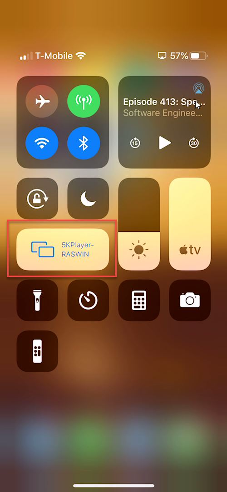
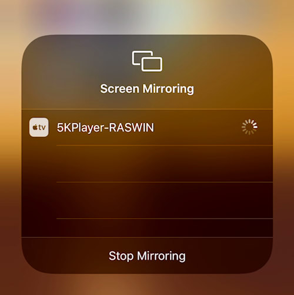
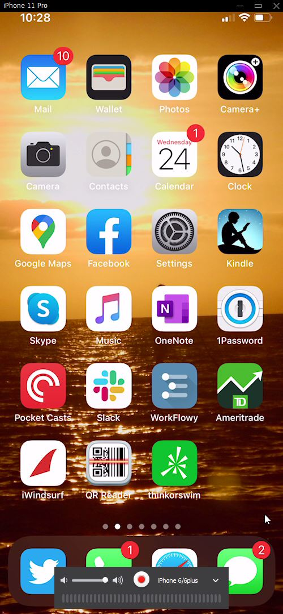

# Mirror your iOS Device Screen on Windows with the free 5KPlayer
After my last post about using [Angular Live Reload on a Mobile Device](https://weblog.west-wind.com/posts/2020/Jun/23/Using-Angulars-Live-Reload-Web-Server-to-Refresh-Pages-on-a-Phonehttps://weblog.west-wind.com/posts/2020/Jun/23/Using-Angulars-Live-Reload-Web-Server-to-Refresh-Pages-on-a-Phone), several people asked me what I was using for displaying my phone screen on my Windows machine. So here's a short post that talks about the tool I'm using and how to set it up: 

[5KPlayer](https://www.5kplayer.com/)

If you're doing Mobile Web development on Windows, it's probably not uncommon to run into a scenario where you need to display the content of the mobile device screen. For me that's usually for a **screen capture** or potentially for a **presentation** of some sort.

For example here's a screencast capture in the aforementioned blog post. In that post I showed how to use WebPack development Web server in Angular to live reload content directly on an iOS device and I used the Windows screen mirroring to capture the updates as part of a short screencast to demonstrate the feature:

The screen mirroring allowed me to show the interaction between the development editor and my iPhone mobile device. The same thing applies in a live presentation where attendees can't see your phone screen, and need the projected device screen to see what's happening.

## iOS Screen Mirroring on Windows: Harder than it should be
Apple being Apple and always poking a stick into competitors' eyes, they don't make it easy to access iOS features from Windows. You can't access the phone directly and screen mirroring is not a thing. On a Mac **AirPlay** is built in and works in the default media player, so screen mirroring **just works** - not surprising on Apple's native platform. But no such luck on Windows. And surprisingly there also haven't been a lot of third party solutions available to provide AirPlay services on Windows either...

**AirPlay** is Apple's screen casting technology that's meant to project iOS device screen content or application output to some other display device like a TV or set top box. Many TVs, and various TV boxes like a Roku support AirPlay so you can cast content from an Apple Device to your TV.

AirPlay is proprietary, but it's a fairly well known protocol and widely used, yet there aren't a lot of Windows implementations of it. So when I ran into 5KPlayer, which is what I use in this post, I was excited to see it and try it out.

### 5KPlayer and Apple AirPlay
I've been looking for a decent mirroring solution on Windows **for years**. Sadly I've gone through many, many different and shady tools that have come and gone over that timeframe.

Recently I ran into [5K Player](https://www.5kplayer.com/) via an unrelated recommendation for a media player. 5KPlayer is first and foremost a Video Player and - as it turns out - a pretty damn good and fast one at that. It's bare bones, but it works much smoother and faster than anything else I've used for **quickly** scrubbing through and clipping my many 4K GoPro Videos. Given that most video solutions on Windows stutter or downright lock up when scrubbing through video this was a huge win for me.

But... the real highlight of 5KPlayer is that **it provides an Apple AirPlay Server** that you can use to cast your iOS device to a Window on the Windows desktop. And it works very well for that task. It's fast, doesn't stutter and there's minimal lag so it works fine for capturing smooth animations for example. Again, unlike some of the other solutions I've used in the past which often would disconnect, not keep up or lock up.

5KPlayer is free and no, they're not paying me - I'm just excited to have found a reliable and smooth solution to projecting my iOS devices. Apparently they also make a [video editor](https://www.videoproc.com/?ttsoft=5kpwin-6.3-mu-unreg) they sell, which I'll likely buy next time I need to edit my GoPro videos. If that can handle 4k videos even close to as well as the player I'm all in.

## Setting up Screen Mirroring with 5kPlayer
Once you've installed 5KPlayer you have to enable the AirPlay server that's built into it when it's running. You have to turn it on in the settings:

### Connect your Device
Once it's on you should now be able to connect your iOS device to it.

> Make sure that the device and your computer **are on the same WiFi network** - on the same subnet. I've run into problems when I used a wired connection on my laptop and WiFi on the phone where the two are effectively on separate network segments and so couldn't see each other.

To do this open the iOS device and bring up the iOS control center (swipe from upper left corner diagonally) and choose screen mirroring from that screen:

In the screen shot the mirroring is already set up (otherwise I couldn't capture the image). If not connected the text will read *Screen Mirroring*.

When you click in the device will display all nearby AirPlay servers and **5KPlayer-YourMachine** should be one of them:

Select that and if all is well a new window pops up on your desktop with the mirrored device.

And with that you're on your way:

The mirroring is very smooth and fast - there's minimal lag so animations and transitions display well. The viewer also includes the ability to create a video of the screen operations easily which is useful for phone only content captures. 

The pictures above are captured from the mirrored application window and you can see that by default the window is bit oversized and the image isn't Retina sharp so that's a trade off. You can resize the window down a bit but that only seems to make it even more jaggy. This means it's a great tool for projecting for demonstrations but it's not the best tool for capturing razor sharp videos or screen capture images. For that you should capture video on the device or take a full screen shot there. It's a fair trade off I think for the excellent responsiveness of this solution.

Also just to be clear, this is **screen mirroring** not remote access, so you can't control the phone from Windows - all interaction has to happen on the phone while it's connected.

### Summary
5KPlayer is a simple and free solution to mirroring an iOS device onto your PC screen and it works very well with little fuss. It makes for a great addition to your developer toolbox that you might not need all the time, but if you're like me there are the occasional situations where I do need to capture or broadcast what's displaying on the phone. This solution fits the ticket nicely - maybe you find it useful too.

### Resources

* [5KPlayer](https://www.5kplayer.com/)

    
    this post created and published with the 
    <a href="https://markdownmonster.west-wind.com" 
       target="top">Markdown Monster Editor</a> 

