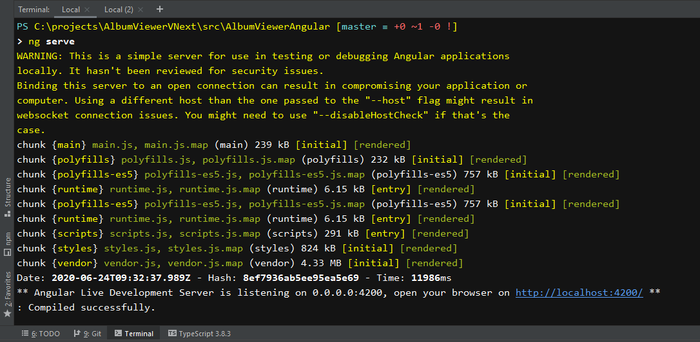
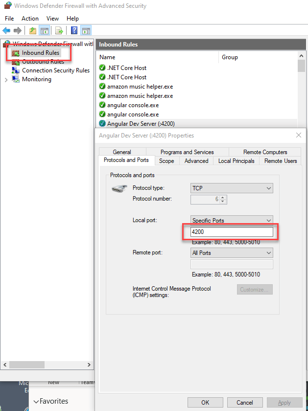

# Using Angular's Live Reload Web Server to Refresh Pages on a Phone

Angular (and really any of the major JavaScript UI frameworks that integrate with the [WebPack Dev Server](https://webpack.js.org/configuration/dev-server/)) provides a built-in Live Reload Web server that makes it quick and easy to see UI changes updated in the browser as soon as you make a change to your code, HTML or CSS content. 

What's not so obvious: How do you get the live reload functionality to also work on a phone by connecting to your development machine, in order to be able to preview and tweak the layout quickly and just as easily as in a desktop browser? Turns out it's not that hard, but there's a bit of configuration that's required to connect the phone and desktop machine properly. 

When you get it all going you can happily work like this on a mobile device:


In this post I'll walk you through what you need to know in order to set up the Angular Dev server to:

* Serve content and allow external IP Access
* How to connect to the your server on the local network
* Set up your firewall
* Bonus: capture the phone output on your desktop screen

> #### @icon-info-circle Not just for Angular
> Although I specifically discuss the Angular Dev Server in this post, most other frameworks like Vue and React also use the same WebPack Dev server, so you can use the concepts described here with those CLIs as well. The syntax may be different so check the specific CLI documentation for host binding.

### Live Reload Server
Angular and a number of other tools use the WebPack development server. By default this server is set up to run as a local Web server, but you can set it up quite easily to also serve IP traffic externally. It's not quite obvious, and in the past I've been doing this the ~~hard~~ wrong way, by building the app and then running it through another always on Web server (IIS). This works but it's not exactly quick since building the app for final output can take a while. Making a change then takes some more time. 

Turns out - there's an easier way: It's quite easy set up the WebPack Web Server to externally expose an IP address, which would allow your phone to access the live reload server over the local network.

In Angular you run the live reload server with:

```ps
ng serve
```

using the Angular CLI. This starts up the server locally. Using just the default  `ng serve` you generally use `localhost:4200` to access the Web server:

```text
http://localhost:4200
```

This is what the dev server is designed for and that of course works. But if you try to access the local IP address directly:

```text
http://192.168.50.111:4200
```

you'll find **remote access doesn't work** with the default configuration.

### Exposing your IP Address: Host Ports
The problem is that by default the WebPack server is bound to localhost. `localhost` is the local loopback adapter or `127.0.0.0` which **does not expose itself to the network** - it's entirely internal and in fact doesn't even hit the network interface. So using the default is not going to let you connect to the dev server.

This is actually a good default as it ensures that there isn't an accidental security leak via external network access . For typical dev scenarios running on localhost is perfectly reasonable.

### Phone Testing is Painful
But if you want to check out your application on the actual phone or other mobile device, the process can be painful. Before I realized I could actually expose an external port in the dev server, I used to:

* Build my Angular into the distribution folder
* Point my local Web Server (IIS) at it

That works, but it's sloooooow... the build takes a while and then making changes requires another complete build. Meh!

### Exposing a Host Port in Angular
Turns out Angular has easy options via its [ng serve](https://angular.io/cli/serve) can be set up to bind to a specific port. As mentioned `localhost` or `127.0.0.0` are local IP addresses, so rather than using those you can bind to:

* A specific machine IP Address
* 0.0.0.0 which is all local IP Addresses

So to launch the Angular Dev server with external port access enabled you can use:

```ps
ng serve --host 0.0.0.0
```

which gets you:



Notice that the server is letting you know that you're exposing the server to the network and is warning that the server is not meant to be a hardened Web server and not secure for external access. But for development testing it certainly is sufficient.

You can also be more specific about the IP address:

```ps
ng serve --host 192.168.50.111
```

Voila now you can **can access** the server remotely!

Finally you can also set the `host` in the `angular.json` configuration file:

```json
{
"projects": {
    "MyProject": {
        "architect": {
            "serve": {
                "options": {
                    "port": 4200,
                    "host": "0.0.0.0"
            },            
        }
    }
}

}
```

With this you can now simply run `ng serve` to get external access.

### Firewall
If you're on Windows you'll likely also have to add a Firewall exception rule to enable remote access to the firewall. This creates one using PowerShell:

```ps
# Launch as Administrator
netsh advfirewall firewall `
   add rule name="Angular Dev Server :4200" `
   dir=in action=allow `
   protocol=TCP localport=4200
```

Alternately you can add it in the Firewall app:



### Accessing the Application From your Phone
Accessing the application from your phone now should work via the server's IP address. Unfortunately you'll need to use an IP Address rather than a domain name so a local network URL like this works on your local WiFi network:

```text
http://192.168.50.111:4200
```

Note that the WebPack Dev Server **does not support host header resolution**, so AFAIK you can't use a domain name like `myapp.server.com` even if that DNS name is mapped to the appropriate IP address. AFAIK **you have to use the IP Address**.

> If you're testing on your local network, make sure that **your mobile device is on the same network segment as your development machine**. I often use a wired connection for my laptop and the phone on the wireless subnet - these are different and can't directly see each other on my network. 

Several people asked what I was using to mirror the iOS phone screen on my machine. I'm using [5kPlayer](https://weblog.west-wind.com/posts/2020/Jun/26/Mirror-your-iOS-Device-Screen-on-Windows-with-the-free-5KPlayer), which among many other cool features can act as an Apple Air Play server. You basically start the air play server in the application and then connect to it from the phone. It's very smooth and seems very reliable. Turns out that was very useful for capturing the screen capture at the beginning of this post :-)

### Summary
As mentioned at the beginning, this approach should also work with other CLI's that use the WebPack Web server. Both the Vue and React CLIs also use the WebPack web server, so with perhaps slightly different syntax the same approach can be used, so this isn't Angular specific.

I feel a bit silly it took me this long to realize I can get Live Reload to run on my phone. All that wasted time building and explicitly navigating, when all along I could have been just putting the phone in always on mode and watch things change! Having this functionality - especially on the phone - is a huge time saver especially on a recent mobile first project I'm working on.

So maybe I'm not the only one who didn't think or even think about the Angular Dev server as a remote Live Reload server that can work for live reloading on a mobile device. Even though domain names don't work, once you've manually typed in the IP, you're done - just leave it sitting and it'll do its own refreshing. Yay - good times and more productivity ahead...

### Resources

* [Using 5kPlayer to mirror your iOS on Windows](https://weblog.west-wind.com/posts/2020/Jun/26/Mirror-your-iOS-Device-Screen-on-Windows-with-the-free-5KPlayer)


<div style="margin-top: 30px;font-size: 0.8em;
            border-top: 1px solid #eee;padding-top: 8px;">
    
    this post created and published with the 
    <a href="https://markdownmonster.west-wind.com" 
       target="top">Markdown Monster Editor</a> 
</div>